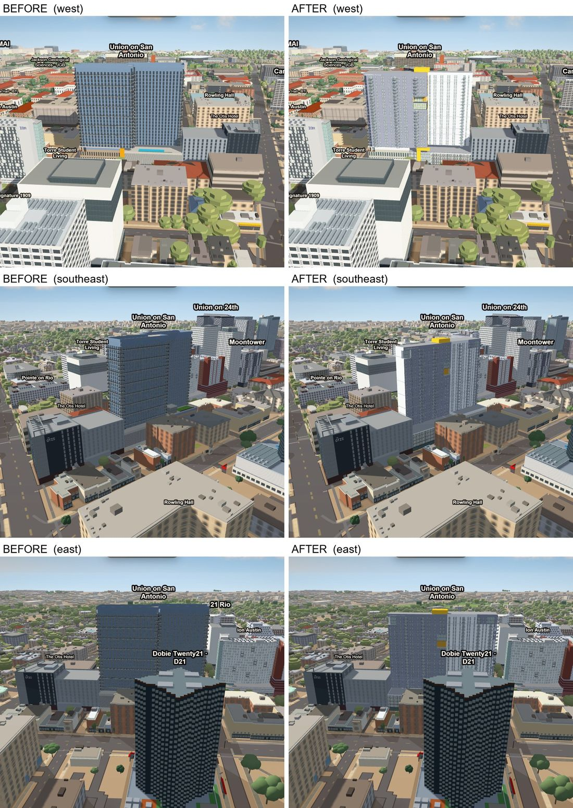
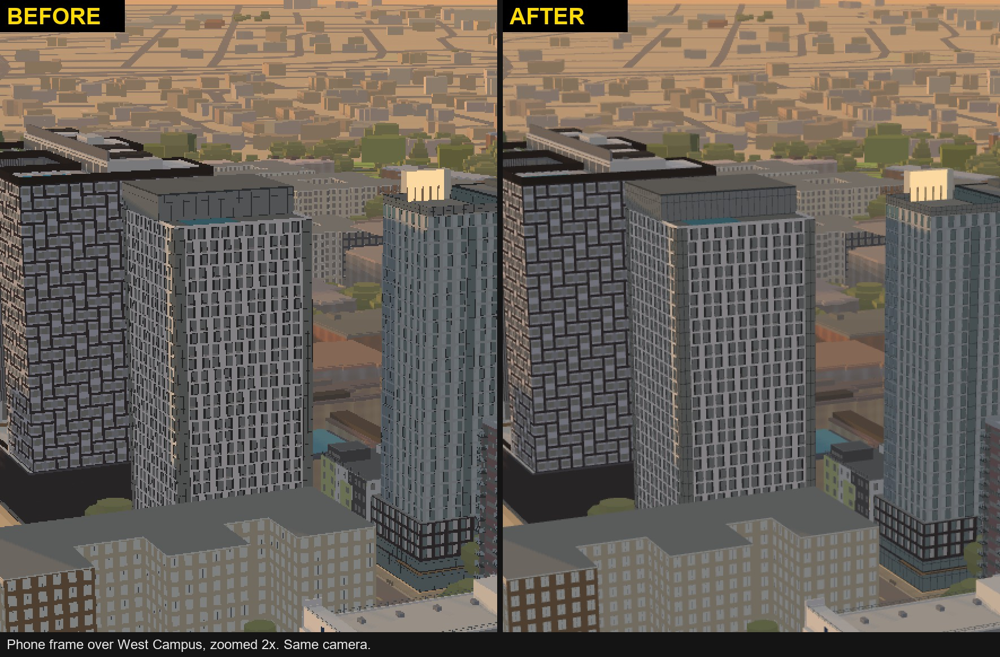
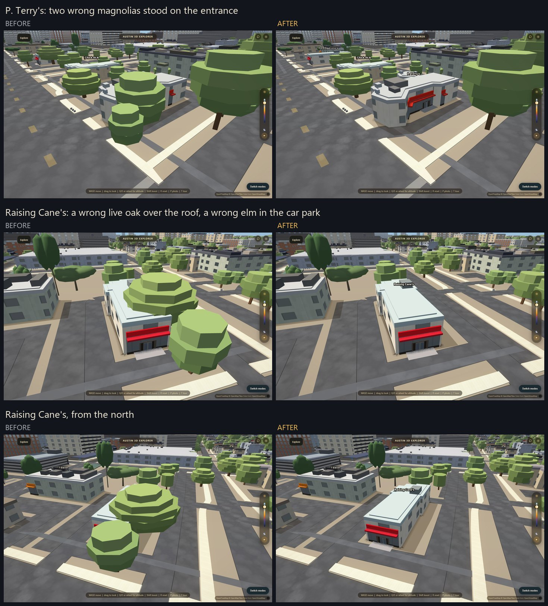

# Austin 3D Explorer — Full Handoff

## Oct 5 2026 - Rowling Hall is its real shape, with windows on all four sides (`mac/rowling-hall`, PR #402)

**What it was.** A plain cream block with a window grid. The real building is dark glass, with a
stepped courtyard, roof terraces and a tall glazed lobby on the street corner.

**What it is now.** A recipe of 32 blocks in `data/apartments/robert-b-rowling-hall.json`. The outline
and every level come from the 2021 survey. The street and courtyard faces come from reference
photographs. No photograph shows the west and north sides, so they carry the street side's window
rows at the same heights, and the recipe marks each of them as an inference.

**Two fixes over the first version.** The two lowest floor slabs had a wall line 0.2 to 1.6 m off the
slabs above them, so thin dark ledge pieces showed as diagonal lines: they use the upper wall line now.
Every long west or north wall that had no face has window rows.

**Cost.** About 56,000 triangles more than the old block.

**Checked.** `node scripts/verify/model-compaction.mjs` passes. All four corners were drawn in the
real app in one page load, before and after: `docs/shots/rowling-hall-all-sides.jpg`.

**Open.** The west and north sides are inferred. A photograph of either side replaces the inference.

## Oct 5 2026 - The repository says in plain words that it is not open source (`LICENSE`, straight to main)

**What it was.** A public repository with no licence file. By default that already means
"all rights reserved", but a visitor could not see it, and nothing said what they may do.

**What it is now.** A root `LICENSE` in plain words. People may read the repository. They
may not copy it, host it, reuse the building models, build a competing product from it, or
train a model on it, without written permission. School work must ask first too. Open data
and third-party libraries keep their own licences (OpenStreetMap data stays under the ODbL).

**Why straight to main.** It is one text file. It changes nothing that the app loads.

**What it does not do.** A licence is a rule, not a lock. The app runs in the browser, so
every visitor still receives the code and the models. The owner chose to keep the
repository public: a private one gets 2,000 free CI minutes a month and the visual checks
used about 62,000 in the last 30 days.

**Next.** A terms page and a credits list in the app, on its own branch.

## Oct 5 2026 - Union on San Antonio rebuilt from street photographs (`mac/union-on-san-antonio`)

**What it was.** A plain blue glass box: 5 blocks, one skin on every face, and a height
taken from one public number.

**What it is now.** 59 blocks, from the Mac lane's overnight pass. Two offset wings. Each
wing is dark charcoal on one long side and pale on the other, so the two tones swap from
the west to the east. A yellow seam runs up the junction and a yellow block sits on the
roof above it. The lit corner lounge, the balcony stacks, the name sign, the open garage
with its roof guard, and the covered passage with its columns, wood ceiling and strip
lights are modelled. Temporary barriers, cones and banners are left out.

**The numbers, and how sure each one is.**

- Slab roof 94 m, crown 97.5 m, above the north-west ground corner. This is a fit to
  photographs. The public 101.19 m has no confirmed ground datum, the street falls about
  4 m along the site, and the 2021 laser scan is older than the tower, so nothing here
  is measured.
- Floor repeat 3.06 m, 23 tower rows. 21 slab edges can be counted on the clearest west
  view; the lower floors are hidden, so the full count is inferred.
- The south slab is 12.5 m deep (it was 20.5 m). Its roof corner and the way the bands
  turn the corner say so. The outline-only fit slightly prefers the old depth; both are
  recorded in the file's `_parameters` and `open` notes.

**What was checked and what was not.** The west and south sides were compared with
photographs through cameras proven by the tower's own outline against the sky (no part
of the model may cover sky in the photograph). The north and east sides have no proven
camera: they show the features that can be seen, at inferred sizes. The garage screen up
close is an approximation and is the weakest part.

**Three limits of the renderer this pass met.** Fine metal panel joints draw curved marks
on a large pale wall, in two different constructions, so the joints are left out. Facade
glass is opaque, so the lounge's interior lights are a small proxy on the facade plane.
The ground is flat, so the base cannot follow the street.

**Verdict.** The owner scored it 8.3 and asked for the merge. Drawn again on the merged
main on hardware GL from three sides before merging: no page errors, and the picture
above is that run.

## Oct 5 2026 - The sky banks with the camera when you turn (`acer/sky-turn-direction`, PR #399)

**What was wrong.** In a turn the flight controller banks the camera up to 5 degrees and the
whole picture leans. The GL sky was built for a level camera and ignored the roll, so the
clouds, stars, horizon haze and the sun's disc stayed level while the skyline leaned. Turning
(yaw) and tilting (pitch) were already right; only the bank was wrong.

**The fix (`js/sky.js`).** The sky shader looks each pixel up at the level-frame position it
came from (a rotation about the frame centre by the camera's roll). The stars, the sun's disc
and the position handed to the bloom turn by the same angle. A level camera draws the same
sky as before (largest difference 1 level of 255, in about 0.04 percent of pixels).

**Measured (`scripts/verify/skyturn.mjs`, hardware GL, desktop and phone profile).** Bank +5
and -5 degrees, sky tilt against world tilt: old code 0.00 against 5.00; new code 5.00 against
5.00 (phone profile 4.99 against 4.91). Old code passes 16 of 18 assertions, new code 18 of 18.
`sky-gl.mjs` passes 6 of 6.

## Oct 5 2026 - A recessed band can leave out its own soffit, floor or returns (`acer/inset-band-switches`)

**The block it removes.** A band with `inset` stands its wall behind the face plane, and
the generator closes the recess: a soffit at the top, a floor at the foot, a return at
each open end. That is right for a ground floor set back under a podium. It is wrong for
ONE recessed glass wall that a height slice cuts into two stacked bands: each band closed
its own recess, so a ceiling plate crossed the middle of the glass. The only switches were
city-wide (`APARTMENTS.insetSoffit`, `APARTMENTS.insetReturns`), so the way round it was
free geometry, and a photo pass spent its time on that instead of on the building.

**What landed.** The object form of `inset` takes three switches:
`{ "d": 2.0, "soffit": false, "floor": false, "returns": false }`, and `returns` also
takes `{ "lo": false }` or `{ "hi": false }` for one end. A switch a band does not give
falls to the layer default, so every file that exists is drawn exactly as before. For the
split glass wall: the lower band gets `soffit: false`, the upper band gets `floor: false`.
`docs/apartments.md` has the paragraph.

**Proof.** `scripts/verify/inset-switches.mjs`, on the real page with hardware GL, through
the GPU queue (3.6 minutes). It sets one band of The Standard's corner bay 2.0 m back in
thirteen variants and counts mesh vertices: the soffit is 6, the floor 6, the returns 8
(4 an end); all three off removes exactly 20; the recessed wall is 428 vertices in every
variant; a band's own `true` draws its surface with the layer default off; taking the
inset away restores the starting count. Run against the code before this change the same
check goes red on its first switch. It is listed under `quarantine` in
`scripts/verify/ci/checks.json` as a GPU check: it rebuilds the whole apartment layer
thirteen times and has not been timed on a runner.

**No picture changed.** No recipe uses a switch yet. The first user will be a photo pass.

## Oct 4 2026 - A phone has every anti-moire tool switched off; the fix is built and waits behind `?smooth=1` (`acer/phone-smooth-edges`)

**The report.** "Clouds load on mobile. If someone can do a moire fix for mobile that
would be nice."

**The cause was a default, not a bug.** The three things that remove moire on a laptop
(Smooth edges, the far pattern filter, the apartment facade filter) each skip the phone
profile, and each for the same reason: nobody had timed it on a phone. So a phone drew
one sample a pixel with nothing in front of it, and anything thinner than a pixel
(floor lines, fins, rails, far road edges) broke into dots and crawled in flight.

**What landed.** The switch, and it is OFF. The phone tier can ask for Smooth edges
(4 coverage samples a pixel) through its own budget, `smoothEdges` in `js/mobile.js`;
`defaultMSAA` in `js/graphics.js` reads it, capped by `EDGE_SMOOTHING.phoneMaxPixels`
so a tablet's buffer stays off either way. Turning the default on is that one line.

Until then `?smooth=1` turns Smooth edges on for ONE VISIT on any device and saves
nothing, and `?smooth=0` turns it off. With the flag a small strip at the top says what
the graphics context really has (on or off, samples, drawing buffer size, phone tier),
read again whenever the buffer is resized. A setting that was asked for is not proof of
one that was given.

**Why the default went back off before it merged.** The first version of this branch
made it the phone default. Before it merged, the owner looked for the fix on a phone
and saw no change, because the phone was showing the build without it. In a second
browser on the same phone that build "reloaded once, then errored out 'can't open this
page'". That is the page being killed twice in a row: on the phone tier, then on the
lighter tier. This branch did not cause it (it was not live). But it says the phone
city has no memory to spare, and Smooth edges costs memory.

**Memory, desktop Chrome in phone emulation, NOT a phone** (`mobile-memory.mjs`,
390x844 DPR 3, iPhone UA, RTX 3050 Ti, 2 interleaved reps, fresh browser each,
auto-detect cancelled, min [range] MB):

| arm | page-held peak | page-held settled | page process peak / settled | graphics process peak / settled |
|---|---|---|---|---|
| live, phone tier | 1058 [1058-1060] | 825 [825-870] | 1625 / 1032 | 1376 / 1361 |
| live, lighter tier | 737 [737-924] | 610 [610-610] | 1500 / 772 | 1074 / 934 |
| this branch, Smooth edges on | 995 [995-1065] | 831 [831-890] | 1622 / 926 | 1557 / 1497 |

- Smooth edges cost 135-180 MB in the graphics process here, not the 53 MB of
  arithmetic. Direct3D on a laptop card is not a phone, but it is the only measurement
  there is.
- The lighter tier is much lighter once settled (610 against 825), but its LOAD PEAK is
  almost the same: the page process peaks at 1500 MB against 1625. A phone that kills
  the page during the load of the phone tier will kill the lighter tier too. That is
  exactly "reloaded once, then the error page".
- Sep 30 recorded the phone tier at peak 821 [821-1010], settled 779, WebGL 506. Today
  it is 1058 / 825 / 533. Four days of new buildings and textures used up room.

**Next for phones (not in this PR).** Lower the load peak (about 500 MB of typed arrays
are alive at once during the load, 170 after it), give the lighter tier a load peak
that is really lower, then turn `smoothEdges` on.

**What it does to the picture, measured on the phone frame** (`moire.mjs --width 390
--height 844 --dpr 3 --scale 0.75 --q lite=1`, truth supersampled 2x, RTX 3050 Ti, each
side against its own truth; "after" is what `?smooth=1` shows):

| pose | moire before | after | pixels in a visible band |
|---|---|---|---|
| spawn | 0.530 | 0.283 | 0.94% -> 0.14% |
| intro-crest | 0.568 | 0.347 | 0.89% -> 0.28% |
| west-campus | 0.887 | 0.419 | 3.09% -> 0.29% |
| downtown | 0.768 | 0.545 | 2.40% -> 1.04% |
| campus-low | 0.465 | 0.301 | 1.18% -> 0.41% |

Along a slow 48-frame flight into campus the frame-to-frame crawl the truth does not
have went 0.418 -> 0.095.

**The far pattern filter stays off on a phone.** On top of smooth edges it moved the
same five poses by 0 to 2%. A phone's facade patterns are already built at 1x, so they
are barely minified, and the filter costs up to 16 texture reads a pixel. It has its own
budget line (`farPatternFilter`) for the day that changes.

**What is NOT known.** The cost on a real phone, in memory or in speed. Every number
above is a phone-sized frame on a laptop graphics card. `?smooth=1` on a real phone is
how to find out.

**Harness.** `moire.mjs` took its pixel ratio from `--dpr` alone, so it waited forever
for a canvas the phone profile never makes (the phone draws at 0.75 of the device
ratio). `--scale` is that render scale. `edge-defaults.mjs` now boots a phone with a
budget: on by budget, off on the lighter tier, off on a tablet buffer, an old save
follows the new default, a hand-set off survives, and no renderer is probed. It also
asserts the flag: `?smooth=1` on over a budget that says off, `?smooth=0` off over one
that says on, on a desktop too, the setting itself untouched and nothing saved.

## Oct 4 2026 - Four trees that a street photograph proves are not there (`acer/field-clear-trees`)

**What landed.** `scripts/shape_trees.py` has a new table, `FIELD_CLEAR`: one row per
spot where a photograph taken from the street shows nothing standing. Four rows, all at
one restaurant corner west of campus. Two 8 and 12 m magnolias stood against the
entrance of P. Terry's, a 13 m live oak covered half the roof of Raising Cane's and an
11 m elm stood in its open car park. All four were `src:'imagery'` crowns, which is the
detector that looks straight down and reads a steel canopy or a dark roof unit as a
crown. `data/trees.geojson` loses those four trees (17 features: 15 crown tiers and 2
trunks) and nothing else changes.

**`--field-clear` is how a row lands.** The full pass also strips and replants, and it
is no longer a no-op on `main`: an unchanged run today swapped 2,236 planted features
for 1,439 and dropped 33 other trees, because the ground and road bakes have moved
since the planting was last run. That is a campus-wide visual change and it does not
belong inside a fix for one corner. `python scripts/shape_trees.py --field-clear`
applies the table and writes every other feature back exactly as it was read. The full
pass applies the same table as a dropped surface, so a later full run keeps the spots
clear and does not plant in them.

**The fourth tree was found by looking at the after picture.** The first after frame
still had a large tree in front of the Cane's door. The photographs of that side show
open asphalt across the whole car park.

**Not done here.** The stale planting above is its own pass, with its own before and
after. The trees beside Chick-fil-A were not checked against a photograph.

**Trap.** `data/tiles/trees.pmtiles` is what the app draws. It is built by
`build-tiles.yml`, not on this machine. The pictures here were taken with `?tiles=0`,
which reads the GeoJSON.

## Oct 4 2026 - The 2021 laser scan raises 92 buildings by default (`acer/lidar-heights`, PR #395)

The owner saw the before/after sheet and chose "raises only". So the knob's
default is now `'raise'`: every load reads `data/lidar_raises.json` (92
buildings, under 5 KB) and raises those plain prisms. `?lidarheights=0` is the
snapshot's own heights; `?lidarheights=all` also lowers by up to 3 m and reads
the whole 288 KB measurement for it. Nothing is lowered by default: the scan is
from early 2021 and a lower reading may only be old.

The rule for the height lives in one place, `scripts/bake_lidar_raises.py`,
which owns that one file. Two guards came from looking at the 14 biggest raises
one by one, not from the numbers:

- **A tower on a podium.** The scan's height is the 90th percentile of the roof,
  which is the tower. A prism has one height for the whole footprint, so the
  county courts building came out as a block as wide as its podium and as tall
  as its tower. Now a raise goes to the height that at least half of the roof
  reaches (courts: 63.1 m, not 70.5). Ten raises use it; eleven buildings whose
  tall part is under half are left alone.
- **A sliver.** A 2 m by 4 m footprint beside a tower read 24 m and was drawn as
  a pole. No raise for a footprint under 60 m2 or under 4 m wide (17 left
  alone).

`scripts/verify/lidar-raises.mjs` (no browser, in CI) holds the knob's three
modes, that the app's function only raises, that every entry in the list obeys
the rule, and that the app really raises every entry; its validator is proved
on poisoned copies first. That last check found a list of 93 with 92 raised:
one height was set by hand, the app refused it, and the notes said 93. The bake
now leaves hand-set heights off the list.

Three traps for the next lane:

- `drawn-heights.mjs` must dump with the scan OFF (it does by default now). A
  dump taken with the raises on makes the next bake compare the scan with
  itself and raise nothing.
- `building-exclusions.mjs` runs a slice of `js/app.js` in a sync vm. The lidar
  block awaits a fetch and sat inside the slice; the slice now ends at the
  first block after the exclusion code.
- `m.once('idle', r)` inside `page.evaluate` hands Playwright MapLibre's idle
  event, which carries the whole map, and the run dies with "Cannot create a
  string longer than 0x1fffffe8 characters". Use `m.once('idle', () => r())`.
  It has happened once, on a phone-size frame at pixel ratio 2; the same line
  runs clean at the desktop frame. `shot.mjs` and `lidar-shots.mjs` are fixed;
  69 other verify scripts still have the pattern.

Also here: `shot.mjs` takes `SHOT_VP=390x844x2` for a phone-size frame.

Known limit: a curved roof on a plain prism becomes a flat box near its ridge
(the Indoor Practice Facility, 6.7 m to an 18.2 m box; the roof averages 14.3).

## Oct 4 2026 - The cheap "profile numbers" pass did not move the owner's score (`acer/pilot-wall-cards`, PR #396 closed)

Tested on three campus halls: colour, rows, bay, window size, ground floor,
height and a hip roof, all taken from the owner's photos and the laser scan and
written into `data/campus_profiles.json`. His scores, before to after: 1.5 to
1.8, 0.9 to 1.0, 0.7 to 0.7. The goal was 3 to 3.5. The pass is closed and must
not be batched. What he reads is the building's own shape and features (window
stacks, stone floors and bands, the entrance, the roof form), and the profile
cannot say any of those. A 3 needs a per-building recipe.

## Oct 4 2026 - The sky drawn in the map's own pass, with real clouds (`acer/sky-gl-pass`)

**What landed.** A second way to draw the sky, `SKY_COMP.mode = 'gl'`, and since the
owner's look at the three pictures it is **the default, with cloud look A**. The canvas
sky is one line away (`?sky=canvas`) and is the automatic fallback. In `'gl'` the
atmosphere (gradient, Belt of Venus, sun and moon washes, night skyglow, horizon
feather) is computed in the fragment shader from the same `SKY_TUNE` tables the canvas
reads, the stars are GL points, and the clouds are a 4096 x 512 panorama uploaded once
after first paint. A camera turn changes uniforms only: no 2D draw, no upload.

**Two cloud looks** behind `SKY_TUNE.cloudSet`. A is a real CC0 sky photograph baked to
coverage plus self-shade (401 KB); B is generated, thin high cloud with a few puffs
(488 KB). Both store no colour, so the shader relights them for noon, golden hour and
night. `scripts/bake_sky.py` owns `data/sky/` and nothing else writes it. Credit line
is in `docs/perf/sky-gl.md`.

**Proof.** In Safari on the Intel Mac, interleaved six reps in one tab, Performance tier:
median frame 189 ms (canvas) against 117 ms (GL), minimum of each side, three reps each
within 2 ms. `scripts/verify/sky-gl.mjs` on hardware GL: 6 of 6 assertions green
(atmosphere within 2 levels of the canvas, no wrap seam, feather on the same row, clouds
drawn, a 40-frame turn with zero 2D draws and zero uploads by two independent counters,
output is the GL path's own) and 6 of 6 break switches red. Pictures:
`docs/shots/sky-gl-{noon,sunset,night}.jpg`.

**The default flip.** With `'gl'` as the default, once each on hardware GL through the
GPU slot: `sky-gl.mjs` 6 of 6, `graphics.mjs` 27 of 27, `banding.mjs` 9 of 9,
`y20-handover.mjs` 4 of 4, `light-rays.mjs` 6 of 6. `sky.mjs`, `night-sky.mjs` and
`light-sky2.mjs` have the 2D canvas as their subject, so they open the page with
`?sky=canvas` now and guard the fallback only.

**Two defects the build server found once it was the default, both fixed.** The clouds
drift, so `tile-heal.mjs` saw one state as three pictures; `?drift=0` holds them still
now (16 of 16 on SwiftShader). And a lost GL context left the sky a bare gradient with
no clouds, because the GL sky kept programs and textures from the dead context
(`context-restore.mjs`: 12.8% of the frame differed); it forgets them now and rebuilds
on the next frame, with the decoded panorama kept in memory (after: 0.003%, pass).
`sky-gl.mjs` again after both: 6 of 6, and 6 of 6 break switches red.

**Not done.** Only the WebGL2 path was exercised; the WebGL1 power-of-two fallback is
written, not run. `sky-gl.mjs` needs a GPU, so the default sky has no gate on the build
server beyond the checks above that read the finished frame. The clouds are a different
picture from the canvas's, not a copy; the atmosphere is the part that matches. Sunset
in look A reads a little flat orange; `SKY_TUNE.GL` holds the values to warm or cool it.

## Oct 4 2026 - The tile archives heal a broken browser cache (`acer/tile-cache-heal`)

**What landed.** `js/tiles.js` opens every `.pmtiles` archive through a
small source object that checks each read (header magic and version, a
zeroed range, a gzip block with no magic or a zeroed end). A bad read is
re-read with `cache:'reload'`; if a normal read is still bad, that archive
moves to `?cg=N` for good (`N` kept per archive in `localStorage`, 1 to 99,
anything else reads as 0). It opens and draws in the same page load, says it
once in the console with the archive name, and adds no UI.

**Why.** A desktop browser on the live site held all-zero 206 answers for
the first 16 KB of `outer`, `roads` and `props`. The archive could not open,
so a whole layer silently never drew, and a hard refresh did not clear it.

**Proof.** `scripts/verify/tile-heal-source.mjs` (node only, real archives,
fake fetch) must go red with the heal off and against the old `tiles.js`;
`scripts/verify/tile-heal.mjs` does it in a real page and counts drawn
pixels. Details in `scripts/verify/README.md`.

**Not covered.** The whole-file JSON/GeoJSON fetches have the same hole and
are listed in the PR; `?tileheal=0` restores the old path for A/B.

## Oct 4 2026 - What sets the Safari frame floor on an Intel Mac (`acer/safari-frame-floor`)

Finding only, no change in `js/`. At the Performance tier a Safari frame is about
195 ms: the sky canvas upload is about 58 ms of it (one synchronous
`texImage2D` of a 5120 x 960 canvas per frame; skipping it gives 126 ms), the
city's layers add up to about 100 ms, and Safari runs script and GPU one after
the other rather than together. A blank canvas of the same size presents at 59
fps in the same Safari, so it is not the machine or the size. No lossless fix
exists: uploading fewer rows is 4 to 8 percent, issuing the upload first in the
frame is nothing. The one big lever, drawing the sky at the map's own pixel
ratio, changes pixels (193 to 151 ms, inside the noise on the strong GPU) and is
shown as a labelled before/after, not built. Everything is in
`docs/perf/safari-frame-floor.md`.

## Oct 2 2026 - Burdine Hall, the Norman Hackerman Building and the compact wall material (`acer/wall-pattern`, PR #388)

**What landed.** `js/wall-patterns.js` draws a running-bond brick wall as
one flat face in the shader instead of a triangle per brick
(`docs/wall-patterns.md`). It loads before `js/slopes.js` and is hooked in
directly; draft #387's test-only adapter is closed as superseded. Burdine
Hall and the Norman Hackerman Building are the first two files that use
it, both rebuilt from reference photographs.

**Two runtime rules came with them.**
- A building in its own file supersedes its entry in a collection
  (`replacementCatalog`). Burdine is also one of `campus_buildings.json`'s
  halls and was drawn twice without this. The bake still writes Burdine
  into that collection; nothing needs to change there, the file wins.
- `replaceHero: '<code>'` hides a hero's bands by its short code (`b`) and
  drops that code's roof underside (`window.heroesHideUndersides`), and
  puts both back when the mesh stops. NHB uses `'nhb'`.

**Checked in the real app** (no data swaps, branch vs main, balanced and
performance presets): 0 errors, each building built once, 0 rendered NHB
hero features, the NHB deck underside gone. Door light pools
(`entrances-pool`) still show at the old door positions, as for every
`replaceFrontage` building.

**Known, for the owner's look.** Burdine's front reads pale grey-beige and
its back block is still the old red brick; the real building is tan all
round. The back was never photographed. NHB's heights are estimates.

## Oct 1 2026 - night pass: restore check, desktop memory, buildings from street photos

**Merged.** #369 (the city comes back after the browser loses its graphics
context, no reload) and #354 (desktop memory: packed appearance attributes,
input copies dropped). #369's CI failure was the check, not the city: names
fade back in by time after a restore, and at SwiftShader's ~1 fps a frame
caught some half-faded (0.5% of pixels, every one of them label text).
`scripts/verify/context-restore.mjs` now compares the city with
`namelabels=0` and symbol layers hidden, and waits for the shadow model's
hash to hold still across two readings 4 s apart before it compares.

**Buildings from street photographs: the owner's verdict.** Only two
changes passed his look: #383 2400 Nueces (merged) and #379 Ion Austin
(merge once its CI is green). #380 Moontower, #381 21 Rio, #382 Villas on
24th, #384 Signature 1909, #385 The Mark and #386 The Otis Hotel were
closed. His reasons: they did not capture the building's depth or colour,
and the cameras did not match the photographs. The bar is "looks like the
building in the photograph", not "closer than before".

**The cameras were wrong, and that is fixed upstream of this repo.** The
render cameras came from an old fitter that guessed the tilt from a coarse
grid (21 Rio: 25 degrees, the photograph's own vertical lines say 35), and
the renderer faked looking up with MapLibre's top padding at pitch 88. That
is a shift lens: verticals stay parallel and roughly the top 12 degrees of
the photograph's view is cut off, so an upper-floor photograph was compared
with storefronts. The fix renders one tall, centred frame from the
photograph's eye that holds its whole view, then warps it into the
photograph's camera (same eye, pure rotation, so the warp is exact).
Padding is not used: MapLibre draws its sky from the unpadded centre
(`skyUniformValues` uses `height / 2`), so a padded frame shows a dark band
above the horizon. Tilt and roll now come from the photograph's vertical
lines. Position and heading are searched by rendering the app and scoring
long straight edges and the sky outline against the photograph. Method,
unchanged: a camera that does not line up is dropped, then a blind compare.
Never write photo ids, who took a photo, or camera positions into a
building file: the repo is public.

## October 1, 2026 - Flight collision keeps every module's heights; Icon is solid again (claude/icon-collision)

Three modules raise the flight-collision field after boot (js/westcampus.js,
js/heroes.js, js/slopes-apartments.js). Each rebuilt the whole field from its
own list, so the last one silently erased the others. And d017e58 (the
time-sliced apartment build) dropped the apartments' call with the boot log it
sat in. Measured on main, laptop GPU: Icon's collision 0 m under an 87 m roof,
and the 54.6 m West Campus tower back to 20.5 m because heroes rebuilt after
west campus. Now `__flyRebuildCollision(scene, owner)` in js/controls.js keeps
each owner's latest volumes and builds from all of them (cells stamp a MAX, so
that is exactly everyone's raise); a call with no owner is still a full
replacement, which campus-everywhere-check's raster test relies on. The
apartments rebuild again when their build lands. After: Icon 93.6 m, the West
Campus tower 58.2 m, hero volumes unchanged, the tallest apartment 101.19 m.
campus-apartment-check (from PR #374) and campus-everywhere-check pass.

Not fixed, and NOT caused by this: `collision.mjs` fails on main and on this
branch identically, "Collision pose did not settle within 60 s" (the fly
controller never leaves `driving`). It needs its own look.

## October 1, 2026 - Balcony stacks listed only on walls that hold them (claude/balcony-spans)

Campus-repairs-check failed on 19 "Balcony outside its wall piece" warnings.
GrandMarc's north, south and southS ranges listed their balcony stacks, measured
along the LONG wall, at block level, so the short end walls (20.3, 12.2 and 8 m)
wore the same list and every stack past their length was skipped with a
warning. The Block on Rio's south-elevation override also reaches the u0 end
wall over v 30.0..44.7 (14.7 m), where two of its three stacks do not fit. Now
each long wall carries its stacks as its own face, the block bands keep only
what an end wall holds, and Rio gets a region that touches u0 alone, ahead of
the override. Nothing drawn changes: with main's two files against these, the
city builds the same 2,134 balconies and 3,106,943 triangles, the warnings go
19 to 0, and four matched frames of the two buildings are pixel-identical on
the buildings (55-236 differing pixels, all on far background towers).
campus-repairs-check passes on hardware GL.

Not decided here, for the photo pass: whether the end walls really carry the
stacks that were drawn there (GrandMarc's ends hold 3, 1 and 1; Rio's u0 holds
1). They were drawn before this change and still are.
