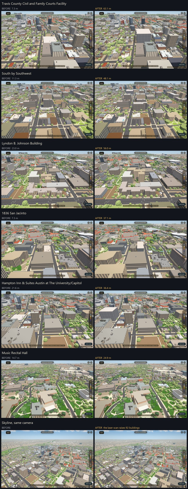

# Roof heights from the 2021 airborne lidar

The heights the app draws are second-hand (Overture and City footprints, a floor
count times a guessed floor height, a hand-typed override). The Gates Dell
Complex alone has four of them: 28.14, 42.39, 29.5 and 16.8 m. A photograph
cannot settle metres; a laser can. This measures every building's roof
from the public 2021 scan. **Since 2026-10-04 the app raises the buildings the
scan reads taller, by default** (93 of them); the owner chose "raises only" from
the before/after pictures. Nothing is lowered by default.

## The data

- Bexar and Travis Counties Lidar 2021 (28 cm, about 12 points per square metre
  in Austin), flown 2021-01-26 to 2021-03-07, published by TxGIO (StratMap).
  **Licence CC0-1.0**, public domain. Four of the six tiles that cover campus
  and West Campus were fetched (2.68 GB); the raw files and the 0.5 m raster stay
  outside the repo.
- Not covered: the two south-west and south-east corner tiles, so about 3% of the
  2432 footprints have no number (116 in all, counting slivers).
- **The scan year is recorded in the data** (`year`, `flown` at the top of
  `data/lidar_heights.json`). It matters: see the guard below.

## What is in the repo

- `scripts/lidar_raster.py` builds the 0.5 m height-above-ground raster from the
  tiles (building-class surface, bare earth from the scan's ground class).
- `scripts/bake_lidar_heights.py` measures every footprint (shrunk 1 m): p90,
  max, height steps with area shares, flat or pitched, flags. It owns ONE output,
  `data/lidar_heights.json`. The raster folder comes from `--raster` or
  `LIDAR_RASTER_DIR`. With `--drawn` it joins what the renderer really draws.
- `scripts/verify/drawn-heights.mjs` + `scripts/lidar_drawn.py`: the drawn height
  per footprint and the way it is drawn (below).
- `scripts/verify/lidar-shots.mjs`: before/after frames from one camera on the
  real GPU, with proof of the height the renderer drew.
- `scripts/bake_lidar_raises.py` cuts the short list the app loads from that
  measurement. It owns ONE output, `data/lidar_raises.json` (id to height, 93
  buildings, under 5 KB). The rule for the height lives there and nowhere else.
- `scripts/verify/lidar-raises.mjs` (no browser, runs in CI): the knob's three
  modes, that the app's function only ever raises, and that every entry in the
  list obeys the rule against the whole measurement.
- `js/app.js`: `LIDAR_HEIGHTS`. Default `'raise'`: on every load a building on the
  list is raised to the scan's height, once, in `loadScene`, so walls, parapet
  caps, window grids, labels and shadows all see one number. `?lidarheights=0`
  is off (no request). `?lidarheights=all` also lets the scan lower a building by
  up to 3 m, and reads the whole measurement for that. Every threshold is a field
  of the knob object or a constant at the top of the bake.

## The drawn height (why `final_height` is the wrong thing to compare with)

`final_height` is only the height of the plain prism. A lot of the city is drawn
another way and the prism is hidden or buried: authored apartment and campus
meshes, stacked West Campus bands, hero designs, parts, pitched roofs. Comparing a
scan with it compares the scan with something that is not on screen: a first table
put 9.6 m next to Villas on Rio, which the app draws as a tall tower.

`drawn-heights.mjs` loads the real app and reads what is drawn on each footprint:
an authored mesh's own top where there is one, otherwise the maximum over the
prism (unless it is hidden) and every extrusion lying mostly inside the
footprint. Rooftop clutter and the parapet cap are not counted. Every count below
is computed from that **drawn height**, and the table has it as its own column
with the path beside it.

| how the footprint is drawn | footprints |
|---|---|
| plain prism | 2115 |
| apartment mesh | 153 |
| pitched roof | 69 |
| campus hand model | 37 |
| campus storeys | 20 |
| arts buildings | 14 |
| stadium | 6 |
| capitol override | 4 |
| Moody precinct | 4 |
| OSM parts | 3 |
| hero design | 2 |
| places | 1 |
| Drag buildings | 1 |
| West Campus bands | 1 |
| Capitol | 1 |
| UT Tower parts | 1 |

## What is raised, and the guards

- Only buildings whose path is the plain prism (2115 footprints). Anything drawn
  another way carries `x` in the data and is left alone: a hand model, a mesh,
  bands, a hero, parts or a pitched roof would not follow a new `final_height`,
  and the pieces built on it would not move.
- **Raises only, by default.** The scan is early 2021 and West Campus has built
  towers ever since, so a scan that reads lower may simply be old. A building
  cannot have been taller in 2021 than it is now unless it was pulled down, so a
  raise is safe in a way a lowering is not. Raising has no limit short of 100 m.
- **A tower on a podium is raised to the height half its roof reaches**, not to
  the top of the tower. A prism has one height for the whole footprint; the
  scan's `h` is the 90th percentile, which on a podium tower is the tower, and
  that drew a block twice as fat as the real one. If the top step covers under
  half the footprint, the list carries the highest height that at least half the
  roof reaches (`MIN_TOP_SHARE` in the bake). Ten of the 93 raises use it. Where
  even that is not above the drawn height the building is left alone (11
  buildings): its tall part is under half of it, and one prism cannot show that.
- **No raise for a footprint under 60 m2 or under 4 m wide** (17 left alone).
  Such a footprint holds a handful of scan cells and they belong as much to what
  stands beside it. Found by looking: a 2 m by 4 m sliver beside a tower read
  24 m and would have been drawn as a 24 m pole.
- A raise is applied only while the list's height is still above the height in
  the snapshot that loaded, so a snapshot that is corrected later is not pushed
  back down.
- **93 buildings are raised**: 13 by more than 10 m, 27 by more than 5 m, 66 by
  more than 2 m.
- `?lidarheights=all` adds the lowerings: the scan may lower a plain prism by up
  to 3 m (1237 buildings, most under 3 m by construction). Not the default.
  Every larger "scan lower" case is never applied; it carries `rv` in the data
  and is listed with a guess in a private review list (353 buildings): 161
  unclear, 96 footprint artifact, 75 tree canopy, 20 built after 2021, 1 app
  error.

## What it found

- UT Tower check: crown plateau p90 93.9 m, finial 100.1 m, against 94.0 m drawn.
  Datum, units and registration are right. The Tower's own footprint is the whole
  Main Building, so a plain p90 reads the 27.5 m bulk: it is in the review list as
  a footprint artifact, and is not lowered.
- Gates Dell Complex: main roof **28.1 m** (so 28.14 is right), rooftop plant up
  to 31.8 m, nothing near 42 m. 29.5 m is the top of the plant, 16.8 m is a floor
  count guess and is 11 m low.
- Scan against the DRAWN height, 2316 buildings with a number: 746 differ by
  more than 2 m, 262 by more than 5 m, 60 by more than 10 m (of the
  2183 roofs the scan saw well: 645 / 207 / 47). The scan is more
  than 2 m higher for 199 and more than 2 m lower for 547. Compared with the
  prism number, as a first table did, it was 715 / 248 / 75.
- Five of the six big "app too low" cases in the first table (Villas on Rio, Torre, Yugo Waterloo, The Standard, 2400 Nueces) are authored meshes, drawn at about 50 to 100 m, so their prism number was never the one on screen. Against the mesh top the scan agrees within 7 m for four of them (scan minus drawn: Villas on Rio -0.4 m, The Standard -3.0 m, 2400 Nueces +3.7 m, Torre -6.5 m). Yugo Austin Waterloo is the exception: drawn at 99.6 m against a scan p90 of 47.9 m (max 64.3 m). The knob leaves all five alone.
- PMA (Physics, Math and Astronomy) is the one that really is low on screen: it is a 25.5 m prism with floor-line detail (path `campus storeys`), the scan reads 65.2 m. The knob does not change it (the floor lines are baked on 25.5 m); it is listed for a decision.
- Three more authored meshes are drawn about 90 to 100 m tall where the scan reads 7 to 12 m: Union on 24th, Union on San Antonio, and the Icon mesh, which sits on the id of a 165 m2 church footprint. Either they were finished after the flight or the mesh is keyed to the wrong footprint id. The guess in the review list is "built after 2021", and it is only a guess. The knob does not touch meshes either way.
- Four Capitol-area state office buildings carry hand-set heights that `js/capitol.js` writes AFTER the knob runs, so the knob cannot change them (and does not try: they carry `x`). The scan reads 10 to 26 m higher than those hand-set numbers (Barbara Jordan 43.2 m drawn against 69.2 m, William B. Travis 38.4 against 54.1, Stephen F. Austin 39.6 against 52.4, Daniel Price Sr. 32.4 against 42.5). The first set of pictures included two of them and they came back identical before and after, which is how this was found. They are a decision for the owner, not something the knob should do silently.

## Before and after

One browser on the real GPU (discrete NVIDIA card, 1440x900), one camera per
pair: `?lidarheights=0` against the default page. For each building the renderer
itself was asked which height it drew, in both frames (it matches the table to
the decimetre). The 14 biggest raises were each looked at this way before the
default was changed; these six are the largest that are named.

| building | drawn before | raised to | the scan's p90 |
|---|---|---|---|
| Travis County Civil and Family Courts Facility | 7.3 m | 63.1 m | 70.5 m |
| South by Southwest | 11.3 m | 48.1 m | 54.3 m |
| Lyndon B. Johnson Building | 23.0 m | 56.0 m | 56.0 m |
| 1836 San Jacinto | 7.3 m | 37.1 m | 40.2 m |
| Hampton Inn & Suites Austin at The University/Capitol | 21.6 m | 36.4 m | 40.4 m |
| Music Recital Hall | 14.7 m | 24.9 m | 24.9 m |

The last row of the picture is a skyline from the same camera: the visible
changes are the raised blocks.

## Known limits

- One extrusion per footprint. A podium tower is raised to its half-roof height
  over the whole footprint (above); it is still one block until the `steps` in
  the JSON are drawn as steps.
- A curved or sloped roof on a plain prism is drawn as a flat box at the scan's
  p90, near the ridge. The Indoor Practice Facility goes from 6.7 m to an 18.2 m
  box; its roof averages 14.3 m.
- `scripts/verify/drawn-heights.mjs` must dump the heights with the scan OFF (it
  does by default). A dump taken with the raises on would make the next bake
  compare the scan with itself and raise nothing.
- Heights are above local ground; on a sloped site that is a compromise.
- The scan is from early 2021. Newer buildings and demolitions are not in it, which
  is what the guard and the review list are for.
- `canopy` (trees over a roof) is information only. The number comes from the
  scan's building class, which ignores trees.
- Roof clutter and pitched roofs are drawn from their own data at heights baked
  on the old prism; that is why a building with a pitched roof carries `x`.
