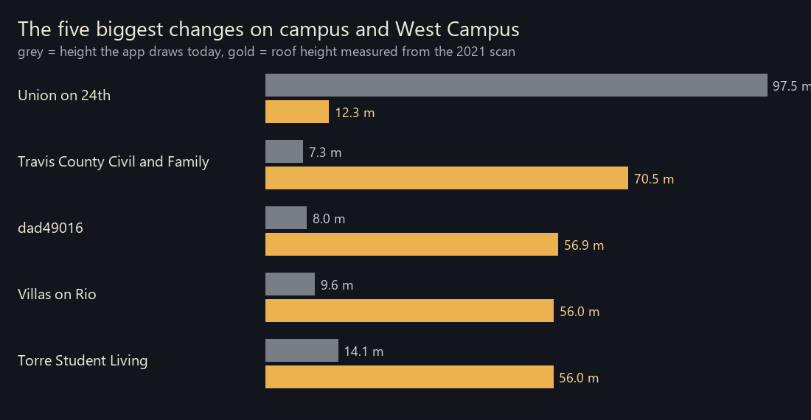
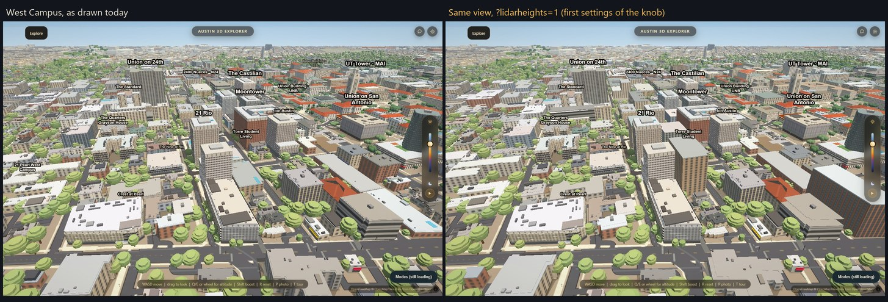

# Roof heights from the 2021 airborne lidar

The heights the app draws are second-hand (Overture and City footprints, a floor
count times a guessed floor height, a hand-typed override). The Gates Dell
Complex alone has four of them: 28.14, 42.39, 29.5 and 16.8 m. A photograph
cannot settle metres; a laser can. This branch measures every building's roof
from the public 2021 scan and ships the numbers behind a knob that is **off**.

## The data

- Bexar and Travis Counties Lidar 2021 (28 cm, about 12 points per square metre
  in Austin), flown 2021-01-26 to 2021-03-07, published by TxGIO (StratMap).
  **Licence CC0-1.0**, public domain. Four of the six tiles that cover campus
  and West Campus were fetched (2.68 GB); the raw files and the 0.5 m raster stay
  outside the repo.
- Not covered: the two south-west and south-east corner tiles, so 72 of the
  2,432 footprints (3.0%) have no number.

## What is in the repo

- `scripts/lidar_raster.py` builds the 0.5 m height-above-ground raster from the
  tiles (building-class surface, bare earth from the scan's ground class).
- `scripts/bake_lidar_heights.py` measures every footprint (shrunk 1 m): p90,
  max, height steps with area shares, flat or pitched, flags. It owns ONE output,
  `data/lidar_heights.json`. The raster folder comes from `--raster` or
  `LIDAR_RASTER_DIR`.
- `js/app.js`: the `LIDAR_HEIGHTS` knob. Default OFF. `?lidarheights=1` swaps
  `final_height` for the measured height once, in `loadScene`, so walls, parapet
  caps, window grids, labels and shadows all see one number. It leaves alone
  landmarks with an authored height, hand-built campus models, buildings drawn
  from parts, and any roof the scan barely saw. Every threshold is a field of the
  knob object.

## What it found

- UT Tower check: crown plateau p90 93.9 m, finial 100.1 m, against 94.0 m drawn.
  Datum, units and registration are right.
- Gates Dell Complex: main roof **28.1 m** (so 28.14 is right), rooftop plant up
  to 31.8 m, nothing near 42 m. 29.5 m is the top of the plant, 16.8 m is a floor
  count guess and is 11 m low.
- Of 2,316 buildings with a number, 714 differ from what the app draws by more
  than 2 m, 246 by more than 5 m and 73 by more than 10 m. The app runs low by a
  median of about 0.9 m; West Campus towers carried from a floor-count guess are
  the worst (a 56 m tower drawn at 14 m).
- The two biggest the other way are wrong heights, not scan error: Union on 24th
  is carried at 97.5 m and reads 12 m everywhere on its footprint.

The after frame was taken with the first version of the knob, which also skipped
canopy-flagged buildings, refused changes over 60 m (so the tall Union on 24th
block did not move) and did not skip hand models. The final settings are not yet
photographed: the graphics slot was timing out on screenshots.

## Known limits

- One extrusion per footprint: a tower on a podium gets the tall part's height
  over the whole footprint until the `steps` in the JSON are drawn.
- Heights are above local ground; on a sloped site that is a compromise.
- The scan is from early 2021. Newer buildings and demolitions are not in it.
- `canopy` (trees over a roof) is information only. The number comes from the
  scan's building class, which ignores trees.
