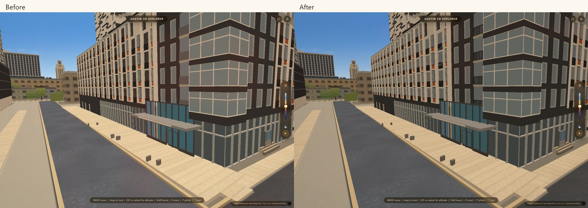
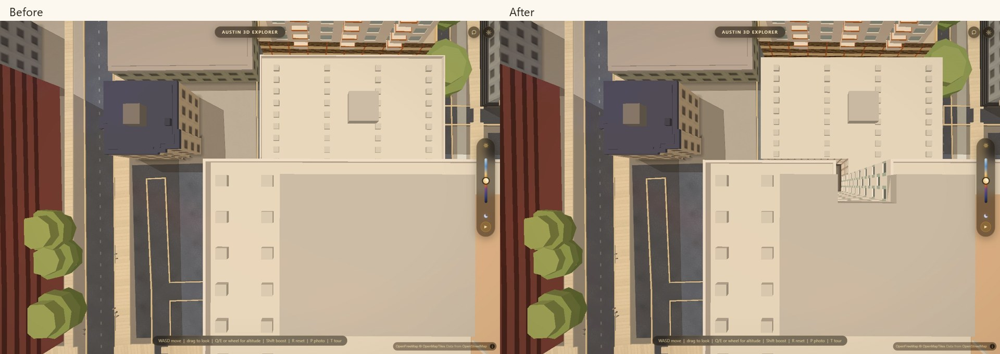

# What if you lived here?

Preview: `?livehere=1&intro=0`. `?walk=0` still disables it, and `WAYFIND.on`
remains false. The normal Explore menu is unchanged outside this preview.

Choose The Standard, Union on 24th or Villas on Rio. Add recurring class
meetings, try the explicitly labeled example week, or use the existing local
schedule importer. Compare home-to-first-class plus last-class-to-home walking
for the week. Between-class walking is shown separately because it is identical
for every apartment. The shortest-distance label appears only when every walk
is available. It is an estimate, with overlapping time ranges, not a rent or
overall apartment recommendation.

Choose a day and a leg to see its path. Street preview follows only mapped
network geometry; it excludes the estimated door connections. Its slider moves
the camera along the path and lifts above blocking building geometry. It is a
preview, not live navigation or a wheelchair-accessibility claim.

Manual edits stay in memory until reload. Imports use the existing device-only
store. The preview copies only building codes, days, times and a review flag.
Unresolved and uncertain imports remain visible for correction. The clear
button uses the existing store's asynchronous deletion, including its IndexedDB
cleanup. No schedule is added to a URL, a server request or the repository.

## Sources and limits

`data/apartment-approaches.json` supplies the two missing apartment entries to
the existing `bake_walk.py`, which remains the only writer of `walk_graph.json`.
Both pass the existing 30 m limit and obstacle-aware anchor checks. Their role
and source explicitly say approximate frontage, not surveyed lobby entrance:

- Union's north frontage follows its [official 701 W 24th address](https://www.unionon24th.com/virtual-tour)
  and the sourced building footprint.
- Villas uses the Rio Grande frontage documented in its apartment specification.
  The [architect's project](https://www.rhodepartners.com/student-housing-villas-on-rio)
  and the existing footprint remain its architectural sources.

The graph rebuild also incorporates the already-current entrances and September
building snapshot. GDC and PCL entrance coordinates differ from the previous
August graph. In the 19 comparison pairs, the measured changes were at most
2.12 m, with all routes still available. The old frozen regression baselines
already failed 13 of 19 pairs before this feature; they are not claimed green.

The Standard gains open balcony rail geometry, separate light recess reveals
and dark glass, and 715 above its existing recessed entrance. Rail spacing and
thickness are editable approximations; the building file cites its existing
S23/S24 photographs. The round entrance logo remains absent.

Villas' light well and east slot follow the footprint's vertices rather than
the old filled rectangles. Roof equipment is clipped or repositioned inside
the roof. Newly exposed, unphotographed walls keep the existing generic panel
rule. Union's existing architecture is retained.

## Implementation and checks

`live-here-core.js` owns schedule arithmetic; `live-here.js` owns the preview.
Routes use `wayfindStairs(..., {geom:true})`, with no second routing engine.
Appearance is editable in `live-here.css` and `window.LIVE_HERE`; balcony geometry
is parameterized in each building specification.

Run `live-here-core.cjs`, `live-here.mjs` and `live-here-buildings.mjs` in
`scripts/verify`, plus `harness-drift.mjs`. Browser gates use hardware WebGL,
cancel graphics auto-detection, and take each evidence screenshot twice.
The building gate compares current data with `origin/main`, so run it before
merging this branch. It proves both restored voids with downward rays and
checks that the original data fails those same rays.

The routing bake reports 19/19 health gates, including all 26 apartment names
routing to WEL. The city still produces its existing 111 startup geometry
warnings; this pass does not claim to resolve them. Final browser evidence and
publication status are recorded below when verification completes.
