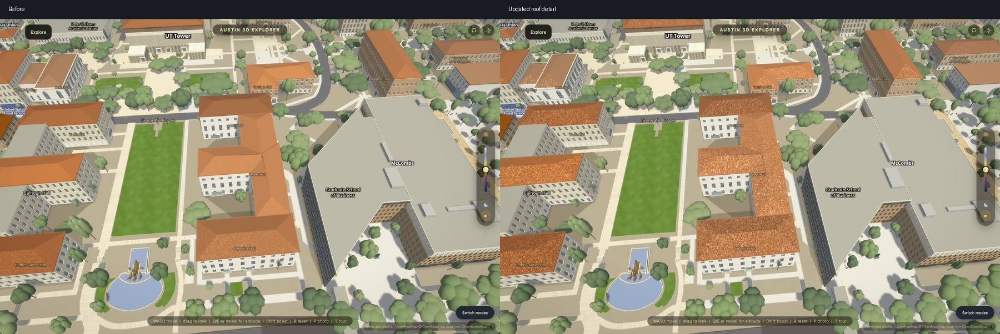
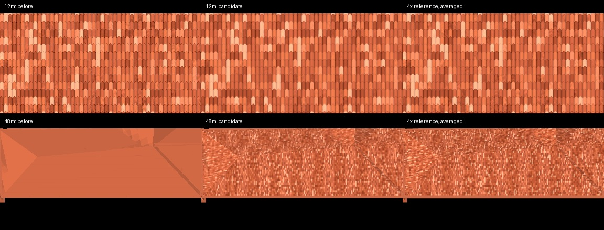

# Roof distance and Mac rendering — October 5, 2026

Work on `codex/mac-roofs-motion`. This is a partial repair of the reported
roof/detail, motion-flicker and frame-rate defects. **30 fps, citywide motion
acceptance and physical-phone acceptance remain open.**



The campus roof meshes load in Safari 17.6 in the tested current build: 198
authored buildings, 108 roof rigs, no shader errors. At middle distance the
previous tile material fades almost completely to its baked colour. The new
material retains readable tiles longer while integrating their colour and
relief over each pixel. No model, texture image or data request is added;
geometry and the existing clay palette are unchanged. The existing roof gate
passes all 16 checks against the saved original renderer, including unchanged
triangle/buffer counts, no new page/worker resource URLs, and identical
non-tile roof and apartment controls.

`SLOPES_ROOFS.tiles` retains the tuning controls. `clayFilter` now uses
0.20–0.65 cells per pixel area, `axisFilter` 0.60–1.00 cells along either axis,
and relief's `filter` 0.65–1.25 cells. Clay uses the at-most-four cells touching
a pixel footprint smaller than one cell per axis, replacing the previous
nine-cell search. Periodic valley/lip coverage is integrated analytically;
barrel shading and curved course displacement use its box-filtered cosine. The course footprint includes a conservative warp bound, without derivatives after divergent returns. Device-pixel bounds also protect reduced-resolution displays. Coordinates are reduced to their
fractional phase before integrating strips, avoiding cancellation at large
world coordinates. Unresolved detail converges to the same roof mean.

The generic stone/brick material also measures continuous coordinates before
its running-bond discontinuity and filters random tile colour with its joints.
This removes a source of colour shimmer; it does not fix thin geometric screens
or all downtown patterns.

## Roof evidence



Safari rendered the production roof geometry/material at 384×192 and
1536×768 from the same orthographic camera, spanning 12 m and 48 m. A second
frame translates the camera by one quarter of a native pixel. The reference
is averaged to native resolution; only fully covered roof pixels enter the
comparison. The native render targets are single-sampled. The reference deliberately retains
tile detail: the 48 m error reduction includes restored detail and must not be
quoted as a pure flicker reduction against the old, nearly flat material. This is an isolated
roof sampling check, not a whole-city motion or frame-rate result.

Against the corrected material's high-resolution reference, mean absolute RGB
error fell from 2.05 to 1.27 at 12 m and 17.03 to 2.66 at 48 m. The residual
frame-to-frame change beyond the reference fell from 2.44 to 0.85 and 4.53 to
1.66 respectively. The close and middle-distance images were also inspected.
The matched Safari city frames were captured twice; the second is shown above.

## Phone-sized movement check

A hardware-Chromium phone emulation used 390×844 CSS pixels, DPR 3, the
phone performance profile at 0.75 scale (877×1899 actual pixels), fixed
exposure, and three poses separated by 0.015 degrees of bearing. In an eroded
roof-only mask, mean absolute brightness change was 0.165 with the original
material, 1.549 with the retained 0.20–0.65 clay fade, and 1.475 with a gentler
0.08–0.25 trial fade. Plain roofs measured 0.015. These are changes during movement,
not isolated aliasing: restoring visible tiles necessarily adds image changes.
The gentler trial appeared calmer but erased real middle-distance tile
variation: in the 48 m reference check its RGB error was 15.81 and motion
residual 5.61, versus 2.66 and 1.66 for the retained setting. The wider fade
was therefore retained. Raw frame differences alone cannot rank aliasing.
This check does not establish lower whole-scene flicker or phone performance.

## Rendering overhead and limits

`CityLighting` now tracks the active texture unit and the two units borrowed
for sun-shadow textures. It observes bind, switch and delete operations and
restores the same bindings after each extrusion draw. Context restoration
reinstalls and reseeds the tracker. `GLSTATE.on=false` retains the original
query path; `GLSTATE.check=true` compares every tracked value with the driver.
This removes three binding queries per affected draw, without changing pixels.
The hardware-Chromium gate also passes at day, sunset and night, after texture
deletion and after context restoration. Star twinkle and cloud drift are pinned
for exact pixel comparisons; leaving twinkle running initially produced a false
night mismatch.

The actual edited Safari build checked more than 50,000 state comparisons with
zero mismatches. An earlier runtime A/B at 4096×2220 produced zero changed
channels in the finished city image. Repeated timing experiments showed only
a small improvement, not a doubling of frame rate. In the smaller 2880×1816
near-USA sweep, minima were 84.6 ms querying and 83.5 ms tracking. These were
visible Safari 17.6, balanced, fixed daylight/exposure, no CPU throttle, on a
shared machine. A contemporaneous macOS check reported a 63% CPU speed cap on
AC power with Low Power Mode off; this is not proof of the bottleneck. The
larger-window first uncached leg was interrupted by a
hidden tab and is invalid. Use the verification gate for reproducible state,
pixel and restoration checks:

```sh
VERIFY_URL=http://127.0.0.1:8467 node scripts/verify/city-texture-state.mjs --restore --out /tmp/city-texture-state.json
```

Do not turn on Smooth edges globally based on this pass. A separate four-sample
Safari experiment at the same smaller viewport took a minimum of 178.4 ms per
frame versus about 83.5 ms without it. That comparison is an exploratory
separate-load measurement, not a complete interleaved hardware acceptance run;
it is enough to reject it as this pass's speed solution. Shader daylight
shortcuts also failed to establish a worthwhile whole-frame gain and are not
included. Neither 30 fps nor the Rowling/USA screen and downtown flicker is
claimed fixed. No physical phone was available.

Compact observations: [verification report](verification/mac-roofs-motion.json).
