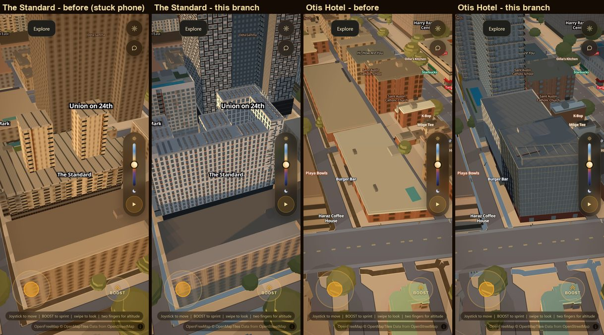
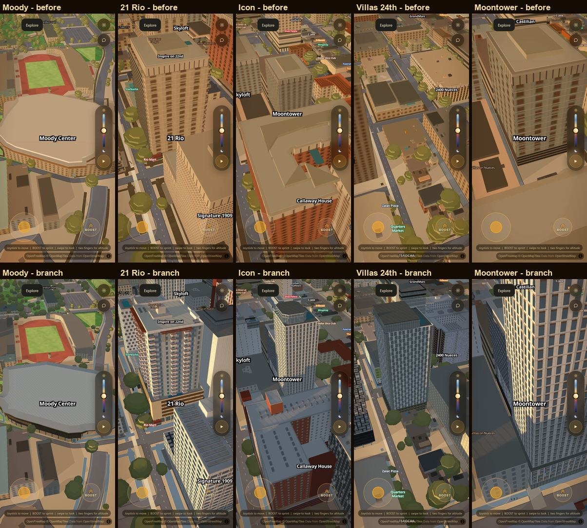
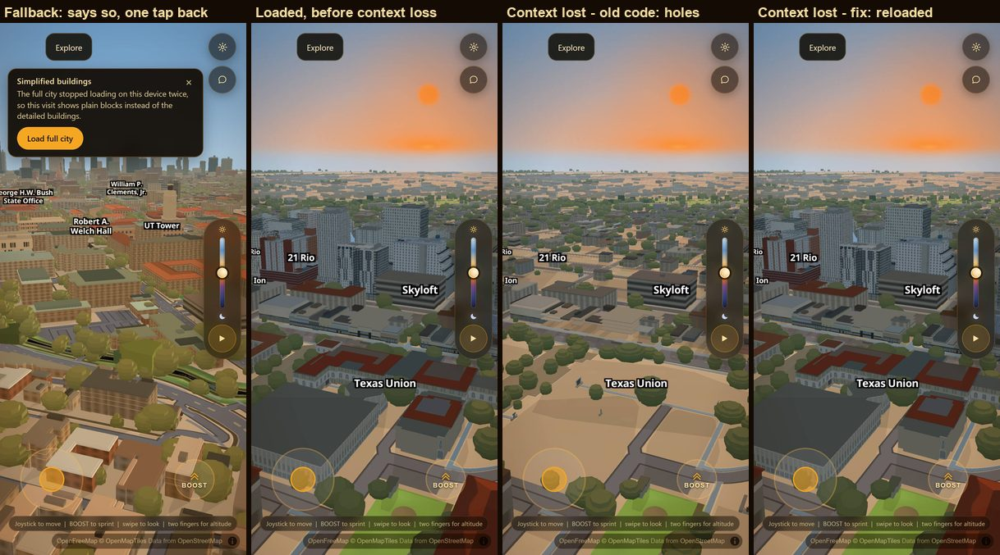
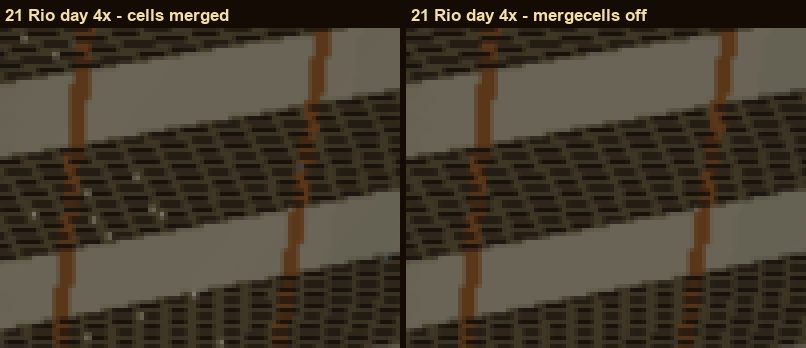

# The phone shows the real buildings (2026-09-19)

Branch `acer/mobile-real-buildings`. Device check for the owner:
`docs/mobile-device-check.md` (**UNVERIFIED on a real iPhone** — no device was
available; everything below is an emulated phone in desktop Chrome: 390x844,
DPR 3, `isMobile`, `hasTouch`, iPhone user agent,
`matchMedia('(pointer: coarse)')` true in the page, `LITE_PROFILE.on` true).

## What was reported

On a phone, The Standard showed as two pointy sticks and campus as flat prisms
with no pitched roofs. Two people had reported the same thing before (HANDOFF
"Sep 16 2026 — The phone shows the REAL buildings"). Flat red roofs mean the
whole three.js layer was off: that is `js/mobile.js`'s emergency fallback
(`slopes=0`), which puts every one of the 195 authored buildings back to its
old prism (`replacedBuildingIds` are only filtered out while the layer is on).

## The cause — measured, on main at c656249

`scripts/verify/mobile-boot.mjs returning`, before the fix: three ordinary
visits, each one finished loading and was left open, then a reload.

| visit | profile | authored buildings | address bar |
|---|---|---|---|
| 1 | normal | 196 built | `?drift=0&campuslandscape=0&preset=performance&lite=1` |
| 2 | normal | 196 built | same |
| 3 | **fallback** | **0** | `?drift=0&slopes=0&campuslandscape=0&preset=performance&lite=safe` |
| reload | **fallback** | **0** | same, forever |

The boot counter read 1, 2, 3 — it never cleared. A phone that never crashed
was put on the old buildings by its third visit and kept there.

1. **The crash counter never cleared.** It was cleared when the veil read
   `gone` or opacity `'0'`, polled once a second. `js/app.js` fades the veil for
   1.15 s and then *removes* it, so the poll almost never saw either state,
   found no element, and returned early forever. Only a 120 s timer cleared it
   — and iOS suspends timers in a background tab. Every visit shorter than two
   minutes, every reload during the ~30 s load, counted as a crash. Two of them
   and the third visit took the fallback.
2. **The fallback was written into the URL.** `history.replaceState` put
   `lite=safe&slopes=0&…` in the address bar, and `lite=safe` means "forced by
   hand", which skipped the counter. Reload, bookmark, home-screen icon,
   restored tab: the old scene permanently, with nothing on screen saying why.
   Shared, the same link forced it on whoever opened it. (The normal profile
   leaked the same way: `lite=1&preset=performance&campuslandscape=0` in a
   shared link forced the phone profile onto a desktop.)
3. **A slow load also silently showed the old buildings.** `js/app.js` gives
   the authored buildings 90 s (`INTRO.authoredCeilingMs`); past that it turns
   them off for the visit. On this laptop under load (CPU 83-100% from other
   lanes' browsers) **11 of the 15** normal-profile phone visits in the final
   boot suite crossed 90 s (authored build 54-150 s). Without the fix every
   one of those would have shown The Standard as its old prism for the whole
   visit. A different mechanism from the report's (campus keeps its pitched
   roofs), but the same symptom, and exactly what a slower phone would hit.
4. **A lost WebGL context left holes.** Nothing in the app listens for
   `webglcontextlost`. Forcing a loss and a restore on the loaded phone scene
   (`WEBGL_lose_context`): MapLibre came back, the three.js layer did not
   (`slopes.frames` stayed 0, three `Cannot read properties of null (reading
   'getLayer')` errors) and every authored and campus building was a hole.
   Phones do reclaim WebGL contexts under memory pressure without killing the
   tab; this is not the reported picture (holes, not prisms), but it is the
   same "wrong city on a phone" class and it was one listener away.

Also checked, no defect found: every asset loads on the phone path (no 404 or
page error on a fresh visit); `pageshow` from the back/forward cache and
`visibilitychange` are now part of the boot record (below); nothing else in the
app writes the URL.

## The fix

`js/mobile.js` (rewritten) and one guarded branch in `js/app.js` `tick()`.

- **A boot is a record, not a count.** `pending` is set while a boot runs *and
  the page is visible*. Success clears it (veil lifted, authored buildings
  landed, then 15 s visible). So does every way a load ends that is not a
  crash: `pagehide` (reload, navigation, close), `visibilitychange` to hidden
  (app switch, lock), `freeze`. A boot that finds a `pending` left by the one
  before knows that one died while visible with none of those events — which
  is what a WebKit memory kill looks like. Two in a row → the fallback.
- **The fallback is never in the URL.** The profile flags are written into the
  query string only while the scripts parse (every module reads its switch at
  evaluation — checked: every `location.search` read in `js/` is either
  top-level or reads a flag the visitor set), then the visitor's own URL is put
  back on `DOMContentLoaded`. A reload in that window is recognised by a
  `lite=auto` marker.
- **The fallback says so.** A card at the top — "Simplified buildings", the
  reason, **Load full city**. One tap gives the full city a fresh try. A visit
  an hour after the fallback started tries the full city by itself.
- **Old state recovers by itself.** The pre-fix integer counter is discarded;
  a URL carrying exactly what the old version wrote (`lite=safe` + all three
  safe flags, or `lite=1` + the phone profile) is cleaned. A hand-typed
  `?lite=safe` is still honoured, and explained.
- **A slow phone keeps its authored buildings.** Past the 90 s ceiling a phone
  (`LITE.lateAuthored`) lifts the veil on the prisms and lets the authored
  meshes land when their build finishes (the filters follow the group, so the
  swap is never a hole). Desktop keeps its existing behaviour. The boot is not
  called a success until they have landed, so a death at that allocation still
  counts.
- **A lost graphics context reloads.** On a phone with the three.js layer on,
  a lost context on the map canvas reloads the page as soon as the browser
  restores it, or 3 s after the loss if it has not — in both cases only while
  the page is visible (a hidden page waits until it comes back). At
  most once per 10 minutes; inside that window the notice offers "Reload city"
  instead, so a phone that keeps losing the context cannot reload forever. The
  reload is a `pagehide`, so it is never counted as a crash.
- Taste values (thresholds, windows, notice copy and colours) are in the
  `LITE` block at the top of `js/mobile.js`.

What a phone gets is unchanged: the authored buildings, roofs and windows;
`preset=performance` (no window reveals or sign dots) and no campus planting
layer. Desktop (no coarse pointer and touch screen) returns from `js/mobile.js`
before it reads or writes anything, except to clean an old phone URL.

## Evidence

All on the emulated phone above, `scripts/verify/mobile-boot.mjs` against a
local server of this branch, hardware GL, every run wrapped in the lane's GPU
slot. The machine was loaded throughout (other lanes' browsers, CPU 83-100%),
so load times here are slow and not a phone's; the pass/fail results are the
point, not the timings.

**Before/after, same camera, second of two shots.** "Before" is the scene a
trapped phone showed (`slopes=0`, the old prisms: The Standard as two stubby
towers on a slab); "this branch" / "branch" is the normal phone profile. In the
second sheet the top row is before, the bottom row this branch.

**Boot scenarios** — `mobile-boot.mjs` (all scenarios), **37/37 PASS** on this
branch. Before the fix (main at c656249) the same `returning` scenario failed
visit 3, the reload and the clean-URL check. The suite's first scenario ran
while the slimming change below was still in the tree; it was re-run on the
final code alone: 5/5 PASS.

| scenario | result |
|---|---|
| fresh visit: coarse pointer, profile on, 7/7 named authored buildings built, URL untouched, no 404 | PASS |
| three ordinary visits + a reload: all normal profile, authored buildings, clean URL | PASS (was: 3rd visit and reload = fallback) |
| three loads cut short (reload at 3 s, navigate away at 6 s, reload at 9 s), then a visit | PASS: normal profile |
| hidden + frozen 10 s mid-load (CDP `Page.setWebLifecycleState`), resumed | PASS: finishes with the authored buildings |
| three tabs killed while hidden, then a visit | PASS: never trips the fallback |
| two genuine renderer crashes mid-load (CDP `Page.crash`, no pagehide) | PASS: fallback, notice on screen, URL clean |
| one tap on "Load full city" | PASS: full city, clean URL; a later visit stays normal |
| pre-fix phone: old counter at 3 + old `?…&lite=safe` URL | PASS: full city by itself, URL cleaned, reload stays normal |
| hand-typed `?lite=safe` | PASS: honoured, explained, one tap restores the full city |
| old phone URL opened on a desktop | PASS: no phone profile, URL cleaned |
| landscape 844x390 | PASS: profile on, authored buildings |
| desktop 1280x800 | PASS: no profile, URL untouched, no boot record, three.js layer + campus planting on |
| WebGL context lost + restored after load | PASS: the page reloads by itself, the authored buildings draw again, not counted as a crash |

`scripts/verify/mobile-timeline.mjs` logs, once a second from navigation to
reveal, what the reveal gate is waiting on (model data, the time-sliced build,
the legacy filters, tiles); it is how lead 3 was found.

**Memory** (`scripts/verify/mobile-budget.mjs`, SwiftShader, 390x844 DPR 3,
JS heap after a forced GC once the authored buildings have landed; main and
this branch interleaved on two local servers that differ only in `js/mobile.js`
and `js/app.js`), three reps each, interleaved:

| server | JS heap MB, min (spread) | three.js triangles at the reading |
|---|---|---|
| this branch | **462** (462-508) | 1,890,519-1,906,547 — the authored buildings |
| main | 263 (263-486) | **42,624 — no authored buildings in any rep** |

The two cannot be compared as memory: on this loaded machine main crossed the
90 s ceiling in all three loads (veil 107-119 s) and dropped the authored
buildings, which is lead 3 again, measured by a different instrument. The
branch kept them in all three. Its 462 MB is the same phone profile as main's
when main is fast enough (the Sep 16 budget quoted ~485 MB): the fix adds no
memory of its own, it stops a slow phone from throwing the buildings away. A
slow phone now holds the same memory a fast one always did; if that ever kills
it, the crash record and the explicit fallback above take over.

**Slimming (`origin/acer/slim-cells` 701b953) was left out.** It merges runs of
same-tone wall cells into one quad: 1,849,232 → 1,456,516 apartment triangles
(−21%) on the phone profile. The pixel check (`scripts/verify/mobile-mergecells.mjs`:
the flag toggled inside ONE page and the apartments rebuilt, so the control is
the same page shot again; SwiftShader, 7 authored buildings, day + night,
phone arm) did not pass: 8 of 14 frames changed more than their control. Most
of those changes sit off the authored facades (ground and low roofs that
change with night-lighting state, the pulsing BOOST ring), and the control
moves on most of them too, so they are not evidence either way. One is real
and on a facade: merged runs leave single-pixel sparkles in 21 Rio's dark
window bands, identical in both merged shots and absent with `?mergecells=0`
(control 0 px, change 2,372 px, max channel difference 128). (The desktop arm
timed out at app.js's 90 s ceiling on this machine; the instrument now
re-enables the buildings, but with the phone arm failed it was not re-run.) Those are
T-junction cracks — a merged pier's long edge meets the window cells'
vertices — and on a phone they would twinkle as the camera moves. Not
shipped; the instrument is committed so the merge can be retried with the
cracks closed (e.g. merging only runs whose neighbours share both edges).

## Not done / open

- **The real device is UNVERIFIED.** `docs/mobile-device-check.md` is the
  procedure. The one thing emulation cannot prove is that a real WebKit memory
  kill arrives with no `pagehide`/`visibilitychange` — the design rests on it
  (and on a background kill arriving after `visibilitychange` hidden).
- **Desktop has the same context-loss hole.** `js/mobile.js` only covers the
  phone; the real fix is for `js/slopes.js` to rebuild its renderer on
  `webglcontextrestored`. That file belongs to the render path, not this lane.
- **Load time.** On this loaded machine the phone's authored build took 54-150 s.
  The fix makes a slow build land late instead of vanishing, but it does not
  make it faster; a phone that needs 90 s+ still sees prisms for that long.
- The "slow" notice copy in `LITE.notice` is reachable only with
  `LITE.lateAuthored = false`.
