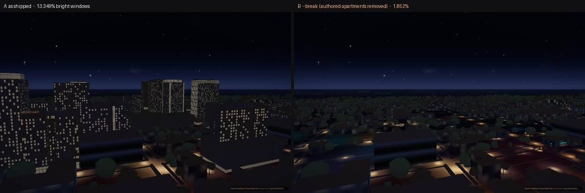
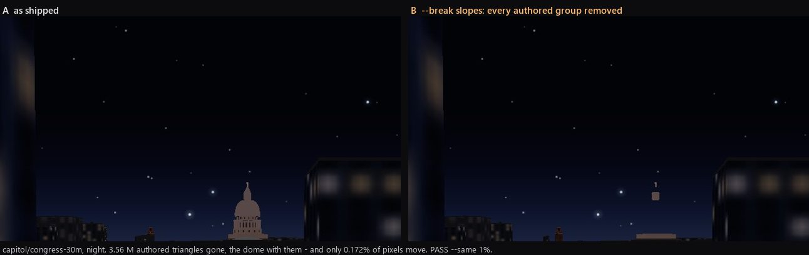
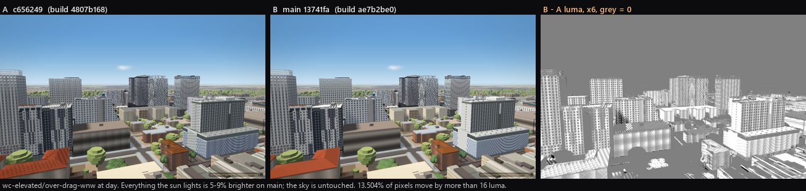

# Night renderer: implementation plan

Written 2026-09-19 for Codex, who owns the integrated night renderer and the final lighting calibration.
It is a plan only: nothing in it has been built. Evidence is in `docs/night-reference-package.md`, from the
owner's photos and the web references.

**Line numbers are against `main` @ `13741fa` (re-anchored 2026-09-21).** They were written against
`c656249`, and `main` then changed six files this plan cites — `js/app.js`, `js/city-lighting.js`,
`js/graphics.js`, `js/lod.js`, `js/mobile.js`, `js/slopes-dome.js` — so 23 of the 28 citations into
those files had drifted and every one of them still looked right. The worst was D1's named risk,
`js/city-lighting.js:215`, which on today's `main` is unrelated shadow-proxy code; it is `:263` now.
Each one was re-anchored by matching the exact source line, not by eye. **The baseline frames and every
number in §7.2 are still of `c656249`** — the shoot has not been repeated — and §7.2 says what changed
underneath them.

Tags used throughout:
- **[M]** measured: pixels, data or timing, with the method named.
- **[C]** read from code.
- **[P]** proposed.
- **[E]** an estimate that nobody has measured. Every [E] needs a measurement before it is quoted as fact.

**Non-goals:**
- No global brightness increase, and no "more bloom". Both were measured not to be the problem (§1.4).
- The daytime look stays: the owner likes the citywide sunlight and strong window glare (PR #267). Every
  change here must leave p ≤ 0.56 frames within noise of `main`.

**What the owner has already said about night, and how that squares with the first non-goal.**
`docs/PASS_NIGHT.md` (2026-07-31) opens with his only recorded verdict on night mode, verbatim:
**"lights are a bit too dim on night mode."** Read plainly that asks for the thing this plan's first
non-goal refuses, so it has to be answered rather than left out.

That pass answered it and the answer holds here: measured, the complaint was **density, not gain**. There
were 1,039 street lamps in a 3.3 × 3.1 km box, adding +0.15 to +0.57 luma across the whole frame, and the
two biggest unlit road classes (`service` and `path` — campus drives and every lit walk, 416 features)
had no lamps at all. More lamps in more places read as "brighter". Turning the existing ones up did not,
and the same pass found that when it luma-mismatched the cool edge against the warm core the result was a
belt of white blobs, not a brighter city.

So: **more lit things, not more gain.** Every item below adds light by adding sources and occupancy
(W3, W4, W5) or by lowering what should never have been bright (the sky and the unlit walls, W1/W6).
None of them turns a master exposure up. If the owner says "still too dim" against a frame built this
way, that is the §8 taste call and not a bug — and §8 now shows him where the two answers differ.

**The full inventory this plan summarises is `docs/night-code-inventory.md`** — in this repo, next to
this file, since 2026-09-20. It is 50 KB of code analysis with no photograph in it, so nothing in the
disk or licence rules kept it out, and Codex owns the renderer it describes: handing him a summary and a
list of line numbers while the reading sat in a git-ignored folder on one laptop was simply a mistake.

**Where the rest of the baseline evidence is (local, not tracked):**
`<projects>/austin-reference-images/_night/_baseline-c656249/` holds:
- `captures-C/`: 12 views × blue hour, twilight and full night, plus the `E1` and `E7` experiments;
- `captures-B/`;
- `sweep.json`, `perf-*.json`;
- the capture scripts.

The owner-photo analysis is under `austin-reference-images/_owner-phone/analysis/`. It is private, and it
names a viewpoint that must not be copied into any tracked file.

---------------------------------------------------------------------------------------------------

## 1. Current state (summary of the inventory)

### 1.1 Nine clocks instead of one [C][M]

The slider `p` drives the sun (`js/sky.js:49-56`: p .50→+6°, .62→−5.8°, .69→−12°, 1.0→−40°). The one
schedule that `js/sky.js:119-173` (`SKY_TUNE.DUSK`) says everyone should use, keyed to sun elevation, is used
by the lamps only. Every other consumer carries its own ramp in p:

| consumer | ramp | where |
|---|---|---|
| street/tower/entrance pools | sun +2° → −6° | `js/sky.js:253`, `js/night.js:740-742` |
| sky darkness, auto-exposure target, label dim | sun +1° → −31° | `js/sky.js:249`, `js/graphics.js:888`, `js/timeofday.js:468` |
| stars | sun −7° → −18° | `js/sky.js:257` |
| facade-atlas lit windows | `(p−.55)/.45`, full at p≈.90 | `js/facades.js:1969`, `:2158`; `js/places.js:325`; `js/drag.js:579`; `js/moody.js:523` |
| facade-atlas wall darkening | `max(night, −sun/9)` | `js/facades.js:1971-1976` |
| hero/arts windows, DKR field | `(p−.62)/.38`: zero until blue hour ends | `js/heroes.js:458`, `js/arts.js:241`, `js/app.js:1183` |
| OSM walk lamps | `(p−.58)/.27`, the old ramp | `js/props.js:109`, `:494-498` |
| every baked `wd/wg/wn` trio, and three.js `cNight` | linear golden→night over p .5→1 | `js/timeofday.js:208-215`, `js/outer.js:315-326`, `js/westcampus.js:147-165`, `js/facades.js:3368-3376`, `js/slopes.js:360-361` |
| DKR mesh floods | smoothstep p .58→.92 | `js/slopes-stadium.js:22`, `:362` |

At p .62 [M]:
- street lamps are 99.8% on;
- atlas windows 20%;
- baked and three.js night colours 24%;
- hero and arts windows 0%.

### 1.2 No emissive term in either renderer [C][M]

Both MapLibre's extrusion shader and the slopes shader compute `colour × directional × u_lightcolor`
(`js/slopes.js:392-404`). They transcribe MapLibre, and at night `cityShade()` is a no-op
(`js/city-lighting.js:73`).

So every lit window, sign band and floodlit wall is multiplied by the night light
`#8fa0e0` = (0.561, 0.627, 0.878) (`js/timeofday.js:81`). The one exception is the DKR mesh
(`js/slopes-stadium.js:361-362`). It applies `max(lit, cNight*mask)` **after** that multiply, which makes it
the working precedent.

`js/tower.js:322,447,531-542` and `js/entrances.js:51,603` pre-divide by the **old** light `#9aa6da`.

Measured, E1 at p=1, changing only the light colour to white:
- WC-elevated view: pixels above luma 120 go from 0.17% to **4.71%**, and p99 from 96 to 177.
- Lit panes land khaki (158,136,105), against the owner's warm white (195,182,152).
- Congress's only bright pixels average lavender (171,177,196).

### 1.3 How lit windows are chosen [C][M]

| renderer | unit of choice | structure |
|---|---|---|
| facade atlas, `js/facades.js:2126-2160` | one pane cell of a 33 m tile, `hash01(seed,r,c) < occupancy` | **None.** The seed is (family, colour bucket), so 125 patterns cover the city and the top one sits on 618–733 buildings [M, E2]. The pattern repeats every tile (6–10 storeys). Tone is per pane, occupancy is constant all night. At walking height the tile holds **one window**, so each building is 100% lit or 100% dark: 11 of 23 tower bases have 0 lit texels and 12 are fully lit [M, E7]. |
| hero/arts/drag/moody atlases | `hash01(col+k,row+k2)`, constant salts (`js/heroes.js:509,553,589,616,640`; `js/arts.js:271,314`) | per tile, no floors |
| places storefronts, `js/places.js:345-379` | the whole shop | every one of 133 lit all night, all equally bright |
| three.js apartments, `js/slopes-apartments.js:943` | one opening, `h01(building\|block\|face\|skin,'lit',bandFloor,col,part) < 0.45` | Real floors and bays exist, but the choice ignores units. Every building gets exactly 45%, one tone `#d9b46a` (`:125-129`). Storefront and curtain stacks are 100% lit (`:1110-1116`). The lit colour is reached only at p=1 (`:740`). |
| UT Tower, `js/tower.js:337-549,1355-1460` | flood circuits + numeral windows | **The only sourced model.** Keep it. |

### 1.4 Light without sources, sources without light [C][M]

- **Street pools:** 3,344 synthetic points sampled on road **centrelines** (`js/night.js:569-586,622-670`).
  - [M] Only **2.2%** have a mapped OSM pole within 15 m, and 10 sit inside buildings.
  - The "head" is a second ground disc (`:483-495`).
  - Pools sit **below** the raised `ground-paths` (layer **#134 vs #144**, as the layer-order table in
    `js/night.js:414-440` gives them — this plan quoted #137 and #145 until 2026-09-20), so pavements are
    never lit. That comment also records that moving the pools after the ground stack works and is not
    shipped only because `scripts/verify/night-lights.mjs:89` gates on `poolIdx < buildingsIdx`, which is
    the layer-index assertion W0 proposes to re-express in pixels.
  - The generator is fenced to latitude ≥ 30.269 (`:547-567,623`), so downtown streets have none.
- **What the pools look like** [M]:
  - WC street, p=1: hiding the lamp layers drops the lower frame from luma 110 to 11. The carriageway reads
    148–151 with a std of 9.4 (a flat orange floor), while the Guadalupe shopfront pavement beside it reads
    14.
  - At sunset (p .54→.56) the street's lower frame jumps 105→141: brighter than at noon.
- **Entrance pools:** one pool per door **ring point**, so 4–5 stacked circles per leaf across 1,413 doors
  (`js/entrances.js:208-221`; MapLibre's circle bucket emits a circle per ring vertex) [C].
- **Unsourced glows:**
  - 48 sign pools sit at sign anchors, and the signs themselves are screen-space text (`js/signs.js:86-135`).
  - The 115 m uniform Tower pool (`js/night.js:337-347`).
  - The WC pool and jumbotron colours, which light nothing (`js/westcampus.js:99-145`).
  - The Capitol flood is a flat wall colour (`js/capitol.js:64-121`).
- **Sources with no light:**
  - The 531 OSM lamp poles are dark geometry, with pools on the stale ramp.
  - 751 downtown retail bands and 335 crowns are baked **darker than their walls** (luma 24–27 vs 32–33) [M].
  - 6,866 outer low-rise prisms have no windows.
  - Parking decks are a thin cool edge line (`js/facades.js:1025-1029,2029-2045`).
  - There is no crown mode, no beacons and no traffic.
- **Frame statistics** (graded JPEG luma, run C, 1440×900 hardware GL) [M]:

  | view | blue hour p .62 (mean / p99) | twilight p .69 | full night p 1.0 |
  |---|---|---|---|
  | 01 skyline across the lake | 103.8 / 165 (**lake 161 vs sky 31**) | 70.7 / 118 | 8.9 / 58 (0 px > 120) |
  | 02 Congress street | 79.8 / 142 | 64.7 / 117 | 17.0 / 76 |
  | 04 WC elevated | 90.8 / 154 (**wall 139 vs sky 32–96**) | 69.1 / 123 (wall 109 vs sky 20–70) | 14.8 / 89 (wall 13 vs sky 4) |
  | 05 WC street | 141.9 / 239 | 111.8 / 207 | 73.4 / 163 (the pools) |
  | 07 South Mall | 93.8 / 185 | 67.5 / 128 | 12.7 / 79 |

  - Pixels above luma 200 at p=1: **≤ 0.001% in all 12 views**.
  - Bloom's pre-grade threshold is about 0.775, or luma ~198 (`js/graphics.js:1085-1119`), so it has nothing
    to act on.
  - Auto-exposure sits on its clamps: **gain 1.20 at blue hour in 10 of 12 views, and 0.85 at full night in
    11 of 12** (`js/graphics.js:845-897`).
- **Other night state** [C][M]:
  - The night light points up from below the ground (z = −0.803, the sun at −40°), not from the moon
    (`js/timeofday.js:409-420`).
  - The sky zenith is `#040713` with 520 stars (`js/sky.js:1245-1256`).
  - Water is a flat plane with no reflection path (`js/ground.js:656-670`).

### 1.5 Cost baselines [M]

All from `night-perf-ab.mjs`: 5 interleaved reps, minimum reported, 1440×900 hardware GL. The machine
was loaded by other lanes.

| setting | view | day min ms | night min ms | reading |
|---|---|---|---|---|
| desktop `balanced` (CPU 88%, 3 GPU slots busy) | WC elevated | 29.3 | 30.1 | no measurable night cost |
| desktop | campus aerial | 38.2 | 45.9 | spreads overlap; weak signal at most |
| `?lite=1` (performance, 0.75 scale, no bloom) | WC elevated | 11.0 | 9.7 | no night cost |
| `?lite=1` | campus aerial | 22.1 | 14.5 | no night cost |

- **Retint to night:** 1.25–3.17 s of synchronous main thread per `applyTimeOfDay` (desktop), and
  0.97–1.29 s under `?lite=1` (`js/timeofday.js:379-482`).
- **Phone memory:** `scripts/verify/mobile-budget.mjs` read a 1,035 MB JS heap for the full scene before the
  slopes geometry was indexed (HANDOFF, 2026-09-15). `js/mobile.js` now keeps the authored buildings under
  the `performance` preset.
- The slopes vertex already carries `aSurface` (vec4 float; `js/slopes.js:353,642,912`). **Any new
  per-vertex attribute multiplies across ~2.5 M apartment triangles.**
- Frame rate on a real iPhone has **never been measured** (HANDOFF §139 and later).

---------------------------------------------------------------------------------------------------

## 2. The gaps, in one paragraph each

1. **Randomness without structure.** Lit windows are independent coin flips on a texture tile shared by
   hundreds of buildings. Real windows cluster by apartment and by floor [M: Icon's full three-window groups
   lit 3.5× chance; Lark's per-floor SD 2× binomial]. Real windows change with the hour [M: 35–45% at 20:36,
   4–12% at 03:05]. And each one belongs to a building with a lobby, a crown and a garage.
2. **Lights without sources.** Ground discs stand where no lamp is. The real lamps, lobbies, signs and
   garages that light Austin are dark geometry. Every emitter is tinted by a blue light from under the ground.
3. **Nine clocks.** Walls, ground and water follow p while the sky follows the sun. So at dusk the city
   outshines its sky (the lake at luma 161 against a sky of 31) [M], which is the reverse of every blue-hour
   reference.
4. **The existing gates encode the wrong target.** `scripts/verify/night-silhouette.mjs:53-59` requires
   sky luma − wall luma ≥ +8 at p=1.0 and p=0.7. The owner's 20:36 photo would **fail** it: sky 31 against
   wall 59–63 (sRGB), a separation of about −30 [M]. That rule holds at blue hour, not at night (reference
   §4.8). `scripts/verify/night-lights.mjs:89` asserts a layer INDEX (`poolIdx < buildingsIdx`) where the
   property that matters is occlusion. That is the only thing keeping pavements dark (`js/night.js:414-440`).

---------------------------------------------------------------------------------------------------

## 3. Reusable material / light categories [P]

These classes replace per-file ad-hoc constants. Every value in the table is a starting target from the
reference package, and belongs in one taste block (AGENTS.md rule 11), e.g. `NIGHT.classes` in a new
`js/night-classes.js` read by every renderer.

"Level" is relative to the median lit residential window, which is 1.0. The sun elevations are on-curves on
the single clock (W1).

| id | class | emitter/receiver | on-curve (sun elevation) | colour (sRGB, display) | level | spatial rule | renderer paths |
|---|---|---|---|---|---|---|---|
| RW | residential window (unit) | emitter | ramps in from about −2°, peaks around −12…−19°, decays to deep night | 70% `#a29671`–`#b09b78`, 15–20% warmer, ~10% whiter, 2–7% accent | 1.0 (spread 0.5–2); dim 0.25–0.33 | per unit (2–3 bays; corners shared), per-floor bias ±0.25, per-building rate, dark top floor allowed | three.js apartments; atlas (`tr`, `mr`, `lo`, `tw`); heroes/arts |
| OW | office / curtain-wall floor | emitter | on from 0° (before accents) | whiter and cooler than RW (no measured office sample; `#d2cdb8` is a placeholder [P]) | 0.8–1.2 [P] | **per floor band**; late-night floors few | atlas `tg`/`mh`; downtown towers |
| HT | hotel | emitter | from 0° | as RW | 1.0 | high and even (near 100% at full night) | per-building preset of RW |
| LB | lobby / open retail | emitter + ground spill | on before sunset; off at closing time | `#e5c37f`–`#f6d792` | **1.5–4** | continuous full-height volume; pavement pool 0.6–1.0× a lamp pool | places.js bands; slopes-apartments storefront stacks; outer `k=r` |
| GD | garage deck / amenity band | emitter | all night | cool `#869aae` / `#8399a2` (older decks warm) | 1.0–1.4× a storefront | horizontal bands, soffit points, screen-filtered | atlas `dk`; WC decks; podiums |
| CR | crown / rooftop amenity | emitter | from sunset | clipped white fins over a warm lounge `#f2e2ba`; glass box `#dfeedb` | clipped | +25% spill on the top 2–3 floors; 2×-sky skirt ≤ 4° for large crowns | slopes roofs/pavilions; outer `k=c`; halo sprite |
| AC | accent LED | emitter | from 0° | saturated purple/cyan/amber/green (palette §6 of the reference) | small area, high | along setbacks, chevrons, lanterns; named towers only | downtown tower data |
| PL | pool light | emitter + wall tint | from sunset | green `#00c644`, purple `#914fc4` | — | tints the adjacent wall (Torre `#3c6642`) | `js/westcampus.js` pool solid |
| SG | sign | emitter + pier wash | on before sunset | cool white `#bcdaee`/`#c2e7f0`/`#e8f2dc`, or brand colour | clipped | washes its pier 4–6× over 3–4 floors | on facades (not screen text) |
| SL | street lamp | head emitter + ground light | sun +2° → −6° (already) | head `#eeeed9`; pool warm-neutral; far neighbourhoods `#d27e4d` | head clips | at mapped poles and kerb lines; pool 5× under vs midway; full-cutoff | sprites + ground-light term |
| WL | walkway/globe/bollard/festoon | emitter + small pool | as SL | warm; festoon `#917b41`–`#a4915c` | head clips | pools 2.6× under vs midway | props lamps |
| EN | **entrance / doorway** (added 2026-09-20) | emitter + doorstep pool | on before sunset, on all night for a lobby door; residential doors follow LB | door glass warm `#e5c37f`–`#f6d792` as LB; transom the same, dimmer; canopy soffit cooler `#d7be98` | 0.6–1.0 (a doorway is a small lobby) | the lit thing is the **glazed leaf and its transom**, not the surround or the rail; canopy soffit washes down; a pool on the step/landing, 0.5–1× a WL pool | `js/entrances.js` — `data/entrances.geojson` already carries **1,413 `door`, 1,786 `glass`, 439 `transom`, 78 `canopy`, 33 `sign`** pieces as separate features, so this is a paint expression on `k`, not new geometry |
| CY | **courtyard / amenity court** (added 2026-09-20) | receiver + WL emitters | as WL | paver warm-neutral under festoons; turf reads near-black beside it | — | the **surface contrast is the subject**: IMG_9971-72 measure a **15× paver-vs-turf albedo** under the same fixtures (D2), so a court lit as one flat material is wrong however bright it is | `js/campus-landscape.js` surfaces + WL fixtures; the West Campus amenity decks in `js/westcampus.js` |
| FL | landmark floodlight | receiver lit by fixtures | as SL | stone white/cream (Tower white state), dome blown white | — | falloff from fixture positions | `js/tower.js` (keep); `js/capitol.js`, `js/slopes-dome.js` |
| BC | obstruction beacon | emitter | from 0° | `#e30015` | point | 1–4 per tall roof; strings on masts | sprites |
| UW | unlit wall / roof / ground | receiver | darkens with the sun, not p | warm-grey `#453a2b`–`#483f32`; cool near cool LEDs | wall 4–7× sky early, ~25–30× deep; glass 0.4–0.6× wall | albedo × (skyglow ambient + nearby spill) | all |
| WA | water | receiver/mirror | follows the sky | sky colour + emitter streaks | ≤ sky at dusk | rippled vertical streaks under emitters | ground water |
| SK | sky | — | sun | slate `#1c1f24`, horizon ×1.9, near-black late | — | urban skyglow, few or no stars | `js/sky.js` overlay |

---------------------------------------------------------------------------------------------------

## 4. Engine decisions that the research settles

Each item here is a question whose answer changes the implementation. Nothing else was researched.

**D1. How to get an emissive term into MapLibre's extrusions without forking MapLibre.** [C] + [P]
- `js/city-lighting.js:239-264` already rewrites MapLibre 5.24's fill-extrusion shaders, and it throws
  visibly if the contract changes.
- Read in the 5.24 build (`maplibre-gl-dev.js`):
  - **Pattern walls:** lighting is applied in the fragment as `fragColor=mixedColor*v_lighting`. The atlas
    already reserves alpha 191 for glass (`:84-89`, decoded at `:212`). A second alpha code for "emissive
    pane" is decodable in the same place. It then outputs the texel **without** `v_lighting`.
    - Risk: bilinear filtering blends codes at pane edges. Edges between an emissive code and opaque 255
      average to about the glass code, so they read as an unlit reveal: acceptable.
  - **Solid extrusions:** the vertex shader builds `v_color` from `vec4(0,0,0,1)` and never reads the
    per-feature colour's alpha. So `fill-extrusion-color` alpha is a free per-feature channel. The patch
    already passes the raw colour as `v_cityAlbedo` (`:201`).
    - Style colours are stored **premultiplied** in 5.24 (the Color class comment says so), so the fragment
      must un-premultiply `rgb/a`.
    - **It is not free until one more line changes, and W2 — which everything from W3 onward rests on —
      rests on this.** (Named 2026-09-20; §9 used to hedge "must be verified on the real build" without
      saying what the mechanism was.) The patched solid fragment at `js/city-lighting.js:263` is
      `fragColor = vec4(cityShade(v_color.rgb/max(v_color.a,.0001), …) * v_color.a, v_color.a)`. It
      writes the colour's alpha **straight to the output alpha** and premultiplies the RGB by it. So a
      feature whose colour alpha carries an emissive code does not just carry data — it **renders
      translucent at the blend stage**, by exactly the factor of the code. Alpha 0.35 meaning "emissive
      0.35" is also a building you can see through.
    - The fix is small and must be in the same commit as the channel: read the code from
      `v_cityAlbedo.a` (the raw, un-premultiplied colour is already there) and write
      `fragColor = vec4(shaded, 1.0)` for the patched path.
    - The constraint that creates: forcing output alpha to 1.0 gives up per-feature *translucency* on
      extrusions. Checked 2026-09-20 — no layer in `js/` passes an `rgba()`/`hsla()` to
      `fill-extrusion-color`, and translucency is done with `fill-extrusion-opacity` (a uniform, not the
      colour), which this patch does not touch. So nothing today loses anything. Anything that wants
      translucency later must use `fill-extrusion-opacity`.
    - Verify with one test layer before relying on it: **one feature at alpha 0.5 over a contrasting
      background, screenshot-sampled at its centre.** If the background shows through, the second line
      is missing. This is a pixel assertion, not a reading of the source.
- **Three.js:** `aSurface.x` is a material kind (masonry 1–3, glass 4; `js/slopes.js:427-431`). A new kind
  (e.g. 5 = "window that can be lit") costs **0 bytes**. The vertex shader can skip `u_lightcolor` for it
  (`js/slopes.js:395-399`), following the DKR precedent (`js/slopes-stadium.js:361-362`). The unused
  `aSurface.yzw` can carry (unit seed, floor, class) for D3.
- Prior art: Mapbox GL JS v3 ships exactly this model as style properties: `fill-extrusion-emissive-strength`,
  and `fill-extrusion-flood-light-*` with wall and ground radii in metres
  ([Mapbox style spec](https://docs.mapbox.com/style-spec/reference/layers/)). v2 and later are not open
  source, so it is a design reference only.

**D2. Light on the ground: circle discs, a baked texture, or a light list.** [C] + [P]
- MapLibre's circle fragment (5.24) is `opacity_t = smoothstep(0, blur, len−1)` composited with ordinary
  alpha. Two consequences:
  1. Overlapping pools do not **add**. They converge on the pool colour, which is the measured flat orange
     carriageway (std 9.4 on 151).
  2. A disc ignores what it lands on, but light scales with albedo: pale pavers are 15× turf under the same
     lamps [M, 9972].
- So pools belong **in the surface shaders**, as `out = nightColour × (1 + gain·E(x))`:
  - E is lamp irradiance;
  - the night colour stands in for albedo × ambient.
- **Source of E:**
  - **Chosen: a world-space lamp-irradiance texture generated at runtime.** Lamps are static. A single R8
    texture at 2 m/texel over the lamp area, including downtown (≈ 2.9 × 4.7 km), is ≈ 1,450 × 2,330 texels
    ≈ **3.4 MB** [E]. Each ground or wall fragment then needs **1 fetch**, and there is no loop.
  - If lamps ever become dynamic, the alternative is a tiled light list (Forward+: Harada, McKee & Yang,
    [EG 2012](https://diglib.eg.org/items/1db2c4c6-dcab-42ea-8c0a-6805d781759e)), bounded to ≤ 4 lights per
    cell.
- **Where E is sampled:**
  - the city-lighting patch for all fill-extrusions: the paths and pads, which are fill-extrusions at
    0.22 m (`js/ground.js:1924-1945`), and the walls, for wall wash with a height falloff;
  - a patched `fill` program for the flat road fill (`ground-road`).
- **Quick first step, while the above is built:** move the circle pools after the ground stack.
  `js/night.js:414-440` records that this was tried and works, and that circle layers depth-test. Only the
  index assertion in `night-lights.mjs:89` blocks it; re-express that assertion in pixels.

**D3. Window identity: a structured hash per unit and floor.** [P]
- Decide lit state **in the shader**, with the hour as a uniform. The atlas and the geometry only mark where
  panes are. This removes per-hour atlas repaints and lets the night decay without rebuilding anything.
- **Three.js:** identity = (building id, global floor index, unit = floor(bay / bays-per-unit), face-pair for
  corners). It is packed into `aSurface.yzw` at build time (`js/slopes-apartments.js:943,1193,1730,2107`).
- **Atlas:** the pattern fragment has `v_pos_a`, whose integer part counts pattern repeats along the wall
  (edge distance) and up it (height) (`get_pattern_pos` in 5.24). So pane index = floor(v_pos_a × (cols,
  rows)), and a building seed = a hash of `v_cityPos.xy` quantised to ~30 m cells (the patch already has
  world position). One hash therefore no longer lights a whole building at walking height (E7), and 618
  buildings no longer share one pattern (E2).
  - Risk: the atlas grid is re-derived per tile zoom (`js/facades.js:245,477-491,2975-2980`), so the pane
    index can shift at a zoom change. Measure pops with a zoom sweep before accepting.
- **Hash:**
  - use **pcg3d** or pcg4d on integer inputs, not `fract(sin(dot))`. Jarzynski & Olano find pcg3d on the
    quality/speed Pareto front ([JCGT 9(3) 2020](https://www.jcgt.org/published/0009/03/02/paper.pdf)).
  - MapLibre 5 and the shared context are WebGL2 / GLSL ES 3.00 (`in`/`out`, `fragColor` in the 5.24 source),
    so `uint` arithmetic is available.
  - `js/slopes.js:424` `hashCell` uses `fract(sin(...))`; leave it for texture noise.

**D4. Halos as authored sprites, not frame bloom.** [C] + [P]
- MapLibre draws into the 8-bit default framebuffer. The current bloom copies the GL canvas into a
  256-px-wide 2D canvas with `brightness/contrast/blur` every frame (`js/graphics.js:1085-1119`), so it
  cannot see anything above 1.0. A 1–2 px window averages away at that width.
- The target halo is small and fixed: ≤ 4× the core radius, 10× drop [M, reference §4.7]. Only small
  emitters and crowns get one.
- So draw the halo **with the emitter**: an instanced camera-facing sprite whose texture has the core and
  halo baked in, depth-tested and additive. Its cost scales with halo area, not screen area.
- On phones, full-screen post passes are bandwidth-bound on tile-based GPUs (Bjørge, *Bandwidth-Efficient
  Rendering*, [SIGGRAPH 2015](https://community.arm.com/cfs-file/__key/communityserver-blogs-components-weblogfiles/00-00-00-20-66/siggraph2015_2D00_mmg_2D00_marius_2D00_slides.pdf)).
  The phone profile already runs bloom 0 (`js/mobile.js`, `performance` preset). Sprites give it halos with
  no post pass at all.
- Frame bloom at night becomes optional; switch it off at night if the sprites carry the look. Removing
  its per-frame canvas readback at night is a likely saving [E]; `post-perf.mjs` should measure it.
- Where sprites live: the slopes custom layer is `renderingMode:'3d'` and sits after the ground stack
  (`js/slopes.js:1004,1102-1108`), so it shares depth with the extrusions
  ([MapLibre CustomLayerInterface](https://maplibre.org/maplibre-gl-js/docs/API/interfaces/CustomLayerInterface/)).
  `?slopes=0` / `?lite=safe` lose that layer; keep the circle fallback for them.

**D5. Water reflections.** [P]
- There is no scene-colour buffer to do screen-space reflection inside MapLibre.
- A planar mirror pass would re-render the three.js scene. That roughly doubles its draw cost [E], so it is
  not for phones.
- The references show that real-time lake reflections are **rippled vertical streaks under bright emitters**,
  plus a sky-coloured surface (reference §4.10). Mirror-flat water is a long-exposure artefact.
- So: streak sprites for emitters within ~1 km of the shore, a water colour that follows the sky, and no
  mirror.

**D6. The slider is not a clock.** [P]
- p .69→1.0 means early night → 3 am, the order of the owner's photos. Occupancy is therefore a curve over
  that arc: rise from blue hour to the early-night peak (35–45% bright), then decay to 4–12% at p=1.
- Shops close along the same arc, using the place's own closing hour (W4).
- This is written as one curve in the taste block, so the owner can re-time it with one line.

---------------------------------------------------------------------------------------------------

## 5. Work items, in dependency order

Each item lists: evidence → files → approach → cost → phone → acceptance (§7) → dependencies. Items W0–W7
are the core. W8 and W9 follow.

### W0. Instruments before pixels [P]

**Read `docs/PASS_NIGHT.md` §4 before touching either gate or either measure.** It is this repo's own
night failure ledger, from the 2026-07-31 pass, and it already paid for three of the four things below.

- **Re-express two gates:**
  - `night-silhouette.mjs:53-59` becomes regime-aware: wall < sky at blue hour (sun > −6°), and wall ≥ 3× sky
    (linear) at early and full night.
    **But the threshold is not what is broken about that script.** PASS_NIGHT §4 and §7 record that it
    locates the roofline with `queryRenderedFeatures`, which `scripts/verify/README.md` documents as
    returning 0 for fill-extrusion layers at flying pitch; measured over nine runs it **finds no column
    about two thirds of the time**, and a rewrite was attempted and reverted because measuring the skyline
    as a band median changes what the check claims. Re-tuning the threshold of a locator that misses two
    runs in three buys nothing. Either fix the **locator** first (and then the threshold is a one-line
    change), or retire the script and assert the same claim from `night-compare`'s `wall/sky` ratio, which
    reads a named rectangle and cannot come back empty. Retiring it is the cheaper of the two and does not
    lose a claim.
  - `night-lights.mjs:89` checks pool occlusion in pixels, not layer index. (`js/night.js:414-440` says
    the pavement fix is already written and is waiting on exactly this assertion.)
- **New measures** (extend `night-luma.mjs` / `night-variety.mjs`):
  - convert the graded frame to linear Y;
  - class masks by layer hiding (the `night-luma.mjs` method) — PASS_NIGHT §4 item 1 is the warning that
    comes with it: hiding ~30 fill-extrusion layers and showing them again re-tiles the scene and drops
    the facade atlas, and two consecutive grabs of the same pose once disagreed on **695,048 of 1,296,000
    pixels**. `night-luma.mjs` was rewritten to take one `readPixels` per pose and change no visibility at
    all. Do not reintroduce diff-by-hiding;
  - a lit-unit counter read from **data** (three.js window records at a given p) as well as from pixels.
    This is the item PASS_NIGHT most wants: §4 items 2–4 conclude, after three rigs, that **no chroma
    threshold separates a light from a wall in general** (a luma threshold scored the Co-op and the Harry
    Ransom Center as 38% lit window; a warm-chroma threshold then filed 4000 K lamps as walls). The
    data-side counter is the only one of these measures that is not a pixel class.
- **Matched views:** this round's `match.mjs` renders the scene from a photo's camera (eye and target in
  metres). It lives in a session scratch folder, not in the repo, so port it into `scripts/verify/` first. Poses for the owner's elevated series
  must stay local (they reveal a viewpoint). Poses for the street-level frames (9963, 9970, 9977–9981) are
  public street corners.
- Files: `scripts/verify/night-silhouette.mjs`, `night-lights.mjs`, `night-luma.mjs`; a new
  `scripts/verify/night-accept.mjs`.
- Cost: none in the app.

#### W0a. Built 2026-09-19: the comparison harness [M]

The camera half of W0 exists: **`scripts/verify/night-compare.mjs` + `scripts/verify/night-routes.json`**
(documented in `scripts/verify/README.md`). It shoots 16 named poses on 11 routes at named lighting
regimes, for one build or for two builds/flag sets side by side, and writes labelled sheets plus a JSON
report of per-region luminance, ratios and bright-window share. The named-measure half (linear Y by class
mask, the data-side lit-unit counter, the regime-aware rewrites of `night-silhouette.mjs:53-59` and
`night-lights.mjs:89`) is still to do; `night-accept.mjs` should read this harness's report rather than
re-shoot.

It is a **comparison instrument, not a gate**: nothing in it encodes the §7.2 targets, so it can measure
a change without pre-judging it. `--same` is the only assertion, and it is the A9 no-regression check.

> **`--same` could not go red until 2026-09-20, and nobody had checked.** The harness documents its own
> sabotage — `--break`, "with `--same` it must go red: that is the watched failure" — and that line had
> never been run: no `report.json` under `<scratch>/lanes/night/harness/*` carried either flag. Run for
> the first time, it came back **`PASS --same 1%`, exit 0, A and B differing on 0.005% of pixels**, with
> the sabotage dutifully recorded on side B and every measured number identical on both sides. The
> assertion the whole A9 row rests on had no demonstrated ability to fail.
>
> **The mechanism.** `--break` set `slopesApartments.group.visible = false`. `js/slopes.js` `render()`
> rewrites `g.visible` for **every child of `root`, on every single frame**, from the group's `minzoom`
> and LOD tier (`js/slopes.js:1030-1036` — the loop that exists precisely so `js/lod.js` never writes
> `visibility` on this layer). The flag was true again before the first screenshot. A sabotage the app
> undoes is not a sabotage, and a green from it means nothing.
>
> **Fixed and demonstrated.** `--break` now takes the group **out of the scene** (`slopes.remove(group)`),
> which that loop cannot undo, and the run **dies** if the group is back in the scene at the first
> repaint or at the end of the shoot — a sabotage that does not hold is now a failure, not a pass.
> Measured on `wc-elevated/over-drag-wnw` at `night`, one browser each:
>
> | run | A/B pixels over 16 luma | bright windows A → B | verdict |
> |---|---|---|---|
> | control, no sabotage | **0.006%** | 13.349% → 13.349% | `PASS --same 1%`, exit 0 |
> | `--break` | **8.162%** | 13.349% → **1.852%** | `FAIL --same 1%`, exit 1 |
>
> Both halves now exist: the instrument goes green when nothing changed and red when the authored
> apartments are gone. Until that pair had been run, the full-night A4/A5 numbers on the route named
> after the authored apartments had no evidence they were measuring them.
>
> 
>
> That is what a red `--break` looks like. The first version of the flag produced **two frames
> indistinguishable from the left one** and called it a pass.
>
> **The evidence is kept now (2026-09-21).** The paragraph above used to condemn the earlier state
> with "no `report.json` under `<scratch>/lanes/night/harness/*` carried either flag" — and after the
> fix that sentence was still true, because the demonstration ran in a session scratch folder that gets
> swept. Both reports are in the repo: **`docs/night/harness-runs/`**, unedited apart from having
> absolute paths rewritten, shot `--refs off --local none` so they carry no photograph. The table above
> reproduces: an independent re-run on `9487d4f` got 0.005% for the control and 8.160% / 7.101% /
> 3.650% for the sabotage, and re-measuring the frames in numpy outside the harness agreed with the
> report to the 256-bin quantisation the tool documents.
>
> #### And then the sabotage was run somewhere the apartments are not, and `--same` did not notice
>
> `--break` removes the authored **West Campus apartments**. At a pose they are not in, it is a
> measured no-op — so the three `wc-elevated` reds above say nothing about the other thirteen poses.
> `--break` now takes a mode, and **`--break slopes` empties the whole authored scene** (apartments,
> roofs, arches, art, the Capitol dome, the Tower, the stadium, the campus landscape) and stubs
> `slopes.add()` so nothing can creep back in mid-shoot. Run at the two Capitol poses at `night`:
>
> | | |
> |---|---|
> | authored triangles removed | **3,560,273** — every group in the scene |
> | sabotage held | yes: root empty and `add` stubbed at the first repaint **and** at the end of the shoot |
> | `capitol/congress-30m` | A/B pixels over 16 luma **0.172%** |
> | `capitol/gate-1p7m` | **0.308%** |
> | verdict | **`PASS --same 1%`, exit 0** |
>
> 
>
> **The dome is gone and the assertion is green.** That is not a scene fact, it is an instrument fact:
> at these poses the authored geometry is under one percent of the pixels, so a one-percent tolerance
> is blind to all of it vanishing. A9's tolerance was a round number, never a derived one — §7.2 now
> derives it — and until it is derived, **`--same 1` is an assertion only where the subject is large in
> the frame.** The harness now records, per shot, which slopes groups were on at that camera
> (`shot.slopes`) and rolls it into `verdict.breakCoverage`, with the no-op poses named. Read that
> block before quoting a pose as covered.

**Baseline on `main` @ `c656249`**, at all four acceptance regimes. Blue hour, twilight and full night
were shot 2026-09-20 01:03 UTC; **early night (sun −15°, the owner's 20:36) was shot 2026-09-20 05:02
UTC**, after `defaultRegimes` was corrected to include it. Settings both times: hardware GL, 1440×900
DPR 1, `?drift=0`, graphics auto-detect cancelled, second screenshot kept, **one kept frame per (pose,
regime) — no reps**. Frames under `<scratch>/lanes/night/harness/baseline2/`; **the report is committed
at `docs/night/harness-runs/baseline-c656249.report.json`** so the numbers below outlive the scratch
folder. Three sheets are committed as the before-picture for W1–W6; the rest stay in scratch, and none
of the reference or owner-matched sheets may ever be committed.

**Corrected 2026-09-21 — where the committed sheets came from, and the report that had been edited by
hand.** This paragraph used to point at `baseline2/`'s report for numbers that were not in it: the
`ratiosDark` and `ratioBands` the sheets print (`wall/sky 4.98~`, band `3.99–6.64`) lived in a later,
unnamed `--from` folder, and that folder's own report still carried the *pre-fix* provenance —
`--refs off --show-regions`, `--out …/baseline2`, harness `03808c6`, no `remeasure` block. Worse,
`baseline2/report.json` held all four regimes while its `when`/`args`/`harnessGit` described only the
01:03 Z blue/twilight/night shoot: the sixteen `early` shots had been **merged in by hand**, under a
`mergedFrom` key `night-compare.mjs` never writes, and the `early` run's side block — 196 buildings,
two reloads then the poke — had been dropped on the floor. Every `early` number quoted from that file
sat under the wrong build.

So the merge is now something the tool does. **`night-compare.mjs --from <dir> --merge <other>`** folds
another run in with its provenance intact: every imported shot carries `mergedFrom`, the other run's
side block and settings land in `merged[]`, a hand-written `mergedFrom` is preserved as `mergedByHand`,
and a new top-level `provenance` block says how many of the shots the top-level fields actually
describe (**48 of 64** here). `baseline2` was rebuilt that way and re-measured with the current
harness, and the three committed sheets it produces are **bit-identical** to the ones already in
`docs/shots/` — mean |Δ| 0.000, 0.000% of pixels over 16 luma on all three. The sheets were always the
right pictures; the file that was supposed to account for them was not.

**Corrected 2026-09-20 — this paragraph used to say the two runs were "in the same worktree at the
same settings … 196 authored buildings confirmed built (not the legacy fallback)". Both halves of that
were wrong, and the reports say so.** The two shoots ran on **different harness commits** —
`baseline2` on `03808c6` (dirty), which had no reload remedy at all and carries no `authoredReloads`
field, and `early` on `0745d6b` (dirty), which reloaded twice before falling back to the poke. And
**`baseline2` recorded 298 authored buildings, not 196.** The claim was quoted from `early` and
attributed to both.

What is actually true, and is the thing to quote from here on: **both runs report `triangles:
2,600,942`, bit-identical**, which is the authored city and not the legacy fallback. `count.buildings`
is not a count of anything stable. It is incremented per building inside the time-sliced build
(`js/slopes-apartments.js:2224`) and zeroed by `resetCount()` at the top of `build()`, but the
`!want && _building` branch of `applySlopesApartments` releases the in-flight guard while the old
build is still running — "the in-flight build discards itself on landing" — so the `APARTMENTS.on`
poke can start a second build that counts on top of the first. Measured on one build at one port:
**196 (clean, 0 reloads), 298, 323 and 363**, with `triangles` unmoved throughout and the catalogue
holding exactly 196 buildings (45 individual models + 151 across five collections). The harness now
reports `triangles`, `namesUnique` and `catalog` beside the raw counter and warns when the counter
exceeds the catalogue, because a value above 196 is the tell that two builds overlapped.

And caution #3 below is corrected too: **both runs reached the authored buildings through the
`APARTMENTS.on` poke** that `night-compare.mjs` itself calls unreliable — `baseline2` because its
harness had no other remedy, `early` after two reloads timed out. The plan previously attributed the
poke to the early run alone.

The blue/twilight/night numbers below were **re-measured on 2026-09-20** with corrected region
rectangles (see the caution at the end of this block), so a few of them differ from the first reading of
the same frames. No frame was re-shot to get them.

| | blue hour (p .62, −5.8°) | twilight (p .69, −12.1°) | **early night (p .7222, −15°)** | full night (p 1, −40°) |
|---|---|---|---|---|
|  `wc-elevated/over-drag-wnw` | wall/sky **4.44**, ground/sky 9.46, bright windows **0%** | wall/sky **9.64**, ground/sky 16.8, windows **0%** | wall/sky **12.2**, ground/sky 20.4, windows **0%** | wall/sky 4.98, ground/sky 36.0, windows 13.3% |
|  `skyline-south-shore/shore-10m` | wall/sky 2.37, **water/sky 20.5** | wall/sky 2.13, **water/sky 22.9** | wall/sky 2.58, **water/sky 23.2**, windows 0.07% | wall/sky 7.06, water/sky 1.75, windows 7.6% |
|  `congress-street/at-5th-1p7m` | wall/sky 4.69, ground/sky 5.04 | wall/sky 5.60, ground/sky 6.67 | wall/sky 5.85, ground/sky 6.67 | wall/sky 6.16, ground/sky 2.33 |

Read against §7.2, over all sixteen committed poses:

- **A1 fails everywhere, and as of 2026-09-20 its target is measured rather than eyeballed.** Target
  wall/sky ≤ 0.5 at blue hour; measured **1.21–14.2**, and water/sky 16.2–20.5 where the lake is in
  frame. The target itself used to come only from looking at graded web photographs — §7 of the
  reference package said outright "Nobody measured the web photos" — so the same rectangles were put on
  the photographs and divided the same way (`scripts/verify/night-refmeasure.py`, regions in
  `night-ref-regions.json`; medians of linear Y, the unit `night-compare` divides with):

  | photograph | sun elevation | wall/sky | water/sky |
  |---|---|---|---|
  | `waterloo-westcampus-duskblue` (West Campus street) | no clock; orange still on the horizon, lamps just on | **0.132** | — |
  | `skyline-blue-hour__congress-view__cutrer` 20:34 | **−2.6°** (7 min after sunset) | **0.122** | — |
  | `rambler-nueces` (West Campus corner) | no clock; direct solar glow, sunset | **0.234** | — |
  | `congressbridge-fullnight-view__mayer` | no clock; late blue hour, every tower lit | 0.75 † | — |
  | `downtown-skyline__town-lake-water-reflection-bluehour` | no clock | — | **0.254** |
  | `skyline-dusk-wide-pano__dimas` 19:08 | −20.9° (full night, **mis-tagged blue hour**) | — | 0.266 |
  | `townlake-dawn-reflection__kotipalli` | clock says +3.6°, sky says blue hour (see below) | — | 0.220 |

  † the only unlit-looking wall in that frame still contains lit windows, so 0.75 is an upper bound.

  **The wall target of ≤ 0.5 survives**: three frames with a genuinely unlit broad wall give
  **0.12–0.23**, well inside it. Our 1.21–14.2 is 5–100× the reference, which is the defect, and the
  threshold was not the problem.
  **The water target of ≤ 1 does not survive — it is about four times too loose.** Three independent
  blue-hour water frames give **0.220, 0.254, 0.266**: real water at blue hour is about a **quarter** of
  the sky above it, not equal to it. A1's water half is tightened to **≤ 0.35** on that evidence.
  Every one of these is a ratio inside one frame, which is the only thing a graded web photograph can
  honestly give — the camera chose an exposure and both regions moved with it. No absolute sRGB level
  from any of them may be quoted, and §5's ladder must not be read off them.
- **A2's target band is met by accident at early night.** Target 3–7; measured wall/sky **1.35–18.4** at
  −15°, with most poses inside the band — but not because the walls went dark. The sky did. At the same
  regime ground/sky runs **1.54–118** and **exceeds wall/sky in 10 of the 13 poses that measure both**, so
  the pavement, not the building, is the brightest surface in the frame. The ratio is in range and the
  picture is wrong, which is exactly why A2 cannot be read on its own.
- **A3 fails, and A3 also cannot be settled by this instrument.** At p 1 wall/sky is **0.80–10.7**
  against a target of ≥ 15, and the one pose that looks right (`lady-bird-lake/aerial-west-120m`, 10.7)
  gets there from altitude, not from dark walls. Deep night's ground/sky spread is **0.48–599**.
  But **at p 1 the `sky` median is sRGB code 3 or 4 out of 255 in fourteen of the sixteen poses**, so
  every deep-night ratio is a quotient of two near-black 8-bit codes: one code either way moves it
  25–50%, and the aerial pose's 10.7 has a band of **8.0–16.0**, which straddles the ≥ 15 target. The
  harness marks these `~` and prints the band from 2026-09-20; the giveaway that found it was
  `wall/sky 4.98` coming back **bit-identical** from three different renders at two different viewport
  sizes, because the medians landed on the same code. **A3 must be re-expressed before it can be used**
  — as an absolute linear wall luminance with a cap on the sky, or measured off a frame that is not an
  8-bit JPEG. It is a measurement limit, not a scene property, and no amount of re-running fixes it.
- **§1.1's staggered clocks are visible in one column.** Hero and arts windows read **0% at blue hour,
  twilight and early night** on every elevated West Campus pose and only appear at p 1, while the street
  lamps are 99.8% on by p .62 — the sheets' top three rows are lit pavement under unlit buildings. The
  new early-night column is the clearest statement of the defect in the whole package: at the exact sun
  elevation of the owner's photographs, where his frames show a dense grid of lit windows, **not one
  window in ours passes the bright-window test** (Y ≥ 4× the region median, luma ≥ 40, R ≥ B).
  **Corrected 2026-09-20: this sentence used to read "ours shows none at all", and that is not what the
  frame shows.** Our early-night frame draws a window grid on every facade — the geometry and the
  per-building grids are there — and what is 0% is the *brightness* class. Those are two different
  defects with two different fixes: nothing lit enough to read as a light is W6 (receivers, sky, night
  light and exposure) plus W2's emissive channel, whereas no windows drawn at all would be W3
  (occupancy). Merging them sends the reader to the wrong work item.
- **The owner-matched comparison now exists** (local only, never committed). Shot at `early` from the
  overlay's four approximate camera matches for IMG_9964–9969: our frame is pale unlit slabs under a
  still-bright sky; his is dark walls, a black sky and lit units. Those poses carry no `wall` region yet,
  so they have no ratio — that is the next thing to add to the overlay.

- **The reference column has now been run too**, for the first time (2026-09-20). The committed baseline
  was shot with `--refs off --local none`, so `refFor()`, the reference tiles and the `missing:` path had
  never produced a frame in either direction. All three branches are now exercised: the bound web
  photographs composite onto the rows they are bound to, an unbound row prints `no reference for
  <regime>` rather than borrowing a photograph of a different sky, and a deliberately unresolvable
  `NIGHT_REF_ROOT` prints `missing: <file>`. **None of those sheets may be committed.**

  **Corrected 2026-09-21 — this used to read "the fifteen bound web photographs composite at the hours
  their own package entries are tagged with", and neither half is true now.** Counted out of
  `night-routes.json` today: **12 distinct photographs across 20 (pose, regime) tiles** (14 at
  `af97f99`; it was never 15). And "at the hours their own entries are tagged with" was the binding rule
  the very next commit retired: `hargup` is deliberately bound to `twilight` while its own `sources.json`
  says "full night", because its pixels and its −10.8° clock both say twilight and its `refNote` says so.
  The rule now is the pixels, checked against the clock, with the argument written into the `refNote` —
  see `scripts/verify/README.md`.

Four cautions carried by these runs:

1. **Four region rectangles were not on the thing they were named after,** and were corrected on
   2026-09-20. `wc-street/rio-grande-23rd`'s `sky` sat on the far end of the street canyon and measured
   rgb(110,78,64) at blue hour — brown haze, not sky — which is what produced the wall/sky **0.60** this
   plan previously quoted and blamed on the wall. `south-mall/terrace-4m`'s `sky` straddled the roofline;
   `wc-elevated/down-on-ion`'s was 7,785 px of building; and `campus-aerial/z16-p68` had no regions at
   all, so one pose in sixteen produced no ratio and only a starred whole-frame number. All four now sit
   on what they are called, and the harness flags any region under 1% of the frame with `#`.
2. `wc-street/rio-grande-23rd` still carries a flagged `sky`: at 1.7 m under a tree canopy the real sky
   is 6,942 px in two slots (0.54% of the frame). Every ratio on that pose is a ratio over those slots.
3. **The app gave up on the authored buildings on both visits** (`INTRO.authoredCeilingMs`, which fires
   under machine load). The harness now reloads first — js/app.js's own documented remedy — and only
   pokes `APARTMENTS.on` back on if that fails; on the early run both reloads timed out and the poke
   worked, and an earlier attempt at the same run died outright with 30 `getLayer` null errors. Any run
   of this harness on a loaded machine is at risk, and `report.json` says which path it took.
   **Corrected 2026-09-20: BOTH runs ended up on the poke**, not just the early one — `baseline2` ran
   on a harness commit that had no reload remedy to try. That is also where its inflated building
   counter came from, since the poke is what lets a second build overlap the first. A poked run's
   frames are still our city (`triangles` is unmoved), but its counters are not to be quoted.
4. **Every deep-night ratio in the table above is quantisation-limited.** At p 1 the `sky` median is
   sRGB code **3 or 4 of 255** in fourteen of the sixteen poses, so `wall/sky` and `ground/sky` there are
   quotients of two near-black 8-bit codes and one code either way moves them 25–50%. The harness marks
   them `~` and prints the ±1-code band beside them from 2026-09-20. Read `wall/sky 4.98` as
   **4.0–6.6**, and `10.7` on the aerial pose as **8.0–16.0**. The blue-hour, twilight and early-night
   numbers are unaffected — their skies are nowhere near black — so the A1 and A2 readings stand as
   written; it is A3 that needs a different question (see §7.2).

### W1. One night clock with per-class on-curves [P]

- **Evidence:** §1.1; dusk inversion [M] (lake 161 against sky 31; wall 139 against sky 32–96).
- **Files:**
  - `js/sky.js:119-173,245-260`: extend `SKY_TUNE.DUSK` with class curves RW/OW/LB/GD/CR/AC/SG/SL/FL, and a
    receiver darkening curve.
  - Consumers:
    - `js/facades.js:1969-1976,2158`;
    - `js/places.js:325`;
    - `js/moody.js:523`;
    - `js/heroes.js:458`;
    - `js/arts.js:241`;
    - `js/app.js:1183`;
    - `js/props.js:109,494-498`;
    - `js/timeofday.js:208-215`;
    - `js/outer.js:315-326`;
    - `js/westcampus.js:147-165` (and its duplicate at `js/slopes-apartments.js:488-493`);
    - `js/signs.js:153-171`;
    - `js/entrances.js`.
  - `js/slopes.js:360-361`: replace the p-lerp of `cNight` with two uniforms. `u_recv` is receiver darkness
    from the sun; `u_emit` comes from the class curve.
- **Ownership:**
  - `js/drag.js:579` is frozen by PR #164. Leave it on its ramp and record the exception, or wait.
  - `js/slopes-stadium.js:22` belongs to the Acer DKR lane; request the change in HANDOFF.
- **Cost:** 0 GPU [C]. Retint work is unchanged or lower.
- **Phone:** identical.
- **Acceptance:** A1, A9.
- **Depends on:** W0.

### W2. Emissive channel in all three paths; retire the blue multiply on emitters [P]

- **Evidence:** §1.2; the E1 A/B [M].
- **Files:**
  - `js/city-lighting.js:96-101,191-216`: alpha code for emissive panes; per-feature colour alpha for solids,
    un-premultiplied.
  - The atlas painters that call `glassRect` (`js/facades.js:2162` and the band atlases).
  - `js/slopes.js:392-404` (kind 5), `js/slopes.js:410-450` (fragment).
  - Remove the `#9aa6da` pre-division from `js/tower.js:322,447,531-542` and `js/entrances.js:51,603`, then
    re-verify the Tower against its own gate.
- **Cost:** a few ALU per fragment [E]. **0 bytes of geometry** (alpha codes, colour alpha, `aSurface.x`).
- **Phone:** identical.
- **Acceptance:** A5 (colour), A8.
- **Depends on:** W1 (so the emission level has a curve to follow).

### W3. Structured occupancy: apartments first, then the atlas [P]

- **Evidence:** reference §4.2 [M]; E2 and E7 [M].
- **Apartments** (priority: West Campus apartments are the product's core):
  - `js/slopes-apartments.js:125-129`: the taste block becomes class RW (rates, spread, dim share, tone mix).
  - `:740`: stop baking the lit tone into `cNight`.
  - `:943,:1193`: emit kind-5 panes with (unit seed, floor, tone class) in `aSurface.yzw`.
  - `:1110-1116`: storefront and curtain stacks become class LB/OW, not "100% lit windows".
  - `js/slopes.js` FRAG: decide lit state from pcg3d(identity) against `u_occ(p)`, a per-building rate, and
    a per-floor bias.
- **Atlas:**
  - `js/facades.js:951-1012,2126-2160`: paint panes as "can be lit", and move the choice into the
    city-lighting fragment (D3).
  - Then `js/heroes.js`, `js/arts.js`, `js/moody.js` on the same pattern.
  - `js/drag.js` is frozen (#164).
- **Cost:**
  - pcg3d is about 20–30 integer ops per pane fragment [E], on glass fragments only;
  - 0 bytes;
  - atlas images no longer repaint for lit state, so retint should fall [E] (measure A10).
- **Phone:** identical shader. The `performance` preset keeps it.
- **Acceptance:** A4, A5.
- **Depends on:** W2.

### W4. The emitter classes that do not exist yet [P]

- **Lobby/retail (LB):**
  - `scripts/bake_places.py` owns `data/places.geojson`. It already computes `latest_close()` (`:541-564`) but
    publishes only `open` at 22:00 (`open_state`, `:567-573`; `SF_NIGHT_HOUR = 22.0` at `:380`). Publish the close hour
    itself as a new field.
  - `js/places.js:189,196,345-379` then closes each shop on the D6 arc, gives it LB level 1.5–4, and draws its
    pavement spill through the W5 ground term.
  - Downtown `k=r` bands: `js/outer.js:315-326` gets class LB with emissive alpha. Change the colour in JS; no
    bake change is needed.
- **Garage decks (GD):**
  - `js/facades.js:1025-1029,2029-2045` (`dk`): lit soffit bands, cool, all night.
  - The WC deck solids in `js/westcampus.js:99-145`.
- **Crowns (CR):**
  - Outer `k=c` (335) in `js/outer.js`.
  - Apartment roof pavilions and lounges in `js/slopes-apartments.js` (the Icon, Villas on 24th and Torre
    models exist).
  - +25% spill on the top 2–3 floors, and the D4 skirt sprite for the large ones.
- **Accents (AC)** on named downtown towers only. "Downtown scope is skyline silhouettes only" (AGENTS.md,
  2026-09-12), so crowns and accents are the whole downtown night job.
- **Pools (PL):** `js/westcampus.js` pool `#1d4a63` becomes LED green/cyan with an adjacent wall tint.
- **Signs (SG):** Moontower and The Standard become facade emitters (`js/westcampus.js:102-145`). The 48
  screen-text signs (`js/signs.js`) lose their unsourced ground pools; the pier wash comes from W5.
- **Beacons (BC):** sprites, 1–4 on roofs above a height threshold (taste value).
- **Entrances (EN)** — added 2026-09-20, because the owner's ask names "campus paths/**entrances**/
  courtyards" and until now `entrance` appeared in this plan only as things to *delete*: a stale ramp
  (§1.1), a `#9aa6da` pre-division to remove (W2) and 5,650–7,065 stacked circles to remove (W5 step 1).
  Nothing lit a doorway.
  - `js/entrances.js` is the renderer and it needs no bake change: `data/entrances.geojson` already
    separates the pieces by `k`, so the emissive term goes on **`glass` (1,786), `door` (1,413) and
    `transom` (439)** by a paint expression on `k`, with `canopy` (78) getting a dimmer soffit value.
    `rail`, `step`, `surround` and `reveal` stay receivers — a lit handrail is the tell that a class was
    applied to a whole feature collection instead of to the glazing.
  - The doorstep pool is the W5 ground term at the entrance point, at 0.5–1× a WL pool. A campus door
    is the one emitter at eye level on a path, which is why it matters out of proportion to its area.
  - The `n` (leaf count) and `dt` (door type) fields already in the data give per-door variety for free.
- **Courtyards (CY)** — also added 2026-09-20. The measured **15× paver-vs-turf albedo** from IMG_9971-72
  is used as an argument in D2 and lights nothing; here it becomes the acceptance for an amenity court.
  Fixtures are WL (festoons, bollards, globes); the surfaces are `js/campus-landscape.js`. A court whose
  paving and turf read within 2× of each other under the same fixture is the defect, not the brightness.
- **Cost:** data plus a few hundred sprites [E].
- **Acceptance:** A3, A6 (spill), A7; **EN and CY are judged on R2/R3 and the campus paths at walking
  height, where the owner will be standing.**
- **Depends on:** W2; the halo parts depend on W7.

### W5. Street lighting from real sources, and light that adds [P]

- **Evidence:** §1.4 [M]; reference §4.5.
- **Placement:** `js/night.js:569-586,622-670`:
  - start from the OSM poles (`data/props.geojson` k=lamp, 531; `data/walk_lamps.json`);
  - fill gaps on **kerb lines** at the mapped median spacing (32 m [M]), not on centrelines;
  - drop points inside footprints;
  - extend the fence (`:547-567`) to cover the street acceptance routes, including Congress (R4).
- **Heads:** instanced sprite at 6–9 m (D4), class SL/WL colour.
- **Ground light:**
  - Step 1: move the pools after the ground stack, feed `entrances-pool` one centroid per leaf instead of the
    ring (`js/entrances.js:208-221,1200-1216`), and fix `js/props.js:109` to the SL curve.
  - Step 2: the D2 irradiance texture, sampled in `js/city-lighting.js` for fill-extrusions (paths, pads,
    and walls with a height falloff) and in a patched `fill` for roads. The circle layers are then retired
    everywhere the slopes/patch path runs.
  - Coordinate with the water lane, which has pending edits to `js/city-lighting.js` and `js/ground.js` this
    round.
- **Cost** [E]:
  - texture ≈ 3.4 MB (R8, 2 m) or 6.7 MB (RG8, with a warm/cool channel);
  - generating it on a 2D canvas: 3,344 radial gradients, well under 100 ms;
  - 1 texture fetch and a few ALU on ground and wall fragments;
  - one instanced draw for about 3.3 k heads;
  - removes about 5,650–7,065 stacked entrance circles and 3 circle layers.
- **Phone:** texture at 3 m/texel (≈ 1.5 MB [E]); wall wash off under `performance`. `?slopes=0` / `?lite=safe`
  keep step 1's circles.
- **Acceptance:** A6.
- **Depends on:** step 1 on W0; step 2 on W2's patch work.

### W6. Receivers, sky, night light and exposure [P]

- **Evidence:** reference §4.8 and §5 [M].
  - Ours at p=1 has wall 13 against sky 4 luma: **3.3× linear**. The owner's deep night is ~25–30×.
  - At twilight our walls are too bright; see W1.
- **Files:**
  - `js/timeofday.js:73-103,145-159`: night palette.
  - `js/timeofday.js:409-420`: the night light becomes a weak moon or ambient term instead of a sun below the
    ground. Its **colour** is decided with the owner (§8).
  - `js/sky.js:419-468`: fog toward skyglow, not `#2c3a63`.
  - `js/sky.js:1245-1256,1519-1521`: stars and skyglow.
  - `js/graphics.js:845-897`: auto-exposure retargeted per regime, or held at night. It currently pins at
    0.85 and darkens the night 15% [M].
  - `scripts/bake_detail.py:night_wall()` (`:1091-1098`, its own output) and the WC tier-four ramp, which is
    duplicated in `js/westcampus.js:535-583`, `js/slopes-apartments.js:488-493` and
    `scripts/bake_westcampus.py`. Collapse it to one source.
- **This is a ratio change for receivers, not a global lift.** Emitters keep their W2 levels, and only
  receivers and the sky move relative to them.
- **Cost:** 0 GPU [C].
- **Acceptance:** A1, A2, A3.
- **Depends on:** W1, W2.

### W7. Restrained halos [P]

- **Files:** a new sprite module inside the slopes scene (D4), e.g. `js/night-emitters.js` (heads, festoons,
  beacons, sign letters, crown skirts). In `js/graphics.js:1085-1119`, turn bloom off at night, or restrict it
  to the sprite layer if that proves to be needed.
- **Cost:** proportional to halo area [E]. Minus one canvas readback per frame at night on `balanced` [E].
- **Phone:** the same sprites, smaller, near-field only.
- **Acceptance:** A7.
- **Depends on:** W5 (heads), W4 (crowns).

### W8. Water and optional wet streets [P]

- Emitter streak sprites plus a sky-following water colour (D5). This is `js/ground.js:656-670` and the water
  lane's files: **after the water lane merges.**
- Damp streets: a default-off flag. A view-dependent lobe of ~1.6× on asphalt only, with sparkle.
- **Acceptance:** A1 (water ≤ sky at dusk), A11.

### W9. Retint cost [P]

- **Evidence:** 1.0–3.2 s of synchronous retint [M].
- Once W1–W3 move occupancy and emission into uniforms, re-measure `applyTimeOfDay`. Move the remaining
  per-hour expression rewrites (`js/timeofday.js:379-482`) to uniforms where they are lerps.
- **Target:** ≤ main, aiming at ≤ 0.5 s [E].

**Order:**
- W0 → W1 → W2 → (W3 ∥ W4 ∥ W5 step 2 ∥ W6) → W7 → W8 → W9.
- W5 step 1 can land any time after W0.
- W3 on the apartments is the highest-value single item for the product: West Campus apartments at night,
  which are also what the owner photographed.

---------------------------------------------------------------------------------------------------

## 6. Cost summary

| item | GPU per frame | memory | CPU / main thread | evidence |
|---|---|---|---|---|
| W1 clock | 0 | 0 | same retint, or less | [C] |
| W2 emissive | ~3–5 ALU per extrusion fragment | **0 B** (codes in existing channels) | 0 | [E] |
| W3 occupancy | ~20–30 int ops per pane fragment | **0 B** (`aSurface.yzw`) | less atlas repainting | [E] |
| W4 classes | a few hundred sprites | < 1 MB | bake field added | [E] |
| W5 lamps | 1 fetch per ground/wall fragment; 1 instanced draw | 3.4–6.7 MB desktop, ~1.5 MB phone | < 100 ms texture build | [E] |
| W6 receivers/sky | 0 | 0 | 0 | [C] |
| W7 halos | ∝ halo area | < 1 MB atlas | minus a canvas readback | [E] |
| W8 water | streak sprites | < 1 MB | 0 | [E] |
| **baseline** | night ≈ day (WC 29.3 vs 30.1 ms; lite 9.7 vs 11.0) | phone heap budget: `mobile-budget.mjs` | retint 1.0–3.2 s | [M] |

A new per-vertex float attribute on the slopes geometry would cost about 12 bytes × vertex count. That is
the one expensive option in this plan, and **nothing here needs it**.

### 6.1 Effort, in sessions [E] (added 2026-09-20)

"Cost" above is what a frame pays. This is what a *lane* pays, and until now the plan had none of it —
W0–W9 carried dependency order, files, per-frame cost and acceptance, so a reader could tell what to do
first but not what fits in one sitting. A **session** here is one uninterrupted lane on one machine,
roughly what fits before the context has to be handed over: a few hours, one or two verification passes.
These are estimates, not measurements; they are here so the next reader can plan, and they should be
corrected against what the work actually took.

| item | sessions | what makes it that size | the risk that doubles it |
|---|---|---|---|
| W0 instruments | **1** (harness exists; `night-accept.mjs` and the data-side lit-unit counter do not) | reading an existing `report.json` rather than re-shooting | the A3 re-expression is blocked on §8 and is not in this estimate |
| W1 one clock | **1–2** | nine clocks to converge on one curve set; touches every renderer but changes no geometry | every "which clock won this pixel" question needs a frame, not an argument |
| W2 emissive channel | **1–2** | three paths (pattern atlas, solid extrusions, three.js), each a small shader change | the alpha/blend trap in D1; budget the whole first session for the one-feature pixel test |
| W3 occupancy | **3–5 — the largest item in the plan, and the highest value** | a per-unit model (seed, floor bias, per-building rate, complete-unit correlation) plus the atlas, plus A4's data-side counter, plus enough poses to show variety | A4/A5 cannot be settled from pixels (see §7.2), so the counter is not optional and is half the work |
| W4 emitter classes | **2–3**, splittable one class at a time | LB, GD, CR, AC, PL, SG, BC, EN, CY — each is small; there are nine | the `places.geojson` close-hour field is a bake change and lands on its own clock |
| W5 street lighting | **2–3** | a light list and a ground term replacing 5,650–7,065 stacked circles; 3.4–6.7 MB of texture to budget | the phone budget; this is the item most likely to need a second perf pass |
| W6 receivers/sky | **1–2** | no new data; curve and exposure work | it is where "too dim" complaints land, so it re-opens §8 |
| W7 halos | **1** | one sprite class with a radius rule | tuning against A7 by eye costs more frames than the code costs |
| W8 water | **1** | streak sprites over the existing plane | wet streets are optional and are a second session if taken |
| W9 retint cost | **1**, and it must be **last** and **alone** | timing needs a quiet machine and interleaved reps | sharing the machine invalidates the numbers — schedule it on its own |

**If only one item is taken: W3.** It is the defect in every frame of the baseline, it is three to five
sessions rather than one, and it cannot start until W2 lands.

---------------------------------------------------------------------------------------------------

## 7. Acceptance

### 7.1 Views and routes (the harness provides the camera paths)

Each route runs at four sun elevations: **−5° (blue hour), −12° and −15° (early night, the owner's 20:36),
−40° (p=1, deep night)**. Day p .30 and golden p .50 are the no-regression checks. Settings: `?drift=0`,
auto-detect cancelled, hardware GL, second screenshot kept, **one kept frame per (pose, regime, side) —
there are no reps, and every baseline number below is a single reading.**

> **Corrected 2026-09-21: this line said "3 reps" and the instrument cannot do reps.** `night-compare.mjs`
> has no reps concept — `report.json` holds exactly one kept frame per (pose, regime, side), and
> `SETTLE.retries` only re-shoots a frame that is still MOVING; it does not aggregate anything. So the
> whole "now (`c656249`)" column in §7.2 and all three committed baseline sheets are **single readings**,
> against `scripts/verify/README.md`'s own law ("take the minimum of interleaved reps, never one
> reading … a whole theory was built on a single sample and was wrong"). Two things follow, and both
> are now written into the harness's own header. **One:** where a number has to survive that law, run
> the harness N times into N `--out` folders and take the minimum across them — do not quote a spread
> this tool did not produce. **Two:** the A/B diff inside ONE run is the exception the law does not
> reach, because both sides are shot in the same browser minutes apart under the same machine load;
> that is what makes `--same` a tighter test than comparing two separate runs, and it is why A9's
> tolerance could be measured (below) from a single A-against-A run.

These are now poses in **`scripts/verify/night-routes.json`**, shot by `night-compare.mjs` (W0a): R1 →
`wc-elevated` (3 poses), R2/R3 → `wc-street`, R4 → `congress-street` + `capitol`, R5 →
`skyline-south-shore` + `lady-bird-lake`, R6 → `guadalupe-storefronts`, R7 → `main-mall-tower` +
`south-mall`, R8 → `parking-structure`, R9 → `campus-aerial`. The regimes are named there too (`blue`,
`twilight`, `early`, `night`, and `day`/`golden` for A9), and **`defaultRegimes` carries all four
acceptance elevations, `early` included**. Until 2026-09-20 it read `blue, twilight, night`, so the one
regime the owner's own photographs measure — the regime this section prints in bold, and the regime the
`wc-elevated` route is titled after — was never actually shot, and the W0a baseline below had no column
for it. It has one now.

**R10, the phone pass, is runnable from 2026-09-20**: the harness took a `--viewport` flag, so R10 is
`--viewport 393x852 --a 'lite=1' --only wc-elevated,wc-street`. One caveat that is not optional: the
region rectangles in the tracked file were read off 1440×900 landscape frames and they are fractions, so
they survive the resize onto entirely different subjects. Run it once with `--show-regions` and re-read
them before quoting any ratio from a portrait frame. The frames are honest at any size; the rectangles
are not.

**R10 has now been run** (2026-09-20, `early` and `night`, R1+R2's five poses). Three legs, because one
phone run on its own confounds two different changes:

| leg | report | shot | harness | authored | `wall/sky`, `san-antonio-castilian` early | bright windows, `over-mlk-north` night |
|---|---|---|---|---|---|---|
| 1440×900 as shipped (preset `balanced`) | `early-regime-shoot` (early) and `baseline-c656249` (night) | 05:02 Z and **01:03 Z** | `0745d6b` and **`03808c6`** | 196 after 2 reloads; **298** after none | 2.58 | 17.8% |
| 1440×900 `?lite=1` (preset `performance`) | `r10-1440x900-lite` | 05:44 Z | `0745d6b` | 196, 0 reloads | 2.50 | **24.2%** |
| 393×852 `?lite=1` | `r10-393x852-lite` | 05:41 Z | `0745d6b` | 196, 0 reloads | **10.2** | 7.6% |

(The `report` column names files in **`docs/night/harness-runs/`**, committed 2026-09-21 so this table
survives the scratch folder it was written from. The session temp directory those runs were made in gets
swept, and this repo already has 149 doc citations pointing at frames that only ever existed inside a
deleted worktree.)

> **Corrected 2026-09-21. This paragraph used to say "quiet machine … 196 authored buildings confirmed
> on every leg. Three interleaved legs", and the reports it draws from say otherwise — the same three
> claims §W0a had already corrected sixty lines earlier, left standing here.** The table above now
> carries its own provenance, and the row that matters is the first one: leg 1 is **not one leg**. Its
> `early` column comes from the 05:02 Z run on `0745d6b` (196 buildings, two reloads then the poke) and
> its `night` column from the 01:03 Z run on `03808c6` (**298**, a harness with no reload remedy at
> all, straight to the poke). So leg 1 differs from legs 2 and 3 by harness commit, by authored-recovery
> path and by **4.7 hours** — three confounds inside the one comparison this table exists to
> de-confound. Both cited reports also carry the `INTRO.authoredCeilingMs` load warning, so "quiet
> machine" was never true of leg 1 either.
>
> **What survives it.** Legs 2 and 3 were shot three minutes apart on the same harness commit with no
> reloads on either, so the 393×852-versus-1440×900 comparison — the aspect finding, the one R10 exists
> for — is clean. The `?lite=1`-versus-as-shipped comparison in the first two rows is the one that is
> confounded, and the bright-window column is where it bites: **17.8% → 24.2% is not purely the preset**
> until leg 1's night column is re-shot on `0745d6b`. The conclusion below (that `?lite=1` lifts the
> window share by about a third at full night on every pose) rests on five poses' worth of the same
> comparison and is directionally safe; the individual number is not, and it is quoted here as the
> confounded reading it is.

- **`?lite=1` is a different renderer, not a smaller window.** It reports preset `performance`: bloom 0
  (from 0.4), god rays 0 (from 0.5), auto-exposure **off**, render scale 0.75, stars 0.5. At the same
  size that leaves `wall/sky` almost untouched but lifts the bright-window share by about a third at
  full night on **every** pose (9.4→12.5, 13.3→16.7, 17.8→24.2, 5.6→7.1, 9.9→13.1 %). Without bloom
  and auto-exposure the lit pixels stay compact and the region median falls, so more pixels clear the
  4× test. **A phone window count is not a desktop window count**, and A4/A5 will need a phone-side
  target or a phone-side instrument, not the desktop numbers read at a smaller size.
- **The rectangles survive the portrait crop unevenly, per rectangle** — looked at, not assumed. On
  `wc-elevated/over-drag-wnw` the `sky` rectangle lands entirely on clean sky (portrait has *more* sky
  above the skyline) and `ground` lands on the lit intersection, but of the two `wall` rectangles the
  left falls completely off the tower onto haze and treetops and the right is about half trees. The
  numbers agree: `san-antonio-castilian` goes 2.50 → 10.2 and its window share 23.7% → 0% purely from
  the aspect. **`sky` and `ground` are reusable in portrait; `wall` is not.**

What R10 still does not have: a frame time, on any phone. This is desktop Chromium in a phone profile.

The matched poses for the owner's photographs are still **not** in the tracked file — they name a
viewpoint — and live in `../austin-reference-images/_night/night-routes.local.json` outside every repo.

| route | path | what it judges | reference |
|---|---|---|---|
| R1 | WC elevated orbit, 70 m, around Rio Grande/San Antonio × 21st–24th (inventory views 03 and 04) | occupancy, crowns, podiums, pools | owner 9964–9968 (matched poses local only) |
| R2 | Rio Grande St walk, 21st → 24th, 1.7 m | lamps, lobbies, garage deck, pavement light | owner 9977–9981 (matched) |
| R3 | San Antonio St at the Castilian, 1.7 m | amenity band, retail, top floor dark | owner 9970 (matched) |
| R4 | Congress Ave, from the bridge to the Capitol, 1.7 m and 30 m (views 02 and 09) | downtown lamps, retail, dome white against the portico | pellesten, zykov, capitol-bw |
| R5 | lake level, panning across downtown (views 01 and 11) | crowns and accents, water streaks, skyline occupancy | cutrer pair, dimas, hargup |
| R6 | Guadalupe (the Drag) at 23rd, 1.7 m (view 08) | storefront against dark upstairs, pavement pools | drag-2009 |
| R7 | South Mall → Tower, terrace → mall (views 06 and 07) | Tower circuits kept, campus lamps | tower refs, flawn |
| R8 | garage pose (view 10, `dk06`) | GD class | Zalat, Torre podium |
| R9 | campus aerial z16 pitch 68 (view 12) | whole-frame ordering, cost | — |
| R10 | R1 + R2 at 393×852 with `?lite=1` | phone path | — |

### 7.2 Measurements (linear Y from the graded frame; **one reading each — this harness has no reps**)

> **The `now (c656249)` column is of a build `main` has moved past, and at day it has visibly moved.**
> `main` went from `c656249` to `13741fa` while this document was being reviewed, changing six of the
> files it cites — among them `js/city-lighting.js`'s shadow-acne fix, which `docs/dark-campus-diagnosis.md`
> measures as lifting sun-facing campus visibility from 0.77–0.82 to 0.93–0.95. Run through this
> harness, one browser, sixteen poses, the two builds side by side at the A9 regimes:
>
> 
>
> | regime | A/B pixels over 16 luma, across 16 poses |
> |---|---|
> | day | min **0.612%**, median **8.216%**, max **13.504%** |
> | golden | min 0.003%, median 1.802%, max 5.672% |
>
> Everything the sun lights is **5–9% brighter in the midtones** on `main`, the sky is untouched, and
> both frames were fully settled (`pctOver` 0, no re-shoots) with identical GFX presets and identical
> authored triangles. That is the shadow fix arriving, not noise — and it is a good change, the one the
> owner's daylight work was for. What it means here is only this: **the numbers in the `now` column are
> a `c656249` reading**, the three committed sheets are `c656249` pictures, and neither has been
> re-shot. The night regimes have not been compared across the two builds yet; `js/slopes-dome.js`
> changed the Capitol cupola, so `capitol` is the pose to check first. Report:
> `docs/night/harness-runs/build-ab-c656249-vs-main-daygolden.report.json` — and read its
> `committedCopy` field, because that run was launched as something else and its side labels are wrong;
> the per-side `build.sha1` is what identifies it.

| id | measure | target | now (c656249) [M] |
|---|---|---|---|
| A1 | blue hour: median unlit wall at the roofline ÷ horizon sky; water ÷ sky above it | wall **≤ 0.5**; water **≤ 0.35** — both **[OBSERVED, not measured at blue hour](#a1s-evidence-is-not-blue-hour)** | wall 139 against sky 32–96 luma; lake 161 against 31: fails both |
| A2 | early night: unlit wall ÷ zenith sky; horizon ÷ zenith; unlit glass ÷ wall | 3–7; 1.6–2.2; 0.4–0.6 — **[M] from the owner's −15° frames; the harness's `twilight` ROW is not calibrated** (reference §1.1: one unclocked photograph carries it) | twilight walls far above sky (W1) |
| A3 | deep night: unlit wall against the sky — **see the box below; the ratio form is retired and the replacement's number is not set yet** | **UNSET.** Do not gate on the old "≥ 15": §W0a caution 4 shows it cannot be measured at 8 bits, and §9 does not license a replacement number that nobody has measured | 3.3×; unmeasurable in the ratio form |
| A4 | occupancy (data **and** pixels): bright / dim share; per-floor SD ÷ binomial SD; complete-unit ratio ÷ chance; distinct patterns | early night 35–45% / 15–25%, deep night 4–12% / 5–8%; ≥ 1.5; ≥ 2; no two buildings identical | 45% everywhere (apartments); atlas bimodal 0/100% at walking height |
| A5 | lit-window colour: cream/neutral share; warm; cool; saturated accents; mean hue | ≥ 60%; 10–25%; 5–15%; 1–7%; warm (b\* > 0) | khaki (158,136,105); lavender on Congress |
| A6 | lamps: pavement under the head ÷ mid-span; half-intensity point ÷ spacing; kerb and pavement lit; mapped poles with a lamp within 5 m; lamps inside footprints | 3–7; 0.4–0.6; pavement ≥ 0.5× the carriageway under the same lamp; ≥ 90%; 0 | carriageway std 9 on 151; pavement 14 against 148; 2.2% within 15 m; 10 inside |
| A7 | halos: radius to 10% of core ÷ core radius; halo from windows; crown skirt | ≤ 4; 0; ≤ 2.5× sky at 1–4° | none |
| A8 | the brightest things are lights (`night-luma.mjs` ordering) | pass | pass |
| A9 | no regression: p .30 and .50 frames on R1–R9 | `--same 0.05` — **derived from a measured floor, see below** (PR #267 look intact) | floor **0.000%** on 32 of 32 frames [M 2026-09-21] |
| A10 | cost: night vs day forced-frame min (5 interleaved reps, desktop and lite, machine load logged); retint; phone heap at veil | ≤ +10%; ≤ main (aim ≤ 0.5 s); ≤ main + 10 MB | §1.5 |
| A11 | water: streaks under emitters, no mirror skyline, dry by default | pass by eye plus a streak-mask check | flat plane |

The owner's display levels (reference §5) are phone-lifted. **The ratios are the acceptance.** Absolute
level is the §8 decision.

> #### A9's tolerance, measured (2026-09-21)
>
> A9's target was "within the noise floor of `main`" and its `now` column was a dash: nobody had
> measured the floor, and the recipe in `scripts/verify/README.md` said `--same 1`, a round number
> nothing was derived from. **It has been measured.** `main` @ `13741fa` against itself — two
> independent page loads in one browser, 16 poses × `day` and `golden`, hardware GL, 1440×900, quiet
> machine, both sides reporting the same build sha, 0 reloads and 2,600,942 authored triangles:
>
> | | |
> |---|---|
> | A/B pixels over 16 luma | **0.000% on all 32 frames** — min, median and max |
> | frame pairs that are byte-identical JPEGs | **24 of 32** |
> | worst mean \|Δ luma\| on the other eight | **0.021** |
> | frames still moving after the settle check | 0 |
>
> **The renderer is deterministic across page loads at these two regimes.** So the floor is not "about
> a percent" — it is zero, and `--same 1` was two orders of magnitude looser than the thing it was
> meant to bound. **A9 is `--same 0.05`**: ten times the largest reading ever taken from an unchanged
> build anywhere in this harness (0.005% at `night`, five frames, on a machine under load), and still
> twenty times tighter than the old number.
>
> That one change is also what rescues the Capitol problem in §W0a. The total authored-scene wipe that
> `PASS`ed at 1% moved **0.172%** and **0.308%** — comfortably red at 0.05%. The sabotage was never too
> weak; the tolerance was too loose. Re-measured at the new tolerance, with no re-shoot:
>
> ```
> night-compare.mjs --from <the --break slopes run> --same 0.05  ->  FAIL, exit 1
> ```
>
> **What a floor of zero does not mean.** It is a floor for *this* machine, quiet, at these two
> regimes, between two loads of one build minutes apart. A run whose two sides hit different machine
> load — the `INTRO.authoredCeilingMs` path, a reload, the `APARTMENTS.on` poke — is not this
> measurement, and the report says which path each side took. Check that before quoting 0.000% as
> yours. And the same instrument measured **0.612–13.504% at `day`** between `c656249` and `13741fa`
> above: against a floor of zero, that is not noise, it is the shadow fix, and it is exactly the size
> of thing A9 now catches.

> #### A1's evidence is not blue hour
>
> **Corrected 2026-09-21. Until now both halves of A1 were tagged `[M 2026-09-20]`, and the frames they
> were measured on are frames this same package disqualifies.** The tag is off. The numbers are not.
>
> The **wall** half was measured on three frames: `waterloo` (no capture time at all, unknown licence),
> `cutrer 20:34` — which `night-refmeasure.py --sun` itself prints as **sun −2.6°, sunset**, and which
> §1.2 of the reference package lists as *corrected out* of blue hour — and `rambler`, which the same
> commit re-tagged a **sunset** frame. The **water** half, which *tightened* the target from ≤ 1 to
> ≤ 0.35, was measured on `townlake` (no clock), `kotipalli` (its own stamp puts the sun at **+3.6°**,
> above the horizon) and `dimas`, which `--sun` puts at **−20.9°** and which `night-routes.json`'s own
> `refNote` calls *"full night … it stays unbound"*. Two tracked files written in one commit said
> opposite things about the same photograph; `night-ref-regions.json` has been corrected to agree with
> the sun.
>
> **The one clock-confirmed blue hour in the corpus has now been measured.** `mrlaugh 17:55` (sun
> −5.9°) had no rectangles; it has them now, and it reads **wall/sky 0.413** — against 0.122, 0.132 and
> 0.234 from the three disqualified frames. That is the useful part: a real blue-hour sky is *dimmer
> relative to the wall* than a sunset sky is, so the sunset frames were making the target look far
> easier to meet than blue hour does. It still is not a measurement of the target, because `mrlaugh`'s
> own `sources.json` entry flags it **heavy HDR**, and §2 of the reference package forbids calibrating
> on an HDR frame — that is the rule that disqualifies `ut-tower-all-seeing` for twilight. It is a
> cross-check, and it is tagged as one in `night-ref-regions.json`.
>
> **So the thresholds stay where they are, as OBSERVED values, and here is why that is not a dodge:**
> nothing we render is anywhere near them. Our blue-hour wall is 139 luma against a 32–96 sky and the
> lake is 161 against 31 — we fail A1 by roughly an order of magnitude, at ≤ 0.5 or at ≤ 0.35 or at
> anything in between. The tolerance is not load-bearing at this distance. It becomes load-bearing the
> moment W1 lands, and **before it does, A1 needs one clock-confirmed, non-HDR blue-hour photograph
> with a wall and a water rectangle on it** — the corpus does not contain one today. That is a
> gathering task, not a measuring one.

> #### A3, written out (added 2026-09-20, because the table used to print a number this document
> #### elsewhere says cannot be measured)
>
> §W0a and §9 both concluded "A3 must be re-expressed before it can be used", and the table went on
> printing **≥ 15** with no replacement, so a reader working from the table alone would have gated on it.
> It is now UNSET, and this is what closing it takes. Nothing below is a measurement yet; it is the
> instrument and the procedure, which is what was missing.
>
> **Why the ratio died.** At p = 1 the `sky` median is sRGB code 3 or 4 of 255 in fourteen of sixteen
> poses. Every deep-night ratio is a quotient of two near-black 8-bit codes, one code moves it 25–50%,
> and the best pose's 10.7 has a ±1-code band of 8.0–16.0 straddling the threshold. Re-running does not
> fix a quantisation floor.
>
> **The instrument.** `night-compare.mjs` keeps a JPEG at quality `JPEG_Q`, which is right for every
> other row and fatal for this one. A3 needs a **16-bit PNG** of the same pose — `page.screenshot({
> type: 'png' })` plus a colour-managed read, or a float read out of the WebGL buffer before the grade —
> so the sky has room below sRGB code 6. Until that frame exists, A3 has no instrument and no number
> either way, and a `~`-marked ratio is not a substitute.
>
> **The region.** The same `wall` and `sky` rectangles the route already carries — but only on a pose
> whose `sky` is at least 1% of the frame (`night-routes.json` flags the rest with `#`), and only where
> the `wall` rectangle has been eyeballed to hold no lit window. Two poses today cannot meet the first
> condition and are excluded from A3 by that alone.
>
> **The form.** A **difference in linear Y**, `wall − sky`, not a quotient: a difference does not blow up
> when the denominator is one code above black, and it is the quantity the eye is actually judging (is
> the wall separable from the sky behind it). Report it beside the absolute `sky` median, because a
> difference met by lifting the wall and a difference met by darkening the sky are different pictures.
>
> **The number, and why it is not here.** §5's deep-night row (unlit wall ÷ sky ~25–30, sky Y ≤ .002)
> is measured off the owner's frames, but §2 says those display levels are phone-lifted — so turning
> that row into an absolute target is the §8 taste question wearing a different hat. **A3's threshold is
> blocked on §8** and should be set from whichever of §8's two options he picks, off a 16-bit capture of
> his matched poses. Anyone who needs a deep-night gate before then should use A8 (the brightest things
> in the frame are lights), which is measurable today and is already passing.

**A4 and A5 are the two rows that cannot be settled from pixels alone, and this repo has already proved
it.** Both are written in the vocabulary of the warm/neutral split — "bright / dim share", "cream/neutral
share; warm; cool; mean hue warm (b\* > 0)" — and `night-compare`'s bright-window measure is that split
(Y ≥ 4× the region median, luma ≥ 40, **R ≥ B**). `docs/PASS_NIGHT.md` §4 items 2–4 is a three-rig failure
ledger against exactly that: a luma threshold scored the Co-op and the Harry Ransom Center as 38% lit
window; a warm-chroma split (+25 R−B) then filed the new 4000 K street lamps as unlit wall and made a
pose's "unlit" p99 jump 136 → 226, which reads identically to the inverted-silhouette failure; and at
R−B = 0 the conclusion was that **"no chroma threshold separates a light from a wall in general"**,
because the scene legitimately contains cool sources (TV-blue, fluorescent). That pass therefore demoted
the chroma classes to *reporting* and ran its assertions on histogram shape.

So, for A4 and A5:
- the **data-side counter of W0** (three.js window records at a given p) is the primary instrument, and
  the pixel share is the corroborating one. A4 already says "data **and** pixels": that ordering is not
  decoration;
- a pixel-side A5 verdict is only safe inside a `wall` rectangle that has been eyeballed to contain
  windows and no lamp head, which is why `night-routes.json` insists on a `wall` region and now also
  flags any region under 1% of the frame;
- "mean hue warm (b\* > 0)" must be read over the **counted lit units**, never over the wall region as a
  whole — masonry lit by a warm lamp will satisfy it with no window lit at all.

---------------------------------------------------------------------------------------------------

## 8. The one taste question for the owner

**He has answered a version of this once already.** On 2026-07-31 he said *"lights are a bit too dim on
night mode"* (`docs/PASS_NIGHT.md`). That pass read it as density and fixed density, and he did not come
back on it — so it is one data point, not a settled preference about absolute level, and it points at the
brighter of the two options below. Put it in front of him with the pair rather than deciding for him.

Show **one matched pair** at R2/R1, early night and deep night:

- **(a)** the "phone look": the owner's own photos, with walls clearly readable at 4–7× / 25–30× the sky,
  warm-grey, and a slate sky. This is the brighter option, and it is the one his 2026-07-31 complaint
  leans towards;
- **(b)** a darker "eye look" that keeps the same ratios at a lower overall exposure. Its night-light tint is
  the blue-moon convention.

Both options have the same **ratios**; they differ only in absolute level, and both have far more lit
things in them than `main` does today. Neither is "turn the brightness up", which §1.4 measured is not the
problem — so if (b) looks too dim to him, the answer is (a), not a gain slider.

Everything else in this plan is an execution decision, backed by the evidence above. Lamp colour follows
the 2026 photos (warm-neutral white, not sodium, not blue). Stars stay subdued in a city sky.

---------------------------------------------------------------------------------------------------

## 9. Risks

- **MapLibre contract.** The patch targets 5.24's shader text and throws visibly on change. Pin the version.
  The colour-alpha and alpha-code tricks must be verified on the real build before anything depends on
  them — and **for the colour-alpha trick the thing to verify now has a name** (added 2026-09-20; this
  bullet used to hedge without saying what could go wrong). The patched solid fragment at
  `js/city-lighting.js:263` writes `v_color.a` straight to the output alpha and premultiplies by it, so a
  feature whose colour alpha carries data renders **translucent** unless the same commit forces the
  patched path's output alpha to 1.0. W2 rests on that channel and everything from W3 onward rests on W2,
  so this is the load-bearing line in D1. The test is one feature at alpha 0.5 over a contrasting
  background, sampled at its centre — see D1.
- **Concurrent edits.** The water lane has pending changes to `js/city-lighting.js` and `js/ground.js`.
  `js/drag.js` is frozen (#164). `js/slopes-stadium.js` and the stadium bake belong to the Acer DKR lane, and
  `js/stadium.js` to the Mac lane.
- **Zoom-level pops** in atlas pane identity (D3).
- **Phones are unmeasured for SPEED.** No item here has a real-iPhone frame time, and nothing in this
  harness measures one; everything under "phone" is desktop Chromium in a phone profile. The *look* is
  no longer unmeasured: R10 ran on 2026-09-20 (§7.1) and returned two things that change the acceptance
  — `?lite=1` is a different renderer (no bloom, no auto-exposure, render scale 0.75) and lifts the
  bright-window share by about a third at full night, and the tracked `wall` rectangles do not land on
  walls in portrait while `sky` and `ground` do. **Do not read a desktop A4/A5 number as a phone
  number.**
- **The deep-night ratios are quantisation-limited** (§7.2, A3). At p 1 the sky median is 3 or 4 codes
  above black, so `wall/sky` there carries less than one significant figure. The harness prints the
  ±1-code band; the plan's A3 needs re-expressing before it can be a gate.
- **Most web references are still unmeasured** — eight of 46 now carry numbers (reference §7) — and the
  owner's are phone-processed (reference §2). Treat the targets as ratios with ranges, not exact values,
  and **never quote an absolute sRGB level off a web photograph**: it is a record of the exposure the
  photographer chose. The deep-night zykov frame measures a sky at sRGB 50–62 against the package's own
  full-night target of 11, for exactly that reason.
- **Regime tags in the corpus are words, not sun elevations**, and on 2026-09-20 three bindings in
  `night-routes.json` were found sitting up to 29° from the row they were on
  (`scripts/verify/night-refmeasure.py --sun`; reference §1.2). **22 of the 46 photographs state no
  capture time at all**, so that check cannot be run on half the corpus and those regimes remain one
  person's judgement.

### 9.1 Named deliverables that do NOT exist yet (2026-09-20)

Kept in one list so that nothing in this plan reads as built when it is not:

- `scripts/verify/night-accept.mjs` — W0's named deliverable. Not written. `night-compare.mjs` exists and
  is a comparison instrument, not a gate; it encodes none of §7.2.
- **The data-side lit-unit counter** that §7.2 calls "the primary instrument" for A4 and A5. Not written.
  Until it is, A4 and A5 have only the corroborating half, and `docs/PASS_NIGHT.md` §4 is a three-rig
  ledger of why the pixel half alone is not enough.
- **The regime-aware rewrites** of `night-silhouette.mjs:53-59` and `night-lights.mjs:89`. Not done; both
  still assume one hour.
- **A `wall` region on the owner-matched overlay poses.** Without it the matched comparison is a picture
  and not a number — it is the one comparison against measured evidence and it has no ratio.
- **A frame time on a real phone.** None exists, for any item in this plan (see the bullet above).
- **A3's replacement threshold**, which is blocked on §8 (see the box under §7.2).

---------------------------------------------------------------------------------------------------

## 10. Sources

- Reference package: `docs/night-reference-package.md`. Code inventory: `docs/night-code-inventory.md`.
  Owner analysis (private, local): `austin-reference-images/_owner-phone/analysis/owner-photos.md`.
- **This repo's own prior night work, which every item above depends on and which the first draft of this
  plan did not cite:**
  - `docs/PASS_NIGHT.md` — the 2026-07-31 night pass: the owner's verbatim verdict, the measurement that
    showed the complaint was lamp *density* not gain, the three-rig failure ledger for chroma-based "lit
    window" measures (§4), and the note that `night-silhouette.mjs` is a coin flip at its own pose
    (§4, §7). Read §4 before building any instrument in W0.
  - `docs/night/black-towers.md` — why some West Campus blocks are black at night: the `dk` facade family
    has no lit-window variant by design (`GRIDS.dk = null`, `OCCUPANCY.dk = [0,0]`), and one of the two
    bands using it is 44% of The Castilian's elevation. Directly relevant to W3 and W4.
  - `docs/night/flicker.md` — the reproducible 242 px cluster in `westcampus-day` and the harness
    discipline used to pin it.
  - `docs/night/entrances-payload.md` — what `data/entrances.geojson` really costs (348 KB wire, 115 ms
    main thread), measured, with the conclusion to leave it alone. Relevant to §1.4's entrance pools.
- Baseline inventory and captures (local): `austin-reference-images/_night/_baseline-c656249/`.
- The comparison harness and its `c656249` baseline (W0a): `scripts/verify/night-compare.mjs`,
  `scripts/verify/night-routes.json`, `scripts/verify/README.md`; committed sheets
  `docs/shots/night-baseline-{wc-elevated,skyline,congress}.jpg`.
- MapLibre 5.24 shader source: the `maplibre-gl-dev.js` 5.24.0 build (fill-extrusion, pattern and circle
  programs) and the [CustomLayerInterface docs](https://maplibre.org/maplibre-gl-js/docs/API/interfaces/CustomLayerInterface/).
- Mapbox GL JS v3 style spec, emissive-strength and flood-light properties (prior art only):
  <https://docs.mapbox.com/style-spec/reference/layers/>
- Jarzynski & Olano, *Hash Functions for GPU Rendering*, JCGT 9(3), 2020:
  <https://www.jcgt.org/published/0009/03/02/paper.pdf>
- Harada, McKee & Yang, *Forward+: Bringing Deferred Lighting to the Next Level*, Eurographics 2012 (short
  papers): <https://diglib.eg.org/items/1db2c4c6-dcab-42ea-8c0a-6805d781759e>
- Bjørge, *Bandwidth-Efficient Rendering*, SIGGRAPH 2015 (Moving Mobile Graphics):
  <https://community.arm.com/cfs-file/__key/communityserver-blogs-components-weblogfiles/00-00-00-20-66/siggraph2015_2D00_mmg_2D00_marius_2D00_slides.pdf>
- Austin Energy streetlights: 56,000 automated, more than 13,000 LED, flat-glass fixtures (Austin Monitor,
  2014-09-16): <https://www.austinmonitor.com/stories/whispers/austin-energy-automates-streetlight-system/>
