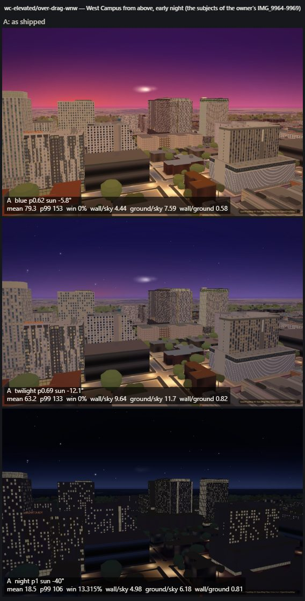
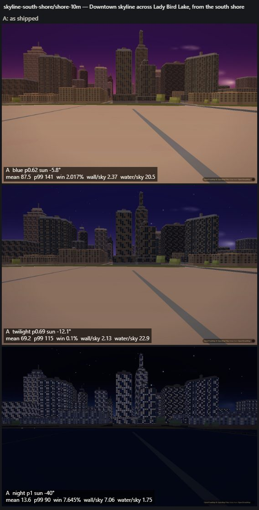
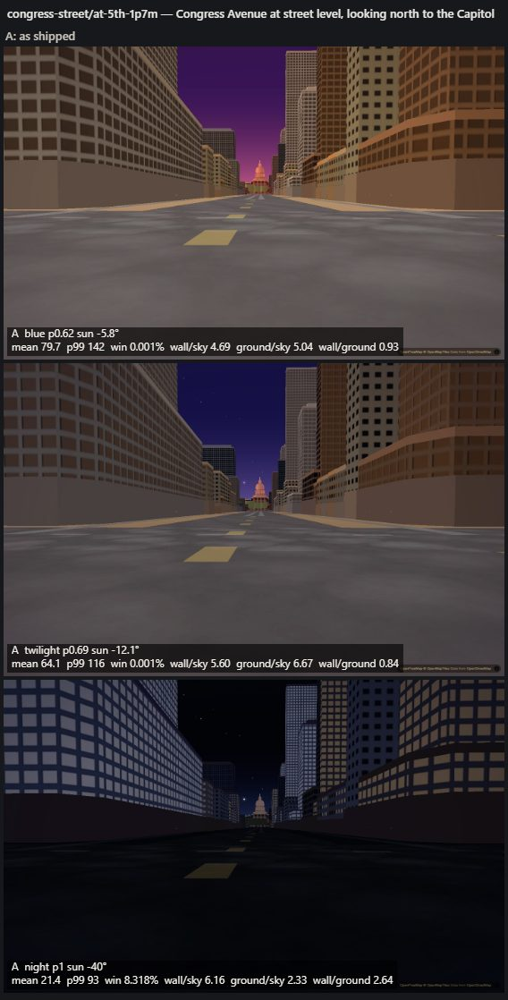

# Night renderer: implementation plan

Written 2026-09-19 for Codex, who owns the integrated night renderer and the final lighting calibration.
It is a plan only: nothing in it has been built. Evidence is in `docs/night-reference-package.md`, from the
owner's photos and the web references. Line numbers are against `main` @ `c656249`.

Tags used throughout:
- **[M]** measured: pixels, data or timing, with the method named.
- **[C]** read from code.
- **[P]** proposed.
- **[E]** an estimate that nobody has measured. Every [E] needs a measurement before it is quoted as fact.

**Non-goals:**
- No global brightness increase, and no "more bloom". Both were measured not to be the problem (§1.4).
- The daytime look stays: the owner likes the citywide sunlight and strong window glare (PR #267). Every
  change here must leave p ≤ 0.56 frames within noise of `main`.

**Where the baseline evidence is (local, not tracked):**
`C:/Users/simip/Projects/austin-reference-images/_night/_baseline-c656249/` holds:
- `code-inventory.md`: the full inventory this plan summarises;
- `captures-C/`: 12 views × blue hour, twilight and full night, plus the `E1` and `E7` experiments;
- `captures-B/`;
- `sweep.json`, `perf-*.json`;
- the capture scripts.

The owner-photo analysis is under `austin-reference-images/_owner-phone/analysis/`. It is private, and it
names a viewpoint that must not be copied into any tracked file.

---------------------------------------------------------------------------------------------------

## 1. Current state (summary of the inventory)

### 1.1 Nine clocks instead of one [C][M]

The slider `p` drives the sun (`js/sky.js:49-56`: p .50→+6°, .62→−5.8°, .69→−12°, 1.0→−40°). The one
schedule that `js/sky.js:119-173` (`SKY_TUNE.DUSK`) says everyone should use, keyed to sun elevation, is used
by the lamps only. Every other consumer carries its own ramp in p:

| consumer | ramp | where |
|---|---|---|
| street/tower/entrance pools | sun +2° → −6° | `js/sky.js:253`, `js/night.js:740-742` |
| sky darkness, auto-exposure target, label dim | sun +1° → −31° | `js/sky.js:249`, `js/graphics.js:837`, `js/timeofday.js:468` |
| stars | sun −7° → −18° | `js/sky.js:257` |
| facade-atlas lit windows | `(p−.55)/.45`, full at p≈.90 | `js/facades.js:1969`, `:2158`; `js/places.js:325`; `js/drag.js:579`; `js/moody.js:523` |
| facade-atlas wall darkening | `max(night, −sun/9)` | `js/facades.js:1971-1976` |
| hero/arts windows, DKR field | `(p−.62)/.38`: zero until blue hour ends | `js/heroes.js:458`, `js/arts.js:241`, `js/app.js:1183` |
| OSM walk lamps | `(p−.58)/.27`, the old ramp | `js/props.js:109`, `:494-498` |
| every baked `wd/wg/wn` trio, and three.js `cNight` | linear golden→night over p .5→1 | `js/timeofday.js:208-215`, `js/outer.js:315-326`, `js/westcampus.js:147-165`, `js/facades.js:3368-3376`, `js/slopes.js:360-361` |
| DKR mesh floods | smoothstep p .58→.92 | `js/slopes-stadium.js:22`, `:362` |

At p .62 [M]:
- street lamps are 99.8% on;
- atlas windows 20%;
- baked and three.js night colours 24%;
- hero and arts windows 0%.

### 1.2 No emissive term in either renderer [C][M]

Both MapLibre's extrusion shader and the slopes shader compute `colour × directional × u_lightcolor`
(`js/slopes.js:392-404`). They transcribe MapLibre, and at night `cityShade()` is a no-op
(`js/city-lighting.js:61`).

So every lit window, sign band and floodlit wall is multiplied by the night light
`#8fa0e0` = (0.561, 0.627, 0.878) (`js/timeofday.js:81`). The one exception is the DKR mesh
(`js/slopes-stadium.js:361-362`). It applies `max(lit, cNight*mask)` **after** that multiply, which makes it
the working precedent.

`js/tower.js:322,447,531-542` and `js/entrances.js:51,603` pre-divide by the **old** light `#9aa6da`.

Measured, E1 at p=1, changing only the light colour to white:
- WC-elevated view: pixels above luma 120 go from 0.17% to **4.71%**, and p99 from 96 to 177.
- Lit panes land khaki (158,136,105), against the owner's warm white (195,182,152).
- Congress's only bright pixels average lavender (171,177,196).

### 1.3 How lit windows are chosen [C][M]

| renderer | unit of choice | structure |
|---|---|---|
| facade atlas, `js/facades.js:2126-2160` | one pane cell of a 33 m tile, `hash01(seed,r,c) < occupancy` | **None.** The seed is (family, colour bucket), so 125 patterns cover the city and the top one sits on 618–733 buildings [M, E2]. The pattern repeats every tile (6–10 storeys). Tone is per pane, occupancy is constant all night. At walking height the tile holds **one window**, so each building is 100% lit or 100% dark: 11 of 23 tower bases have 0 lit texels and 12 are fully lit [M, E7]. |
| hero/arts/drag/moody atlases | `hash01(col+k,row+k2)`, constant salts (`js/heroes.js:509,553,589,616,640`; `js/arts.js:271,314`) | per tile, no floors |
| places storefronts, `js/places.js:345-379` | the whole shop | every one of 133 lit all night, all equally bright |
| three.js apartments, `js/slopes-apartments.js:943` | one opening, `h01(building\|block\|face\|skin,'lit',bandFloor,col,part) < 0.45` | Real floors and bays exist, but the choice ignores units. Every building gets exactly 45%, one tone `#d9b46a` (`:125-129`). Storefront and curtain stacks are 100% lit (`:1110-1116`). The lit colour is reached only at p=1 (`:740`). |
| UT Tower, `js/tower.js:337-549,1355-1460` | flood circuits + numeral windows | **The only sourced model.** Keep it. |

### 1.4 Light without sources, sources without light [C][M]

- **Street pools:** 3,344 synthetic points sampled on road **centrelines** (`js/night.js:569-586,622-670`).
  - [M] Only **2.2%** have a mapped OSM pole within 15 m, and 10 sit inside buildings.
  - The "head" is a second ground disc (`:483-495`).
  - Pools sit **below** the raised `ground-paths` (layer #137 vs #145), so pavements are never lit
    (`js/night.js:414-440`).
  - The generator is fenced to latitude ≥ 30.269 (`:547-567,623`), so downtown streets have none.
- **What the pools look like** [M]:
  - WC street, p=1: hiding the lamp layers drops the lower frame from luma 110 to 11. The carriageway reads
    148–151 with a std of 9.4 (a flat orange floor), while the Guadalupe shopfront pavement beside it reads
    14.
  - At sunset (p .54→.56) the street's lower frame jumps 105→141: brighter than at noon.
- **Entrance pools:** one pool per door **ring point**, so 4–5 stacked circles per leaf across 1,413 doors
  (`js/entrances.js:208-221`; MapLibre's circle bucket emits a circle per ring vertex) [C].
- **Unsourced glows:**
  - 48 sign pools sit at sign anchors, and the signs themselves are screen-space text (`js/signs.js:86-135`).
  - The 115 m uniform Tower pool (`js/night.js:337-347`).
  - The WC pool and jumbotron colours, which light nothing (`js/westcampus.js:99-145`).
  - The Capitol flood is a flat wall colour (`js/capitol.js:64-121`).
- **Sources with no light:**
  - The 531 OSM lamp poles are dark geometry, with pools on the stale ramp.
  - 751 downtown retail bands and 335 crowns are baked **darker than their walls** (luma 24–27 vs 32–33) [M].
  - 6,866 outer low-rise prisms have no windows.
  - Parking decks are a thin cool edge line (`js/facades.js:1025-1029,2029-2045`).
  - There is no crown mode, no beacons and no traffic.
- **Frame statistics** (graded JPEG luma, run C, 1440×900 hardware GL) [M]:

  | view | blue hour p .62 (mean / p99) | twilight p .69 | full night p 1.0 |
  |---|---|---|---|
  | 01 skyline across the lake | 103.8 / 165 (**lake 161 vs sky 31**) | 70.7 / 118 | 8.9 / 58 (0 px > 120) |
  | 02 Congress street | 79.8 / 142 | 64.7 / 117 | 17.0 / 76 |
  | 04 WC elevated | 90.8 / 154 (**wall 139 vs sky 32–96**) | 69.1 / 123 (wall 109 vs sky 20–70) | 14.8 / 89 (wall 13 vs sky 4) |
  | 05 WC street | 141.9 / 239 | 111.8 / 207 | 73.4 / 163 (the pools) |
  | 07 South Mall | 93.8 / 185 | 67.5 / 128 | 12.7 / 79 |

  - Pixels above luma 200 at p=1: **≤ 0.001% in all 12 views**.
  - Bloom's pre-grade threshold is about 0.775, or luma ~198 (`js/graphics.js:1034-1068`), so it has nothing
    to act on.
  - Auto-exposure sits on its clamps: **gain 1.20 at blue hour in 10 of 12 views, and 0.85 at full night in
    11 of 12** (`js/graphics.js:794-846`).
- **Other night state** [C][M]:
  - The night light points up from below the ground (z = −0.803, the sun at −40°), not from the moon
    (`js/timeofday.js:409-420`).
  - The sky zenith is `#040713` with 520 stars (`js/sky.js:1245-1256`).
  - Water is a flat plane with no reflection path (`js/ground.js:656-670`).

### 1.5 Cost baselines [M]

All from `night-perf-ab.mjs`: 5 interleaved reps, minimum reported, 1440×900 hardware GL. The machine
was loaded by other lanes.

| setting | view | day min ms | night min ms | reading |
|---|---|---|---|---|
| desktop `balanced` (CPU 88%, 3 GPU slots busy) | WC elevated | 29.3 | 30.1 | no measurable night cost |
| desktop | campus aerial | 38.2 | 45.9 | spreads overlap; weak signal at most |
| `?lite=1` (performance, 0.75 scale, no bloom) | WC elevated | 11.0 | 9.7 | no night cost |
| `?lite=1` | campus aerial | 22.1 | 14.5 | no night cost |

- **Retint to night:** 1.25–3.17 s of synchronous main thread per `applyTimeOfDay` (desktop), and
  0.97–1.29 s under `?lite=1` (`js/timeofday.js:379-482`).
- **Phone memory:** `scripts/verify/mobile-budget.mjs` read a 1,035 MB JS heap for the full scene before the
  slopes geometry was indexed (HANDOFF, 2026-09-15). `js/mobile.js` now keeps the authored buildings under
  the `performance` preset.
- The slopes vertex already carries `aSurface` (vec4 float; `js/slopes.js:353,642,912`). **Any new
  per-vertex attribute multiplies across ~2.5 M apartment triangles.**
- Frame rate on a real iPhone has **never been measured** (HANDOFF §139 and later).

---------------------------------------------------------------------------------------------------

## 2. The gaps, in one paragraph each

1. **Randomness without structure.** Lit windows are independent coin flips on a texture tile shared by
   hundreds of buildings. Real windows cluster by apartment and by floor [M: Icon's full three-window groups
   lit 3.5× chance; Lark's per-floor SD 2× binomial]. Real windows change with the hour [M: 35–45% at 20:36,
   4–12% at 03:05]. And each one belongs to a building with a lobby, a crown and a garage.
2. **Lights without sources.** Ground discs stand where no lamp is. The real lamps, lobbies, signs and
   garages that light Austin are dark geometry. Every emitter is tinted by a blue light from under the ground.
3. **Nine clocks.** Walls, ground and water follow p while the sky follows the sun. So at dusk the city
   outshines its sky (the lake at luma 161 against a sky of 31) [M], which is the reverse of every blue-hour
   reference.
4. **The existing gates encode the wrong target.** `scripts/verify/night-silhouette.mjs:53-59` requires
   sky luma − wall luma ≥ +8 at p=1.0 and p=0.7. The owner's 20:36 photo would **fail** it: sky 31 against
   wall 59–63 (sRGB), a separation of about −30 [M]. That rule holds at blue hour, not at night (reference
   §4.8). `scripts/verify/night-lights.mjs:89` asserts a layer INDEX (`poolIdx < buildingsIdx`) where the
   property that matters is occlusion. That is the only thing keeping pavements dark (`js/night.js:414-440`).

---------------------------------------------------------------------------------------------------

## 3. Reusable material / light categories [P]

These classes replace per-file ad-hoc constants. Every value in the table is a starting target from the
reference package, and belongs in one taste block (AGENTS.md rule 11), e.g. `NIGHT.classes` in a new
`js/night-classes.js` read by every renderer.

"Level" is relative to the median lit residential window, which is 1.0. The sun elevations are on-curves on
the single clock (W1).

| id | class | emitter/receiver | on-curve (sun elevation) | colour (sRGB, display) | level | spatial rule | renderer paths |
|---|---|---|---|---|---|---|---|
| RW | residential window (unit) | emitter | ramps in from about −2°, peaks around −12…−19°, decays to deep night | 70% `#a29671`–`#b09b78`, 15–20% warmer, ~10% whiter, 2–7% accent | 1.0 (spread 0.5–2); dim 0.25–0.33 | per unit (2–3 bays; corners shared), per-floor bias ±0.25, per-building rate, dark top floor allowed | three.js apartments; atlas (`tr`, `mr`, `lo`, `tw`); heroes/arts |
| OW | office / curtain-wall floor | emitter | on from 0° (before accents) | whiter and cooler than RW (no measured office sample; `#d2cdb8` is a placeholder [P]) | 0.8–1.2 [P] | **per floor band**; late-night floors few | atlas `tg`/`mh`; downtown towers |
| HT | hotel | emitter | from 0° | as RW | 1.0 | high and even (near 100% at full night) | per-building preset of RW |
| LB | lobby / open retail | emitter + ground spill | on before sunset; off at closing time | `#e5c37f`–`#f6d792` | **1.5–4** | continuous full-height volume; pavement pool 0.6–1.0× a lamp pool | places.js bands; slopes-apartments storefront stacks; outer `k=r` |
| GD | garage deck / amenity band | emitter | all night | cool `#869aae` / `#8399a2` (older decks warm) | 1.0–1.4× a storefront | horizontal bands, soffit points, screen-filtered | atlas `dk`; WC decks; podiums |
| CR | crown / rooftop amenity | emitter | from sunset | clipped white fins over a warm lounge `#f2e2ba`; glass box `#dfeedb` | clipped | +25% spill on the top 2–3 floors; 2×-sky skirt ≤ 4° for large crowns | slopes roofs/pavilions; outer `k=c`; halo sprite |
| AC | accent LED | emitter | from 0° | saturated purple/cyan/amber/green (palette §6 of the reference) | small area, high | along setbacks, chevrons, lanterns; named towers only | downtown tower data |
| PL | pool light | emitter + wall tint | from sunset | green `#00c644`, purple `#914fc4` | — | tints the adjacent wall (Torre `#3c6642`) | `js/westcampus.js` pool solid |
| SG | sign | emitter + pier wash | on before sunset | cool white `#bcdaee`/`#c2e7f0`/`#e8f2dc`, or brand colour | clipped | washes its pier 4–6× over 3–4 floors | on facades (not screen text) |
| SL | street lamp | head emitter + ground light | sun +2° → −6° (already) | head `#eeeed9`; pool warm-neutral; far neighbourhoods `#d27e4d` | head clips | at mapped poles and kerb lines; pool 5× under vs midway; full-cutoff | sprites + ground-light term |
| WL | walkway/globe/bollard/festoon | emitter + small pool | as SL | warm; festoon `#917b41`–`#a4915c` | head clips | pools 2.6× under vs midway | props lamps |
| FL | landmark floodlight | receiver lit by fixtures | as SL | stone white/cream (Tower white state), dome blown white | — | falloff from fixture positions | `js/tower.js` (keep); `js/capitol.js`, `js/slopes-dome.js` |
| BC | obstruction beacon | emitter | from 0° | `#e30015` | point | 1–4 per tall roof; strings on masts | sprites |
| UW | unlit wall / roof / ground | receiver | darkens with the sun, not p | warm-grey `#453a2b`–`#483f32`; cool near cool LEDs | wall 4–7× sky early, ~25–30× deep; glass 0.4–0.6× wall | albedo × (skyglow ambient + nearby spill) | all |
| WA | water | receiver/mirror | follows the sky | sky colour + emitter streaks | ≤ sky at dusk | rippled vertical streaks under emitters | ground water |
| SK | sky | — | sun | slate `#1c1f24`, horizon ×1.9, near-black late | — | urban skyglow, few or no stars | `js/sky.js` overlay |

---------------------------------------------------------------------------------------------------

## 4. Engine decisions that the research settles

Each item here is a question whose answer changes the implementation. Nothing else was researched.

**D1. How to get an emissive term into MapLibre's extrusions without forking MapLibre.** [C] + [P]
- `js/city-lighting.js:191-216` already rewrites MapLibre 5.24's fill-extrusion shaders, and it throws
  visibly if the contract changes.
- Read in the 5.24 build (`maplibre-gl-dev.js`):
  - **Pattern walls:** lighting is applied in the fragment as `fragColor=mixedColor*v_lighting`. The atlas
    already reserves alpha 191 for glass (`:84-89`, decoded at `:212`). A second alpha code for "emissive
    pane" is decodable in the same place. It then outputs the texel **without** `v_lighting`.
    - Risk: bilinear filtering blends codes at pane edges. Edges between an emissive code and opaque 255
      average to about the glass code, so they read as an unlit reveal: acceptable.
  - **Solid extrusions:** the vertex shader builds `v_color` from `vec4(0,0,0,1)` and never reads the
    per-feature colour's alpha. So `fill-extrusion-color` alpha is a free per-feature channel. The patch
    already passes the raw colour as `v_cityAlbedo` (`:201`).
    - Style colours are stored **premultiplied** in 5.24 (the Color class comment says so), so the fragment
      must un-premultiply `rgb/a`.
    - To verify with one test layer before relying on it.
- **Three.js:** `aSurface.x` is a material kind (masonry 1–3, glass 4; `js/slopes.js:427-431`). A new kind
  (e.g. 5 = "window that can be lit") costs **0 bytes**. The vertex shader can skip `u_lightcolor` for it
  (`js/slopes.js:395-399`), following the DKR precedent (`js/slopes-stadium.js:361-362`). The unused
  `aSurface.yzw` can carry (unit seed, floor, class) for D3.
- Prior art: Mapbox GL JS v3 ships exactly this model as style properties: `fill-extrusion-emissive-strength`,
  and `fill-extrusion-flood-light-*` with wall and ground radii in metres
  ([Mapbox style spec](https://docs.mapbox.com/style-spec/reference/layers/)). v2 and later are not open
  source, so it is a design reference only.

**D2. Light on the ground: circle discs, a baked texture, or a light list.** [C] + [P]
- MapLibre's circle fragment (5.24) is `opacity_t = smoothstep(0, blur, len−1)` composited with ordinary
  alpha. Two consequences:
  1. Overlapping pools do not **add**. They converge on the pool colour, which is the measured flat orange
     carriageway (std 9.4 on 151).
  2. A disc ignores what it lands on, but light scales with albedo: pale pavers are 15× turf under the same
     lamps [M, 9972].
- So pools belong **in the surface shaders**, as `out = nightColour × (1 + gain·E(x))`:
  - E is lamp irradiance;
  - the night colour stands in for albedo × ambient.
- **Source of E:**
  - **Chosen: a world-space lamp-irradiance texture generated at runtime.** Lamps are static. A single R8
    texture at 2 m/texel over the lamp area, including downtown (≈ 2.9 × 4.7 km), is ≈ 1,450 × 2,330 texels
    ≈ **3.4 MB** [E]. Each ground or wall fragment then needs **1 fetch**, and there is no loop.
  - If lamps ever become dynamic, the alternative is a tiled light list (Forward+: Harada, McKee & Yang,
    [EG 2012](https://diglib.eg.org/items/1db2c4c6-dcab-42ea-8c0a-6805d781759e)), bounded to ≤ 4 lights per
    cell.
- **Where E is sampled:**
  - the city-lighting patch for all fill-extrusions: the paths and pads, which are fill-extrusions at
    0.22 m (`js/ground.js:1924-1945`), and the walls, for wall wash with a height falloff;
  - a patched `fill` program for the flat road fill (`ground-road`).
- **Quick first step, while the above is built:** move the circle pools after the ground stack.
  `js/night.js:414-440` records that this was tried and works, and that circle layers depth-test. Only the
  index assertion in `night-lights.mjs:89` blocks it; re-express that assertion in pixels.

**D3. Window identity: a structured hash per unit and floor.** [P]
- Decide lit state **in the shader**, with the hour as a uniform. The atlas and the geometry only mark where
  panes are. This removes per-hour atlas repaints and lets the night decay without rebuilding anything.
- **Three.js:** identity = (building id, global floor index, unit = floor(bay / bays-per-unit), face-pair for
  corners). It is packed into `aSurface.yzw` at build time (`js/slopes-apartments.js:943,1193,1730,2107`).
- **Atlas:** the pattern fragment has `v_pos_a`, whose integer part counts pattern repeats along the wall
  (edge distance) and up it (height) (`get_pattern_pos` in 5.24). So pane index = floor(v_pos_a × (cols,
  rows)), and a building seed = a hash of `v_cityPos.xy` quantised to ~30 m cells (the patch already has
  world position). One hash therefore no longer lights a whole building at walking height (E7), and 618
  buildings no longer share one pattern (E2).
  - Risk: the atlas grid is re-derived per tile zoom (`js/facades.js:245,477-491,2975-2980`), so the pane
    index can shift at a zoom change. Measure pops with a zoom sweep before accepting.
- **Hash:**
  - use **pcg3d** or pcg4d on integer inputs, not `fract(sin(dot))`. Jarzynski & Olano find pcg3d on the
    quality/speed Pareto front ([JCGT 9(3) 2020](https://www.jcgt.org/published/0009/03/02/paper.pdf)).
  - MapLibre 5 and the shared context are WebGL2 / GLSL ES 3.00 (`in`/`out`, `fragColor` in the 5.24 source),
    so `uint` arithmetic is available.
  - `js/slopes.js:424` `hashCell` uses `fract(sin(...))`; leave it for texture noise.

**D4. Halos as authored sprites, not frame bloom.** [C] + [P]
- MapLibre draws into the 8-bit default framebuffer. The current bloom copies the GL canvas into a
  256-px-wide 2D canvas with `brightness/contrast/blur` every frame (`js/graphics.js:1034-1068`), so it
  cannot see anything above 1.0. A 1–2 px window averages away at that width.
- The target halo is small and fixed: ≤ 4× the core radius, 10× drop [M, reference §4.7]. Only small
  emitters and crowns get one.
- So draw the halo **with the emitter**: an instanced camera-facing sprite whose texture has the core and
  halo baked in, depth-tested and additive. Its cost scales with halo area, not screen area.
- On phones, full-screen post passes are bandwidth-bound on tile-based GPUs (Bjørge, *Bandwidth-Efficient
  Rendering*, [SIGGRAPH 2015](https://community.arm.com/cfs-file/__key/communityserver-blogs-components-weblogfiles/00-00-00-20-66/siggraph2015_2D00_mmg_2D00_marius_2D00_slides.pdf)).
  The phone profile already runs bloom 0 (`js/mobile.js`, `performance` preset). Sprites give it halos with
  no post pass at all.
- Frame bloom at night becomes optional; switch it off at night if the sprites carry the look. Removing
  its per-frame canvas readback at night is a likely saving [E]; `post-perf.mjs` should measure it.
- Where sprites live: the slopes custom layer is `renderingMode:'3d'` and sits after the ground stack
  (`js/slopes.js:1004,1102-1108`), so it shares depth with the extrusions
  ([MapLibre CustomLayerInterface](https://maplibre.org/maplibre-gl-js/docs/API/interfaces/CustomLayerInterface/)).
  `?slopes=0` / `?lite=safe` lose that layer; keep the circle fallback for them.

**D5. Water reflections.** [P]
- There is no scene-colour buffer to do screen-space reflection inside MapLibre.
- A planar mirror pass would re-render the three.js scene. That roughly doubles its draw cost [E], so it is
  not for phones.
- The references show that real-time lake reflections are **rippled vertical streaks under bright emitters**,
  plus a sky-coloured surface (reference §4.10). Mirror-flat water is a long-exposure artefact.
- So: streak sprites for emitters within ~1 km of the shore, a water colour that follows the sky, and no
  mirror.

**D6. The slider is not a clock.** [P]
- p .69→1.0 means early night → 3 am, the order of the owner's photos. Occupancy is therefore a curve over
  that arc: rise from blue hour to the early-night peak (35–45% bright), then decay to 4–12% at p=1.
- Shops close along the same arc, using the place's own closing hour (W4).
- This is written as one curve in the taste block, so the owner can re-time it with one line.

---------------------------------------------------------------------------------------------------

## 5. Work items, in dependency order

Each item lists: evidence → files → approach → cost → phone → acceptance (§7) → dependencies. Items W0–W7
are the core. W8 and W9 follow.

### W0. Instruments before pixels [P]

- **Re-express two gates:**
  - `night-silhouette.mjs:53-59` becomes regime-aware: wall < sky at blue hour (sun > −6°), and wall ≥ 3× sky
    (linear) at early and full night.
  - `night-lights.mjs:89` checks pool occlusion in pixels, not layer index.
- **New measures** (extend `night-luma.mjs` / `night-variety.mjs`):
  - convert the graded frame to linear Y;
  - class masks by layer hiding (the `night-luma.mjs` method);
  - a lit-unit counter read from **data** (three.js window records at a given p) as well as from pixels.
- **Matched views:** this round's `match.mjs` renders the scene from a photo's camera (eye and target in
  metres). It lives in a session scratch folder, not in the repo, so port it into `scripts/verify/` first. Poses for the owner's elevated series
  must stay local (they reveal a viewpoint). Poses for the street-level frames (9963, 9970, 9977–9981) are
  public street corners.
- Files: `scripts/verify/night-silhouette.mjs`, `night-lights.mjs`, `night-luma.mjs`; a new
  `scripts/verify/night-accept.mjs`.
- Cost: none in the app.

#### W0a. Built 2026-09-19: the comparison harness [M]

The camera half of W0 exists: **`scripts/verify/night-compare.mjs` + `scripts/verify/night-routes.json`**
(documented in `scripts/verify/README.md`). It shoots 16 named poses on 11 routes at named lighting
regimes, for one build or for two builds/flag sets side by side, and writes labelled sheets plus a JSON
report of per-region luminance, ratios and bright-window share. The named-measure half (linear Y by class
mask, the data-side lit-unit counter, the regime-aware rewrites of `night-silhouette.mjs:53-59` and
`night-lights.mjs:89`) is still to do; `night-accept.mjs` should read this harness's report rather than
re-shoot.

It is a **comparison instrument, not a gate**: nothing in it encodes the §7.2 targets, so it can measure
a change without pre-judging it. `--same` is the only assertion, and it is the A9 no-regression check.

**Baseline on `main` @ `c656249`** (run 2026-09-20 01:03 UTC, hardware GL, 1440×900 DPR 1, `?drift=0`,
auto-detect cancelled, second screenshot kept; frames under
`<scratch>/lanes/night/harness/baseline2/`, report `report.json`). Three sheets are committed as the
before-picture for W1–W6; the rest stay in scratch.

| | blue hour (p .62, sun −5.8°) | twilight (p .69, −12.1°) | full night (p 1, −40°) |
|---|---|---|---|
|  `wc-elevated/over-drag-wnw` | wall/sky **4.44**, ground/sky 7.59, bright windows **0%** | wall/sky **9.64**, ground/sky 11.7, windows **0%** | wall/sky 4.98, windows 13.3% |
|  `skyline-south-shore/shore-10m` | wall/sky 2.37, **water/sky 20.5** | wall/sky 2.13, **water/sky 22.9** | wall/sky 7.06, water/sky 1.75 |
|  `congress-street/at-5th-1p7m` | wall/sky 4.69, ground/sky 5.04 | wall/sky 5.60, ground/sky 6.67 | wall/sky 6.16, ground/sky 2.33 |

Read against §7.2 that is: **A1 fails everywhere** (target wall/sky ≤ 0.5 at blue hour; measured 0.6–14.2
across the sixteen poses, and water/sky 16–24 where the lake is in frame, against a target of ≤ 1).
**A2's wall/sky 3–7 at early night is already in range by accident** — not because the walls went dark but
because the sky did, and at the same time ground/sky runs 1.7–90 and exceeds wall/sky in 10 of the 12 poses
that measure both, so the pavement, not the building, is the brightest surface in the frame.
**A3 fails**: at p 1 wall/sky is 0.6–10.7 against a target of ≥ 15, and the one pose that
looks right (`lady-bird-lake/aerial-west-120m`, 10.7) gets there from altitude, not from dark walls.
**§1.1's staggered clocks are visible in one column**: hero and arts windows are 0% at blue hour and
twilight on the elevated West Campus poses and only appear at p 1, while the street lamps are already full
on at p .62 — the sheets' top two rows have lit pavement under unlit buildings.

Two cautions carried by the run: `wc-street/rio-grande-23rd` reads wall/sky **0.60** at blue hour, which is
not a pass — it is a pose whose `wall` region is mostly shaded near-field facade; and the app had given up
on the authored buildings under load on this visit (`INTRO.authoredCeilingMs`), so the harness switched them
back on in the page and said so. Both are recorded in `report.json`.

### W1. One night clock with per-class on-curves [P]

- **Evidence:** §1.1; dusk inversion [M] (lake 161 against sky 31; wall 139 against sky 32–96).
- **Files:**
  - `js/sky.js:119-173,245-260`: extend `SKY_TUNE.DUSK` with class curves RW/OW/LB/GD/CR/AC/SG/SL/FL, and a
    receiver darkening curve.
  - Consumers:
    - `js/facades.js:1969-1976,2158`;
    - `js/places.js:325`;
    - `js/moody.js:523`;
    - `js/heroes.js:458`;
    - `js/arts.js:241`;
    - `js/app.js:1183`;
    - `js/props.js:109,494-498`;
    - `js/timeofday.js:208-215`;
    - `js/outer.js:315-326`;
    - `js/westcampus.js:147-165` (and its duplicate at `js/slopes-apartments.js:488-493`);
    - `js/signs.js:153-171`;
    - `js/entrances.js`.
  - `js/slopes.js:360-361`: replace the p-lerp of `cNight` with two uniforms. `u_recv` is receiver darkness
    from the sun; `u_emit` comes from the class curve.
- **Ownership:**
  - `js/drag.js:579` is frozen by PR #164. Leave it on its ramp and record the exception, or wait.
  - `js/slopes-stadium.js:22` belongs to the Acer DKR lane; request the change in HANDOFF.
- **Cost:** 0 GPU [C]. Retint work is unchanged or lower.
- **Phone:** identical.
- **Acceptance:** A1, A9.
- **Depends on:** W0.

### W2. Emissive channel in all three paths; retire the blue multiply on emitters [P]

- **Evidence:** §1.2; the E1 A/B [M].
- **Files:**
  - `js/city-lighting.js:84-89,191-216`: alpha code for emissive panes; per-feature colour alpha for solids,
    un-premultiplied.
  - The atlas painters that call `glassRect` (`js/facades.js:2162` and the band atlases).
  - `js/slopes.js:392-404` (kind 5), `js/slopes.js:410-450` (fragment).
  - Remove the `#9aa6da` pre-division from `js/tower.js:322,447,531-542` and `js/entrances.js:51,603`, then
    re-verify the Tower against its own gate.
- **Cost:** a few ALU per fragment [E]. **0 bytes of geometry** (alpha codes, colour alpha, `aSurface.x`).
- **Phone:** identical.
- **Acceptance:** A5 (colour), A8.
- **Depends on:** W1 (so the emission level has a curve to follow).

### W3. Structured occupancy: apartments first, then the atlas [P]

- **Evidence:** reference §4.2 [M]; E2 and E7 [M].
- **Apartments** (priority: West Campus apartments are the product's core):
  - `js/slopes-apartments.js:125-129`: the taste block becomes class RW (rates, spread, dim share, tone mix).
  - `:740`: stop baking the lit tone into `cNight`.
  - `:943,:1193`: emit kind-5 panes with (unit seed, floor, tone class) in `aSurface.yzw`.
  - `:1110-1116`: storefront and curtain stacks become class LB/OW, not "100% lit windows".
  - `js/slopes.js` FRAG: decide lit state from pcg3d(identity) against `u_occ(p)`, a per-building rate, and
    a per-floor bias.
- **Atlas:**
  - `js/facades.js:951-1012,2126-2160`: paint panes as "can be lit", and move the choice into the
    city-lighting fragment (D3).
  - Then `js/heroes.js`, `js/arts.js`, `js/moody.js` on the same pattern.
  - `js/drag.js` is frozen (#164).
- **Cost:**
  - pcg3d is about 20–30 integer ops per pane fragment [E], on glass fragments only;
  - 0 bytes;
  - atlas images no longer repaint for lit state, so retint should fall [E] (measure A10).
- **Phone:** identical shader. The `performance` preset keeps it.
- **Acceptance:** A4, A5.
- **Depends on:** W2.

### W4. The emitter classes that do not exist yet [P]

- **Lobby/retail (LB):**
  - `scripts/bake_places.py` owns `data/places.geojson`. It already computes `latest_close()` (`:541-564`) but
    publishes only `open` at 22:00 (`open_state`, `:567-573`; `SF_NIGHT_HOUR = 22.0` at `:380`). Publish the close hour
    itself as a new field.
  - `js/places.js:189,196,345-379` then closes each shop on the D6 arc, gives it LB level 1.5–4, and draws its
    pavement spill through the W5 ground term.
  - Downtown `k=r` bands: `js/outer.js:315-326` gets class LB with emissive alpha. Change the colour in JS; no
    bake change is needed.
- **Garage decks (GD):**
  - `js/facades.js:1025-1029,2029-2045` (`dk`): lit soffit bands, cool, all night.
  - The WC deck solids in `js/westcampus.js:99-145`.
- **Crowns (CR):**
  - Outer `k=c` (335) in `js/outer.js`.
  - Apartment roof pavilions and lounges in `js/slopes-apartments.js` (the Icon, Villas on 24th and Torre
    models exist).
  - +25% spill on the top 2–3 floors, and the D4 skirt sprite for the large ones.
- **Accents (AC)** on named downtown towers only. "Downtown scope is skyline silhouettes only" (AGENTS.md,
  2026-09-12), so crowns and accents are the whole downtown night job.
- **Pools (PL):** `js/westcampus.js` pool `#1d4a63` becomes LED green/cyan with an adjacent wall tint.
- **Signs (SG):** Moontower and The Standard become facade emitters (`js/westcampus.js:102-145`). The 48
  screen-text signs (`js/signs.js`) lose their unsourced ground pools; the pier wash comes from W5.
- **Beacons (BC):** sprites, 1–4 on roofs above a height threshold (taste value).
- **Cost:** data plus a few hundred sprites [E].
- **Acceptance:** A3, A6 (spill), A7.
- **Depends on:** W2; the halo parts depend on W7.

### W5. Street lighting from real sources, and light that adds [P]

- **Evidence:** §1.4 [M]; reference §4.5.
- **Placement:** `js/night.js:569-586,622-670`:
  - start from the OSM poles (`data/props.geojson` k=lamp, 531; `data/walk_lamps.json`);
  - fill gaps on **kerb lines** at the mapped median spacing (32 m [M]), not on centrelines;
  - drop points inside footprints;
  - extend the fence (`:547-567`) to cover the street acceptance routes, including Congress (R4).
- **Heads:** instanced sprite at 6–9 m (D4), class SL/WL colour.
- **Ground light:**
  - Step 1: move the pools after the ground stack, feed `entrances-pool` one centroid per leaf instead of the
    ring (`js/entrances.js:208-221,1200-1216`), and fix `js/props.js:109` to the SL curve.
  - Step 2: the D2 irradiance texture, sampled in `js/city-lighting.js` for fill-extrusions (paths, pads,
    and walls with a height falloff) and in a patched `fill` for roads. The circle layers are then retired
    everywhere the slopes/patch path runs.
  - Coordinate with the water lane, which has pending edits to `js/city-lighting.js` and `js/ground.js` this
    round.
- **Cost** [E]:
  - texture ≈ 3.4 MB (R8, 2 m) or 6.7 MB (RG8, with a warm/cool channel);
  - generating it on a 2D canvas: 3,344 radial gradients, well under 100 ms;
  - 1 texture fetch and a few ALU on ground and wall fragments;
  - one instanced draw for about 3.3 k heads;
  - removes about 5,650–7,065 stacked entrance circles and 3 circle layers.
- **Phone:** texture at 3 m/texel (≈ 1.5 MB [E]); wall wash off under `performance`. `?slopes=0` / `?lite=safe`
  keep step 1's circles.
- **Acceptance:** A6.
- **Depends on:** step 1 on W0; step 2 on W2's patch work.

### W6. Receivers, sky, night light and exposure [P]

- **Evidence:** reference §4.8 and §5 [M].
  - Ours at p=1 has wall 13 against sky 4 luma: **3.3× linear**. The owner's deep night is ~25–30×.
  - At twilight our walls are too bright; see W1.
- **Files:**
  - `js/timeofday.js:73-103,145-159`: night palette.
  - `js/timeofday.js:409-420`: the night light becomes a weak moon or ambient term instead of a sun below the
    ground. Its **colour** is decided with the owner (§8).
  - `js/sky.js:419-468`: fog toward skyglow, not `#2c3a63`.
  - `js/sky.js:1245-1256,1519-1521`: stars and skyglow.
  - `js/graphics.js:794-846`: auto-exposure retargeted per regime, or held at night. It currently pins at
    0.85 and darkens the night 15% [M].
  - `scripts/bake_detail.py:night_wall()` (`:1091-1098`, its own output) and the WC tier-four ramp, which is
    duplicated in `js/westcampus.js:535-583`, `js/slopes-apartments.js:488-493` and
    `scripts/bake_westcampus.py`. Collapse it to one source.
- **This is a ratio change for receivers, not a global lift.** Emitters keep their W2 levels, and only
  receivers and the sky move relative to them.
- **Cost:** 0 GPU [C].
- **Acceptance:** A1, A2, A3.
- **Depends on:** W1, W2.

### W7. Restrained halos [P]

- **Files:** a new sprite module inside the slopes scene (D4), e.g. `js/night-emitters.js` (heads, festoons,
  beacons, sign letters, crown skirts). In `js/graphics.js:1034-1068`, turn bloom off at night, or restrict it
  to the sprite layer if that proves to be needed.
- **Cost:** proportional to halo area [E]. Minus one canvas readback per frame at night on `balanced` [E].
- **Phone:** the same sprites, smaller, near-field only.
- **Acceptance:** A7.
- **Depends on:** W5 (heads), W4 (crowns).

### W8. Water and optional wet streets [P]

- Emitter streak sprites plus a sky-following water colour (D5). This is `js/ground.js:656-670` and the water
  lane's files: **after the water lane merges.**
- Damp streets: a default-off flag. A view-dependent lobe of ~1.6× on asphalt only, with sparkle.
- **Acceptance:** A1 (water ≤ sky at dusk), A11.

### W9. Retint cost [P]

- **Evidence:** 1.0–3.2 s of synchronous retint [M].
- Once W1–W3 move occupancy and emission into uniforms, re-measure `applyTimeOfDay`. Move the remaining
  per-hour expression rewrites (`js/timeofday.js:379-482`) to uniforms where they are lerps.
- **Target:** ≤ main, aiming at ≤ 0.5 s [E].

**Order:**
- W0 → W1 → W2 → (W3 ∥ W4 ∥ W5 step 2 ∥ W6) → W7 → W8 → W9.
- W5 step 1 can land any time after W0.
- W3 on the apartments is the highest-value single item for the product: West Campus apartments at night,
  which are also what the owner photographed.

---------------------------------------------------------------------------------------------------

## 6. Cost summary

| item | GPU per frame | memory | CPU / main thread | evidence |
|---|---|---|---|---|
| W1 clock | 0 | 0 | same retint, or less | [C] |
| W2 emissive | ~3–5 ALU per extrusion fragment | **0 B** (codes in existing channels) | 0 | [E] |
| W3 occupancy | ~20–30 int ops per pane fragment | **0 B** (`aSurface.yzw`) | less atlas repainting | [E] |
| W4 classes | a few hundred sprites | < 1 MB | bake field added | [E] |
| W5 lamps | 1 fetch per ground/wall fragment; 1 instanced draw | 3.4–6.7 MB desktop, ~1.5 MB phone | < 100 ms texture build | [E] |
| W6 receivers/sky | 0 | 0 | 0 | [C] |
| W7 halos | ∝ halo area | < 1 MB atlas | minus a canvas readback | [E] |
| W8 water | streak sprites | < 1 MB | 0 | [E] |
| **baseline** | night ≈ day (WC 29.3 vs 30.1 ms; lite 9.7 vs 11.0) | phone heap budget: `mobile-budget.mjs` | retint 1.0–3.2 s | [M] |

A new per-vertex float attribute on the slopes geometry would cost about 12 bytes × vertex count. That is
the one expensive option in this plan, and **nothing here needs it**.

---------------------------------------------------------------------------------------------------

## 7. Acceptance

### 7.1 Views and routes (the harness provides the camera paths)

Each route runs at four sun elevations: **−5° (blue hour), −12° and −15° (early night, the owner's 20:36),
−40° (p=1, deep night)**. Day p .30 and golden p .50 are the no-regression checks. Settings: `?drift=0`,
auto-detect cancelled, hardware GL, second screenshot kept, 3 reps.

These are now poses in **`scripts/verify/night-routes.json`**, shot by `night-compare.mjs` (W0a): R1 →
`wc-elevated` (3 poses), R2/R3 → `wc-street`, R4 → `congress-street` + `capitol`, R5 →
`skyline-south-shore` + `lady-bird-lake`, R6 → `guadalupe-storefronts`, R7 → `main-mall-tower` +
`south-mall`, R8 → `parking-structure`, R9 → `campus-aerial`. The regimes are named there too (`blue`,
`twilight`, `early`, `night`, and `day`/`golden` for A9). Two are **not** in the tracked file: R10 (the
393×852 `?lite=1` phone pass — the harness is fixed at 1440×900 and needs a viewport flag first) and the
matched poses for the owner's photographs, which name a viewpoint and live in
`../austin-reference-images/_night/night-routes.local.json` outside every repo.

| route | path | what it judges | reference |
|---|---|---|---|
| R1 | WC elevated orbit, 70 m, around Rio Grande/San Antonio × 21st–24th (inventory views 03 and 04) | occupancy, crowns, podiums, pools | owner 9964–9968 (matched poses local only) |
| R2 | Rio Grande St walk, 21st → 24th, 1.7 m | lamps, lobbies, garage deck, pavement light | owner 9977–9981 (matched) |
| R3 | San Antonio St at the Castilian, 1.7 m | amenity band, retail, top floor dark | owner 9970 (matched) |
| R4 | Congress Ave, from the bridge to the Capitol, 1.7 m and 30 m (views 02 and 09) | downtown lamps, retail, dome white against the portico | pellesten, zykov, capitol-bw |
| R5 | lake level, panning across downtown (views 01 and 11) | crowns and accents, water streaks, skyline occupancy | cutrer pair, dimas, hargup |
| R6 | Guadalupe (the Drag) at 23rd, 1.7 m (view 08) | storefront against dark upstairs, pavement pools | drag-2009 |
| R7 | South Mall → Tower, terrace → mall (views 06 and 07) | Tower circuits kept, campus lamps | tower refs, flawn |
| R8 | garage pose (view 10, `dk06`) | GD class | Zalat, Torre podium |
| R9 | campus aerial z16 pitch 68 (view 12) | whole-frame ordering, cost | — |
| R10 | R1 + R2 at 393×852 with `?lite=1` | phone path | — |

### 7.2 Measurements (linear Y from the graded frame; report min/median/max over reps)

| id | measure | target | now (c656249) [M] |
|---|---|---|---|
| A1 | blue hour: median unlit wall at the roofline ÷ horizon sky; water ÷ sky above it | **≤ 0.5**; water ≤ 1 | wall 139 against sky 32–96 luma; lake 161 against 31: fails both |
| A2 | early night: unlit wall ÷ zenith sky; horizon ÷ zenith; unlit glass ÷ wall | 3–7; 1.6–2.2; 0.4–0.6 | twilight walls far above sky (W1) |
| A3 | deep night: unlit wall ÷ sky; bright lit window ÷ wall; lobby ÷ median lit window | ≥ 15 (owner ~25–30); 6–10; 1.4–4 | 3.3×; not measured |
| A4 | occupancy (data **and** pixels): bright / dim share; per-floor SD ÷ binomial SD; complete-unit ratio ÷ chance; distinct patterns | early night 35–45% / 15–25%, deep night 4–12% / 5–8%; ≥ 1.5; ≥ 2; no two buildings identical | 45% everywhere (apartments); atlas bimodal 0/100% at walking height |
| A5 | lit-window colour: cream/neutral share; warm; cool; saturated accents; mean hue | ≥ 60%; 10–25%; 5–15%; 1–7%; warm (b\* > 0) | khaki (158,136,105); lavender on Congress |
| A6 | lamps: pavement under the head ÷ mid-span; half-intensity point ÷ spacing; kerb and pavement lit; mapped poles with a lamp within 5 m; lamps inside footprints | 3–7; 0.4–0.6; pavement ≥ 0.5× the carriageway under the same lamp; ≥ 90%; 0 | carriageway std 9 on 151; pavement 14 against 148; 2.2% within 15 m; 10 inside |
| A7 | halos: radius to 10% of core ÷ core radius; halo from windows; crown skirt | ≤ 4; 0; ≤ 2.5× sky at 1–4° | none |
| A8 | the brightest things are lights (`night-luma.mjs` ordering) | pass | pass |
| A9 | no regression: p .30 and .50 frames on R1–R9 | within the noise floor of `main` (PR #267 look intact) | — |
| A10 | cost: night vs day forced-frame min (5 interleaved reps, desktop and lite, machine load logged); retint; phone heap at veil | ≤ +10%; ≤ main (aim ≤ 0.5 s); ≤ main + 10 MB | §1.5 |
| A11 | water: streaks under emitters, no mirror skyline, dry by default | pass by eye plus a streak-mask check | flat plane |

The owner's display levels (reference §5) are phone-lifted. **The ratios are the acceptance.** Absolute
level is the §8 decision.

---------------------------------------------------------------------------------------------------

## 8. The one taste question for the owner

Show **one matched pair** at R2/R1, early night and deep night:

- **(a)** the "phone look": the owner's own photos, with walls clearly readable at 4–7× / 25–30× the sky,
  warm-grey, and a slate sky;
- **(b)** a darker "eye look" that keeps the same ratios at a lower overall exposure. Its night-light tint is
  the blue-moon convention.

Everything else in this plan is an execution decision, backed by the evidence above. Lamp colour follows
the 2026 photos (warm-neutral white, not sodium, not blue). Stars stay subdued in a city sky.

---------------------------------------------------------------------------------------------------

## 9. Risks

- **MapLibre contract.** The patch targets 5.24's shader text and throws visibly on change. Pin the version.
  The colour-alpha and alpha-code tricks must be verified on the real build before anything depends on them.
- **Concurrent edits.** The water lane has pending changes to `js/city-lighting.js` and `js/ground.js`.
  `js/drag.js` is frozen (#164). `js/slopes-stadium.js` and the stadium bake belong to the Acer DKR lane, and
  `js/stadium.js` to the Mac lane.
- **Zoom-level pops** in atlas pane identity (D3).
- **Phones are unmeasured.** No item here has a real-iPhone frame time. Everything under "phone" is desktop
  Chromium in a phone profile.
- **The web references are unmeasured**, and the owner's are phone-processed (reference §2). Treat the
  targets as ratios with ranges, not exact values.

---------------------------------------------------------------------------------------------------

## 10. Sources

- Reference package: `docs/night-reference-package.md`. Owner analysis (private, local):
  `austin-reference-images/_owner-phone/analysis/owner-photos.md`.
- Baseline inventory and captures (local): `austin-reference-images/_night/_baseline-c656249/`.
- The comparison harness and its `c656249` baseline (W0a): `scripts/verify/night-compare.mjs`,
  `scripts/verify/night-routes.json`, `scripts/verify/README.md`; committed sheets
  `docs/shots/night-baseline-{wc-elevated,skyline,congress}.jpg`.
- MapLibre 5.24 shader source: the `maplibre-gl-dev.js` 5.24.0 build (fill-extrusion, pattern and circle
  programs) and the [CustomLayerInterface docs](https://maplibre.org/maplibre-gl-js/docs/API/interfaces/CustomLayerInterface/).
- Mapbox GL JS v3 style spec, emissive-strength and flood-light properties (prior art only):
  <https://docs.mapbox.com/style-spec/reference/layers/>
- Jarzynski & Olano, *Hash Functions for GPU Rendering*, JCGT 9(3), 2020:
  <https://www.jcgt.org/published/0009/03/02/paper.pdf>
- Harada, McKee & Yang, *Forward+: Bringing Deferred Lighting to the Next Level*, Eurographics 2012 (short
  papers): <https://diglib.eg.org/items/1db2c4c6-dcab-42ea-8c0a-6805d781759e>
- Bjørge, *Bandwidth-Efficient Rendering*, SIGGRAPH 2015 (Moving Mobile Graphics):
  <https://community.arm.com/cfs-file/__key/communityserver-blogs-components-weblogfiles/00-00-00-20-66/siggraph2015_2D00_mmg_2D00_marius_2D00_slides.pdf>
- Austin Energy streetlights: 56,000 automated, more than 13,000 LED, flat-glass fixtures (Austin Monitor,
  2014-09-16): <https://www.austinmonitor.com/stories/whispers/austin-energy-automates-streetlight-system/>
