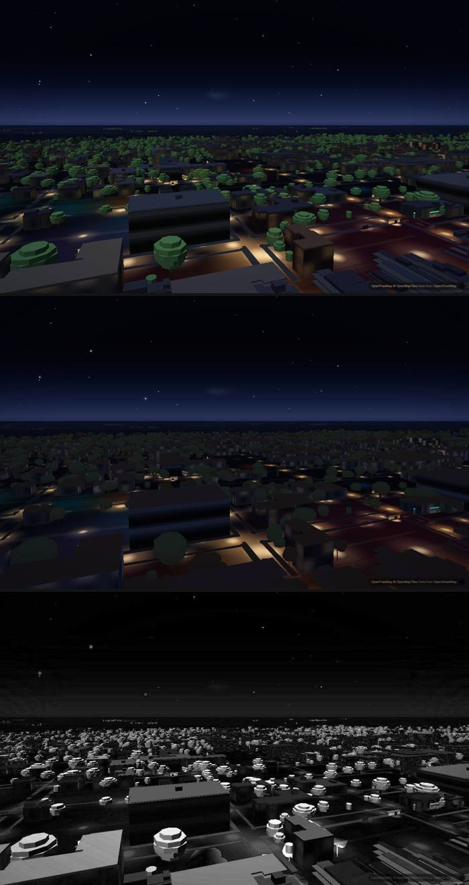

# The `--break` / `--same` runs, kept

> **Two files here are not `night-compare.mjs` reports.** `night-perf-ab-desktop.json` and
> `night-perf-ab-lite.json` are the output of `scripts/verify/night-perf-ab.mjs`, the frame-cost
> A/B behind `docs/night-implementation-plan.md` §1.5 and acceptance row A10. They have no
> `verdict`, no shots and no exit code, and **every count of "the ten kept reports" below means
> the ten `*.report.json` files, not these.** They are here for the same reason the others are:
> §1.5 was tagged `[M]` and cited a script and two result files that existed only in a session
> scratch folder that was about to be swept (added 2026-09-20).

`docs/night-implementation-plan.md` §W0a says `--same` — the assertion in
`scripts/verify/night-compare.mjs` that guards A9 — can go red, and quotes numbers for it.
Those numbers used to have **no surviving artifact anywhere**: the plan itself condemned the
earlier state with *"no `report.json` under `<scratch>/lanes/night/harness/*` carried either
flag"*, and after the fix that sentence was still true, because the demonstration ran in a
session scratch folder that gets swept. A claim whose evidence is deleted is a claim on trust.

So the reports live here. They are the harness's own output, with two changes, both disclosed
in the file itself:

1. absolute paths are rewritten to `<scratch>`, `<worktree>` and `<reference-images>` (this
   repo is public);
2. where anything else was removed or where the labels need reading with care, the file
   carries a **`committedCopy`** field that says exactly what and why. Every file here has
   one. Read it before reading the numbers.

**They carry no photograph, but they were not all shot the same way.** Six of the ten ran
`--refs off --local none` and never opened the private overlay. **Four did open it**, so the
sheets **in their scratch folders** composited photographs — which is why no sheet from any of
them is committed, only the report. Their own `args` say so and their `localOverlay` field
names the file (for `same-break-slopes-capitol` that is under `shoot`, because the later
`--from` pass ran with `--local none` and the top-level field describes the pass, not the
shoot):

| report | `--refs` at the shoot | `--local` | overlay loaded |
|---|---|---|---|
| `early-regime-shoot` | default (**on**) | default | **yes** |
| `r10-1440x900-lite`, `r10-393x852-lite` | `off` | default | **yes** |
| `same-break-slopes-capitol` | `off` | default | **yes** |
| `baseline-c656249`, `same-control`, `same-break-apartments`, `same-break-apartments-loaded-machine`, `noise-floor-main-daygolden`, `build-ab-c656249-vs-main-daygolden` | `off` | `none` | no |

Checked across all ten files before committing: **`lng` appears 0 times**, no pose in any shot
record carries a coordinate, and no overlay route survives anywhere except in one place —
`early-regime-shoot`'s own `committedCopy`, which names `inventory-wc-elevated` and
`owner-elevated` in the sentence that says those six shots were removed. That is the
disclosure, and it is worth more than the two route ids cost.

The blanket sentence this section used to carry — *"They carry no photograph: every one was
shot `--refs off --local none`"* — was false for four of them by their own recorded `args`,
and a blanket claim the artifacts contradict is the exact defect this folder exists to stop.

| file | what it is | verdict |
|---|---|---|
| `same-control.report.json` | A against B, no sabotage, `wc-elevated` + `capitol` at `night`, `--same 1` | **PASS**, exit 0. A/B pixels over 16 luma: min 0.000, median 0.003, max 0.005% over 5 frames |
| `same-break-apartments.report.json` | the same five poses, `--break` (authored apartments removed), re-measured at `--same 0.05` | **FAIL**, exit 1 on 3 of 5. `over-drag-wnw` 8.160%, `down-on-ion` 7.101%, `over-mlk-north` 3.650%; bright windows 13.349 → 1.850. **The other 2 are measured NO-OPs**: `capitol/congress-30m` 0.025% and `capitol/gate-1p7m` 0.002%, under the tolerance, with A and B window shares and dome medians bit-identical. `verdict.breakCoverage` names them |
| `same-break-apartments-loaded-machine.report.json` | the same command on a busy laptop — **the run that went red for the wrong reason** | **exit 2** after the fix, and it was exit 1 before it. See below |
| `same-break-slopes-capitol.report.json` | `capitol` at `night`, `--break slopes` (**every** authored group removed) | **PASS at `--same 1`**, exit 0 — that is the finding, not a comfort. Re-measured at the derived `--same 0.05` it is **FAIL, exit 1**, both frames named. It is also **the run that proved the Capitol rectangles were on the basemap** — see "the green one" below |
| `noise-floor-main-daygolden.report.json` | **A9's floor**: `main` @ `13741fa` against itself, two page loads, 16 poses × day and golden | **0.000% on all 32 frames**; `verdict.abDiff` says **26** pairs with mean\|Δ\| 0 and **24** byte-identical (two different counts, and until the sixth pass neither had a field to rest on) — this is where `--same 0.05` comes from |
| `build-ab-c656249-vs-main-daygolden.report.json` | `c656249` against `13741fa` at the same 32 frames | day 0.612 / 8.216 / 13.504%, golden 0.003 / 1.802 / 5.672% — the shadow fix arriving. **Its side labels are wrong AND its two sides loaded differently** (A: 2 reloads + the poke, ready in 379 s; B: 0 reloads, ready in 94 s). Read `committedCopy`. **`exit: 2` is in the file from the sixth pass** — it had never been re-measured under the rule, so the artifact had been contradicting this README |
| `baseline-c656249.report.json` | the §W0a baseline: 16 poses × 4 regimes on `main` @ `c656249`, one side | the three committed sheets in `docs/shots/` are re-derived from it bit-identically |
| `early-regime-shoot.report.json` | the 05:02 Z `early` shoot, whose 16 shots are merged into the baseline | its side block: 196 buildings, 2 reloads then the poke, harness `0745d6b` |
| `r10-1440x900-lite.report.json`, `r10-393x852-lite.report.json` | R10's legs 2 and 3 (`?lite=1` landscape, `?lite=1` portrait) | the two legs the §7.1 aspect finding rests on, three minutes apart on one harness commit |

`baseline-c656249.report.json` is the one to read first: its `provenance` block says **48 of its 64
shots** came from the shoot its top-level `when`/`args`/`harnessGit` describe, and `merged[]` says where
the other 16 came from. That accounting is the whole point — until the fourth pass on 2026-09-20 the
file claimed all 64. Its `merged[0]` block records the `early` run as `shots: 22, replaced: 16,
added: 6`, and the file holds 64 shots, not 70: **the 6 "added" shots are the owner-matched overlay
poses and they were removed by hand before committing**, because they name a viewpoint. That is now
written in the file's own `committedCopy`, which is where it always should have been — `48 + 16 + 6`
against a 64-shot file was six shots missing with no explanation, in the file whose whole purpose is
to account for where its shots came from.

**`report.exit` records the exit code the run earned, and as of the sixth pass all ten files have
it.** Two got it in the fifth pass; the other eight were still *inferring* their exit codes in the
table above — from `verdict.same.failing` plus an empty `verdict.uninterpretable` — which is exactly
the problem, because "PASS, exit 0" was then the table's word against nothing, the `log.txt` that
does record an exit code being a scratch file nobody commits. The sixth pass re-measured every one
of the ten with `--from` against the corrected `night-routes.json`, from its own frames, and **no
frame was re-shot**: 0, 0, 0, 0, 0 for `baseline-c656249`, `early-regime-shoot`, `same-control`,
`noise-floor-main-daygolden` and the two `r10` legs; **1** for `same-break-apartments` and
`same-break-slopes-capitol`; **2** for `same-break-apartments-loaded-machine` and
`build-ab-c656249-vs-main-daygolden`.

## The one that was red for the wrong reason



*A (top) is the control. B (middle) is the side with the authored apartments deliberately removed.
4× difference at the bottom. The diff is tree canopies.*

An independent critic re-ran this package's own documented sabotage command on a busy laptop and it
came back exactly as advertised: `FAIL --same 0.05%`, exit 1, *"the sabotage moved 5 of 5 (pose,
regime) frames past --same"*. `verdict.uninterpretable` was empty, every frame `settled: true`,
`camera ok`, both sides 196 buildings and 2,600,942 triangles, identical `grade`.

Then they opened the frames. **Side A — the unsabotaged control — was the broken one.** Its tree
canopies are bright unretinted green under a night sky; the authored towers' lit window grids are
absent (`windows.pct` 3.371% against 13.349% for the same pose, regime and build in the kept
baseline); and at `capitol/congress-30m` the Capitol dome is missing from A and present in B
(`docs/shots/night-break-sideA-broken-capitol.jpg`). The two Capitol poses read 3.354% and 1.117%
here against 0.025% and 0.002% in `same-break-apartments.report.json` at the same two poses. The
sabotage had nothing to do with why the run went red.

The only trace anywhere in the report was `tilesOk: false` on all five A shots against `tilesOk:
true` on all five B shots — **a field that was recorded per shot from the first version of the
harness and then never reached `verdict`, the summary or the exit code.** Both sides took 2 reloads
and the `APARTMENTS.on` poke, so the recovery path is not the discriminator here; the load is.

So the rule now is:

- a shot with `tilesOk: false` is **`uninterpretable`** and makes the run **exit 2**, exactly as a
  camera that did not reach its pose does. A missing layer makes every metric look *better* —
  cleaner sky, smaller diff, greener `--same` — which is this repo's own law;
- A and B disagreeing on `tilesOk` at the same (pose, regime) is `verdict.loadAsymmetry`, also
  exit 2;
- so is A and B reaching a ready page by **different routes** — a different number of reloads, or
  one side taking the `APARTMENTS.on` poke and the other not — **but only when the two sides are two
  BUILDS.** *(Narrowed in the sixth pass, 2026-09-20.)* The reload path discriminates between builds;
  in a `--break` run both sides are the same build by construction, and side B, shot second on a
  machine side A has just loaded twice, reloads more often for that reason alone. Both canonical
  watched-failure commands in `scripts/verify/README.md` came back **exit 2 instead of the documented
  exit 1** on a loaded laptop from a reload-count difference alone, with identical `build.sha1`,
  identical triangle counts and `tilesOk: true` on every shot. Same build now gives
  `verdict.loadAsymmetryWarning`, printed in full and not in the exit code;
- **and both sides on the same site and query with DIFFERENT `build.sha1`** is `loadAsymmetry` and
  exit 2, because that is a rebuild landing in the served checkout mid-run. It had happened once,
  in `build-ab-c656249-vs-main-daygolden`, and was caught by hand off the build printed on the
  overview sheet — nothing in the verdict said a word.

`same-break-apartments-loaded-machine.report.json` is those same frames re-measured with `--from`
after the fix — nothing re-shot. It is `exit 2`, all five A frames are in
`verdict.uninterpretable`, the five-pose `verdict.loadAsymmetry` sits beside them, and
`verdict.same.maskedByExitCode` says in the file that the `--same` failure is no longer what the
exit code reports. Of the ten runs kept here, it and `build-ab-c656249-vs-main-daygolden` are the
only two the rule catches, and both are runs whose numbers were already known to need explaining.
**Note which rule catches which**, after the sixth-pass narrowing: the loaded-machine run is caught
by `tilesOk` — both its sides took 2 reloads and the poke, symmetrically, so the reload-path rule
was never what made it exit 2. `build-ab` is caught by the reload path (two genuinely different
builds) **and**, now, by the `build.sha1` mismatch.

**What it costs if you skip this.** The coverage map the plan still owes — the whole route set at
`day` and `golden` — would, on a busy machine, have come back optimistically green: `reached: true`
at poses where the sabotage did nothing and the load did everything.

## The green one is the important one

`same-break-slopes-capitol` removed **3,560,273 triangles** of authored geometry — the
Capitol dome, the Tower, the stadium, the roofs, the arches, the art, the campus landscape
and the apartments — and the two Capitol frames moved by **0.172%** and **0.308%** of pixels.
`--same 1%` passed. The dome is plainly gone when you look (`docs/shots/night-break-capitol-noop.jpg`).

That is a measurement of the instrument, not of the scene: at these poses the authored
geometry is a small share of the frame, so a 1% tolerance cannot see it disappear. Every
pose behaves this way to some degree, and the per-shot `slopes` block in each report says
which groups were on at that camera — **in the runs young enough to have one**. It is younger
than `same-break-apartments`'s frames, whose coverage map therefore prints `groupsDrawnA: null`
and says so in a `note`; null is not an empty list, and an empty list would have read as a pose
the sabotage could not touch. For those poses the measured `pctOver` is the whole of the
evidence, which is the thing that decides coverage anyway. Read `verdict.breakCoverage` before
quoting any pose as covered by `--same`.

**And then the floor was measured and 1% turned out to be the wrong number, not the
sabotage.** `noise-floor-main-daygolden.report.json` is `main` against itself at the two
A9 regimes: **0.000% on every one of 32 frames**. Against a floor of zero, 0.172% is an
enormous signal. A9's tolerance is `--same 0.05` now, and at 0.05 the Capitol wipe is red
without re-shooting anything:

```bash
$ node scripts/verify/night-compare.mjs --out <that run> --from <that run> --same 0.05 --refs off
FAIL --same 0.05%: 2 frame(s) differ: night capitol/congress-30m 0.172%, night capitol/gate-1p7m 0.308%
--break coverage: the sabotage moved 2 of 2 (pose, regime) frames past --same
... exit 1
```

That run is what `same-break-slopes-capitol.report.json` now holds: its `verdict` is the 0.05
re-measure, its `shoot` block is the original `--same 1` shoot, and no frame was taken twice.
`same-break-apartments.report.json` was re-measured the same way, from the same frames, for the
same reason: it gained the coverage map that names its own two Capitol no-ops.

## And the same run says the Capitol numbers were never ours

**Sixth pass, 2026-09-20.** Everything above reads `--break slopes` as a statement about the
*tolerance*: the geometry is a small share of the frame, so 1% cannot see it go. That is true and it
is not the whole of what this report says. Look at the two sides' numbers rather than their pixel
diff and **they are bit-identical at both poses** — `sky` code 3 = 3, `wall` code 8 = 8, `ground`
code 143 = 143, all three ratios, the bright-window share. Only `dome` moved, at one pose, by three
codes. Three and a half million triangles left the scene and the instrument did not notice.

It did not notice because it was not pointed at them. `wall` at `congress-30m` sat on a tower at
x 0.583–0.667 and the pair at `gate-1p7m` on the buildings flanking the avenue; `ground` sat on
Congress Avenue. **Those are MapLibre fill-extrusions and road**, lit and graded by our style and
drawn by the basemap. At the Capitol we author the Capitol and nothing else: **0.394% of the frame at
`congress-30m`, 0.430% at `gate-1p7m`**, measured as the A-vs-B mask of this very run (the share
of pixels the sabotage changed by more than 3 of 255 on any channel; at a 16-luma threshold, the
one the `--same` diff uses, it is 0.172% and 0.308%). The
`gate-1p7m` `dome` rectangle was worse — it sat *below* the dome, on the dark ridge in front of it.

Fixed at both ends, and both ends watched failing first:

- **the rectangles.** `wall` and `dome` at both poses are re-read off that A-vs-B mask — 92–96% of
  each rectangle is pixels the sabotage changed by more than 3 of 255 on any channel, and 86–91% at
  a threshold of 6; the old rectangles are kept as `downtown` and
  `flanking` and declared `basemap`. Re-measured, the same frames give `wall` **71 → 28** and `dome`
  **76 → 20** at `congress-30m`, `wall` **72 → 9** and `dome` **76 → 6** at `gate-1p7m`.
- **the instrument.** `night-routes.json` regions carry a `regionSubjects` declaration
  (`authored` / `basemap` / `sky`, or undeclared), and `verdict.breakCoverage` reports per pose
  **which measured numbers moved**. Pixels over tolerance with not one measured number moving is
  `measuredNothingAt` → exit 2; a region declared `authored` surviving `--break slopes` is
  `authoredRegionsNotOnSubject` → exit 2; an undeclared region that did not move is listed under
  `undeclaredAndUnmoved`. Run against the OLD rectangles on these same frames, both guards fire and
  the run is exit 2 — which is what it should have been for the last five passes.

**Every report in this folder was re-measured with `--from` against the corrected routes file, and
no frame was re-shot.** The Capitol before-and-after table is in
`docs/night-implementation-plan.md` §W0a; the short version is that Capitol `wall/sky` at `night`
was 2.67 and 3.68 and is 69.2 and 71.2, because floodlit limestone is not a dark basemap tower.

## Reproducing them

```bash
python scripts/serve.py 8661

# the control: expect exit 0
SITE=http://127.0.0.1:8661 node scripts/verify/night-compare.mjs \
  --out <scratch>/control --only wc-elevated,capitol --regimes night \
  --a '' --b '' --same 0.05 --refs off --local none

# the watched failure: expect exit 1, and three of the five poses red
SITE=http://127.0.0.1:8661 node scripts/verify/night-compare.mjs \
  --out <scratch>/break   --only wc-elevated,capitol --regimes night \
  --a '' --b '' --break --same 0.05 --refs off --local none

# the stronger sabotage at a pose the apartments are not in: expect exit 1
SITE=http://127.0.0.1:8661 node scripts/verify/night-compare.mjs \
  --out <scratch>/slopes  --only capitol --regimes night \
  --a '' --b '' --break slopes --same 0.05 --refs off --local none

# the measuring half, watched failing. No server, no --out, no app: expect exit 0
node scripts/verify/night-compare.mjs --selftest
```

**If any of the three shooting runs comes back exit 2, read `verdict.uninterpretable` and
`verdict.loadAsymmetry` before anything else** — that is the machine being too busy to give you
two comparable sides, and the numbers in that folder are not about the sabotage. Run it again on
a quieter machine.

On the Acer, wrap each one in the session's GPU-slot runner; parallel hardware-GL Chromes
blue-screen that machine.
