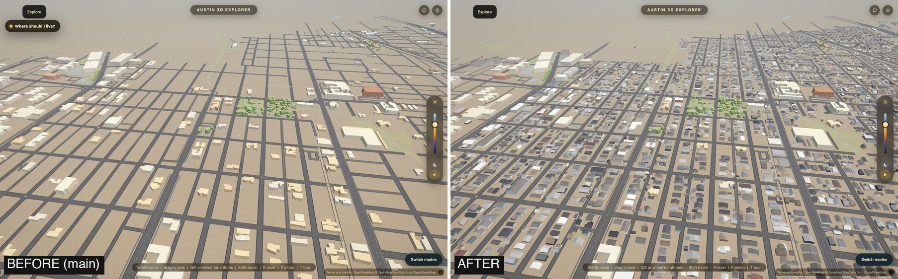
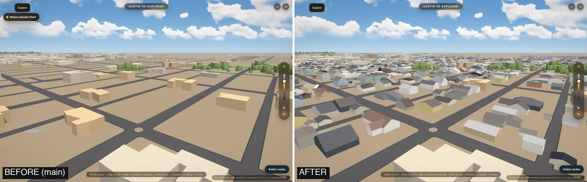
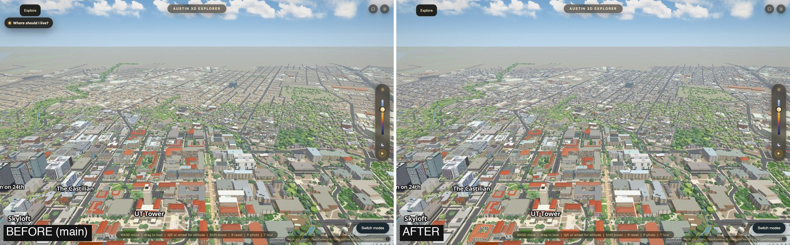
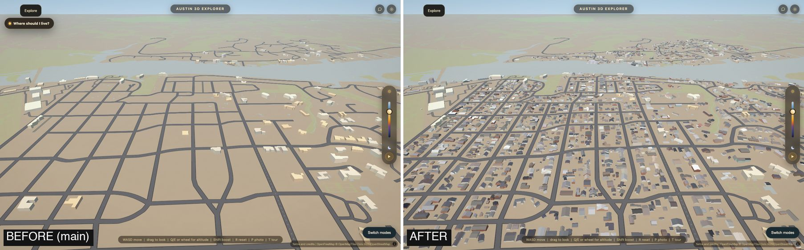
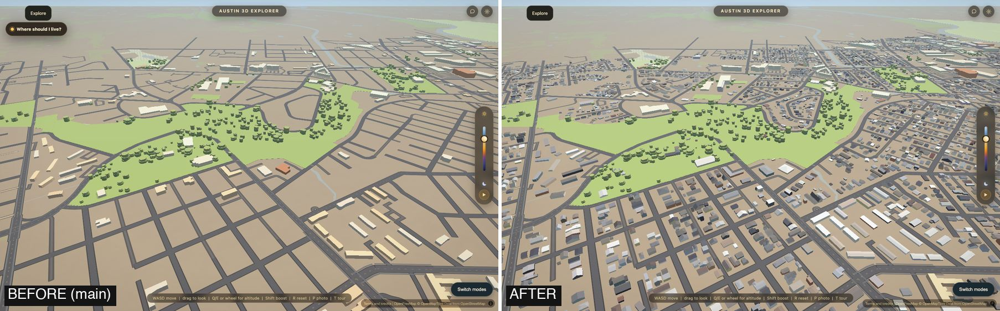

# The houses of the outer city

Branch `mac/outer-city`, 2026-10-10. Step 1 of making the outer city (everything
outside the campus core, the Capitol strip and downtown) accurate.

## What was wrong, measured

The outer ring drew 5,954 buildings outside downtown, all as flat boxes in two
tans. Against the City of Austin's 2023 building outlines that is **15.6 % of
the buildings that stand there**. The ring's bake keeps a footprint only when it
is tall or big for its distance, to protect the frame budget, and a house is
under that limit almost everywhere. Hyde Park was bare ground with a few boxes:



## What it is now

Every building is drawn: **39,820 buildings as 53,780 rectangles**, each with
its measured wall height, roof kind (flat, gable, hip), ridge height and roof
colour. They are not polygons in a tile. A building is **10.6 bytes** in one
file, `data/outer_homes.bin`, and the browser draws one shared 42-vertex house
with GPU instancing inside the existing 3D scene (`js/outer-homes.js`).









Every "before" is the `main` branch from the same made-up camera; none of the
cameras is a photograph's.

## Accuracy, before and after

`python scripts/measure_outer.py` writes this table to
`data/outer/outer_accuracy.json`. All numbers are **measured**. The truth for
buildings is the City of Austin's Building Footprints 2023 (37,625 outlines of
30 m2 or more in the outer city), which none of the app's data came from.

| Area | City buildings | Present before | Present after | Missing after | Extra pieces after |
|---|---:|---:|---:|---:|---:|
| **All of the outer city** | 37,625 | **15.6 %** | **93.8 %** | 2,318 | 1,619 |
| Tarrytown | 3,318 | 11.0 % | 94.6 % | 180 | 294 |
| Old West Austin | 2,524 | 41.6 % | 95.8 % | 107 | 102 |
| Rosedale-Heritage | 4,307 | 25.5 % | 93.5 % | 282 | 91 |
| Hyde Park | 3,286 | 16.7 % | 94.6 % | 179 | 66 |
| Hancock-Cherrywood | 4,825 | 10.0 % | 94.8 % | 251 | 142 |
| Central East | 5,256 | 10.1 % | 93.2 % | 359 | 215 |
| Holly-Cesar Chavez | 2,812 | 12.7 % | 92.1 % | 221 | 174 |
| Travis Heights-SoCo | 2,789 | 15.2 % | 93.5 % | 180 | 140 |
| Bouldin Creek | 3,453 | 14.8 % | 92.8 % | 248 | 155 |
| Zilker-Barton Hills | 3,316 | 6.0 % | 94.5 % | 184 | 128 |
| West Lake shore | 1,233 | 10.6 % | 93.7 % | 78 | 73 |
| East Riverside | 168 | 36.3 % | 97.6 % | 4 | 18 |

The areas are plain boxes named after the main neighbourhood inside each
(`scripts/outer_homes_lib.py`), not official boundaries. "Present" = at least
half of the City's outline is covered by what the app draws. By built area the
city went from 44.9 % to 96.6 %. "Extra" = a drawn piece (a ring box or a house
rectangle) with less than a fifth of its area on any City outline; before there
were 56 of 5,954 pieces, now 1,619 of 54,799 (3.0 %).

| What | Before | After | Truth, and whether it is independent |
|---|---:|---:|---|
| Roof is flat or pitched, right | 6.8 % | **98.0 %** | 147 blind labels (set 3, below). Independent of the fit. |
| Gable or hip, right, where the label is one of the two | none drawn | 79.1 % | 86 of those labels |
| Height, every City building, missing counted as 0 m (mean error) | 5.65 m | **1.21 m** | City `MAX_HEIGHT` |
| Height, drawn buildings only (median error) | 0.04 m | 0.51 m | City `MAX_HEIGHT`. See the note. |
| Height within 1 m, drawn buildings only | 81.7 % | 73.7 % | same |
| Roof colour (median CIE76 delta E) | 30.0 | 3.0 | City 2025 aerial. Not independent after. |
| Wall colour | not measured | not measured | An aerial does not show a wall. Inferred. |
| Ground under trees 3 m or taller | 2.4 % drawn | 2.4 % drawn | The 2021 scan says **38.0 %**. Not changed here. |

**The height note.** Before, the 5,862 buildings the ring drew agreed with the
City's height to 0.04 m because the ring's heights *are* the City's number: they
came through OpenStreetMap from an earlier edition of the same survey. So that
row was never a measurement of the app, and the honest row is the one above it
(every building, a missing one counted as 0 m tall). After, 35,253 buildings
have a height from the 2021 scan. They sit a median 0.45 m under the City's
number, which is the highest point of the roof (chimneys, vents) where ours is
the 97th percentile of the roof surface, and on sloped lots (Tarrytown, West
Lake shore: 0.9 m) the City measures from a lower base than the median ground
under the house, which is what a flat-ground app must use.

**The roof labels.** Three samples of 160 buildings of 70 to 450 m2 were drawn
at random and labelled blind, from the 2025 aerial and the scan's height
picture, without the fit (`data/outer/outer_roof_labels.json`). Sets 1 and 2
were looked at while the flat-or-pitched rule was being written (97.3 % and
93.3 %); set 3 was labelled after the rule was frozen and is the number in the
table. On set 2 seven of fourteen roofs labelled flat are drawn as gables:
low-slope roofs and flat roofs with large machinery.

## Bytes

Measured with `gzip -9` and `brotli`, every changed file a browser can fetch.

| File | Before | After |
|---|---:|---:|
| `data/tiles/outer.pmtiles` (read in slices; already compressed inside) | 2,392,254 | 1,492,898 |
| `data/outer_homes.bin` (new; gzip inside, fetched whole, after the veil lifts) | 0 | 422,203 |
| `js/outer-homes.js` (new; gzip / brotli) | 0 | 9,152 / 8,037 |
| `index.html` (gzip) | 5,812 | 5,932 |
| **Total on the default path** | **2,398,066** | **1,930,185** |
| `data/outer_ring.geojson` (only with `?tiles=0`; gzip) | 773,826 | 465,439 |

The outer city is **468 KB smaller (19.5 %)** in total while it draws about seven times
as many buildings, because 4,897 house-sized boxes left the tile archive (four
zoom levels each, three colour strings each) for 10.6 bytes each. One caveat,
**estimated, not measured**: the archive is read a few tiles at a time and the
new file is fetched whole, so a visit that never leaves campus now transfers
up to about 0.3 MB more than before, after the city has appeared.

## Frame time

`node scripts/verify/outer-homes.mjs --perf`: median frame, houses off and on in
one page, six interleaved reps, the minimum of each. **Measured** on a 2019
MacBook Pro's integrated graphics (Intel Iris Plus 655, 1440 x 900, load
average 2), each frame finished with a `readPixels`.

| Camera | Houses off | Houses on |
|---|---:|---:|
| Hyde Park from the air | 17.3 ms | 20.1 ms |
| Hyde Park, low | 16.5 ms | 16.7 ms |
| Campus looking north (the whole ring in frame) | 71.3 ms | 73.4 ms |
| Like the spawn pose | 54.8 ms | 58.1 ms |

Two to three milliseconds. The whole layer is 753,000 triangles in at most 129
draw calls, culled by 700 m chunk. Not measured on a phone.

## Where each number comes from

| Part of a house | Source | Status |
|---|---|---|
| Where it is, its outline | Overture Maps buildings (96 % OpenStreetMap, 4 % Microsoft ML Buildings), reduced to 1 to 3 rectangles. 3,360 buildings no outline has come from the 2021 scan itself. | MEASURED. Mean overlap of rectangles and outline (IoU) 0.93; 0.6 % under 0.7. |
| Whether it still stands | 2021 scan: 298 outlines with nothing on them and 641 with the building somewhere else were dropped | MEASURED |
| Wall height, ridge height | 2021 scan, building-class returns | MEASURED for 51,356 rectangles; INFERRED for 2,424 (under trees, or in the 280 m north strip the fetched tiles do not cover) |
| Roof kind | 2021 scan: the roof surface's slope, then the best of three ridge models | MEASURED for the same 51,356. 8,662 are pitched roofs no single ridge explains (several ridges, a shed, a step) and are drawn as a gable of their measured height |
| Roof colour | City of Austin 2025 aerial: the sunlit half of the roof's own pixels, 64 colours | MEASURED for 49,914 rectangles |
| Wall colour | a mix of 20 paints and masonries by the housing stock of the area, chosen by a hash of the position | **INFERRED**. Not from any picture of the house. |

Licences. Overture / OpenStreetMap: ODbL (attribution on the terms page;
Microsoft ML Buildings: CDLA-Permissive-2.0). StratMap Bexar & Travis Counties
Lidar 2021, TxGIO: CC0-1.0. City of Austin 2025 aerial: copyright City of
Austin, **no licence grant found**; one colour per building is read from it and
no pixel is in the repo or the app. City of Austin Building Footprints 2023:
**no licence grant found**; used only to measure, and no outline or height from
it is in the repo or the app. The owner's walk photographs were not used in this step.

## How it is drawn

- `data/outer_homes.bin`: a 40-byte header, two palettes, twelve byte columns
  (the layout is in the header of `js/outer-homes.js`). Rows run along a Z
  curve, and position, angle and a wing's values are stored as differences, so
  gzip gets it to 10.6 bytes a building.
- `js/outer-homes.js` builds 129 instanced meshes (700 m chunks) and adds them
  to the `js/slopes.js` scene. The material is `slopes.material()` itself with
  a short vertex prelude, so a house takes the same sun, hour, haze and shadows
  as every other mesh. It adds **no new vertex attribute**: the Mac's Intel
  driver refused the first version ("Too many attributes"), so the instance's
  numbers ride in the nine attribute names the shader already declares.
- Houses receive sun shadows but do not cast them (they are on a layer the two
  shadow cameras do not draw).
- The file is fetched after the loading veil lifts. Above 80 degrees of pitch
  (walking height) only chunks within 650 m are drawn.
- Knobs: `OUTER_HOMES` at the top of the module. `?homes=0` is off. The
  "City beyond campus" slider thins them, smallest first.

## The ring

`scripts/bake_outer.py` gained `apply_homes_split()` and the patch mode
`--homes-split`. It removes the 4,890 ring boxes the houses layer took (listed
by `data/outer/outer_homes_split.json`), and raises 165 boxes that stay to the
2021 scan's height where the scan reads at least 1.5 m taller (raises only, as
the owner chose for the core). No tower, streetwall body, detail piece or
anything inside the downtown box is touched. 981 house-sized boxes stay in the
ring because rectangles would lose their outline or they are over 1,500 m2.

## Rebuild

```
python scripts/fetch_outer_homes_inputs.py overture --work DIR
python scripts/fetch_outer_homes_inputs.py lidar --work DIR      # 24 GB read, 4.5 GB kept
python scripts/fetch_outer_homes_inputs.py aerial --work DIR
python scripts/bake_outer_homes.py --work DIR                    # 11 minutes
python scripts/bake_outer.py --homes-split
bash scripts/tile.sh
python scripts/fetch_outer_homes_inputs.py truth --work DIR      # only to measure
python scripts/measure_outer.py --work DIR --before <the ring file as it was>
node scripts/verify/outer-homes.mjs [--out DIR] [--perf]
```

## What is still wrong

1. **Trees.** The 2021 scan has 38.0 % of the outer city under vegetation 3 m
   or taller; with only this step the app draws crowns over 2.4 %. Step 2
   (`docs/outer-trees.md`) plants them from the same scan.
2. **Walls are a guess.** Colour by area mix, no windows, no doors, no
   porches, no fences. A resident will recognise the roofs and the street
   pattern from the air, not their own front.
3. **Complex roofs are one gable.** 8,662 rectangles. Cross gables come out
   right only where the footprint itself is an L or a T.
4. 2,318 City buildings are still missing (6.2 %): built after early 2021,
   under trees with no roof return, or in no outline and too small for the
   scan rule (28 m2, 2.6 m).
5. 1,619 extra pieces (3.0 %): sheds and carports the City does not count,
   buildings removed between 2021 and 2023, and 356 kept under trees.
6. The 981 house-sized boxes and all the big buildings that stay in the ring
   are still flat boxes in two tans with no roof colour.
7. Heights for the north 280 m of the box (above 30.3125) are inferred: those
   scan tiles were not fetched.
8. Not looked at on a phone. Frame time on a phone is not measured.
