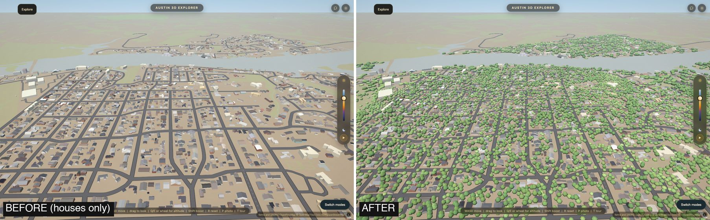
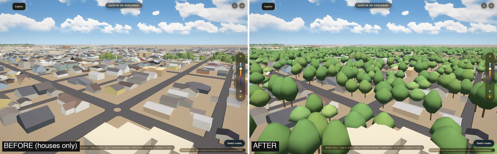
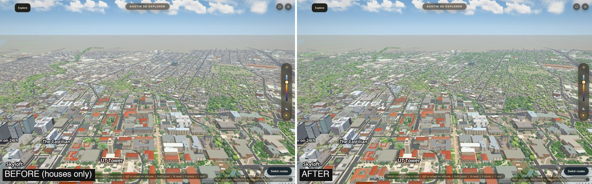
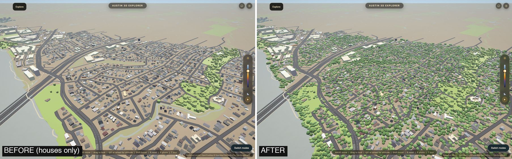
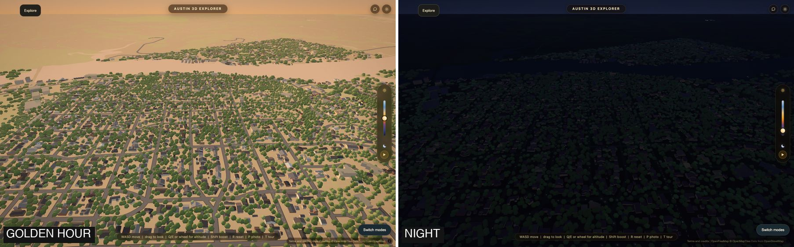

# The tree cover of the outer city

> **Read `docs/city-join.md` for the numbers of the joined branch.** This page is the step as it was on its own
> branch; the campus look, the three distance templates, the phone gate and the join with downtown came after it, and the counts moved a little
> (39,807 buildings, 53,761 rectangles).

Branch `mac/outer-trees`, 2026-10-10. Step 2 of making the outer city accurate;
it stands on step 1 (`docs/outer-homes.md`, the houses).

## What was wrong, measured

The 2021 laser scan has **38.0 % of the outer city under vegetation 3 m or
taller**. The app drew tree crowns over **2.4 %** of it: the street and park
trees of the City's inventory, and nothing in a back yard. Tarrytown is half
canopy and was drawn with 0.6 %.



## What it is now

**196,109 trees**, one per 10 m cell the scan found under canopy, each as tall
as the canopy there. They are not in a tile. The whole city's tree cover is one
grid of 4 bits a cell, `data/outer_trees.bin`, **138 KB: 0.7 bytes a tree**, and
`js/outer-trees.js` plants the trees in the browser.









Every camera is made up; none is a photograph's. "Before" is step 1 (houses, no
new trees) from the same camera.

## Tree cover, before and after

**Measured.** "Scan" is the share of the ground under vegetation 3 m or taller
in the 2021 scan (`scripts/measure_outer.py`). "Before" is the share under the
crowns the app drew. "After" is the share of 10 m cells that now carry a tree
(`data/outer/outer_trees_report.json`); a cell gets one when at least 40 % of it
is under canopy, so the two are close but not the same quantity.

| Area | Scan | Before | After | Trees |
|---|---:|---:|---:|---:|
| **All of the outer city** | **38.0 %** | **2.4 %** | **34.6 %** | 196,109 |
| Tarrytown | 49.0 % | 0.6 % | 47.0 % | 34,588 |
| Zilker-Barton Hills | 49.3 % | 2.2 % | 47.1 % | 27,132 |
| West Lake shore | 46.7 % | 1.0 % | 47.1 % | 17,336 |
| Old West Austin | 44.4 % | 2.9 % | 38.5 % | 12,156 |
| Bouldin Creek | 42.0 % | 2.0 % | 37.3 % | 13,361 |
| Travis Heights-SoCo | 38.7 % | 4.6 % | 32.7 % | 13,410 |
| Hyde Park | 36.0 % | 4.2 % | 29.7 % | 10,229 |
| Rosedale-Heritage | 34.3 % | 2.4 % | 30.0 % | 17,035 |
| East Riverside | 30.7 % | 4.4 % | 30.5 % | 5,920 |
| Hancock-Cherrywood | 28.4 % | 0.8 % | 25.6 % | 16,545 |
| Central East | 28.3 % | 3.0 % | 25.5 % | 15,489 |
| Holly-Cesar Chavez | 25.2 % | 2.1 % | 21.8 % | 9,082 |

**This is not an independent test**: the trees come from the scan they are
compared with. What it shows is that the amount and the place of the cover now
follow the scan, area by area. Tree height is the 90th percentile of the canopy
in the cell, in 2 m steps: a median of 11.8 m (8.4 m at the 10th percentile,
16.1 m at the 90th).

Of the 298,087 cells under canopy, 50,963 are in the core, the Capitol strip or
downtown (another lane's trees) or outside the box, 27,489 have a roof in the
middle (a tree overhangs a roof, it does not grow out of one), 15,085 are in a
carriageway (the same rule `scripts/shape_trees.py` applies to the inventory's
trees: the trunk is the test, not the crown) and 8,441 are beside a tree the
app already draws.

## Bytes (measured)

| File | Before | After |
|---|---:|---:|
| `data/outer_trees.bin` (new; gzip inside, fetched whole, after the veil lifts) | 0 | 137,981 |
| `js/outer-trees.js` (new; gzip / brotli) | 0 | 7,675 / 6,870 |
| `index.html` (gzip) | 6,105 | 6,181 |
| **This step** | | **+145,732** |
| Steps 1 and 2 together, against `main` | 2,398,066 | 2,075,917 |

So with the trees the outer city is still **322 KB smaller than it was on
`main`**, with about seven times the buildings and fourteen times the tree cover.

## Frame time

`node scripts/verify/outer-trees.mjs --perf`: median frame, trees off and on in
one page, six interleaved reps, the minimum of each. **Measured** on Intel Iris
Plus 655, 1440 x 900, at the default preset's tree density (0.675).

| Camera | Trees off | Trees on |
|---|---:|---:|
| Tarrytown from the air | 16.2 ms | 19.2 ms |
| Hyde Park, low | 16.2 ms | 17.2 ms |
| Campus looking north | 62.6 ms | 62.7 ms |
| Like the spawn pose | 56.5 ms | 59.1 ms |

"Off" at the first two cameras is the screen's refresh (16.7 ms), so the true
cost there may be larger than the difference shown. Not measured on a phone.

## How it is drawn

- One template tree, GPU instancing, inside the `js/slopes.js` scene, through
  `slopes.material()` with a vertex prelude and no new attribute name (the
  method and its reason are in `js/outer-homes.js`).
- Two templates per 700 m chunk share one set of instance buffers: **near**, 52
  triangles (a trunk and a crown of four hexagonal rings), within 900 m of the
  eye; **far**, 16 triangles, every fourth tree at twice the width, so the
  ground covered is the same for a twelfth of the triangles.
- The layer is in the LOD tier `trees-canopy` is in and starts at the same
  zoom, so the outer trees leave at the altitude the campus trees leave.
- A tree stands a little off its cell's centre, and is a little wider, taller,
  warmer or cooler than its neighbour, by a hash of the cell: a reload plants
  the same city, and the grid does not show.
- Canopy colours are `js/timeofday.js`'s own keyframes.
- Knobs: `OUTER_TREES` at the top of the module. `?outertrees=0` is off. The
  tree density slider thins them.

## Rebuild

```
python scripts/bake_outer_trees.py --work DIR      # 20 s, from the rasters step 1 fetched
node scripts/verify/outer-trees.mjs [--out DIR] [--perf]
```

Source: StratMap Bexar & Travis Counties Lidar 2021, TxGIO, CC0-1.0
(vegetation classes 3 to 5). Nothing else.

## What is still wrong, and what is a taste call

1. **These trees do not look like the campus trees.** The campus trees are
   stacked octagons with a crown per species; these are one smooth hexagonal
   crown in one green. Where the two meet (the inventory's street trees inside
   a neighbourhood) both kinds stand side by side. Which look the city should
   have is the owner's call; every number of the shape and the colour is in
   `OUTER_TREES`.
2. No species. A live oak, a pecan and a cedar elm are the same tree here.
3. One tree per 10 m cell is a count for the cover, not a census: a 25 m live
   oak is four or five trees, a row of crape myrtles is one.
4. The trees are from early 2021. A lot cleared since still has its trees.
5. The near and far templates swap at 900 m with no blend; four trees become
   one wider one.
6. Trees receive sun shadows but cast none, on the ground or on a house.
7. Not looked at on a phone.
