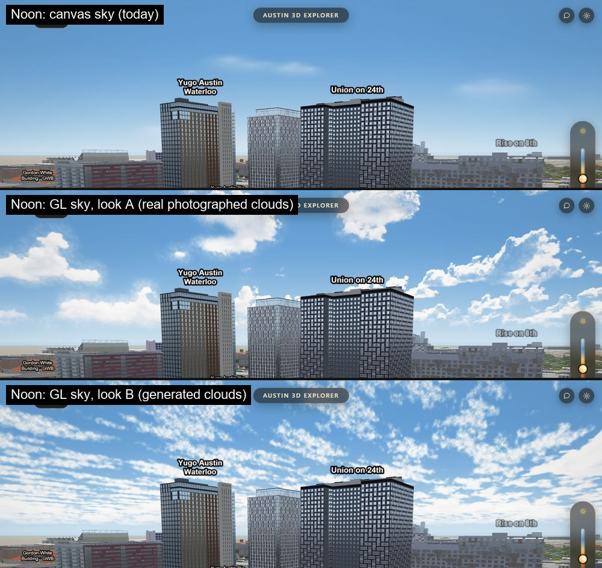
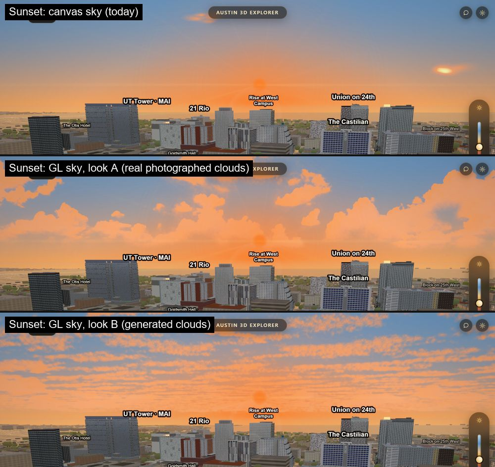
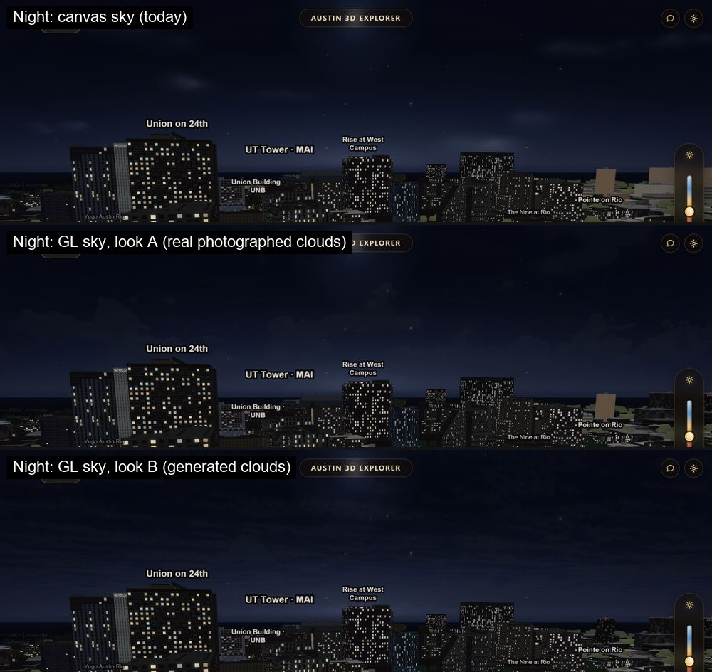

# The GL sky: a sky drawn from uniforms, not a canvas (2026-10-04)

**Status: the default since 2026-10-04**, with cloud look A (the owner chose it from the three
pictures below). `SKY_COMP.mode` is `'gl'` unless you ask for `'canvas'`, the sky before.

The Intel Mac in Safari spends about 58 ms of a 195 ms frame copying the sky's 2D canvas into a GL
texture (`docs/perf/safari-frame-floor.md`). Nothing in the sky depends on where the camera is, only
on its bearing, pitch and field of view and on the hour. So the GL sky draws the same sky in the map's
own pass from textures that are uploaded once. A camera turn changes uniforms and nothing else:
no 2D draw, no canvas, no upload.

## How to switch

| Way | Effect |
|---|---|
| nothing | the GL sky, cloud look A |
| `?sky=canvas` in the URL | the canvas sky for that page load |
| `SKY_COMP.mode = 'canvas'` (or `'gl'`) in the console | switches live (the next frame rebuilds for the new mode) |
| `?set=SKY_COMP.mode="canvas"` | the same, through the Safari timing harness's override |
| `SKY_TUNE.cloudSet = 'A'` or `'B'` | which cloud picture (below), live |

If the GL sky cannot compile or draw it retires itself for the session and the canvas sky comes back
(one console warning). Every taste value is in `SKY_TUNE` (`WASH`, `GLOW`, `FEATHER` are the shared
tables both paths read; `GL` holds the ones only the GL sky uses). The 2D canvas is collapsed to one
pixel in GL mode and rebuilt if you switch back.

## What is analytic, what is a texture

- **Atmosphere: no texture at all.** The night skyglow band, the Belt of Venus (rose over blue), the
  sun's and moon's wide horizon washes and their hot spots are computed in the fragment shader. The CPU
  projects six anchor points per frame and hands over numbers; the stop tables are the same
  `SKY_TUNE` values the canvas reads, so there is one copy.
- **Clouds: one 360-degree panorama per look, uploaded once, after first paint.** `data/sky/clouds-a.jpg`
  and `clouds-b.jpg`, 4096 x 512, columns are azimuth, rows run from 45 degrees up (top) to the horizon.
  Red is coverage, green is self-shade, blue is unused. They store no colour: the shader rebuilds each
  pixel's azimuth and elevation from the camera, reads the panorama, and relights it with the hour's lit
  and shade colours (cool and dim by night, warm at golden hour), a sun-side occlusion tap for lit edges,
  and a haze toward the horizon. Drift is a UV offset (`GL.DRIFT`, degrees a minute, moves only when a frame
  is drawn: a parked camera costs nothing). The files load when the browser is idle, never before the first
  frame, and only in GL mode.
- **Stars: GL points** from a buffer filled once; twinkle comes from a time uniform.
- **Horizon feather: the same easing ramp** as the canvas's destination-out, in the shader.
- **The sun and moon disc and bloom** are the same sprite quads as before.

## The two looks (`SKY_TUNE.cloudSet`)

- **A: a real photographed sky.** A CC0 sky photograph reduced to the two channels by
  `scripts/bake_sky.py` (coverage from how far a pixel is from clear-sky blue, a texture gate that drops
  the smooth haze around the sun, the sun and its glare masked out so the app's own sun is the only sun,
  self-shade from how dark a cloud is against the brightest cloud near it). The photograph's sun is
  rolled to a named azimuth (`--sun-az`, default 180); `SKY_TUNE.GL.ROT` rotates it at run time. 401 KB.
- **B: generated.** A soft, high, thin layer with a few scattered puffs, ray-marched offline through
  periodic noise (no photograph). 488 KB.

Both are under the 600 KB a texture is allowed. The wrap seam is real, not hidden: the photograph is a
full 360 degrees and the generated world repeats, so the last column continues into the first (the baker
prints the ratio; the check measures it on the files and on screen). The zenith pinch of an equirectangular
map is not in the strip, which stops at 45 degrees; the top of the frame sees 41 degrees at most.

**Credit.** Look A is derived from the "Kloofendal 48d Partly Cloudy (Pure Sky)" HDRI from polyhaven.com,
licence CC0. The source file is not in the repository; only the baked texture is.

To swap a look for another picture: bake or paint a 4096 x 512 strip in the layout above, replace the
file, and update its entry in `data/sky/clouds.json`. Nothing in `js/` changes.

## What was measured

### Safari on the Intel Mac: 195 ms down to 117 ms a frame

Same build, same checkout, one tab, interleaved canvas / GL / canvas / GL / canvas / GL (the GL side is the same
URL with `&sky=gl`). First-visit probe on every rep. 2560 x 1360 window at device pixel ratio 2, drawing buffer
3840 x 2040, Performance tier (render scale 0.75, clouds 0.4, stars 0.5, so the clouds are on). Every rep was
valid: Performance tier reached, page visible throughout, canvas the expected size. None was voided.

| Rep | Sky | median frame | 95th percentile | frames a second |
|---|---|---|---|---|
| 1 | canvas | 189 ms | 200 ms | 5.3 |
| 2 | GL | 117 ms | 151 ms | 8.5 |
| 3 | canvas | 191 ms | 216 ms | 5.2 |
| 4 | GL | 118 ms | 147 ms | 8.5 |
| 5 | canvas | 191 ms | 289 ms | 5.2 |
| 6 | GL | 117 ms | 144 ms | 8.5 |

Minimum of each side: **canvas 189 ms, GL 117 ms**, 72 ms (38%) less per frame; frame rate 5.3 to 8.5. The three
reps of each side sit within 2 ms of each other, so the gap is not noise. It is larger than the 58 ms upload alone
because the per-frame 2D redraw of the band (88 cloud lobes, stars, washes) goes too. This number is the whole GL
sky, clouds and stars included, not an empty one. It says nothing about Chrome on a discrete GPU, where the sky was
never the cost.

### The gate: `scripts/verify/sky-gl.mjs`, 6 of 6 green, 6 of 6 break switches red

Hardware GL on the laptop through the GPU slot, 1280 x 800 at device pixel ratio 1, pixels read back from the
finished map frame. Run once, clean, with the final script. Gate and break run are in `scripts/verify/README.md`.

| | What | Result |
|---|---|---|
| a | atmosphere (noon, sunset, night; clouds and stars off, 297 channel samples) | largest difference 2 levels, mean 0.20; limits 4 and 0.8 |
| b | no seam where the panorama wraps | on screen 343 against a limit of 475; in the files the last-to-first column step is 4.20 against a typical neighbour step of 1.99 |
| c | the horizon feather sits where it does today | half-way row 271 in both modes (limit 2.5 px); peak wash 59.0 and 59.0 levels |
| d | clouds are really drawn | look A changes 25% of sky samples by 25 levels or more, look B 44%, A against B 46%; need 3% |
| e | a turn costs no 2D draw and no upload | 40 turning frames: 0 2D draws, 0 uploads by the app's counters and by an independent `texImage2D` wrapper, 40 GL draws; the canvas control shows 40 and 40, so the instrument is alive |
| g | the pixels are the GL path's own | 2D canvas collapsed to 1 px, GL draws counted, zeroing the GL atmosphere moves pixels by up to 30 levels |

The break run turns each of those red on purpose (atmosphere gain 1.6 gives 26 levels; the feather moved 30 px
gives row 287 against 271; clouds at gain 0 change 0.0%; a turn run in canvas mode shows 40 draws and 40 uploads),
and all six did.

### The pictures

Noon, sunset and night, each with the canvas sky, GL look A and GL look B in the same frame (top of the screen,
same camera and hour, twinkle and drift frozen):

At noon and sunset look A is the one that earns the change: real cumulus with lit tops and shaded bases, warm at
golden hour. At night clouds are faint in all three, as they are today; look A keeps a few dark shapes near the horizon.

### The existing sky checks, in canvas mode (measured before the default changed)

Once each, hardware GL through the GPU slot, after the change: `graphics.mjs` 27 of 27, `banding.mjs` 9 of 9,
`light-sky2.mjs` 11 of 11, `skycolour.mjs` prints its colour table and exits 0, `sky.mjs` 10 of 12. The two
`sky.mjs` failures are the pair `scripts/verify/ci/checks.json` already records as red on `main`
(`setLight` azimuth and polar against the shared sun), unchanged. `light-sky2.mjs` timed out waiting 60 s for the
style to load on its first run, when the machine was at 99% CPU from other jobs, and passed on the rerun; that is
the load, not the sky.

## What it does not do

- Three older checks have the 2D sky canvas as their subject (`sky.mjs`, `night-sky.mjs`,
  `light-sky2.mjs`). They now open the page with `?sky=canvas`, so they still guard the fallback path
  and say nothing about the default. `sky-gl.mjs` guards the default, and it needs a GPU, so it does
  not run on the build server.
- The clouds are a different picture, not a copy of the canvas's 88 lobes. Atmosphere and horizon match
  the canvas; clouds are the point of the change.
- No camera roll (the canvas path has none either).
- The WebGL1 path (power-of-two `REPEAT` fallback) is written and the panoramas are power-of-two, but
  only WebGL2 was exercised.
- Cloud drift only advances when something redraws, by design.
