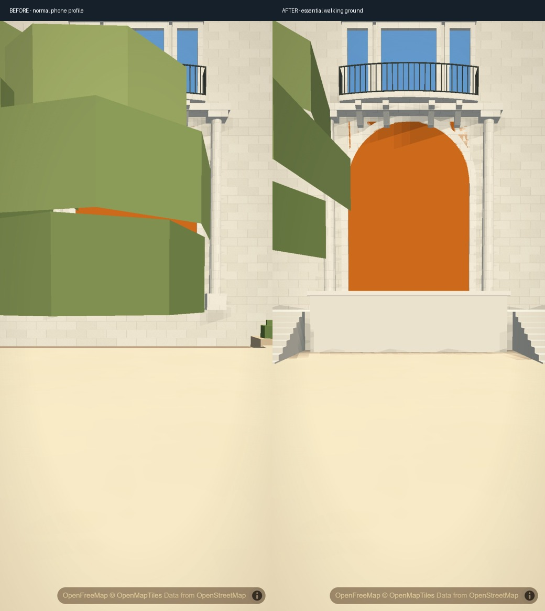
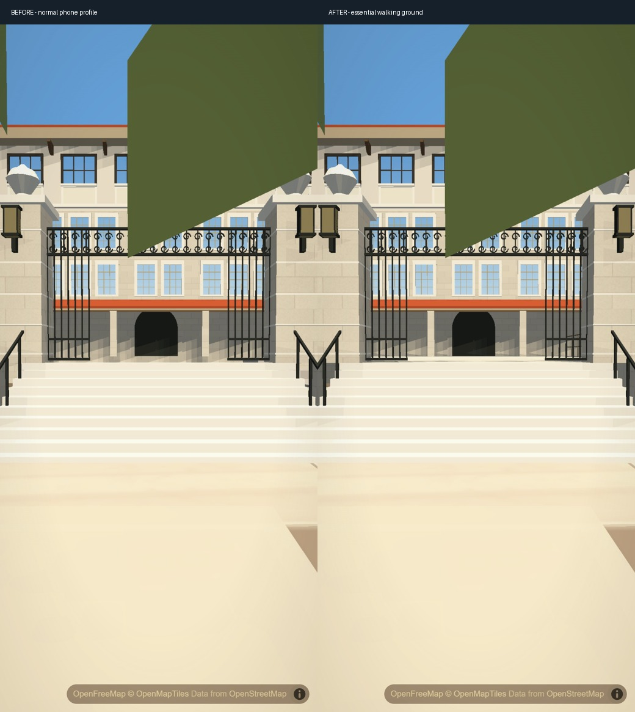

# Essential campus ground on phone profiles

Normal phone profiles disable optional campus planting. That also disabled the walking support under Gearing's visible stairs and removed Union's entire raised approach. Essential terraces, steps, rails and their matching floors now remain available when planting is off.

These are matched second application captures at 1.8 m eye height, 390 by 844 CSS pixels, DPR 3, hardware Chromium, the automatically selected normal phone performance profile, 74-degree field of view and no CPU throttling. Automatic graphics detection and exposure are disabled. This is desktop phone emulation; physical iPhone Safari/Chrome performance, memory and thermal acceptance remain open. Gearing's existing visible stairs look the same from outside; the repair supplies their missing walking support and courtyard terrace. Union's phone doorway detail and remaining ordinary tree occlusion are still simplified.

## Structural ownership

The landscape bake explicitly marks seven existing solid features, ramp 239 and 35 walking surfaces as structural. It does not change their geometry, planting or order. The runtime builds these solids independently from optional landscape density. Ten Gearing stair floors require the corresponding successfully built, visible authored model; missing or hidden geometry cannot leave invisible stairs. The other 25 support surfaces belong to the structural group. Both groups follow the main 3D switch, and the safe `slopes=0` path creates neither geometry nor floors.

The one previously identified false Union canopy also stays retired in fallback tree tiers. Its trunk and every other tree remain unchanged. The disabled source row retains its slot because array indices seed tree shapes. Existing palette ordinals also remain stable when structural features are separated from planting.

The normal phone profile adds one structural mesh: 662 triangles and 91,644 unique geometry-buffer bytes. Balanced desktop has exactly the same combined garden vertex attributes and palette, total 4,075,507 scene triangles and 500,012,726 unique scene geometry bytes as the baseline. These are geometry measurements, not startup, frame-rate or device-memory results. Committed landscape data grows 1,405 raw bytes / 169 gzip bytes; landscape runtime grows 1,967 / 544, and controls grows 114 / 58.

## Descent dependency and preserved failure

The first actual phone walk failed the unchanged 2.35 m clearance ceiling on two descent frames, peaking at 2.364447 m. Exact recorded coordinates and simulation deltas reproduced the same result with the old full landscape, new full landscape and new structural-only floor index. Live planting off/on/off queries also matched all 3,724 recorded route points. Ground activation did not change those heights.

The controller already follows walking ground and enforces it as a hard minimum. Feeding the same ground into rooftop decay left a second, slower floor above the descending pedestrian. A separate controls commit removes only that duplicate target. Rooftop/obstacle-step smoothing, upward collision protection, free flight, the final floor clamp and rendered minimum remain intact. The complete production resolver replay reproduces both original failures within 0.0000001 m; the fixed replay remains at approximately 1.800518 m throughout that descent. This is a recorded-input regression, not a substitute for actual walking.

The new resolver regression deliberately fails before the fix and passes afterward. It checks raised-ground minima, rooftop/step rise and decay across multiple time steps, higher free flight, tall-obstacle rejection and the missing-grid fail-safe. Existing floor/collision fixtures now refer to the structural group. Independent source review found no blocker.

The final normal-phone keyboard walk passes 3,752 Union frames, both ten-tread flights, seven stopped/restarted checks and central-wall contact. Clearance remains 1.800000 to 1.800335 m with the original 2.35 m ceiling. Gearing passes 2,435 frames across stair ascent/restart, terrace-to-original-ramp descent and ordinary outside ground; clearance remains approximately 1.800000 to 1.800491 m. These are continuous keyboard routes with verified starting poses; no intermediate camera teleportation supplies progress.

The close Union landing screenshot still shows the existing simplified orange doorway surface on the phone profile. Walking support is repaired; phone doorway detail and full building recognition are not visually accepted.

Final lifecycle checks pass: all 35 support samples disappear with the main 3D switch off and return after rebuilding; the safe path remains empty. All 196 authored buildings, requested asset/code hashes and error checks pass.

The existing hardware browser movement suite passes all 14 assertions. The existing collision suite passes all nine: 528 random-flight samples retain at least 4 m roof clearance, a low street flight travels 112 m without rising over adjacent buildings, an actual tower approach stops outside the wall without climbing the tower, and simultaneous touch movement/look works. Tests use their original assertions and simulation-time pacing; only local dependency import paths were redirected for the existing installation. No speedup is inferred from these checks.
