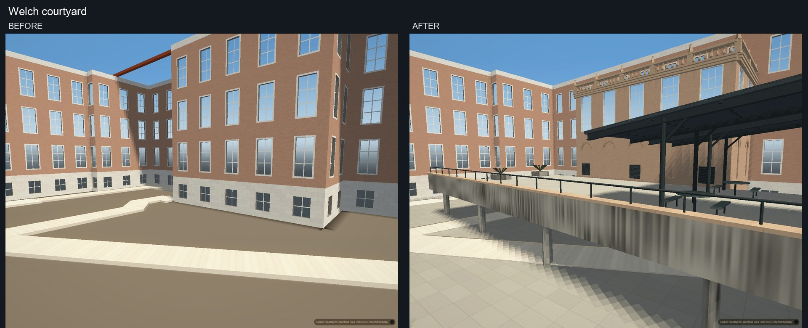
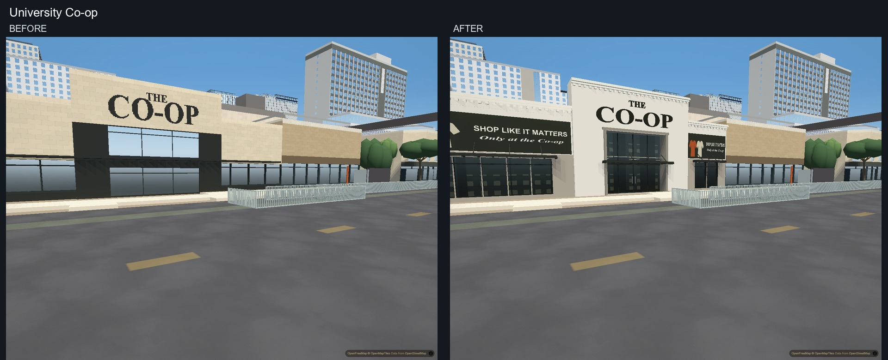
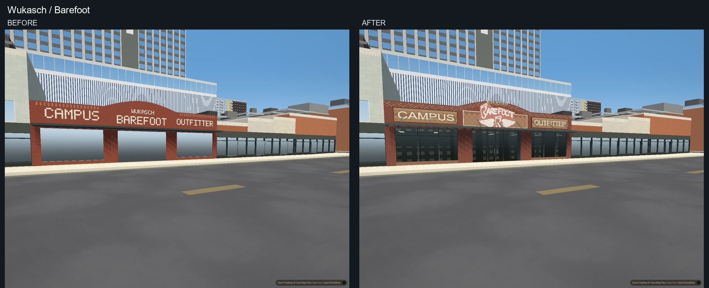
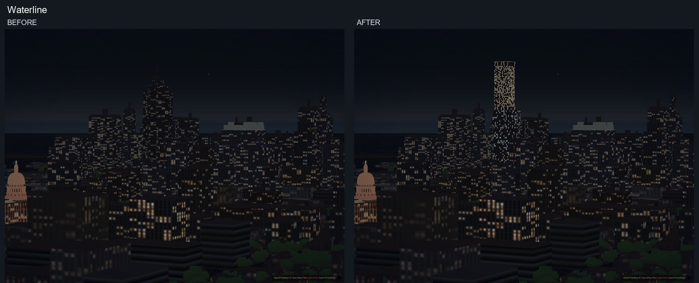
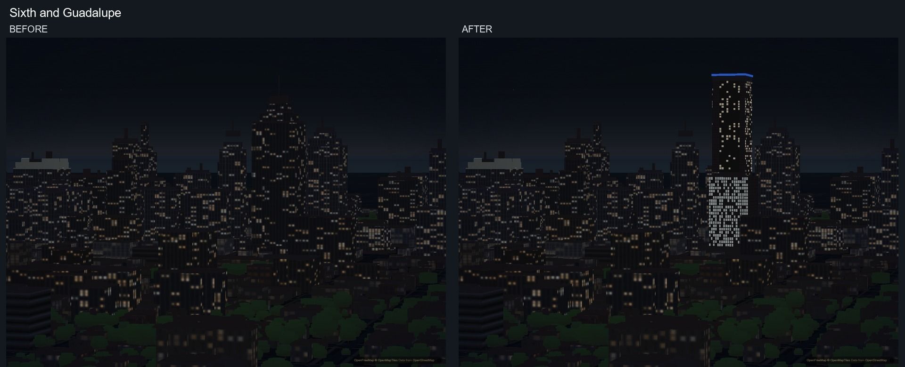

# Five architectural reference targets

This pass rebuilds Welch's courtyard, Waterline, Sixth and Guadalupe,
Wukasch/Barefoot and University Co-op. It replaces the rejected block lettering
and generic tower forms with structural and facade detail. These remain
approximate architectural models; they are not photogrammetric reconstructions.

## What changed

- Welch: a lower central courtyard projection, divided windows and blind brick
  arches, balustrades, split terrace levels, stairs and railings, sloping steel
  shade roofs with actual beams and columns, planting and furniture, plus weathered concrete. The other
  wings retain their previous heights. One explicitly identified legacy roof is
  replaced; its sibling roof and neighboring roof assemblies remain.
- Co-op: a deep entrance portal, narrower side storefront openings with masonry
  piers, subdivided glazing, projecting awnings and cornices, smooth panel
  cladding, solid serif lettering and legible banner shapes.
- Wukasch/Barefoot: shaped parapet and brick corbelling, diamond infill, timber
  sign panels, substantial canopy ties, recessed doors and subdivided glazing.
  The curved brand mark is contoured from the brand's public logo; it is not
  rebuilt from a block alphabet.
- Waterline: distinct offset hotel, office and residential volumes, open
  transition terraces, inclined supports, and the broad supported crown.
- Sixth and Guadalupe: separate office and residential volumes, recessed
  balcony edges, an open transition and broad crown with a blue edge.

## Implementation boundaries

`author_welch_courtyard.py` updates only Welch's model. Optional structural meshes
are validated before any building geometry is emitted. Selective roof exclusion
is applied only when the replacement model succeeds and is restored on failure.

`bake_guadalupe.py` updates its own output; the 65 other shop models are unchanged.
The older Drag bake and campus-storeys experiment remain untouched. Cached sign
outlines allow ordinary baking without a local font installation, fontTools or
Pillow. Public logo provenance is in `data/sign_sources/README.md`.

Only these two shops opt into shallow parallax display interiors. They are
approximate displays, not replicas of private shop interiors. Their default
closed-room night state is preserved. Appearance controls live in
`SLOPES.storefront` and `APTS.materials.shopGlass`.

`bake_outer.py --landmarks-only` replaces exactly the two known legacy tower
recipes or its own prior tagged output. It rejects changed legacy inputs rather
than deleting an approximate geographical area. Unrelated outer-ring features
are preserved. Tower heights remain 315 m and 267 m; this pass does not settle
conflicting published height measurements. Dimensions and colors are editable
in `scripts/downtown_landmarks.py`. Fine facade bands use derivative-filtered
coverage in `CityLighting.landmarkMaterials` rather than unstable subpixel
extrusion strips; their storey zones retain the authored floor spacing.

Owner imagery, reference source identities and camera records remain outside the
repository. Banner art is simplified; weathering, fine interior detail and the
remaining citywide facade/motion issues are not claimed complete. Physical-phone
performance and memory are not measured by this visual pass.

## Verification

Fourteen application before/after pairs use identical camera position, bearing,
pitch, field of view and exposure at 1440 x 1080, balanced graphics. Each capture
waits for all 196 authored buildings, replacement readiness and loaded tiles;
auto-detection and drift are disabled, and the second settled screenshot is kept.
Both sides use the same raw GeoJSON delivery path. Geometry is finite, replacement
and roof checks pass, and the completed captures contain no page or shader errors.
Photo viewpoints are approximate; the application pairs are matched exactly.

Seven additional views at 1920 x 1200 verify the normal PMTiles delivery path,
including all five targets and both day/night tower views. All 196 authored
buildings are ready, sources are loaded, and the vector tiles contain the current
landmark flags with active glass/light draws and no shader or page errors.

Regression checks cover selective roof fallback, malformed structural meshes,
frontage filtering/cache behavior, landmark material partition and per-draw state
reset, analytic facade-band coverage, deterministic bakes and harness parity.
The full data workflow and separate PMTiles rebuild passed; rebuilding from the
committed archives produced no further data changes.

The pictures establish an architectural improvement, not a complete match to the
photographs. Welch's surrounding wings and blue glazing remain generalized,
planting is sparse, storefront displays and banners are approximations, and the
night skyline lacks much of the references' fine lighting detail. These are
remaining visual tasks, not implied acceptance from passing technical checks.

## Matched application comparisons

### Welch courtyard

### University Co-op

### Wukasch / Barefoot

### Waterline

### Sixth and Guadalupe

