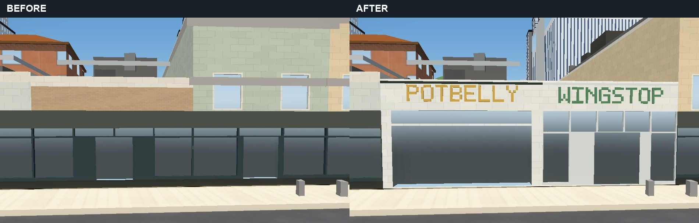
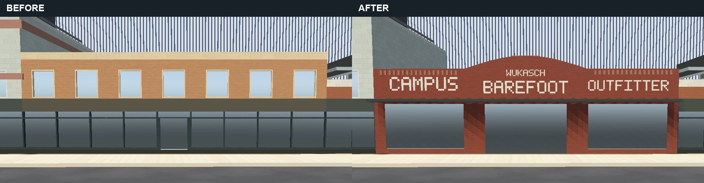
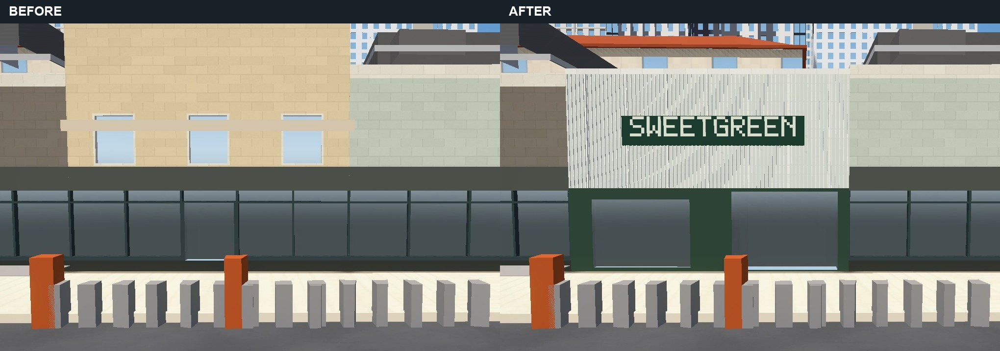
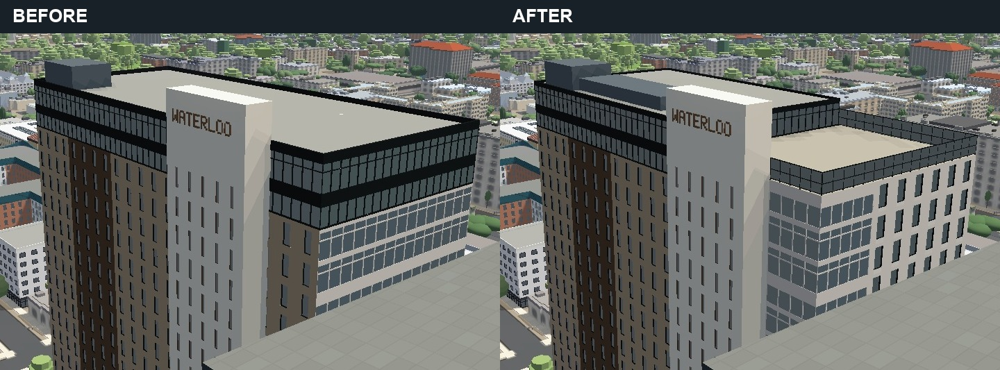

# Guadalupe frontages and Waterloo's open crown

The generic Guadalupe upper-window pattern contradicted the photographed shops.
Waterloo's full-width, two-storey glazed lid also filled the open southern terrace
and continued curtain glazing across a facade that has punched windows.

## Visible changes

- Potbelly: white masonry, deep recessed entry glazing and a separate transom.
- Wingstop: a low roof aligned with Potbelly, tall silver-framed storefront glazing
  and green lettering; the invented second storey is removed.
- Wukasch Building: broad display windows, recessed central entrance, projecting
  metal canopy, a curved central brick parapet and separate sign fields.
- Sweetgreen: pale vertical screening above a recessed green storefront and a
  projecting sign, replacing the generic upstairs windows.
- Waterloo: enclosed northern crown, a lower open-to-sky southern terrace with a
  two-band glass windscreen, stepped roof screening, and a glazed southwest corner
  turning onto the punched south elevation. The footprint, floor grid, northern
  roof height and sign-blade height are retained.

The frontage generator reads optional profiles; the remaining 63 Guadalupe models
are unchanged as parsed JSON. All 67 original footprints are retained. The Drag
and campus-storey experiment files remain untouched. Geometry and appearance
parameters live in the building profiles, including the curved parapet's rise,
span, depth and segment count.

The renderer also removes untagged legacy Drag cornices that overlap a successful
authored shop replacement. Those old filled polygons have no building ID; the
previous ID-only filter left them floating above lowered shops. The cached mask
uses frontage interiors, excludes failed models, and restores the original layer
filter when the authored models are disabled. It does not edit the Drag bake.
If a rebuild loses the last successful replacement for a layer, its obsolete
exclusion is also removed while preserving filters installed by other passes.

## Matched application views

Each pair uses the same camera, field of view, viewport and time setting. These
are application-before/application-after pairs; alignment to reference photographs
is approximate. Reference originals and camera records remain outside the repo.

## Verification and limits

The real application was served through `scripts/serve.py`, using hardware Chrome,
balanced graphics, disabled intro/drift and fixed exposure at 1440 by 1080.
Graphics auto-detection was cancelled. Captures waited for all 196 authored
buildings, full readiness, loaded map tiles and the removed loading veil, then
settled and took two screenshots, retaining the second.

The rendered-mesh downward ray at the terrace changes from 95.40 m to 92.29 m;
the northern roof remains 95.40 m and the blade 99.60 m. Mesh positions and normals
are finite, and replacement-layer and roof-rig checks report no missing entries.
This guards against a model silently falling back: the first thin glass guard
attempt did exactly that and was rejected with only 195 authored models. Guard
geometry now respects the generator's minimum edge length.

The bake passes, repeats deterministically, and changes only the four intended
shop models. Changed block bands fit their block bounds and reference valid skins.
`apartment-frontage-filter.mjs` checks the combined ID/geometry clause, neighboring
footprints, failed-model fallback, all-frontages failure, empty plans, repair and
switch-off restoration. `apartment-filter-cache.mjs` and JavaScript syntax pass.
The harness and index load the same 46 scripts. Flat upper sign bands and the
retained blank blade still produce the existing floor-alignment diagnostics;
they intentionally contain no upper windows.

Shop dimensions and Waterloo's terrace split/windscreen height are exterior-photo
estimates, not surveyed dimensions. The glass windscreen uses the existing
reflective glazing material, without physically transparent refraction. Rooftop
furniture, unverified neighboring amenities, the other facades and adjacent legacy
details remain outside this change. This is not a citywide flicker fix or a
phone-performance result. Further photo matching, campus detail and the remaining
work order in AGENTS.md stay open.
