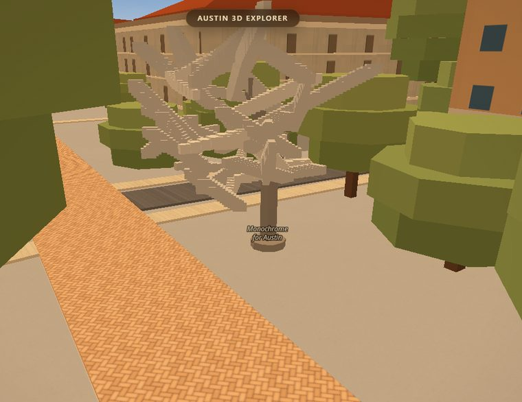
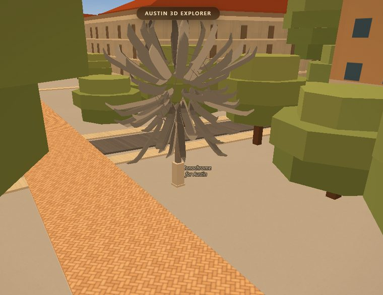
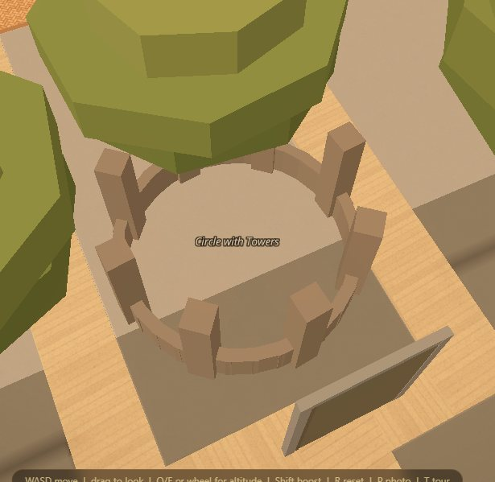
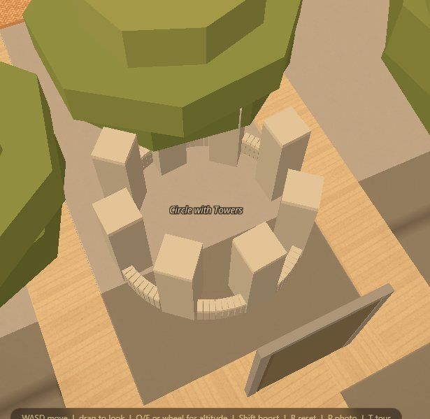

# The two artworks that are shapes now, not stacks

*Branch `acer/apts`. September 5, 2026.*

Two pieces of the Landmarks collection were the worst things on campus, and the
bake that drew them said so in its own header. **Monochrome for Austin** — Nancy
Rubins' seventy aluminium canoes cantilevered off a mast at 24th and Speedway —
was a cloud of pointed slabs, because a `fill-extrusion` is always vertical and a
hull that leans has to be approximated by a run of vertical prisms. Simeon:
*"still blocky"*. **Circle with Towers** — Sol LeWitt's ring of concrete block in
front of the Gates‑Dell Complex — was a 3 m ring with sixteen posts between its
eight towers, which as `scripts/bake_art.py` puts it *"turn a wall into a
colonnade, which is the opposite of what LeWitt built"*. Simeon: *"should be more
accurate"*.

Both are drawn as real angled geometry now, on the three.js slopes layer, from
`data/art3d/*.json`. Nothing was deleted: while the mesh draws, those two pieces'
`artpart` slabs are hidden by a filter on `js/props.js`'s own layer, and they come
straight back the moment you switch it off.

---

## Look at it

### Monochrome for Austin

| before — a staircase of slabs | after — seventy hull shells |
|---|---|
|  |  |

Same camera, same hour, one page: the only thing that changed between the two
frames is `ART3D.on`. In the BEFORE every hull is a flight of steps with a hard
corner at each tread, and the mass reads as one pale lump. In the AFTER each hull
is a shell with a tapered pointed plan, a rockered keel and an open cockpit, and
seventy of them radiate out of a dense core onto a 2.34 m pier.

### Circle with Towers

| before — a colonnade of sticks | after — a ring wall with eight piers on it |
|---|---|
|  |  |

From the north-west and well above, because from any lower angle the campus
canopy sits on top of this piece — which is true of the real one too, and is not
something this pass changed. In the BEFORE the whole work is a dark ring of
sticks, and you cannot tell a tower from a post; that is the sixteen extra posts
the bake put between the eight towers, on a ring under half the real diameter.
In the AFTER the wall is 108 radial block **fingers**, so its coping is a fan of
block tops and its outer face is a palisade of block ends with an open wedge
between them, and eight square piers stand on it, proud into the circle.

---

## What was read, and from where

Every number is in `data/art3d/*.json` with its source beside it. Four findings
changed the geometry, and two of them corrected this pass's own first answer.

### LeWitt's published dimension is stated in the block module

Landmarks' object label gives *"168 × 308 inches diameter"*. **168 in is exactly
21 courses of 8 in nominal CMU.** So the piece is not a ring with eight posts on
it — it is masonry, and its own dimension is counted in blocks. From there
everything else follows: the wall is **five courses**, counted on the outer face
of Landmarks' aerial rather than read off at a glance (`bake_art.py`'s 1.35 m is
one course too tall); the wall is one block thick laid as **radial headers**, so
adjacent blocks touch at the inner face and splay to a 34 mm wedge outside; 108
of them fit the inner circumference.

### Rubins' hulls radiate

In every photograph each hull's long axis points **outward from the core** —
inner end buried in the tangle, pointed end jutting clear. `bake_art.py` gave
each hull an *independent* random heading, uncorrelated with where the hull sat,
and an uncorrelated cloud of sticks is a lump however many of them there are.
That, not the slab section, is why the old one read as a silver tree.

### The gunwale is straight, and the boats are dark

Two measurements off the same frames. The hull's gunwale is a straight line for
four fifths of its length and sweeps up only at the tips, so the sheer and the
rocker run on `|u|^6`, not `u²` — on `u²` the whole hull bends and seventy bent
hulls radiating outward read as a wheel of scythes. And the hulls sample at about
**half the luminance of the concrete plinth in the same frame** (#5e6166 and
#77716f against #cac2bc): weathered aluminium against a bright sky, not the mill
finish `alum` #b9bec6 the bake painted them.

### A tower is a pier, and the grooves were leaf shadow

This is the one worth remembering. The level ground view shows deep vertical
grooves dividing a tower's face into strips, so the first version here built the
towers as runs of wall fingers carried up. At full resolution the aerial settles
it: a tower's faces are plain **running‑bond stretchers** — 2:1 block faces with
staggered vertical joints, on a square pier — and the grooves in the other frame
are **leaf shadow**, which the same frame lays in soft diagonal bands across the
building behind it. A tower is one 48 in square pier, outer face flush with the
wall, the other 32 in standing proud into the circle.

*Don't rationalise a defect you can see* is rule 7 of the reference playbook, and
this was the mirror of it: don't rationalise a feature you can see either. Read
the source at full resolution before you read the pattern out of it.

---

## The look‑fix cycles, and what each one changed

| # | What the frame showed against the photographs | What changed |
|---|---|---|
| 1 | Seventy hulls scattered into a thin disc with a hole in the middle; nine "spike" hulls overshooting the outline by their own length; a fan of thick cables reading as a suspension bridge | Hull centres moved inside the envelope so their own length carries the tips out to it; spikes land their tip on the outline; no cable longer than 8 m |
| 2 | A wheel of scythes — every hull bent along its whole length | The sheer and the rocker moved from `u²` to `|u|^6`; the plan holds full beam to mid‑length and closes over the last third |
| 3 | A comb of near‑parallel hulls down one side and a hole on the other | Directions off a Fibonacci lattice with jitter instead of a hash; inner ends placed on the armature rather than centres in a shell, which retired both the outward bias and the nine bolted‑on spikes and put the count back at the published 70 |
| 4 | From the air, seventy dark gashes instead of a burst of bright pointed shapes; the towers a palisade | The cockpit lightened and narrowed to leave a gunwale rim; the towers rebuilt as square running‑bond piers; the coping given its own course in the sampled cap tone |

---

## The switch

One line, two ways in:

```
?art3d=0                  # at load: the generator is never built
window.ART3D.on = false   # from the console: next frame, no reload
```

Off, both pieces are the `artpart` slabs `scripts/bake_art.py` writes and the
filter on `props-artpart` is gone. The gate proves it two ways: the filter after
a runtime off is byte‑identical to what a `?art3d=0` page carries, and the
runtime‑off **frames** are the `?art3d=0` frames.

---

## The taste constants

Rule 11: every aesthetic call is a named constant you can overrule with a
one‑line edit. `window.ART3D` (`js/slopes-art.js`):

| Constant | Default | What it does |
|---|---|---|
| `mono.stations` / `mono.sides` | `11` / `9` | Grid on a hull shell, × `slopes.detail()`. Seventy hulls at this cost about 12,000 triangles. |
| `mono.deckDrop` | `0.30` | How far the open cockpit sits below the gunwale, as a fraction of hull depth. `0` closes it and a hull reads as a solid pod. |
| `mono.rakeWithHeight` | `0.32` | How much a higher hull is turned to point up. `0` is an even sea urchin; at `0.55` the top became a tight vertical sheaf. |
| `prof.endPow` / `kickPow` | `4` / `6` | How far down the length the plan stays full, and how abruptly the ends kick up. This pair is the difference between a canoe and a scythe. |
| `prof.deckW` | `0.70` | The cockpit's half‑width as a fraction of the hull's — the rest is the gunwale rim, which is what stops a hull reading as a black slot from above. |
| `circle.capH` | `0.2032` | One course. The top course of the wall and of every pier is drawn in the cap tone; without it the wall is a smooth pale ribbon. |
| `circle.courseLines` | `false` | A bed joint is 10 mm and is a moiré at anything but walking distance, so coursing on a face is a tone. The wall's palisade is real geometry because it is 0.23 m and radial. |
| `lift` | `0.01` | How far the group sits off `z=0`, so it does not z‑fight the ground at grazing angles. |

Colour, hull dimensions, the ring's block module and every measured length live
in `data/art3d/*.json`, each with the pixel or the publication it came from.

---

## The gate

`scripts/verify/art-slopes.mjs`, hardware, served by `scripts/serve.py`.

```
python scripts/serve.py 8842
VERIFY_URL=http://127.0.0.1:8842 node scripts/verify/art-slopes.mjs
```

**9 of 9 passed** on the fourth hardware run (2026-09-05, RTX 3050 Ti / D3D11,
balanced preset, 1200×900), with `--against`. `--break` switches the generator
off and the three lines that must go red do: **4 of 7**, exactly the built,
filter and ON‑vs‑OFF lines.

The two numbers worth quoting:

- **ON vs OFF** at the two poses: 98,275 px and 6,979 px change when
  `ART3D.on` goes false. The mesh really is drawing both pieces.
- **`?art3d=0` against the tree without this generator: 0 of 1,080,000 pixels
  at both poses, max channel Δ 0** — a true zero, not a zero within a
  tolerance. Beside it the control (a second load of the same page) is also
  0 and 0, so the zero is a measurement and not a broken instrument.

**`--against` points at this branch WITHOUT this generator, not at main**, and
that distinction cost a run to learn. Pointed at main it reported 277,268 and
147,548 differing pixels — and the control that keeps such a number honest, a
*second load of our own `?art3d=0` page*, came back **0 and 0**, so the difference
was real rather than flake. Looking at it said whose: GDC's atrium and doors and
the kerb under the sculpture, i.e. other lanes' commits on the same branch (see
`de03391`, `8ec80d7`, `f30bfc8`). Both of this gate's poses stand a few metres
from that work. A switch line has to vary one thing, so the archive is the branch
with this generator taken out of it:

```
git archive HEAD | tar -x -C DIR
rm -rf DIR/data/art3d && : > DIR/js/slopes-art.js
python scripts/serve.py 8843 DIR        # the root is the SECOND argument
```

That second argument matters: without it `serve.py` serves the repo it lives in,
the archive answers 200 for a file it does not contain, and the comparison is the
branch against itself. It did, on the first attempt.

**The hour is pinned** on every page and re‑pinned after every `jumpTo`. The
first run asked for one settled page shot twice at one pose and got 277,322
differing pixels; the diff was a broad sky wash with a building's windows lit in
one frame and not the other. It reads 0 now, and that zero is what every other
number in the gate rests on.

The poses are computed rather than guessed. Metres per pixel at this latitude is
`40075017·cos(30.287)/(512·2^z) = 67522/2^z`, so the zoom that puts an object of
height *h* at *N* pixels is `log2(67522·N/h)`. A first attempt used a
camera-distance relation instead and put every pose four zoom levels too close;
the frames were pavement.

---

## What is still open

- **The canopy sits on top of Circle with Towers from every oblique angle.** A
  4.3 m ring under campus live oaks is invisible in the app unless you are nearly
  overhead. That is true of the real one too, so it is not obviously a defect —
  but it is why this doc's Circle frames are nadir, and it is worth a decision.
- **The other 32 pieces are still the bake's slabs.** This pass took the two the
  owner named. Clock Knot's crossed I‑beams and Kelly's coloured glass are the
  next two that would repay the same treatment, and both are already sized and
  oriented in `bake_art.py`'s `DIMS` and `HEADINGS`.
- **The armature is a stub.** Rubins' work "draws its support from a steel
  armature and intertwining cables"; this draws the pier, a mast stub and 26
  ties. The armature proper is inside the tangle and mostly invisible, which is
  correct, but nobody has checked that from underneath.
