# The three regressions, fixed and looked at

Round seven shipped three things that were worse than what they replaced. All
three passed a green gate, because none of the gate lines were about whether the
building looked right — they were about whether the switch still switched. A
blind reader, shown before/after pairs and told nothing about what had changed,
named every one of them unprompted.

This pass undoes them. Nothing here touches app code: the whole change is three
data files under `data/apartments/`, and it is the generator reading different
numbers, not the generator behaving differently.

**The rule this pass was held to.** A picture that needs a caption is not done.
Every claim below is a pair of frames at one camera, judged from the sidewalk as
well as from the air, and where the "after" is not visibly better it says so.

---

## 1. The Standard — the corner

### What went wrong

Two separate regressions landed on the owner's building at its hero angle.

**The sign.** Round seven read the reference photograph as showing the round-S
logo sitting in the middle of the rooftop sign, and split each face's text into
three pieces: `THE`, a 9×9 ring-S bitmap, and `TANDARD`. On screen the sign read
**THE (S)TANDARD** — a glyph substitution that looks like a rendering bug. Going
back to the same photograph at 4× (`humphreys_00.jpg`, source `S25`) shows plain
white channel letters on the band and no mark at all; the ring-S is on the
entrance door on 23rd, and nowhere near the roof.

**The corner.** The corner bay was authored as a flush stack of glazing with the
loggia beside it drawn as one cream inset with a solid black box on it. It
rendered as alternating cream and near-black rectangles — a pale blank column
stuck on the corner of a dark slab. The same photograph shows a projecting glass
**oriel**: a box standing about 0.6 m proud of both street faces, four storeys,
each a run of floor-to-ceiling glazing between light aluminium mullions under a
charcoal spandrel band, standing on the storefront fascia so the fascia becomes a
soffit over the sidewalk. The loggia beside it is light concrete jambs around a
dark glazed door with a black tube rail in front — two tones in one recess, not
one cream tone.

### What the blind judge said

Before, unprompted, shown only the frame:

> "The corner is not one building. The left face is a beige/cream tower with an
> unbroken vertical strip of pale windows running the full height at the corner,
> while the right face is a flat dark-brown slab whose windows are a different
> size, a different pitch, and a different colour — the two faces do not meet as
> the same structure."

and

> "The dark face has two 'THE STANDARD' signs stamped side by side on the same
> wall … a real building has one sign, at the corner or over the entry, not a
> repeated decal."

### What the pictures show now

| | before | after |
|---|---|---|
| corner, 21 m | 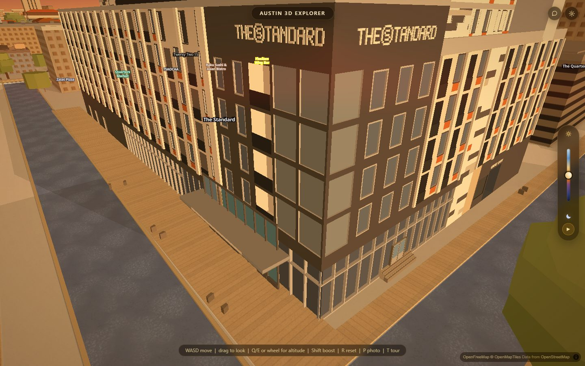 | 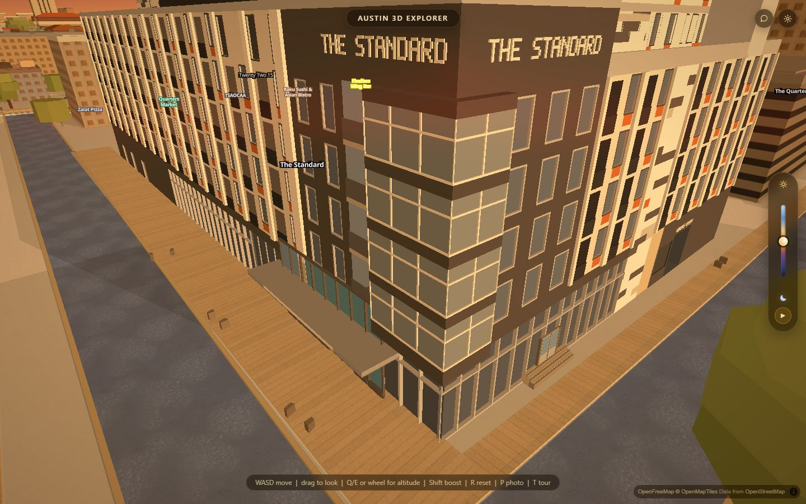 |
| street, 1.7 m | 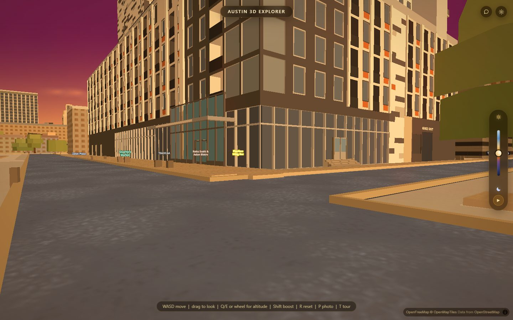 | 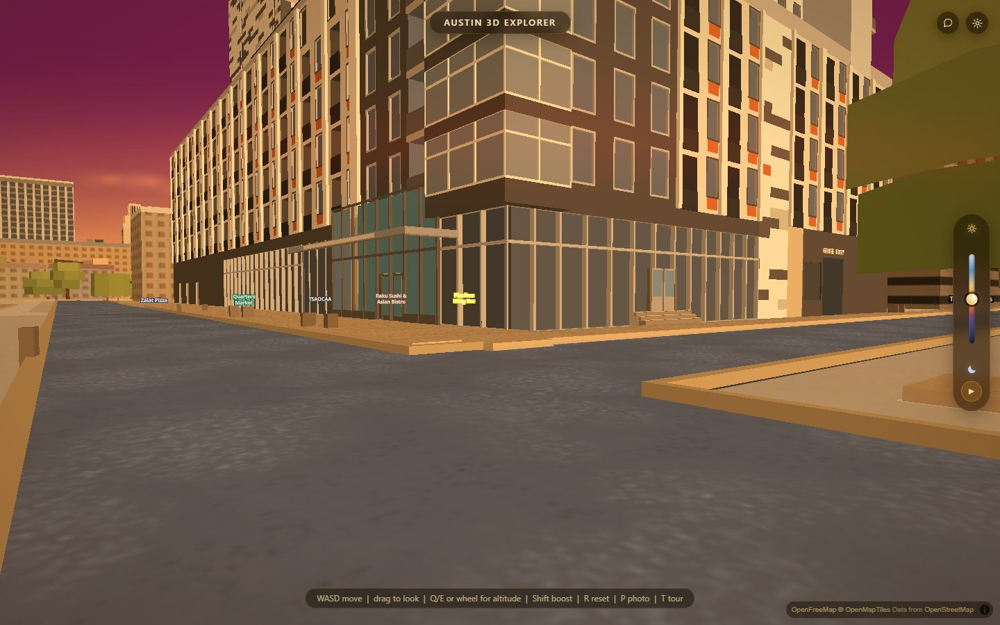 |

**corner (21 m) — better, and obvious without being told.** In the before the
sign reads `THE (S)TANDARD` on both faces and the corner is a blank cream column
running from the storefront to the sign band, flanked by dark. In the after the
sign reads `THE STANDARD` in plain letters, and the corner is a glazed box that
stands proud of both walls: four storeys of glazing, light mullions, a charcoal
spandrel at every floor line, a cap under the sign. 84,067 of the 90,858
differing pixels are deeper than Δ 24 and all of them are on the corner bay —
this is one change in one place, not a wash across the frame.

The two signs are still there and that is correct: they are on the two street
faces of a corner building, one per frontage, which is what the photograph shows.
What was wrong was the glyph, and the glyph is fixed.

**street (1.7 m) — better.** From the sidewalk the before has a flat wall above
the storefront: large flat panels, a cream blank block to the left of the corner,
and no change of plane anywhere between the shop window and the roof. In the
after the oriel projects, sits on a charcoal fascia that reads as a soffit over
the pavement, and the loggia beside it is a green-glass recess with doors and a
rail instead of a cream panel. 28,040 pixels deeper than Δ 24, on the corner.

### Still wrong in the after, said plainly

The blind judge's other complaints on this frame are **not** fixed by this pass
and were never in scope — they live outside `data/apartments/`:

- the plaza under the building is a timber-plank deck running beneath an urban
  block;
- the small boxes on the pavement are untextured cubes at unrelated scales;
- the dark face stops at the top with no parapet or roof edge;
- the yellow POI chips sit inside the wall geometry rather than above it.

Two things about the fix itself that are honest to write down:

- The generator prints a warning that the oriel's two upper glazing bands start
  3.10 m above their floor line, so those storeys' windows are dropped and the
  band draws its own glazing instead. It looks right on camera, but it is not the
  path the generator intends.
- The oriel's return faces are drawn full length with most of each hidden inside
  the corner bay. Harmless by construction — different planes, enclosed — and it
  is invisible at both cameras, but it is unverified geometry.

### A pose that was thrown away, for the record

The first aerial pose (`128, -40, 45`) put the camera **inside** a neighbouring
tower and rendered a ghosted mass across half the frame. A wide replacement at
85 m showed the corner at about forty pixels across, where the change is not
readable. Neither is cited. The 21 m corner pose is the elevated view.

---

## 2. Villas on Rio — the panel wall

### What went wrong

Round three drew the wall's half-module row stagger by making each opening the
leftover *field* rectangle of a checker rule. But a `bays` skin's `window` takes
no field rule, so the 0.50 × 0.90 m glass slot was drawn on the blank bays too.
The wall ended up carrying **two different marks at once**, each shifting a
module every storey: a dark rectangle and a pale square beside it, at two sizes,
lining up into nothing.

Re-counted off the reference photograph rather than reverted: 25 openings in 7
rows, row pitch 58.7 px against the file's own 2.80 m storey, column pitch 47.5
px within a row. The module is **3.15 m**, the opening is **1.70 × 1.65 m**, and
it is one window a bay.

A second commit swapped which part of the opening is the pane. The first cut put
mint glass in the centre with dark to either side, and at the sidewalk camera
each opening read as a *pair of vertical slats* rather than one window — the mint
is nearer the white panel than it is to the dark, so the eye picked out two bars.
The pane is the 1.00 m dark panel now and the 0.35 m mint bars are its frame.
Same measured widths, same area shares, one mark instead of two.

### What the blind judge said

> "Before, each window was a little doublet: a dark rectangle with a paler square
> stuck to its side, and the rows had a jittery, staggered look."

and on the wall camera:

> "Before, every window was a dark frame with a light-green pane offset beside
> it, like a badly registered print, and spacing wandered."

### What the pictures show now

| | before | after |
|---|---|---|
| wall, west | 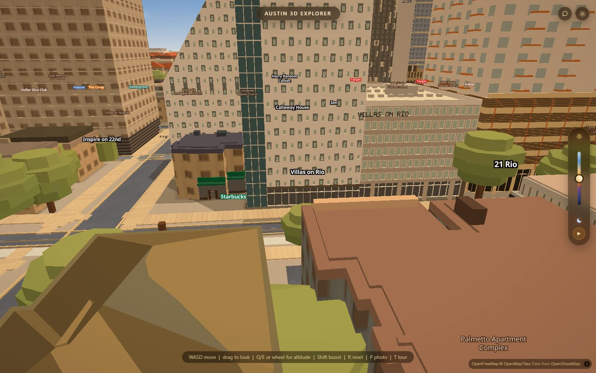 | 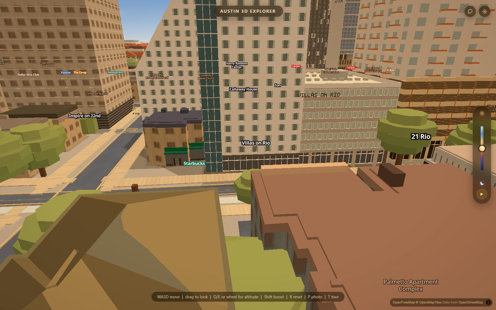 |
| street, SW | 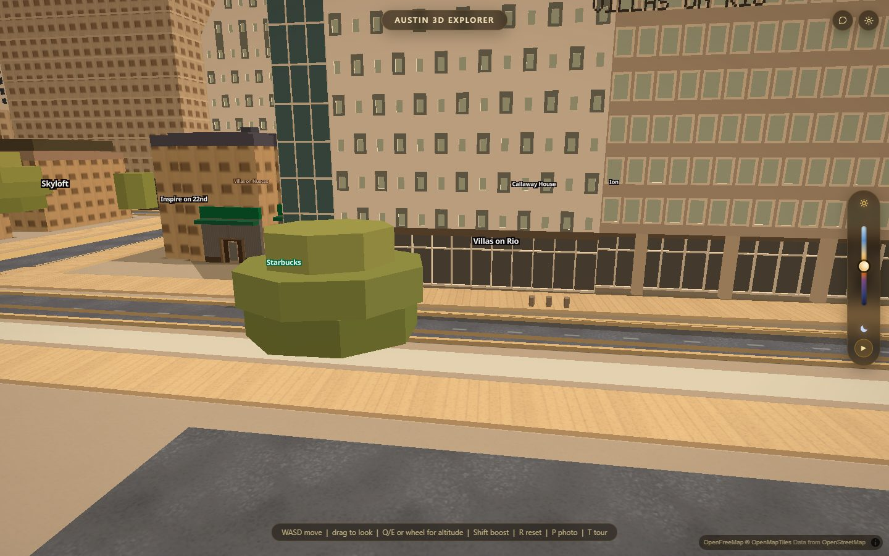 | 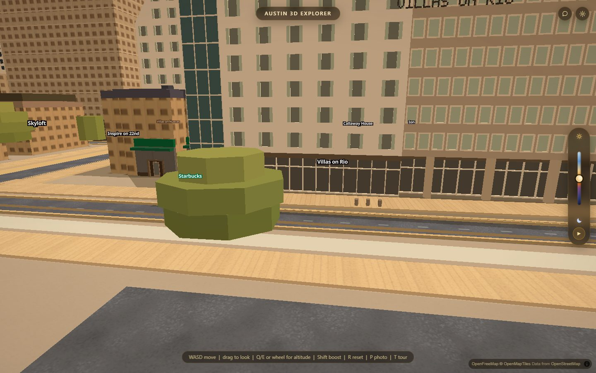 |
| air, NW | 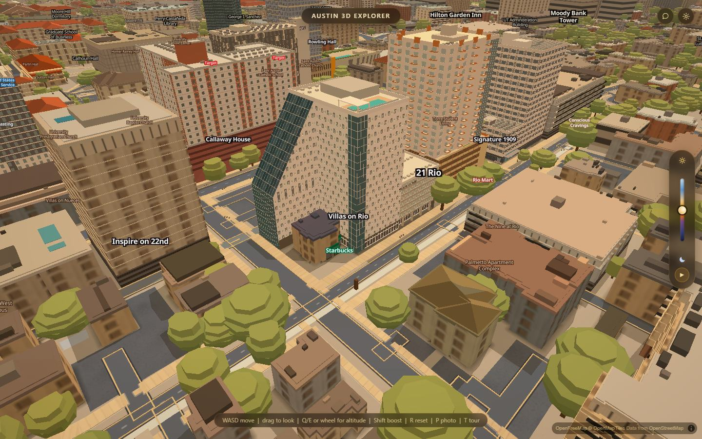 | 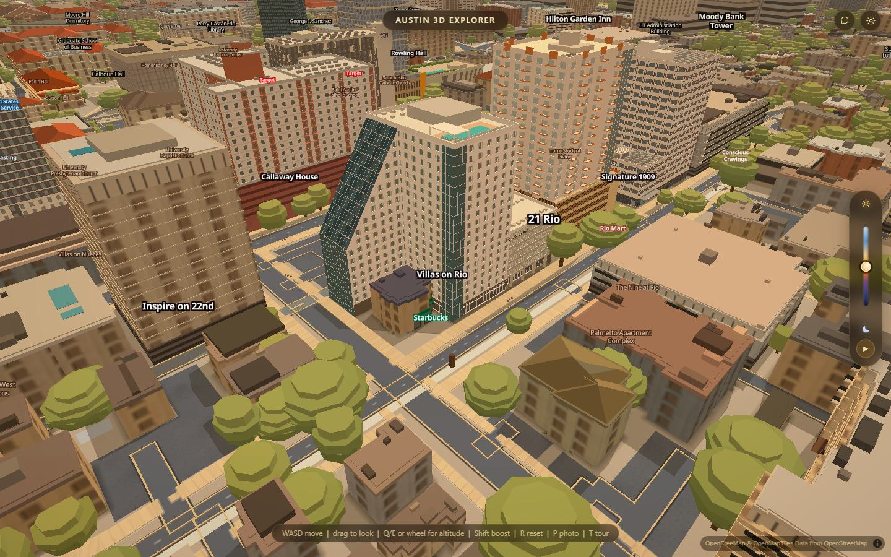 |

**wall (west) — better, and obvious.** 65,801 pixels deeper than Δ 24 on the pale
wall alone. The doubled windows are gone; every opening is one dark pane with a
thin light edge, and the rows and columns line up. Everything else in the frame —
the sloped green glass face, the corner fin, the roof, the pool box, the ground
floor, the neighbours — is pixel-identical.

**street (SW) — better, and obvious.** 78,915 deep pixels. At this distance the
before is visibly speckled: two mark sizes, scattered. The after is a grid.

**air (NW) — better, slightly, and NOT obvious.** 19,252 deep pixels, confined to
one tower face. The blind judge's own verdict on this pair was *"No. At this
altitude I only found it by diffing the two frames. A person looking at the city
would not notice."* That is still true and this doc will not claim otherwise —
the pair is cited because it is the honest air view of a fix that is a
sidewalk-scale fix.

### Still wrong in the after, said plainly

- **The half-module row stagger is measured and still not drawn.** It is real —
  every second row offset exactly 1.575 m, seven rows without a miss — and it is
  the building's "angular design motif". This generator cannot draw it together
  with a window: the stagger needs a rule that skips a bay by `(bay + storey)`
  parity, `fieldRule: checker` is the only thing that has one, and under it the
  window is drawn on every bay regardless. The choice was the stagger **or** the
  pitch, the size, the rows and the night lighting. The pitch won. One generator
  key ends the choice — a `windowRule: 'checker'` beside `fieldRule` — and it is
  written into the file's `todo`. `js/slopes-apartments.js` is not this lane's to
  edit.
- The dark panel is drawn centred with the mint split to either side; on the real
  building the mint is on **one** side and changes hands bay to bay. What ships is
  the honest average of the two hands. It is invisible at both judged cameras and
  it is still not the building.
- The diagonal creases across the custom-formed panels — the other half of the
  angular motif, unmissable in the reference — are not drawn.
- The windows have no recess, no sill, no shadow and no mullion, and every one is
  identical from the ground to the parapet.

---

## 3. Moody Center — the concourse

### What went wrong

**The upper wall.** The fin band's skin was one flat fill of the mean glass
colour, with no window and no reveal, so the blades had nothing behind them. The
blind judge called the street view slightly **worse** than the round before it:

> "a flat mid-blue rectangle with evenly spaced brown posts over it, with no
> reflection, no depth, no interior, and the posts are so uniform it reads as a
> fence."

The ribbon is a curtain wall now, out of colours the source already measured and
never used: a 1.90 × 4.70 m pane recessed 0.10 m in the bright cluster (the sky
off the pane), the plane behind it in the dark cluster, and the reveal jambs in
the measured mullion tone. The glazing module is set so a mullion falls in every
second fin gap and is seen *through* the screen rather than hidden behind a
blade — the one number here that is not measured, and the file says so.

**At night.** Making the ribbon a row of windows again brought back exactly what
the file's own `todo` warned about: the generator lights 45 % of windows at
night, so the arena wore forty scattered pale flats. The night tone is now set so
lit and unlit panes sit within a step of each other and the ribbon reads as one
continuous lit band. It is the only authored colour in the file and its note says
so.

### What the pictures show now

| | before | after |
|---|---|---|
| night | 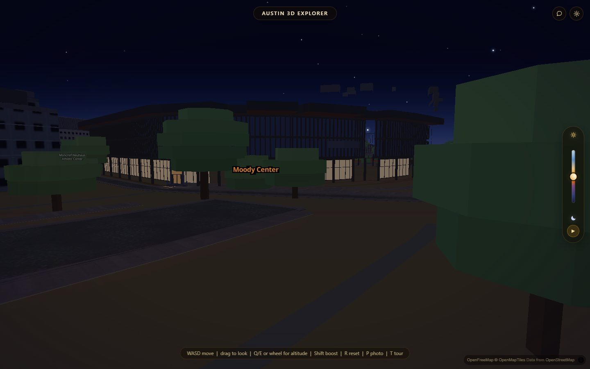 | 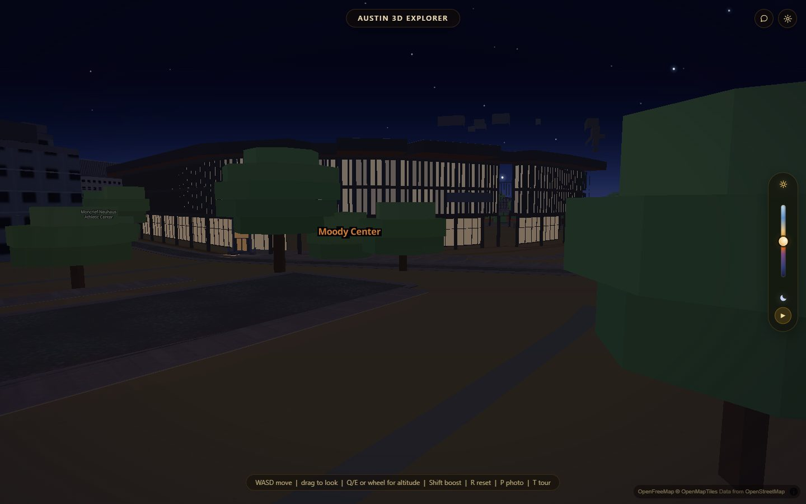 |
| west front | 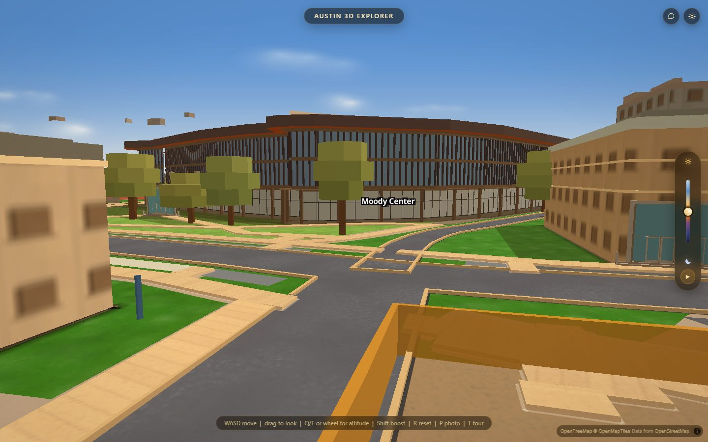 |  |
| street | 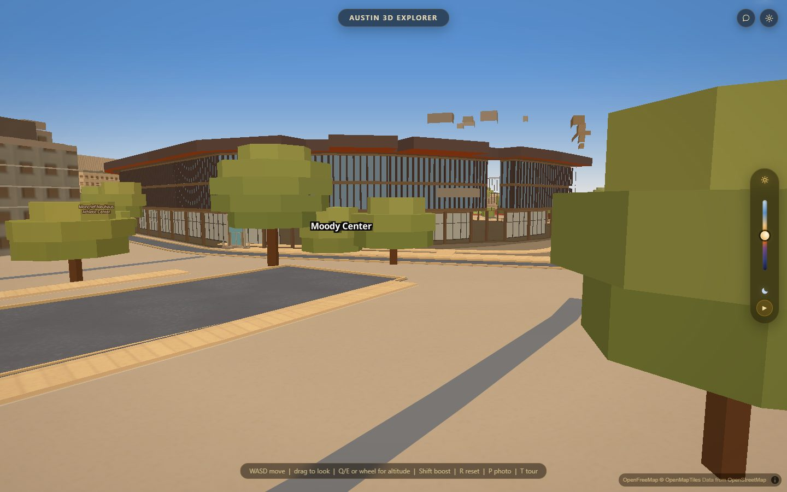 |  |

**night — better, and obvious.** 13,560 deep pixels across the whole concourse
ring. Before, the arena is a black hulk with a faint blue-black band. After, the
concourse glazing is a single lit ribbon running the length of the building. It
reads as a lit room. Honest caveat: the lit tone is a flat pale grey-tan rather
than a warm interior light, so at this distance it reads more like pale panels
than like a room with people in it.

**west front — better, but NOT obvious at full frame.** This is the one to be
careful about. 17,913 deep pixels, spanning the whole west elevation, but the
maximum channel difference is only 87 — a low-contrast change. Side by side at
full frame the two look nearly the same. Zoomed to the glazing band the fix is
plain: the before has a heavy horizontal rail across the middle with thick, close,
dark mullions in front of a flat blue field (the "fence"); the after has no rail,
brighter continuous glass, and thinner mullions. **A person scrolling past would
not notice this one.** It is a correct fix that has not yet earned its picture.

**street — better.** 17,223 deep pixels. Same change seen from the ground, where
the fence reading came from in the first place.

### Still wrong in the after, said plainly

- The glass has no reflection and no interior; it is a flat tone behind a reveal.
- The night ribbon is uniform along its whole length — a real concourse is bright
  at the entries and dim between them.
- The blades are boxes. The airfoil in the file's `todo` is still a `todo`.

---

## The gates

<!--GATES-->

## The cost

<!--PERF-->

## What is still open

1. **Villas' row stagger** — needs one key in `js/slopes-apartments.js`
   (`windowRule` beside `fieldRule` in `windowsFromBays`), which is not this
   lane's file. Written into the data file's `todo` with the exact change.
2. **Villas' diagonal panel creases** — needs one diagonal quad per panel, not a
   skin change.
3. **The Standard's oriel glazing bands** trip the generator's "band starts above
   the floor line, that storey's windows are dropped" warning. It renders right;
   it is not the intended path.
4. **Moody's west front fix is invisible at full frame.** Either it needs more
   contrast between the pane and the plane, or the pose the app shows this
   building at needs to be closer.
5. Everything the blind judge named that is not in `data/apartments/` — the
   timber plaza deck, the untextured pavement cubes, the missing parapets, the
   POI chips inside the walls.
