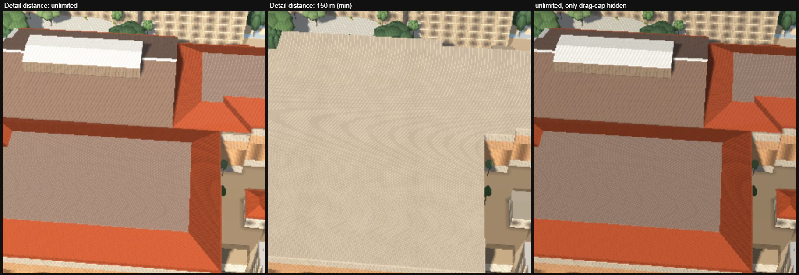
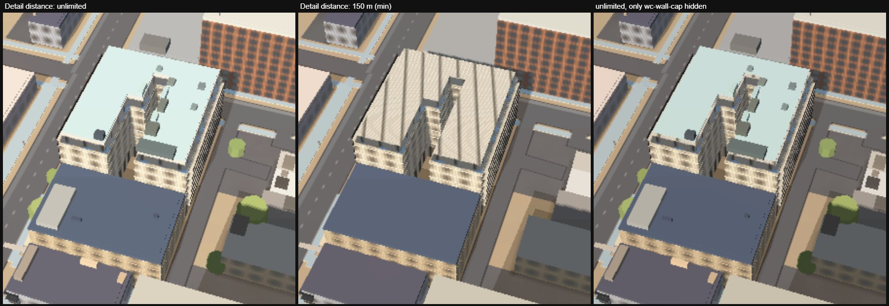
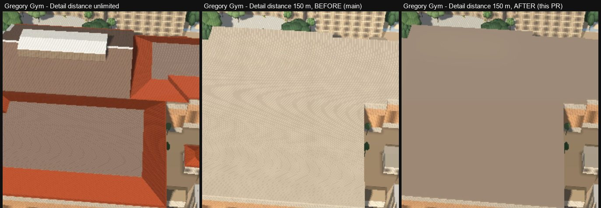
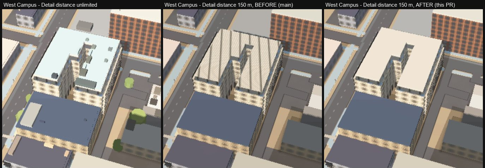
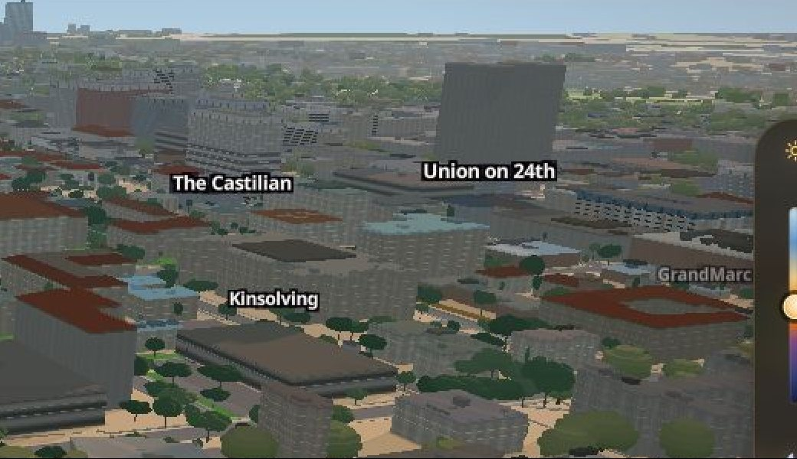

# Render audit — 2026-09-19 (main @ c656249)

Audit lane, branch `acer/render-audit`. Scope: desktop and the phone profile
(`?lite=1`), day / sunset / night, on `main` at c656249 (the citywide
sunlight merge, PR #267), locally and on production
(https://flyover-utx.vercel.app/, read-only).

**Conditions, because they bound every timing here.** One Windows laptop,
headless Chrome on hardware GL (ANGLE / D3D11), with two other lanes'
browsers running for almost the whole audit (the machine-wide cap is three).
No number below is a performance claim. Load times are quoted only to compare
two things measured under the same conditions.

Every result is MEASURED unless it says CODE-READ (derived from the source,
not run) or PROPOSED. The scripts are `scripts/verify/audit-*.mjs`; each prints
its own settings. BEFORE runs serve main's `js/graphics.js` and `js/lod.js`
through `AUDIT_SWAP` (`scripts/verify/audit-lib.mjs`), so before and after come
from one checkout and one server.

## Fixed in this PR (files this lane owns)

### 1. The Detail-distance LOD still turned roofs into window grids — `js/lod.js`

The bug Simeon reported ("when i go up on low detail mode the roofs of houses
become windows") was fixed for `buildings-roof`, `parts-roof` and
`outer-tower-roof`, but three more roof layers were still in the tiers:
`drag-cap` and `wc-wall-cap` (fine tier) and `moody-roof` (mid tier). Each is
the roof of a building whose walls are `fill-extrusion-pattern` bands, and
MapLibre paints the pattern on the top face too. Once both tiers are dropped
(`roofscape-deck` and the pitched roofs go with the mid tier) nothing is left
over those roofs but the wall pattern.

Same camera (170 m up, 40° pitch), same hour; left "unlimited", middle the
slider at its 150 m minimum, right only the cap hidden:

Gregory Gym (`drag-cap`, -97.73634, 30.28410): the tiled roof and the cap both
go and the whole roof becomes the brick-and-window facade tile, with moiré.
West Campus (`wc-wall-cap`, -97.74177, 30.28025): the crown band's roof plane
becomes the striped window pattern. Where it happens in normal use: the fine
tier drops above `renderDistance x 0.45 x 1.08`, the mid tier above
`renderDistance x 1.08`; on `performance` (350 m, the phone default) both are
gone above ~380 m, well under the 900 m ceiling.

Fix: the three roof layers leave the tiers (the drag and West Campus caps, and
the Moody roof whose fascia band covers 17,759 m² while its cap covers only
15,303 m²). The other four layers the same sweep turns up are not this bug:
`tower-detail` is the Tower's "slots, windows, columns, clock" (js/tower.js),
`stadium-detail` and `moody-plant` are rooftop kit, and `arts-cap` sits on
flat colour — `data/arts.geojson` has 79 bands, 77 `solid`, one `panel`, one
`glass`, and **all six capped bands are `solid`**, so dropping the cap shows a
band colour, never a window grid.

AFTER (same script, same pinned targets, `audit-lodcaps.mjs --at`): at the
150 m minimum each roof is now its own flat cap colour — plainer than the
tiled roof, which is what a detail tier is for, but a roof and not a window
grid:

The Moody roof only matters where the authored Moody mesh is off (`?slopes=0`,
`?apartments=0`, the phone's safe profile). Checked there with
`audit-lodcaps.mjs --query "&apartments=0" moody-roof`: BEFORE, at 150 m the
white roof's outer rim is gone and the fascia band's brown top shows round the
lid; AFTER the rim is there as at "unlimited". (Small: ~5% of the crop.)

Also in `js/lod.js` (CODE-READ, low): the hysteresis state was read from the
first id in each tier, which only enters the hidden set once its layer exists,
so until `props-lit` / `trees-canopy` loaded the tier had no hysteresis. It now
keeps its own state per tier.

### 2. On a phone, no Graphics setting ever survived a reload — `js/graphics.js`

`js/mobile.js` writes the phone's default into the URL
(`?lite=1&preset=performance`, via `history.replaceState`, so every reload
carries it). `js/graphics.js` treated any `?preset=` as a capture flag: it
never saves, and it freezes auto-detect. Measured with the real menu
(`audit-settings.mjs` phase B, 390x844 touch, same script both sides):

| | BEFORE (main) | AFTER |
|---|---|---|
| change written to storage | no — `austin3d.gfx.v1` absent; only `flyover.boot` in storage (production too) | yes |
| Brightness 1.20 after reload | 1.03 (reset) | 1.20 |
| Trees 80% after reload | 52% (reset) | 80% |
| Balanced chosen, after reload | performance (reset) | balanced |
| auto-detect frozen as if filming | yes | no |

Fix: on the phone profile the profile's own preset is a DEFAULT — applied only
when the device has saved nothing; the menu saves; what the visitor chose comes
back. Any other `?preset=` is still a capture override, and so is the crash
fallback (`?lite=safe` / the boot counter's safe profile), which stays forced
to `performance`. Reset on a phone returns to the phone default, not
`balanced`. One trade, stated in the code: a hand-typed
`?lite=1&preset=performance` cannot be told apart from the profile's own, so
on a device with saved settings those win (a fresh profile — every harness
context — still gets `performance`).

### 3. Moving any slider rebuilt the city at full density — `js/graphics.js`

`GFX.preset` is read by `js/slopes.js`, `js/slopes-apartments.js` and
`js/roofs.js` as a density key. Any slider or tick box renamed it `'custom'`,
which none of their tables has, so all three fell back to their defaults.
MEASURED BEFORE (phase C, desktop, Performance picked, then Film grain moved to
0.10 — a post-process slider that should change nothing in the geometry):

| | Performance | after moving Film grain |
|---|---|---|
| `GFX.preset` | performance | custom |
| `slopes.detail()` | 0.5 | 1.0 |
| three.js triangles | 1,952,631 | 2,780,333 |
| authored-apartment triangles | 1,849,232 | 2,600,942 |
| apartment sign dots | 0 | 36 |
| JS heap | 688 MB | 886 MB |

Every authored building is dropped and rebuilt at twice the detail (the rebuild
removes the mesh first, so they flash back to their legacy boxes while it
runs). On a phone this is the density the phone profile exists to avoid.
(The geometry numbers repeat exactly run to run; the heap does not — a second
BEFORE run gave 496 MB -> 880 MB with the same triangle counts. Quote the
triangles, not the megabytes.)

Fix: a moved control sets `GFX.custom`; `GFX.preset` keeps naming the preset it
came from, so the density readers keep that preset's density and the menu still
lights no preset. The auto-detect never downgrades a customised set.

Two things about the fix that are worth checking rather than trusting, both
CODE-READ:

*Nobody's scene changes on the upgrade.* A value saved by the old code as
`preset: 'custom'` now restores as `custom: true` on top of `balanced`, and
`balanced` is exactly what the three readers were already falling back to for
an unknown preset name — each one table by table: `slopes.detail()` fallback
1.0 vs `SLOPES.byPreset.balanced` 1.0; `detailNow()` fallback 1.0 vs
`APTS.byPreset.balanced` 1.0; `roofs.detail()` fallback 0.75 vs
`ROOFS.byPreset.balanced` 0.75. Three for three.

*Choosing a real preset still re-densifies.* The rebuild is driven by the name
changing, so it was worth confirming the fix does not switch it off:
`js/slopes.js:1053` compares `GFX.preset` against `_lastPreset` and on a change
calls `applySlopesSettings`, which `js/slopes-apartments.js:2679` has hooked to
also call `applySlopesApartments`, which rebuilds when
`_lastDetail !== detailNow()` (line 2569). `usePreset()` still assigns
`GFX.preset = name`, so that chain fires exactly as before for a preset click
and no longer fires for a slider — which is the whole point.
AFTER, same steps: `GFX.preset` stays `performance` (`custom: true`),
`slopes.detail()` 0.5 -> 0.5, three.js triangles 1,952,631 -> 1,952,631,
apartment triangles 1,849,232 -> 1,849,232, sign dots 0 -> 0.

(A trap this phase fell into first, recorded so nobody repeats it: on a loaded
machine the authored buildings are often dropped for the visit at 90 s — see
backlog item 1 — and `readyToReveal()` is then TRUE with no mesh, so a density
check compares two empty scenes and passes. Two AFTER runs did exactly that
with `aptTriangles: 0`. Phase C now puts the buildings back and asserts they
are there before it measures.)

### 4. "Auto brightness" could be ticked and do nothing — `js/graphics.js`

The meter reads the GL canvas and needs `preserveDrawingBuffer`, fixed at
context creation. `performance` builds the context without it, so ticking Auto
brightness there left the gain at 1.00 with no "Reload to apply" (bloom already
had that prompt). Now either setting asks for the reload. MEASURED (phase D):
context `preserveDrawingBuffer: false`, box ticked, meter idle (gain 1.00, no
reading) in both; "Reload to apply" shown BEFORE: no, AFTER: yes.

Desktop persistence was already right and stays right (phase A, both runs):
all 20 controls survive a reload, every label shows its value, and the render
follows (pixel ratio, field of view, AO and shadow layers, MSAA on the context,
the preserved buffer, grain), for each of the four presets and Reset.

### 5. The LOD's altitude fallback was the slant range, 2.92x too big — `js/lod.js`

`altitude()` prefers `window.__fly.eye().alt` and falls back to
`transform.cameraToCenterDistance / transform.pixelsPerMeter`, under a comment
claiming it is "the same closed form MapLibre uses internally, not an
estimate". It is a closed form for the wrong quantity: that is the distance
from the eye to the look-at point **down the view ray**, not the height above
it. The altitude is that times `cos(pitch)`.

MEASURED (`scripts/verify/audit-camera.mjs`, 16 poses, `jumpTo` then 600 ms,
both numbers read off the same page):

| asked | transform slant | x cos(pitch) | `__fly.eye().alt` | error |
|---|---|---|---|---|
| zoom 17.6, pitch 70 | 245.2 m | 83.86 | 83.9 | −0.04 m |
| zoom 16, pitch 70 | 743.4 m | 254.26 | 254.3 | −0.04 m |
| zoom 14.4, pitch 70 | 2253.6 m | 770.78 | 770.8 | −0.02 m |
| 40 m, pitch 62 | 85.1 m | 39.95 | 40.0 | −0.05 m |
| 640 m, pitch 62 | 1361.7 m | 639.28 | 639.3 | −0.02 m |

Worst error over all 16: **0.06 m**, from 40 m to 900 m and at two pitches. So
`cos(pitch)` is the entire correction, and without it the fallback over-reads
by `1 / cos(70°) = 2.92x` at the pitch the app actually flies at — every tier
dropping at about a third of the altitude it was meant to.

**This is not a defect anyone has seen on the site, and I am not claiming it
is.** `index.html` loads `js/controls.js` (line 211) before the map exists, so
`window.__fly` is always there first and this branch never runs for a visitor.
It runs in harnesses, embeds and any bare-map host — which is exactly where a
2.92x error is hardest to notice. One `Math.cos`, and the comment now says
which quantity it is.

(The same expression is used as an altitude in `js/slopes-stadium.js:417` and
in four verify scripts. Those are other lanes' files: backlog 7.)

### The instrument: `lod-check.mjs` cannot gate this change, so there is a new one

Before trusting any before/after on `js/lod.js` I ran the repo's existing
`scripts/verify/lod-check.mjs` four times, interleaved AFTER / BEFORE / AFTER /
BEFORE on one server in one session. The verdicts do not track the code:

| run | reached | result | FAIL set |
|---|---|---|---|
| AFTER 1 | 814 m | 9/12 | past-render-distance, descent-restores, force-show |
| BEFORE 1 | 268 m | 10/12 | fine-and-mid band, past-render-distance |
| AFTER 2 | 268 m | 10/12 | fine-and-mid band, past-render-distance |
| BEFORE 2 | 814 m | 9/12 | past-render-distance, descent-restores, force-show |

AFTER produced both outcomes and BEFORE produced the same two. What the
verdict tracks is **the altitude the camera happened to reach**: the runs pair
by altitude, not by version. `lod-check.mjs` asks for a ZOOM and reads an
altitude back, and the flight controller re-syncs from the map on idle, so
which altitude a zoom lands on is a race — a 10:48 run reported 116 m for
every zoom in its sweep.

Two things follow. The change in this PR does not move lod-check's verdict
(it produced both of them, on both versions). And lod-check's three FAILs are
not evidence of anything until it is fixed — it is another lane's file, so
backlog 6.

The gate this PR is actually verified against is new and asks for an
**altitude**, inverting the relation measured above:
`scripts/verify/audit-lodtiers.mjs`. It climbs a 15-rung ladder from 60 m to
880 m and descends the same one, prints the altitude it reached beside the one
it asked for, and checks the caps are never dropped, that there is a band where
fine is gone and mid is not, that the descent restores everything, and that the
hysteresis runs in the right direction.

## Backlog, most important first (files other lanes own)

### 1. On this laptop the desktop first load shows NO authored buildings, and never retries — `js/app.js` (intro)

MEASURED, first load, fresh profile, intro on, nothing else driving the page
(`audit-boot.mjs`, `audit-reveal.mjs`):

| | authored buildings at the reveal | triangles |
|---|---|---|
| local desktop `?drift=0` | 51 of 196 | 0 |
| production desktop `?drift=0` | 111 of 196 | 0 |
| local phone `?lite=1` | 196 | 1,849,232 |
| production phone `?lite=1` | 196 | 1,849,232 |

`js/app.js:1945` gives the authored handoff 90 s (`INTRO.authoredCeilingMs`);
past it, it sets `window.APARTMENTS.on = false`, re-applies, logs *"authored
handoff timed out; keeping legacy buildings for this visit"* and never looks
again. The mesh keeps building and finishes: every audit script that turns
`APARTMENTS.on` back on gets the full 1,849,232-triangle scene a short wait
later, from the same page. So the visit that hit the ceiling is the only one
that stays on legacy boxes — the apartments, which are the point of the app,
are silently absent for the whole session.

West Campus on that load: Union on 24th is a plain dark slab, The Castilian and
Kinsolving are legacy prisms, and every authored facade is missing.

Timeline from one fresh desktop load (`audit-reveal.mjs`, 250 ms polling):
`12.06s` slopes layer installed, `100.94s` handoff timed out, `103.21s` veil
gone with 43 buildings and 0 triangles. The desktop is the slow case because
it builds more: the phone profile's own load finished inside the ceiling on
the same machine, twice.

Suspected fix, not attempted (another lane's file): keep polling after the
ceiling and swap the mesh in when `readyToReveal()` turns true, instead of
disabling the replacement for the visit. The ceiling's real job — never hold
the veil — is already done by the veil ceiling above it.

**Caveat, stated plainly:** this laptop ran two or three other lanes' browsers
throughout. A quiet machine may stay inside 90 s. What is NOT
load-dependent is the shape of the failure: a one-shot ceiling with no retry,
on the single feature the app is for.

**It is not a desktop-only failure, and it is not rare.** Four separate audit
scripts, each on its own fresh load, logged *"authored handoff timed out"* and
had to switch the buildings back on before they could measure anything:
`audit-motion.mjs --tests ae` (desktop, ready 190 s), `audit-dupes.mjs`
(desktop), `audit-dupes-control.mjs` (desktop) and — the one that corrects the
table above — `audit-motion.mjs --lite` (**the phone profile**, ready 156 s,
and then all 196 buildings and 1,849,232 triangles arrived exactly as on any
other run). The earlier phone rows in the table were loads that happened to
come in under the ceiling; they are not a property of the profile. Whichever
profile you are on, the mesh finishes — the ceiling just stops the app from
ever looking again.

### 2. A phone that never crashed can be given the crash profile — `js/mobile.js`

MEASURED (`audit-settings.mjs` phase B, 390x844 touch, both BEFORE and AFTER
runs): after the city is up and the veil is gone, `localStorage['flyover.boot']`
is still `"1"`.

`js/mobile.js:157-166` clears the counter when it sees the veil "gone" —
`v.classList.contains('gone')`, `display:none`, or `opacity: 0`. The app does
none of those: `js/app.js:1925-1929` adds the class `lift` and then REMOVES the
element (`transitionend`, with a 2.6 s fallback). Once it is removed the
watcher's `if (!v) return` runs forever, so the only thing that ever clears the
counter is the belt-and-braces `setTimeout(clear, 120000)`.

Consequence: a phone visitor who closes or navigates away inside two minutes —
a completely ordinary visit — leaves the counter at 1. Two of those in a row and
the third load gets `LITE.safeProfile`: `?lite=safe`, `slopes=0`, no authored
buildings, on a device that has never once crashed. Suspected fix: treat "the
element existed and is now gone" as the signal, or clear on the app's own
reveal.

### 3. 280 window bands are dropped across the authored corpus — the apartment data + `js/slopes-apartments.js`

MEASURED: one fresh load logs **280** `... that storey's windows are DROPPED;
start the band at the floor line or within APARTMENTS.floorSlack of it`
warnings (and 109 of the benign "kept and clipped" kind), over 186 parts of
168 distinct authored buildings. The rule is `APARTMENTS.floorSlack = 1 m`: a band
whose `z0` sits more than a metre above the storey's floor line loses that
storey's windows entirely, and the wall goes blank there. Examples from the log:
`podium|v0 spandrelBand` 2.73 m above the floor line, `main|4 wall` 4.50 m,
`21st-pedestrian-bridge|v0 dark` 2.85 m.

It is a data-authoring defect, not a renderer one, and it is invisible unless
you read the console — which is why it is here with a number on it. Each one is
a blank stripe on a building someone authored by hand.

### 4. Every shadow in the city goes out a quarter of a degree before sunset — `js/slopes.js` shadows (Codex's lighting)

MEASURED (`audit-motion.mjs --tests sunset`, low flight over West Campus,
authored buildings in the scene, 1280x800, hardware GL). Two passes over the
same ten times of day, shadows on then off; city luma is the mean over the
bottom 65% of the frame, and Δ is the mean absolute pixel change against the
previous step:

| sun elevation | luma, shadows ON | Δ | luma, shadows OFF | Δ |
|---|---|---|---|---|
| +0.95° | 89.14 | 7.2 | 95.73 | 6.6 |
| +0.35° | 87.48 | 2.6 | 91.65 | 4.7 |
| **+0.10°** | **99.84** | **17.7 (15% of pixels)** | 92.14 | 3.1 |
| 0.00° | 100.74 | 1.5 | 91.36 | 0.7 |
| −0.10° | 98.13 | 3.2 | 90.37 | 1.4 |

One notch of the time slider (0.0025 of its range) brightens the city by 14%
with shadows on, and by 0.5% with them off. It is not the sun-presence ramp:
`js/slopes.js:1076` smoothsteps presence from −6° to 0°, so it is pinned at 1
across this whole step, and `shadowMaps` stays 2 throughout.

**The mechanism, measured rather than guessed** (`audit-motion.mjs --tests
lowsun`, same pose, twelve elevations, each one A/B'd against
`GFX.shadows = false` so the shadows' own share of the frame is the reading):

| sun elevation | frame that is shadow | mean shadow depth | luma on | luma off |
|---|---|---|---|---|
| +0.95° | 19.3% | 19.14 | 79.59 | 94.38 |
| +0.35° | 19.4% | 19.35 | 78.58 | 93.35 |
| +0.25° | 19.4% | 19.28 | 78.66 | 93.36 |
| **+0.15°** | **19.4%** | **19.22** | **78.75** | 93.32 |
| **+0.10°** | **3.8%** | **0.78** | **90.52** | 91.51 |
| +0.05° | 3.8% | 0.76 | 89.61 | 90.59 |
| 0.00° | 0.0% | 0.00 | 90.51 | 90.51 |

Between +0.15° and +0.10° the shadows **go out**: the share of the frame they
are worth falls from 19.4% to 3.8% and their mean depth from 19.2 to 0.78 — a
25x collapse across one notch — and the city jumps 78.75 → 90.52 because it is
simply no longer shaded. There is no ramp; it is a cliff five hundredths of a
degree wide, and the sun is still above the horizon when it happens. The step
Simeon would see is not a brightening, it is every shadow in the city
disappearing at once, a quarter of a degree early.

**Not for this PR.** Lighting is Codex's, and the owner likes the current
sunlight. What is wanted here is the owner's eye on a real defect, not a tune —
and the number to hand him is that the shadows quit at +0.15°, not at 0°.

### 5. The glass mask is not a mask: three quarters of every facade tile is partly mirror — `js/facades.js` + `js/city-lighting.js`

The convention is stated in `js/city-lighting.js:82`: *"Opaque facade atlases
reserve alpha 191 for glass"*, and the shader reads
`glass = clamp((1 - a) * 255/64, 0, 1)` — 255 is wall, 191 or below is full
glass, and **everything in between is partial glass**.

MEASURED over the 216 facade-atlas images the style holds
(`audit-glass.mjs`, families from `js/facades.js`: `lo mr mh tr tg dk st`):

| family | images | texels with alpha < 250 | of that glass, texels the tile's own WALL colour | texels whose alpha is neither 191 nor 255 |
|---|---|---|---|---|
| `tg` glass towers | 46 | 99.2% | 0.0% | 99.1% |
| `tr` towers | 36 | 79.6% | 2.5% | 93.0% |
| `mh` mid-high | 88 | 75.4% | 4.3% | 93.0% |
| `mr` mid-rise | 26 | 77.7% | **13.7%** (worst tile 46.8%) | 93.2% |
| `lo` low-rise | 20 | 23.8% | **14.2%** | 32.9% |
| all 216 | | 76.7% | 5.1% | 88.7% |

Two of those columns are by design and one is not. The graded alpha is
deliberate — `js/pattern-lowpass.js` says so in its own header ("Alpha is
filtered too: opaque facade atlases carry their glass mask in alpha") and
`decimate()` in `js/facades.js` averages alpha with the colour when it builds
each mip tier, which is what a soft mask means. The third column is the
consequence nobody chose: blurring the mask pulls the alpha of the MASONRY next
to every window below 255 while its colour stays masonry, so a halo of brick
around each window reflects the sky. On the mid-rise family that is a seventh
of all the glass in the tile, and on `mr12` nearly half of it.

Worth the owner's eye rather than a fix from this lane: the number to argue
about is the blur radius per family (`SOFTEN.RADIUS`), not the shader.

### 6. `scripts/verify/lod-check.mjs` returns a different verdict each run — the verify suite

Evidence and the four-run table are under "The instrument" above. It asks the
map for a zoom and reads an altitude back, and the flight controller's idle
re-sync makes that a race: three FAIL sets over four interleaved runs of
unchanged code, and one earlier run that reported 116 m for every zoom in its
sweep. Suspected fix: ask for an altitude and invert to a zoom, as
`audit-lodtiers.mjs` and `audit-motion.mjs` do, and assert the pose was reached
before judging anything about it.

### 7. The same slant-range-as-altitude mistake is in four other places

`transform.cameraToCenterDistance / transform.pixelsPerMeter` is used as an
altitude in `js/slopes-stadium.js:417`, `scripts/verify/lod-check.mjs:59`,
`scripts/verify/field-bleed.mjs:297`, `scripts/verify/_o4-fieldframe.mjs:133`
and as the fallback half of `scripts/verify/slopes-layer.mjs:600`. Fixed in
`js/lod.js` above (this lane owns it); the rest are other lanes'. The
correction is `x cos(pitch)` and it is worth 2.92x at the app's usual 70°.
`js/slopes-stadium.js` is the Mac lane's, so flagging only.

### 8. A parked camera is not perfectly still above street level — the tree layers

MEASURED (`audit-motion.mjs --tests zfight`): camera parked, film grain off,
six frames 250 ms apart, consecutive pairs diffed.

| pose | changed | mean | max | blobs | largest blob |
|---|---|---|---|---|---|
| flying (160 m) | 4.49% | 1.76 | 177 | 461 | 16,053 px |
| low (55 m) | 2.51% | 1.15 | 128 | 333 | 15,599 px |
| street (14 m) | 0.00% | 0 | 0 | — | — |
| phone, flying | 2.43% | 1.61 | 158 | 91 | 11,035 px |

**This is not z-fighting, and the shape of the diff is how I know.** Depth
fighting is a fine stipple over a whole surface — thousands of one- and
two-pixel specks, no big blob. This is three to five large sparse regions: the
top blob alone holds 35–61% of every changed pixel, at 11–49% fill inside its
own bounding box. Sampling the scene under those blobs gives `#79746c`,
`#68563e`, `#514830`, `#4e593f`, `#333d24` — canopy greens and trunk browns,
in the lower half of the frame. (For contrast, the cascade re-snap diff in the
next section IS a stipple: 16,158 blobs, 72% of them ≤2 px, largest one 1.2%.)

So: something in the tree layers changes while nothing moves, above street
level only, on both profiles. Two candidates I did not separate — a canopy
sway animation, or tree tiles still streaming 3 s after the jump. Street level
being exactly zero argues for streaming rather than animation (a sway would be
biggest where the trees are biggest). Low priority, and it needs one more test,
not a fix.

## Checked and clean

**The two-cascade shadows do not show a seam while you travel, but they do
shimmer.** 360 frames straight ahead at 1.2 m per frame at the low pose, 432 m
of travel, recorded as a screencast of the composited page
(`audit-motion.mjs --tests shadow`, `shadowSize` 1536, `shadowMaps` 2 the whole
way):

- **No seam.** Nothing in any diff has the structure of a line or a ring at a
  cascade boundary.
- **Frame to frame the travel is smooth**: median consecutive-frame change
  14.8, and only **3 frames out of 363** exceeded 2.5x that. None of the three
  lands on a shadow re-render.
- **What does change is every shadow edge at once, every ~5 m.** Re-snapping
  the near cascade to a different grid (which is what travel does) moves 5.7%
  of the pixels at the flying pose with a peak channel delta of 90 — and the
  diff is 16,158 blobs, 72% of them one or two pixels, largest 1.2%. That is
  texel-level shadow-edge jitter spread over the frame, not a pop. The travel
  run re-rendered the shadow map **82 times over 432 m, one per 5.3 m**, where
  the 20 m snap grid is crossed about 30 times.

One honest limit on the other two shadow A/Bs. Widening a cascade's radius to
find out what it covers also spreads the same 1536² texels over a bigger area,
so those diffs (near cascade 7.4/12.4/3.9% at the three poses, far cutoff
7.0/0.8/0.01%) mix "shadows that appear or vanish" with "shadows that get
blurrier", and I cannot separate the two from the numbers I have. **I am not
claiming a far-cutoff defect from them** — only that the near cascade is doing
real work at every pose, which is what having two of them is for.

**Nothing is drawn twice: one legacy prism inside 196 authored footprints, and
it is buried.** `audit-dupes.mjs` looks straight down at every authored
building (pitch 0 is the only angle at which `queryRenderedFeatures` answers
for a fill-extrusion) and asks all **55** building-like fill-extrusion layers
what they drew at a 5x5 grid inside the footprint, inset 1.5 m from the edge,
at zoom 18 and again at zoom 16. 196 footprints, 196 built, 2,915 probe points
per zoom.

| layer answering inside an authored footprint | z18 | z16 |
|---|---|---|
| `roofscape-deck` / `-major` / `-minor` | 59 / 37 / 29 | 0 |
| `drag-detail` | 9 | 9 |
| `places-pool` | 2 | 2 |
| **`buildings-3d`** | **1** | 0 |
| every other of the 55, incl. `outer-3d`, `outer-tower`, `parts-3d` | 0 | 0 |

The roofscape and `drag-detail` rows are the rooftop kit and the Drag's
shopfront detail — they are *meant* to sit on top of an authored building, not
duplicates of it. (They vanish at z16 because they are LOD tier members and the
camera is higher there: the tiers working, not features disappearing.)

The one real find is a **single** legacy extrusion: `buildings-3d` feature
`e88d1314`, **"Longhorn Dining Facility"**, h 29.2 m, answering at 1 of the 11
probe points inside **Jester East Hall**'s authored footprint. It is a
separate OSM polygon that the authored building's `hideRings` does not cover,
so the old prism is still drawn where the new mesh stands.

**The instrument had to be re-proved before this negative could be believed.**
`audit-dupes.mjs`'s own control — one point on an ordinary building, which must
hit or the probe is blind — came back `[]`. A negative from an instrument that
failed its own control is worth nothing, so `audit-dupes-control.mjs` re-runs
it against six ordinary campus buildings with a 3x3 tap each (so a point that
lands in a light well cannot be mistaken for blindness), then re-probes Jester
East and photographs it with the authored mesh on and off.

**Crossing a LOD threshold during a climb does not pop.** A scripted vertical
climb, 528 frames, `renderDistance` 700 (thresholds 315 m fine / 700 m mid,
±8%). Both tiers toggled where they should, and neither is visible against the
motion already on screen:

| tier toggled | altitude | frame change | the frame before it | median for the climb |
|---|---|---|---|---|
| fine (13 layers hidden) | 343.1 m | 13.57 | 13.50 | 11.92 |
| mid (20 hidden) | 768.5 m | 17.42 | 13.73 | 11.92 |

The fine tier's switch is indistinguishable from the frame before it; the mid
tier's is 27% above it and still well under the 2.5x bar this suite calls a
spike. The only two spikes in the climb (73.9 and 43.9) are at frames 8 and 13,
at 40 m, with nothing hidden — the start of the move, not a tier.

**Production is the commit it claims to be, and it loads clean.** All 140
same-origin paths the first load asks for were fetched from
https://flyover-utx.vercel.app and compared byte for byte against `main`'s
blobs at c656249: **140 identical, 0 different, 0 missing**, every one served
`cache-control: public, max-age=0, must-revalidate`.

**No asset failures and no console errors, on either build or either profile.**
Four first loads (local and production × desktop and `?lite=1`), recorded from
navigation to two frames after the veil:

| | requests | statuses | console errors | uncaught page errors |
|---|---|---|---|---|
| local desktop | 324 | 179×200, 143×206 | 0 | 0 |
| local phone | 285 | 173×200, 111×206 | 0 | 0 |
| production desktop | 363 | 183×200, 161×206 | 0 | 0 |
| production phone | 262 | 172×200, 87×206 | 0 | 0 |

No 4xx and no 5xx anywhere. The remaining entries are `net::ERR_ABORTED` on
pmtiles range requests (2, 1, 18 and 3 of them) and they are the harness
closing the page: every one starts inside the last two seconds of the capture,
after the veil had lifted, except the `HEAD /data/tiles/trees.pmtiles` probe at
~1.2 s that the pmtiles client aborts on every load, on both builds. The
request path sets match between local and production (167 vs 168 distinct paths
on desktop, 161 vs 162 on the phone); the extras are MapLibre's own `blob:`
worker URL and one more basemap tile. Local is larger over the wire (35.0 MB vs
10.9 MB desktop) because `scripts/serve.py` does not compress and Vercel does.

**Every desktop graphics control persists, reads back and renders.** 83
assertions in `audit-settings.mjs` phase A, which drives the real menu: each of
the 20 controls writes its `GFX` key, the menu shows the value in its label,
and the change survives a reload — for the four presets and Reset, with the
rendering checked behind it (device pixel ratio, field of view, the AO and
shadow layers, MSAA on the context, `preserveDrawingBuffer`, grain).

**Auto-exposure does not pump while you fly.** A 360° yaw at golden hour over
the campus (540 scripted frames, recorded as a screencast of the composited
page), run three times interleaved — auto-exposure on, off, on:

| | gain range | direction reversals | gain drift while parked, 60 frames | frame luma SD |
|---|---|---|---|---|
| on | 1.000 – 1.110 | 0 | 0.012 | 6.83 |
| off | fixed 1.000 | 0 | 0 | 7.55 |
| on (again) | 1.002 – 1.019 | 0 | 0.006 | 7.23 |

No reversal in 1,644 frames, and the gain holds still when the camera does. The
frame-to-frame luminance spread with the meter on (6.83, then 7.23) is not
distinguishable from with it off (7.55) — two runs of the same setting differ
by nearly as much — so this says the meter is stable, not that it helps.

**The console warnings, since a boot with none would be worth knowing about:**
83 on a local desktop load, 152 on production, 420 on the phone profile. They
are three families — MapLibre's `Expected value to be of type number, but found
null instead.` (8 on production desktop), THREE's `X3595 gradient instruction
used in a loop` shader warning (2), and the `[slopes-apartments]` band warnings
of backlog 3. Nothing else, and no errors.

## Architecture, noticed in passing (no defect measured, no change made)

- **The shadow proxy is rebuilt after every camera stop.**
  `js/city-lighting.js:122` marks the proxy dirty on `moveend` (and on
  `sourcedata` for three sources), then 300 ms later re-queries
  `austin-outer`, `austin-parts` and `austin-stadium` and re-triangulates every
  footprint into one mesh — 260,343 triangles on this build. Nothing about a
  pan changes those footprints; only new tiles do, and `sourcedata` already
  covers that. The `moveend` trigger looks like it is there for
  `querySourceFeatures`, which only returns what is currently loaded — worth a
  cheaper invalidation (a tile-key set) than a full rebuild per gesture.
- **Every slider input writes localStorage.** `applyGraphics()` ends in
  `save()`, and a range input fires on every pixel of a drag, so a two-second
  drag of Brightness serialises the whole settings object dozens of times. A
  trailing debounce on `save()` alone (not on `applyGraphics`) would keep the
  live preview and stop the writes.
- **`GFX.preset` is three things at once**: the menu's highlight, the density
  key three other files read, and the saved value. This PR splits the first two
  with `GFX.custom`; the honest fix is a named `density` field the renderers
  read, so a future preset cannot silently change geometry by being absent from
  a `byPreset` table.
- ~~**`js/lod.js` reads altitude from `window.__fly`** … the two agree while
  the controller is syncing from the map.~~ **Withdrawn — I measured it and it
  was wrong.** They did not agree: the fallback was the slant range and read
  2.92x high at the app's usual pitch. Fixed, with the measurement, under
  "Fixed in this PR" 5. Left here struck through rather than deleted because
  it is a good example of the failure this audit kept finding in its own work:
  it was a CODE-READ claim about two numbers, written without ever printing
  them side by side. `audit-camera.mjs` printed them and the claim died in one
  run.
