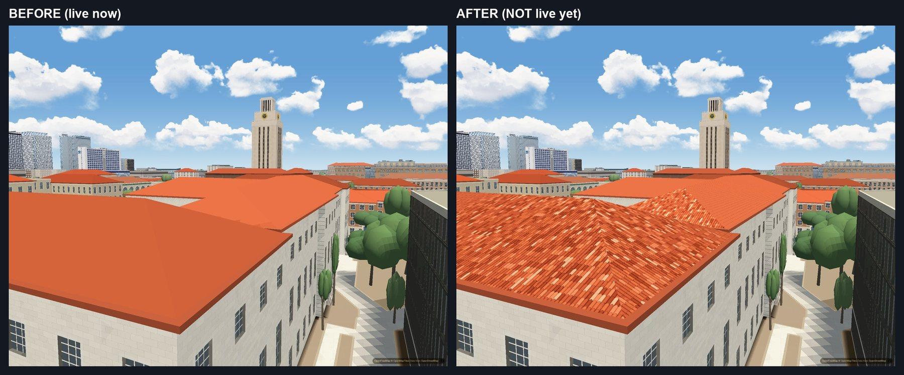

# Campus clay roof material

Status: candidate under visual review. Passing numerical checks is not photo acceptance.

The existing pitched roof faces carry a repeated clay barrel pattern. Columns
follow the fall line. Curved course lips, narrow valleys, clay variation and
short pale runs are evaluated in the fragment shader. No tile geometry or image
texture is generated. The existing surface attribute selects this material.

`js/slopes-roofs.js` owns every appearance parameter in `SLOPES_ROOFS.tiles`.
`js/wall-patterns.js` supplies `RoofTiles` in the already loaded material module.
`js/slopes.js` attaches its uniforms and applies it before city lighting.
No extra script, resource request, data change or bake is needed.

## Selection

The draw-side selector requires a named roof inside the campus bounds, a clay
hue/saturation/value, and a pitched face. Flat entries and faces outside the
slope range are excluded. Exact-name allow entries override the colour test;
deny entries win. Neither overrides the campus bounds or flat-roof exclusion.
Unknown ownership is excluded by default. The Main Building extra is explicitly
included; non-campus extra emit callers are not opted in. Selection changes require
`slopesRoofs.rebuild()`; material parameters update live.

The loaded roof rig currently contains 39 eligible entries, plus the three
Main Building extras. Authored replacements remove additional source entries.
The `authoredCampus` parameter opts their known campus roof callers into the
same rule. A live inventory confirms twenty replacement blocks and the three
Main Building wings. Source entries are not counts of rendered roofs.
The complete scene retains its original triangle and attribute/index byte counts.

## Appearance contract

The provisional cell is 0.25 m across the slope by 0.45 m down it. These metric
sizes are estimates; the reference photographs establish projected repetition,
not a calibrated metric measurement. Five weighted clay tones are normalized
around the roof's existing colour. Cream occupies 6.25 percent of tile choices.
Most pale tiles stand alone. `paleGrouped` sends 30 percent of pale decisions
to a group of two or three courses along a column. The first pass used 65
percent; beside the reference photograph that drew long pale streaks where the
photograph shows single pale tiles and a few pairs. The share is still an
estimate by eye, not a measured distribution.

Clay colour integrates the constant tile cells over the pixel footprint.
Three fades return the roof to its original colour before a tile is too small
to draw:

- `clayFilter` fades the tile colours by projected tile area: full at 33
  pixels per tile, gone at 11.
- `axisFilter` fades them when one axis alone falls from three pixels per
  tile to two.
- `filter` fades the valleys and course lips, each on its own axis: full at
  six pixels per column or course, gone near three.

The first pass kept tile colours down to under two pixels per tile. A tile that
small is not a tile on screen, it is grain: every pixel takes a different
random clay tone, and the grain crawls when the camera moves. The fades above
end before that. A foreshortened hip still keeps its column lines while they
cover several pixels. Fully filtered pixels use exactly the original roof
colour. `perScreenPixel` (off) measures the same fades in screen pixels instead
of device pixels; a phone then fades tiles at the same apparent size as a
desktop, which is calmer and shows fewer tiles.

Day, golden and night contrast are separate parameters; the material adds no
emission. `meanFrom: 'photo'` opts into a different mean and is off by default.
It is not calibrated: under the app's daylight it renders a bright yellow
orange, not the brown clay of the photograph. Do not present it as a match.

`caps` and `eave` are optional face shading only, both off by default. They cannot
create raised cap geometry, a scalloped silhouette, a gutter volume or brackets.
The existing rejected ridge/hip line switch remains off and unchanged.

## Verification

Authored campus replacements use the same emitter and pattern. The
`authoredCampus` ownership list admits their building names with block suffixes;
the colour, campus bounds and face-slope tests still apply. Apartment callers
remain outside this opt-in. The ownership list is an explicit parameter.

Run `scripts/verify/roof-tiles.mjs` through the GPU queue with `VERIFY_URL` set.
Use `--baseline <scratch>` on the unchanged implementation, or supply saved
unchanged modules with `--legacy <scratch>`. Then use `--out <scratch>` and
`--against <baseline>` for the candidate. The baseline intentionally fails the
tile-period assertion because the original material has no tile pattern.

The instrument renders the actual production mesh and shared material into a
temporary orthographic target. It measures column repetition, far mean,
feature-off pixel identity, named non-tile and apartment controls, roof triangles,
buffer bytes, resource requests and disabled ridge/hip lines. Test render targets
are disposed and are not application allocations. Application camera pairs,
motion checks and interleaved hardware timings are also required before release.

The production gate passes all sixteen checks with the fades above.

Flicker was measured as the mean brightness change on clay roofs for a camera
turn of 0.015 degrees (under one pixel), one page load, hardware GL. Phone
profile, 390 x 844 at 0.75 render scale; desktop 1600 x 1000. Lower is calmer;
"plain" is the roof with the material off.

| view | plain | first pass | now |
|---|---|---|---|
| phone, zoom 16.6 | 0.11 | 0.80 | 0.11 |
| phone, zoom 18 | 0.08 | 2.58 | 1.59 |
| phone, zoom 18.7 | 0.04 | 1.87 | 0.86 |
| phone, zoom 19.4 | 0.02 | 2.05 | 1.13 |
| desktop, zoom 18 | 0.12 | 2.92 | 0.29 |
| desktop, zoom 18.7 | 0.07 | 2.97 | 0.75 |
| desktop, zoom 19.4 | 0.03 | 2.56 | 0.87 |

The number mixes two things: grain, which is a defect, and the honest movement
of tiles that are large enough to see. At pitch 60 one frame holds near and far
roofs together, so a view never reaches the plain value while near roofs show
tiles. The far phone view is equal to plain. It is one sample per view, not a
minimum of repeats, and it is not a test on a real phone.

No photograph pair from a matched camera exists: the reference viewpoint falls
inside a building model. The comparison with the photograph is by pattern only.
The optional photo mean and edge treatments remain off.
The full layer integration suite (`scripts/verify/slopes-layer.mjs`) gives no
verdict today: it stops with an uncaught error in its apartment section before
it prints a line. It stops at the same place with the roof code from before
this material, so the stop is not from the tiles, and the dedicated material
gate does not establish that broader result.

### Frame cost

The material is a live switch (`SLOPES_ROOFS.tiles.on`), so both states were
timed in ONE page at the same camera: each timed frame is a synchronous redraw
followed by a one-pixel read, 12 rounds of 15 frames, the two states in
alternating order. The figure is the median of the per-round differences.

| screen | graphics | frame | tiles on, difference | rounds slower |
|---|---|---|---|---|
| desktop 1280 x 680 at 1.5 | graphics card (RTX 3050 Ti) | 21 ms | -0.4 to +0.8 ms | 4 to 7 of 12 |
| phone profile 390 x 844 at 0.75 scale | graphics card (RTX 3050 Ti) | 15 to 18 ms | +0.1 ms | 6 to 8 of 12 |
| desktop 1280 x 680 at 1.5 | built-in chip (AMD Radeon) | 29 to 35 ms | +0.1 to +0.3 ms | 7 to 8 of 12 |
| phone profile 390 x 844 at 0.75 scale | built-in chip (AMD Radeon) | 28 to 31 ms | +0.1 to +0.5 ms | 6 to 9 of 12 |

Three close views (zoom 18, 19 and 19.4), the range of the flicker table, where
the tiles show. On the graphics card the difference is inside the noise. On the built-in
chip it is at most half a millisecond in a 30 ms frame. This is a laptop with
a phone-sized canvas, not a phone: no real phone was timed.
