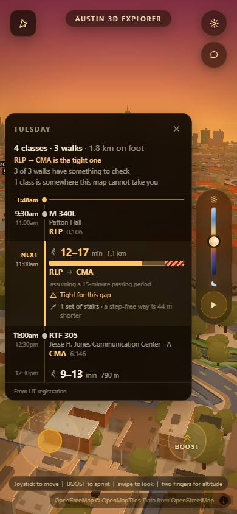
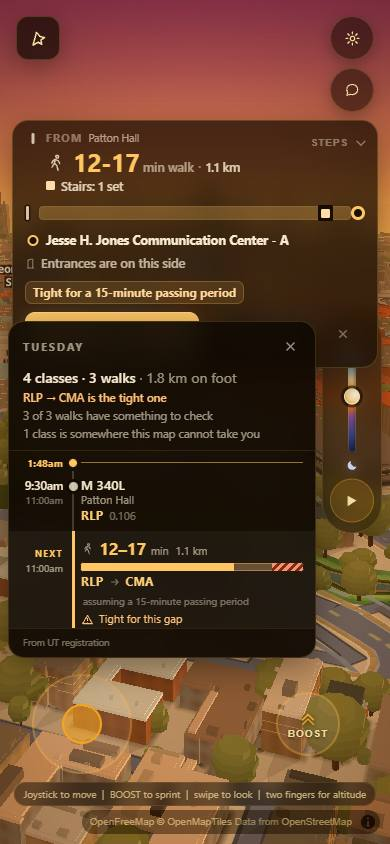
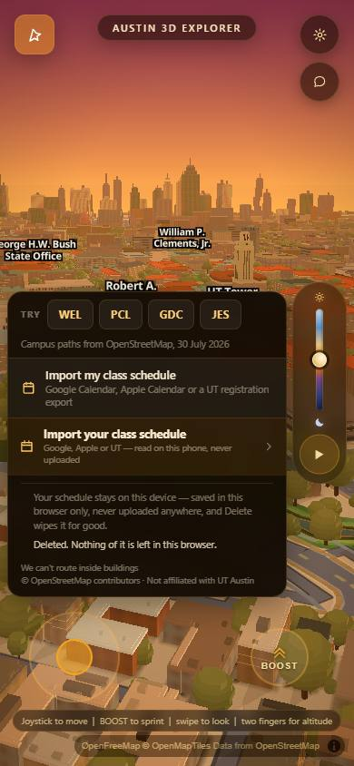
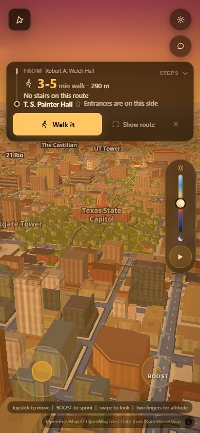

# The five schedule-import lanes, merged and driven end to end

`acer/si-combined`, cut from `origin/main` at `ed74cc3` and merged in the order
`si-gaps` → `si-dayview` → `si-parser` → `si-ui` → `si-privacy`.

Every one of the five won a blind comparison against a real bar, each confirmed
by a fresh-context critic. All five were verified **in isolation**. Nobody had
ever imported a schedule, seen the day view, clicked into a leg and watched it
route on one tree. This is that run.

---

## The answer, first

**No. Do not ship this tree yet.**

The merge itself is clean — every line of all five branches is present, the file
parses, the city renders, the existing walk feature is untouched, and every
number the round has been measured on reproduces exactly. **The code merged. The
feature did not.**

Four of the five lanes each wrote a seam for the next lane to plug into, and
wrote it against an API that did not exist yet. When the real APIs arrived they
had different shapes, and nothing in any one lane's own gate could see that,
because each gate only ever ran one lane. So on the merged tree:

- the import screen **never calls the parser** it was built to call, and quietly
  loses classes because of it;
- the day view **cannot read** the schedule the import screen publishes;
- **nothing is ever saved**, so Delete has nothing to delete and a reload loses
  your import;
- the sheet grows **two buttons that both say "import your class schedule"**, and
  on a phone the second one and the whole footer fall off the bottom.

None of this is a lane doing bad work. It is four lanes doing good work against
four guesses about each other, which is exactly the failure a first integration
pass exists to find. Every defect below is small and local. The list is the
next piece of work, and it should go through the same bar the five did.

**39 gates pass, 11 fail.** `node scripts/verify/si-integration.mjs 8971`.

---

## What it looks like

The sheet a student actually sees on a phone, on the merged tree:


Two rows, from two lanes, saying almost the same sentence — **"Import my class
schedule"** (the day-view lane's) and **"Import your class schedule"** (the
import-screen lane's). The first one opens a hard-coded demo. The second one is
the real thing. The second one's own subtitle is cut off mid-word, and below it,
off the bottom of the sheet, are the privacy line, the **Delete my schedule**
button and the OpenStreetMap credit.

Measured rather than guessed: the sheet is **337 px** tall with **494 px** of
content and `overflow-y: hidden`, so **157 px is unreachable**. With this round's
three additions removed in the page, the same content is **279 px** and fits.
The fold is this round's doing.

That matters more than it looks: `si-privacy` spent eight rounds proving the
schedule never leaves the device, and the sentence that tells the student so —
along with the button that deletes it — is the part that falls off the screen.

The import screen itself is excellent, and the off-map case is the best thing in
this round:


The day view, fed a schedule in the shape it does accept:



and one leg clicked, routing through the answer bar that already shipped:



---

## The merge

### Conflicts, and how each was resolved

Four of the five branches insert a whole new section into `js/wayfind.js` at the
same anchor — immediately before `function boot()` at the end of the file — so
every conflict was the same shape: two complete, independent sections both
claiming one insertion point. **In every case the resolution was to keep both, in
merge order, and no line of any branch was dropped.** That claim is checked, not
asserted: see "Nothing was lost" below.

| # | Merge | File | What conflicted | Resolution |
|---|---|---|---|---|
| 1 | `si-gaps` | `docs/walk-progress.md` | two appended log entries | both kept, ours then theirs |
| 1 | `si-gaps` | `js/wayfind.js` | — | auto-merged clean (its six hunks are all mid-file, none at the tail anchor) |
| 2 | `si-dayview` | `docs/walk-progress.md` | appended entries | both kept |
| 2 | `si-dayview` | `js/wayfind.js` | — | auto-merged clean |
| 3 | `si-parser` | `js/wayfind.js` | §10 THE DAY PLAN vs §14 SCHEDULE IMPORT, same anchor | both kept; git had matched the shared `// ═══` banner line as context, so one banner line was re-added ahead of the parser's section header |
| 4 | `si-ui` | `js/wayfind.js` | §14 vs §9 THE SCHEDULE IMPORT, same anchor | both kept; here the shared **trailing** context was a `  };` that closes the last statement of whichever side comes last, so the resolution also gives our side back its own `};` before the banner |
| 5 | `si-privacy` | `js/wayfind.js` | §12 THE SCHEDULE STAYS ON THE DEVICE, same anchor, split into **two** conflict hunks | reconstructed by hand rather than by editing git's output — see below |
| 5 | `si-privacy` | `index.html` | — | auto-merged clean (adds `<template id="wf-privacy-copy">`) |

**Why the privacy merge was reconstructed rather than resolved in place.** Git
split it into two hunks because four lines happened to be identical in both
sections (`    return null;` / `  }` / blank / `  /**`). Resolving that as written
would have silently given those four lines to one side and taken them from the
other. So instead the privacy block was taken verbatim from
`origin/acer/si-privacy` (its own diff against main is exactly
`@@ -8201,0 +8202,1834 @@`, one contiguous run) and inserted before the single
`  function boot() {` in the already-merged file. The result is byte-identical to
"keep both", and it is provable rather than eyeballed.

### The CRLF landmine — root-caused

The brief warned that `js/wayfind.js` can present a ~19,932-line whole-file diff.
It happened, on the privacy merge: `git diff --cached --stat` reported **14,519
insertions / 12,685 deletions** on a change that was really 1,834 lines.

The cause is not `core.autocrlf` on its own. It is this, in the privacy
section's `addForm()`:

```js
const k = tok + '<a raw 0x00 byte, between the quotes>' + s;
```

One literal NUL character, used as a separator in a dedup key. Valid JavaScript,
and it works — but **git classifies a file containing a NUL as binary, and binary
files are exempt from `core.autocrlf` normalisation.** So for that one file the
CRLF↔LF round trip stopped happening, the CRLF working copy was stored verbatim,
and every line read as changed. It also makes `grep` refuse the file
(`Binary file js/wayfind.js matches`), which is how it was found.

Fixed by replacing the raw byte with its escape:

```js
const k = tok + '\u0000' + s;   // js/wayfind.js:13258
```

The string value is identical (`'a' + '\u0000' + 'b' === 'a' + String.fromCharCode(0) + 'b'`
→ `true`), the file is text again, and the same commit's diff went to a clean
**1,834 insertions, 0 deletions**. This is the only line of any branch's code
that was altered during the merge, and it is the only sensible place to alter it:
a source file with a raw NUL in it defeats git, grep and every editor that reads
it, and it has now cost this workflow one documented incident.

### Nothing was lost

`git diff` against each branch's own merge base, line by line, into the merged
file:

```
acer/si-gaps        added   307 lines to js/wayfind.js   lines not in HEAD: 0
acer/si-dayview     added  1546 lines                    lines not in HEAD: 0
acer/si-parser      added  1351 lines                    lines not in HEAD: 0
acer/si-ui          added  1243 lines                    lines not in HEAD: 0
acer/si-privacy     added  1834 lines                    lines not in HEAD: 1
                                                         (the NUL line, above)
```

And the thing that would have been silent if it had gone wrong — two lanes
declaring the same name in the one IIFE scope these five sections share:

```
top-level declaration collisions between any two lanes, or with main:  none
window.* assignment collisions between any two lanes, or with main:    none
duplicate top-level declarations anywhere in the merged file:          none
duplicate window.* assignments anywhere in the merged file:            none
```

(60 / 42 / 42 / 37 / 7 new top-level declarations and 6 / 6 / 5 / 4 / 1 new
`window.*` names across privacy / parser / ui / dayview / gaps, all distinct.
`node --check js/wayfind.js` passes.)

---

## The eleven failures, in order of how much they cost a student

### 1. The import screen never calls the parser. `js/wayfind.js:11886`

`si-ui` wrote its seam to `si-parser` like this, months before `si-parser`
existed:

```js
function impRawRows(text, sourceId) {
  if (typeof window.wayfindParseSchedule === 'function') {
    try {
      const r = window.wayfindParseSchedule(text, { source: sourceId });
      if (Array.isArray(r) && r.length) return r;      // <- never true
    } catch (e) { /* fall through to the reference decoders */ }
  }
  ...
```

`si-parser` shipped `window.wayfindParseSchedule` as an **`async function`
returning an object** (`{shape, version, tz, source, events[], problems, counts,
summary}`). `Array.isArray(aPromise)` is `false`, so the guard never fires and
every import in this tree is read by `si-ui`'s own fallback decoders — the ones
it wrote *for the case where the parser lane had not landed*.

Instrumented in the running page: `impRawRows` called it **once**, got
`[object Promise]`, kept **zero**.

The cost is not theoretical. On `si-parser`'s own fixture
`scripts/verify/schedule-fixtures/manual-paste.txt`:

| | classes placed | which |
|---|---|---|
| what the screen uses (si-ui fallback) | **2** of 7 | GDC, RLP |
| what si-parser places | **5** of 7 | GDC, MAI, PAI, RLP, WEL |

Three real classes — GOV 312L in WEL, PHY 303L in PAI, MAI 220 — are dropped as
"no location" by a decoder that is running only because a type check is wrong,
while the parser that reads them correctly is loaded, working, and one `await`
away. `messy.ics` shows the same shape: si-parser recognises `MAII`, `SSW` and
`MER 1.606D` and gives a reason per row; the fallback does not.

**The change:** make `impRawRows` async, `await` the call, and map the parser's
`events[]` to the rows `impPlace()` wants (`{title, location, days, start, end,
raw}` from `{title/course, code+room, days, startMin, endMin, locationText}`).
`impFinish`/`impBuild` are already reached through an async path, so this is a
signature change and an adapter, not a redesign.

### 2. The import screen and the router disagree about SSW. `js/wayfind.js:11606`

`si-ui` carries its own hard-coded copy of the unreachable-building list:

```js
SSW: ['nodoor', 'School of Social Work'],
HLB: ['nodoor', 'Health Learning Building'],
```

`si-gaps`'s entire round 3 was making exactly those two routable. On the merged
tree `window.wayfindSearch('SSW')` returns **routable, 2 doors**, walkmeter's
"cannot route to at all" list no longer contains SSW, and its avoid-stairs table
scores `SSW UT doors 2 candidates 2 -> 1 ok`. The import screen still refuses it.

One app, two answers to "can you take me to the School of Social Work". This
repo has paid for that shape twice already (the stairs offer vs the stairs
button; the ruler vs the router).

**The change:** delete the ten Pickle rows and the two `nodoor` rows from
`IMP_UNREACHABLE` and ask `window.wayfindOffMap(code)` and
`window.wayfindSearch(code)` instead — both are `si-gaps` exports, both are on
this tree, and both are the thing that cannot go stale. `IMP_PLACES.prc`'s
wording can stay; it is good, and it is what makes the Pickle screen read well.

### 3. The day view cannot read what the import publishes. `js/wayfind.js:12571`

`si-ui`'s `impUse()` publishes `window.wayfindSchedule = {v, source, via, at,
classes[], rejects[]}` and fires a `wayfind:schedule` CustomEvent.

`si-dayview`'s `wayfindDayFromSchedule(schedule)` reads
`schedule.events || schedule.routable`, i.e. **si-parser's** shape.

Measured on the running page, after a real import through the real screen:

```
wayfindDayFromSchedule(window.wayfindSchedule)  ->  { ok: false, why: 'empty' }
wayfindDayFromSchedule(parserOutput)            ->  { ok: true, day: 'Tuesday',
                                                      RLP@570 CMA@660 GDC@840 MER@960 }
```

Nothing anywhere listens for `wayfind:schedule` — `grep` finds the one
`dispatchEvent` and no `addEventListener`. And `#wf-day-btn`, whose label reads
**"Import my class schedule"**, calls
`window.wayfindDay(window.wayfindDayFixture(WF_DAY.demoPlan))` — a hard-coded
demo. So a student who imports `M 340L / RTF 305 / C S 439 / EE 460R` and then
taps the button that says "Import my class schedule" is shown
`CMS 306M / C S 429 / BA 101S / J 310F`. **Four classes that are not theirs,
presented as their day.** That is the single worst thing on this tree.

**The change:** fix 1 first, then it is small — keep the parser's raw object
alongside the condensed one in `impUse`, add the listener, and make
`dayMount`'s click handler prefer a real schedule over the fixture.

### 4. Nothing is ever saved. `js/wayfind.js:12570`, `14404`

`si-privacy` exposes `WAYFIND.store.save()` and labels it, in its own comment,
"the public seam the import lanes call". **`grep` finds no call to it anywhere in
the file.** After a complete, successful import through the real screen,
`localStorage` holds `["austin3d.gfx.v1"]` and nothing else, and the privacy
panel — which is correct — reads *"No schedule saved on this device yet"* while
still offering a **Delete my schedule** button.

Three consequences:

- **A reload loses the import.** The student does it again.
- **Delete deletes nothing.** The strongest promise in the round is attached to a
  control with no subject.
- **The egress guard is inert during the import.** This is the subtle one. The
  guard arms its watchlist from the *stored* schedule
  (`setWatchlist(buildWatchlist(schedCache))`), so with nothing stored,
  `guard.state()` during the import reads `watched=0, checked=0, quietChecked=0`.
  Nothing leaked — the app makes no such request, and that was verified below —
  but the instrument `si-privacy` built to prove it was switched off at exactly
  the moment it was built for.

There is also a shape mismatch waiting behind this one, worth fixing in the same
change: `store.normalise(si-ui's object)` keeps all 5 classes but sets
`startMin`/`endMin` to `null`, because `si-ui` carries times as `"11:00"` strings
and the store wants minutes. A restored schedule with null times produces an
empty day view (`dayBuild` counts them `noTime` and drops them). And
`store.normalise(si-parser's object)` returns **0 classes**, because it reads
`.classes` and the parser has `.events`.

**The change:** one shape, chosen deliberately, at the seam — the parser's, since
it is the only one that carries `startMin`/`endMin` and per-row problems — with
`impUse()` calling `WAYFIND.store.save()` on it.

### 5. The day view gives the wrong reason for a Pickle building. `js/wayfind.js:9273`

This one only exists on the merged tree, and it is the clearest example of why
this pass was worth running.

`si-gaps` put the ten Pickle codes into `search()` as `offmap` entries, so that
typing `MER` finds it and gets told where it is. `si-dayview`'s `dayPlace()`
checks in this order:

```js
if (entry && entry.routable) return { kind: 'ok', ... };
if (entry)                   return { kind: 'nodoor', ... };   // <- line 9273
...                          // the offmap branch is below here, unreachable now
```

Alone, `si-dayview` found no `entry` for MER, fell through to its own bounds
check and said *"11 km north"*. Merged, `si-gaps`'s entry matches, `routable` is
false, and it takes the `nodoor` branch instead. The day view now says:

> No door or path for MER · It is in the building list, but nothing is mapped to
> walk to.

which is the sentence for a building on **this** campus. The import screen, two
taps away, says *"Pickle Research Campus, about 11 km north of here, outside the
city this app models."* Both are on screen in the same session.

**The change is one line:** test `entry.offMap` before the `nodoor` branch and
return `kind: 'offmap'` with `si-gaps`'s own distance and bearing.

### 6. Two import doors, and a phone fold. `js/wayfind.js:10015`, `12610`

Both `si-dayview` and `si-ui` append their own row to the bottom of the search
sheet, each with a comment explaining that a DOM append is the change no other
lane can conflict with. They were right — it merged perfectly — and the result is
two buttons that say the same thing and do different things, plus 157 px of sheet
below the fold on a 390×844 phone, taking the privacy line, the Delete button and
the OpenStreetMap credit with it.

**The change is a taste call, so it is Simeon's:** one door, and either the day
view opens from the import's result (which fix 3 gives for free) or the import
screen gains a "see my whole day" button on its result page. Whichever he picks,
the sheet needs `overflow-y: auto` or one fewer row.

---

## What already works, and works well

These are not consolation prizes; they are the parts that need no further work.

**The off-map failure is exemplary.** A class at `MER 1.906` is named on screen,
with the building's full name, the campus it is on, the distance, and the reason
this app cannot take you there. It is not a crash, it is not a silent drop, and
it is not a shrug. `si-gaps` supplied the fact and `si-ui` supplied the sentence,
across a branch boundary, with no coordination — the one seam in this round that
was built against an interface that turned out to be right.

**The day view is right when it is fed correctly.** Four classes, three walks,
1.8 km, in time order, with the next one marked, the tight leg named in the
header, stairs and a step-free alternative on the legs that have them, and the
unreachable class kept in the list instead of hidden.

**A leg routes end to end.** Clicking `RLP → CMA` fills both ends of the router,
draws the ribbon on the real city, and prints the answer bar the single-leg
feature already shipped: *12–17 min walk · 1.1 km · Stairs: 1 set · Entrances are
on this side · Tight for a 15-minute passing period*. Same numbers as the row it
was clicked from.

**Nothing leaves the device.** Every request made while the schedule was on
screen was captured at context level — which sees worker traffic, proved below —
and scanned for 17 distinct strings out of the fixture (course numbers, room
numbers, building codes, titles, instructor names, in plain and percent-encoded
form). **Zero requests carried any of them.** A raw TCP sink, which depends on no
Playwright behaviour at all, was never contacted.

That result is only worth something because the instrument was shown catching a
leak first. With the guard disarmed, the same strings were fired through `fetch`,
`sendBeacon` and a **real `Worker`**; the capture and the socket each saw all
three, including the one from inside the worker. Then the guard was re-armed and
confirmed armed.

**Delete really does delete.** With a schedule written through
`WAYFIND.store.save()` (which is how it has to be tested, because nothing in the
UI calls it): it survives a reload, the panel reads *"5 classes from an import, on
this device only"*, one tap wipes it, and after a **fresh page load** the panel
reads *"No schedule saved on this device yet"* with no schedule key left in
`localStorage`.




---

## The feature that already shipped is untouched

This was the thing five lanes editing one file could most easily have broken
without anyone noticing, so it was checked three ways.

**walkmeter, on the combined branch, PASS.** Every number reproduces the record:

```
A. ROUTE-LENGTH EXTRA   total over pairs it makes worse    87.0 m
                        signed total                     -393.7 m
                        median per pair                   -16.3 m
B. DOOR-OFFSET EXTRA    total over 20 routed pairs         90.6 m
                        ends at the right door              38/38
   self-check drift 0 over limit, 0 route errors, live UI gate PASS
```

**87.0 m** is exactly what `acer/w-integrate` recorded when the five *walk* lanes
merged (795 m → 87 m). All 20 pairs come back with identical distances and a
0.00 m self-check drift, meaning the browser's `wayfindRoute()` and walkmeter's
independent Dijkstra still agree pair for pair.

**The unroutable-building count, against the pre-round baseline:**

| | count | which |
|---|---|---|
| `origin/main` (`docs/schedule-gaps.md`) | **11** | BE1 BEG EME FS1 FSL MER PX3 ROC **SSW** SV1 TCB |
| `acer/si-combined` | **10** | BE1 BEG EME FS1 FSL MER PX3 ROC SV1 TCB |

11 → 10, si-gaps's claim, reproduced on the merged tree. All ten that remain are
11 km north at the Pickle campus and are now answered as such rather than in
silence.

**A page nobody imports on is unchanged.** `?walk=1` with no import:
`wayfindRoute('WEL','PAI')` returns **291 m**, the same figure walkmeter has
printed all round; the sheet opens; `WAYFIND.store.has()` is `false`;
`window.wayfindSchedule` is undefined; zero console errors.



---

## The gate

`node scripts/verify/harness-drift.mjs` → **PASS**, 31 scripts in both files.
`WAYFIND.on` is still `false` and was not touched.

All three demo modes at 390×844 with touch, `drift=0`, graphics auto-detect
cancelled, screenshot twice and trust the second — **no walk UI, no day-plan
button, no import row, no privacy footer, and no console errors in any of them**:

| mode | walk UI visible | console errors |
|---|---|---|
| `?clip=1&walk=1&drift=0` | none | 0 |
| `?autopilot=1&preset=cinematic&drift=0` | none | 0 |
| `?sliderdemo=1&preset=cinematic&drift=0` | none | 0 |


The plain page carries none of the feature at all — every one of `wf-root`,
`wf-button`, `wf-sheet`, `wf-day-btn`, `wf-day`, `wf-imp-entry`, `wf-imp`,
`wf-priv`, `wf-priv-del`, `wf-pill` is absent from the DOM, not merely hidden —
zero console errors, and the OpenStreetMap attribution is visible.


---

## Two things noticed and deliberately not called defects

**The day panel covers the answer bar on a phone.** `dayPick()` runs the route
and re-renders the panel but does not close it — by design, since the panel is a
chooser you pick a second leg from. On 390×844 that leaves the panel sitting over
the answer bar's `Walk it` button (visible in the routed-leg frame above). The
same code path exists on `si-dayview` alone, so on the evidence here this is not
something the merge caused, and it is a taste call besides.

**`impUse` fills the router with Monday's classes on a Tuesday.** It sorts by
`IMP.dayOrder` starting at Monday and takes the first two, so a Tue/Thu student
gets `WEL → PAI` (their Mon/Wed/Fri pair) pre-filled. That is `si-ui`'s own
documented behaviour — "the first two consecutive classes" — and it is defensible
in isolation. It stops being defensible once the day view is wired up and one
surface says Tuesday while the other pre-fills Monday, so it belongs in the same
change as fix 3 rather than on this list.

---

## How to reproduce all of it

```bash
python scripts/serve.py 8971                       # from the repo root
node scripts/verify/harness-drift.mjs              # preflight, text only
cd scripts/verify
VERIFY_URL=http://127.0.0.1:8971 node si-integration.mjs --shots ../../shots/si/integration
VERIFY_URL=http://127.0.0.1:8971 VERIFY_MAX_MS=1500000 node walkmeter.mjs
```

`si-integration.mjs` is new in this branch and every assertion in it is about a
**seam between two lanes**, never about one lane's own work — each lane already
has its own gate for that. The fixture it drives,
`scripts/verify/schedule-fixtures/integration-tuesday.ics`, is a UT Registration
Plus export in the format `si-parser`'s own fixtures use: six classes, four on
Tuesday, one of them at `MER 1.906` on the Pickle campus so the off-map path is
on the main road and not in a side test.

The run used one browser, killed by `chrome.mjs`'s watchdog path on exit, and the
server on 8971 was stopped and the port confirmed free afterwards.
