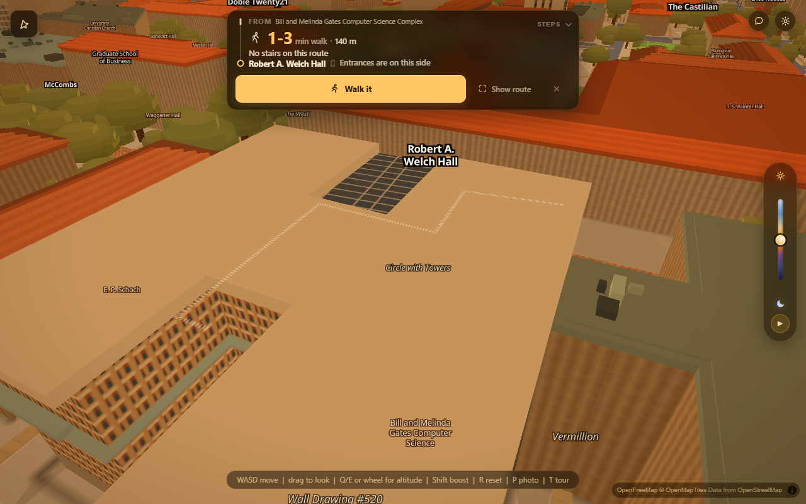
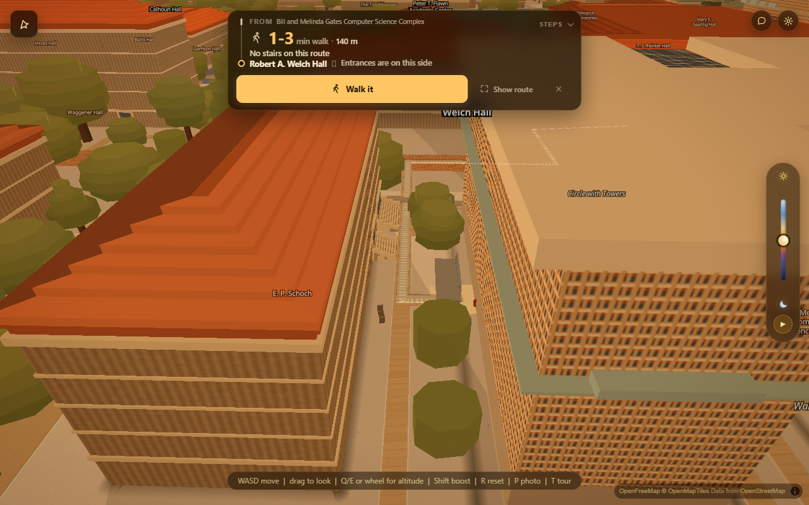

# Class-schedule import — the parser

Branch `acer/si-parser`. Everything below is additive: `js/wayfind.js` gained
1,185 lines and lost **none**, which is the only claim worth making when four
lanes share one 8,000-line file.

The whole feature is one conversion. A student's calendar says
`"MAI 220, TTh 2:00pm"`; this app's native vocabulary is `MAI`. Turn the first
into the second and the router that already beat Citymapper does the rest.

---

## What it does

Three ways in, one shape out, and a fourth way in reserved for a source that
does not exist yet.

| Front end | How the bytes arrive | Entry point |
|---|---|---|
| Google Calendar | `.ics` export, uploaded or pasted | `wayfindParseSchedule(text)` |
| Apple Calendar | `.ics` export, **or** a `webcal://` subscription link | `wayfindParseSchedule` / `wayfindFetchSchedule(url)` |
| UT registration | `.ics` from UT Registration Plus, **or** rows pasted off UT's course-schedule page | `wayfindParseSchedule(text, {kind:'rows'})` |
| _(later)_ photo of a schedule, or a Registration-Plus API | already-structured rows | `wayfindScheduleFrom(rows, meta)` |

Nothing about the last row is built. The point is that it does not need to be:
resolution, the gap statuses, the error catalogue, the summary line and the
shape itself are all downstream of the seam, so a fourth source is an adapter
to one function signature rather than a second parser.

---

## The shape

```
{ shape: 'ut-walk-schedule', version: 1, tz: 'America/Chicago',
  source:  { kind, label, url, producer, importedAt },
  events:  [ Event ],
  problems:[ Problem ],            // file-level and per-event, one list
  counts:  { total, ok, failed, errors, warnings },
  summary: 'Imported 5 of 7 classes. 2 could not be used.',
  routable:[ Event ]               // the usable ones, in day then clock order
}

Event  { index, id, title, course, locationText, code, room,
         days:['MO','WE'], startMin:600, endMin:660,
         firstDate, lastDate, exDates[], tz,
         status:'ok'|'failed', resolved:{…}, problems:[…], raw:{…} }

Problem{ level:'error'|'warning', code, text, hint,
         at:{ event, line, field } }
```

Two decisions in there are load-bearing.

**Nothing at the top level is ICS-specific.** `source.kind` records where the
bytes came from and each event keeps a `raw` blob, but a consumer reads `code`,
`days`, `startMin` and never learns whether an `.ics`, a paste or an OCR pass
produced them. That is what makes the fourth source cheap.

**Times are minutes past local midnight, never `Date` objects.** A class is
defined in Austin's wall clock; building a `Date` from a floating or `TZID`
value leaks the viewer's own timezone into it. The one place a real instant
exists — `RRULE:...UNTIL=20261208T055959Z` — is converted through
`Intl.DateTimeFormat` with `timeZone: 'America/Chicago'`, which is why the
Google fixture's last class day reads **2026-12-07** and not the 8th.

---

## Partial failure, which is the actual product

The bar is Google Calendar's own import: one bad row never kills the file. It
imports what it can, says *"N of M"*, and lists what it skipped.

`messy.ics` has eight broken events around one good one. Verbatim output:

```
Imported 1 of 9 classes. 8 could not be used.

[error] FILE_TRUNCATED         The file stops in the middle of an event, so the last
                               entry was skipped. Re-export it and try again.
[error] BUILDING_UNKNOWN       Row 2 (HIS 315K – THE UNITED STATES 1492-1865):
                               "MAII 220" is not a UT building code. Did you mean
                               MAI (UT Tower)?
[error] LOCATION_MISSING       Row 3 (PSY 301 – INTRODUCTION TO PSYCHOLOGY) has no
                               location, so there is nowhere to walk to. Add the
                               building and room to that event, or type it in below.
[error] DATE_MALFORMED         Row 4 (GEO 401 – PHYSICAL GEOLOGY) has an unreadable
                               start date ("2026O826T140000"), so we do not know when
                               it meets.
[error] BUILDING_IS_ADDRESS    Row 5 (BIO 206L – INTRODUCTORY LABORATORY): "2617
                               Wichita Street, Building 3" looks like a street
                               address, not a UT building code. Class locations read
                               like "WEL 2.224".
[error] BUILDING_OFF_MAP       Row 6 (EE 379K – MICROELECTRONICS RESEARCH SEMINAR):
                               MER is at the Pickle Research Campus, about 11.1 km
                               north of here. This map only covers the main campus.
[error] BUILDING_NOT_WALKABLE  Row 7 (SW 310 – INTRODUCTION TO SOCIAL WORK): SSW is a
                               real UT building, but this build has no walkable doors
                               for it yet.
[error] LOCATION_MISSING       Row 8 (UGS 302 – SIGNATURE COURSE) …
[error] EVENT_TRUNCATED        Row 9 (LAH 350 – RESEARCH METHODS) is cut off at the
                               end of the file and was skipped.
```

Row 1 still imports. That is the whole test.

Every problem carries a machine code, a sentence naming the row and the class,
and a `hint` saying what to do. The harness asserts both halves — a problem code
nobody can act on is not an error report.

---

## The eleven gaps: the brief was wrong twice, in opposite directions

The brief listed eleven codes that cannot be routed to and explained them two
ways. Re-measured on this build (`scripts/verify/schedule-fixtures/gaps-recheck.mjs`,
which asks the running app rather than trusting a list):

**Claim 1 — "ten are ~11 km north at Pickle Research Campus." True.** Measured
straight off `UT_CELEBRATED` in `js/wayfind.js`, distance from MAI's own
celebrated door:

| BE1 | BEG | EME | FS1 | FSL | MER | PX3 | ROC | SV1 | TCB |
|---|---|---|---|---|---|---|---|---|---|
| 11.83 | 11.76 | 11.58 | 11.24 | 11.30 | 11.09 | 11.31 | 11.70 | 10.81 | 11.32 |

(km). Nothing on the main campus is past 1.5 km, so a 3 km cut separates them
cleanly. These are correctly excluded and the importer now says so by name
rather than shrugging.

**Claim 2 — "SSW is not in UT's own building register at all." False.** SSW is
**0.88 km from MAI**, on the main campus, with two hand-surveyed doors sitting
in `UT_CELEBRATED` in this very file. What it is missing from is
`data/ut_buildings.json`, *this app's* 198-code register — so `search()` returns
nothing and the route fails at `notfound` before routing is even attempted. That
is a bug in this repo's own data, not a gap in UT's records, and it is a much
smaller fix than "handle an unregistered building". Patch below.

**A twelfth code the brief missed, failing the other way: HLB.**
`wayfindSearch('HLB')[0].routable` returns **false** — and
`wayfindRoute('PCL','HLB')` **succeeds at 1,339 m**, because `computeRoute()`
invents a virtual door from the UT survey at run time. So `entry.routable` is
not the question "can I walk there"; it is the question "does the baked graph
carry a door". This parser therefore never reports routability from it. The only
honest test is trying the route, which is what `wayfindScheduleCheck()` does.
Anyone building the interface on top of this should take the same care.

---

## What it refuses to do, and why that took a bug to learn

`search()` carries a comment forbidding fuzzy matches on building codes: the
one-edit neighbourhood of `WEL` holds `WCP`, `WMB` and `MEL`, so a typo rule on
codes routes a student to the wrong building with full confidence.

The first cut of this parser broke that rule through the back door. Its
code-shaped test was two-to-three characters wide, so the real typo `MAII 220`
did not look like a code at all, fell past to the free-text name ladder, and
`search()` — a forgiving type-ahead, correctly — fuzzed `maii` onto `mail` and
resolved a history lecture to the **2207 Comal Mail Service Building**. Every
number about that route would have been right.

Two changes fixed it and both are worth keeping in mind:

1. **"Claims a code" and "is a real code" are different questions.** The shape
   test is now deliberately *wider* than a valid code (up to six characters), so
   a typo is caught and reported instead of escaping into free text. The
   vocabulary decides validity, separately.
2. **Free text only wins on real evidence.** A name match is accepted only when
   a whole alphabetic word of four characters or more from the location is a
   genuine *prefix* of one of the building's own words. `maii` is not allowed to
   become `mail`; `Welch Hall` still resolves to WEL. And a string that looks
   like a postal address never reaches the name ladder at all.

A near miss is now **suggested in the error text and never applied.** The
student picks.

The same trap has a manual-entry twin, flagged in `docs/import-bar-ut.md`:
`GOV 312L` and `WEL 2.224` are the same shape, so shape cannot decide which
token is the building. The app's own vocabulary decides — the last candidate
whose code is a real building wins. `MAI 220, TTh 2:00pm` (the brief's own
example) is a line whose single candidate is both course-shaped and a known
building, and there the building wins, because a known code is hard evidence and
course-shape is not. Residual ambiguity is real: `ART 302` could be the course
or room 302 of the Art Building, and it resolves toward the building — which is
the right bias for an app whose job is taking you somewhere.

---

## The fixtures

`scripts/verify/schedule-fixtures/`, built from the real formats in
`docs/import-bar-apple.md` and `docs/import-bar-ut.md`. Real CRLF (pinned by a
`.gitattributes` so autocrlf cannot normalise the thing under test), real
75-octet folding, real `VTIMEZONE` blocks.

| File | What it is for |
|---|---|
| `google-clean.ics` | Google's export: `PRODID:-//Google Inc//…`, `VTIMEZONE` with `STANDARD`/`DAYLIGHT`, `RRULE…UNTIL=…Z`, four classes |
| `apple-clean.ics` | Apple's export: `X-APPLE-STRUCTURED-LOCATION` with a quoted colon-bearing param, plus a folded three-line `LOCATION` carrying the code in parentheses |
| `ut-regplus.ics` | UT Registration Plus, matching the block quoted in `docs/import-bar-ut.md`, including `EXDATE` lists |
| `messy.ics` | one good event and eight ways to fail |
| `not-a-calendar.ics` | the UT EID sign-in page, saved by mistake — the single likeliest real-world "bad file" |
| `manual-paste.txt` | seven pasted rows, five good |

Two traps those fixtures exist to catch:

- **`VTIMEZONE` nesting.** Every Google and Apple export contains
  `BEGIN:STANDARD` blocks each holding their own `DTSTART:19701101T020000`. A
  parser that collects properties without tracking which component it is inside
  reads 2 a.m. on 1 November 1970 as a class time. Only properties whose
  immediately enclosing component is `VEVENT` are kept, which drops `VALARM`
  noise for free.
- **Line folding.** The "multi-line address" case is not a value containing
  newlines — it is one logical line split across three physical ones, each
  continuation marked by a leading space. Unfolding happens before anything
  else looks at the text.

---

## Verification

```
python scripts/serve.py 8911
VERIFY_URL=http://127.0.0.1:8911 node scripts/verify/schedule-fixtures/schedule-parse.mjs
```

**209 assertions, all passing.** Chrome via `playwright-core`, SwiftShader,
`?walk=1&drift=0&intro=0`, graphics auto-detect cancelled, veil waited out.

Every clean event reaches a real route — not a `routable` flag, a route,
through the same `computeRoute()` the card uses:

```
MO GDC -> WEL   145 m  (0 min between classes)     MO WEL -> JES  450 m
TU RLP -> PAI   667 m  (90 min)                    WE WEL -> JES  450 m
WE GDC -> WEL   145 m                              FR WEL -> GRE  349 m
TH RLP -> PAI   667 m                              MO GSB -> UTC   43 m
TU CMA -> DMC   310 m                              TU DMC -> UTC 1218 m
TH CMA -> DMC   310 m                              TH DMC -> UTC 1218 m
                                                   WE GSB -> UTC   43 m
```

Thirteen class-to-class legs across the three clean schedules, every one routed.

### Proving it is on screen, not just in a data structure

House rule: no number before the subject is photographed. The leg
`C S 439 (GDC) → GOV 312L (WEL)` — an actual Monday walk out of the parsed
Google fixture — drawn by the app's own `wayfindRoute`:





The card reads *1-3 min walk · 140 m · No stairs on this route*.

The pixel assertion behind those frames went through three versions and the
first two were bad instruments, which is worth recording:

1. *"count warm pixels matching the ribbon's colour"* — needed a threshold
   chosen after seeing the answer.
2. *"clear the route and count changed pixels, bar 400"* — same problem: the
   first two measurements were 472 and 1,448 and any bar between them would
   have been reverse-engineered from the result.
3. **Measure the noise floor.** Grab the same still frame twice with nothing
   changed; whatever differs is this renderer's own noise, measured on this
   machine on this run. Then clear the route from the unmoved camera and grab
   again. Measured: **the still frame moves 0 pixels, clearing the route moves
   1,437.** No number in that block was chosen by looking at the answer.

### The URL front end, honestly

`webcal://` is an OS handoff, not a wire protocol; the feed behind it is HTTPS
at the same host and path, and the rewrite is asserted
(`webcal://calendar.google.com/…` → `https://calendar.google.com/…`).

A real Google or UT feed will usually **fail** here and the error says so
plainly, because that is the useful thing to tell a student:

> The browser would not let this page read that calendar address. Google and UT
> do not allow other sites to read a feed directly.
> *Download the .ics from your calendar and drop the file in here instead.*

That is CORS at the other end, not a bug at this one. The fetch-and-parse path
itself is exercised over the wire against a served fixture and imports 4 of 4.

---

## Patches this lane could not make

Both are in functions another lane owns. Written out rather than made.

**1. `buildIndex()` in `js/wayfind.js` — make SSW findable.** SSW has two
surveyed doors in `UT_CELEBRATED` and is absent from `data/ut_buildings.json`,
so `search()` cannot find it and routing never gets a chance. After the register
merge loop, before the `for (const e of entries)` token pass:

```js
    // Codes UT's own celebrated-entrances survey knows and neither the graph
    // nor the register does. Gated on distance so the ten Pickle Research
    // Campus codes stay out — they are 11 km off this map and finding them
    // would only produce a route that cannot exist. SSW (0.88 km) is the only
    // main-campus code this admits today.
    const SURVEY_MAX_M = 3000;
    for (const [c, rows] of utIndex()) {
      if (byCode.has(c) || !rows.length) continue;
      const dx = (rows[0].lon + 97.739719) * MPD_LON;
      const dy = (rows[0].lat - 30.286186) * MPD_LAT;
      if (Math.sqrt(dx * dx + dy * dy) > SURVEY_MAX_M) continue;
      const e = { kind: 'ut', code: c, name: '', number: '', display: c, doors: [] };
      byCode.set(c, e);
      entries.push(e);
    }
```

Expected effect, from the HLB precedent: SSW becomes findable, and
`computeRoute()`'s virtual-door path then decides whether it can be reached —
which is the honest place for that decision. Worth measuring with
`walkmeter.mjs` afterward; do not merge it on this paragraph alone.

**2. `data/ut_buildings.json` (bake lane).** The register is 198 codes and is
missing SSW, a real, currently-standing main-campus building with a UT
inventory number. Whichever bake writes that file should pick it up.

---

## For the interface lane

Five functions, all `window`-level, none of which touch the map or the card
except the last-but-one:

```js
await wayfindParseSchedule(text, { kind })     // 'ics' | 'rows'; omit to sniff
await wayfindFetchSchedule(url)                // webcal:// or https://
await wayfindScheduleFrom(rows, meta)          // the OCR / API seam
await wayfindScheduleCheck(schedule)           // routes every pair; adds .legs
await wayfindScheduleCodes()                   // the whole vocabulary
```

`wayfindScheduleCheck` adds `schedule.legs` — every consecutive same-day pair
with `{ day, from, to, gapMin, ok, distM }` — which is the list an import bar
wants to render. It routes headlessly through `wayfindStairs` and draws nothing.

Every sentence a student can read lives in `WAYFIND.schedule.say`, and every
threshold in `WAYFIND.schedule`, so wording and behaviour can both be overruled
with a one-line edit and neither requires going near the parsing (CLAUDE.md
rule 11).

---

## Known limits

- **No timezone other than America/Chicago.** UT is one campus in one zone; a
  `TZID` naming another zone is recorded on the event and otherwise ignored.
- **`RRULE` is read for `BYDAY` and `UNTIL` only.** No expansion into
  occurrences, no `COUNT` arithmetic, no `INTERVAL` beyond recording it. A
  class-schedule importer needs the weekly pattern, not a calendar engine.
- **`ART 302`-style ambiguity in pasted rows** resolves toward the building.
  Documented above; it is a genuine coin-flip in the source data.
- **Nothing here draws.** Uploading, the drop zone, the error list and the bar
  itself belong to the interface lane.
