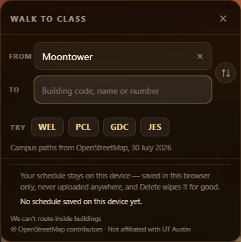
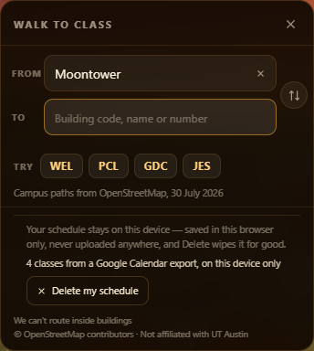
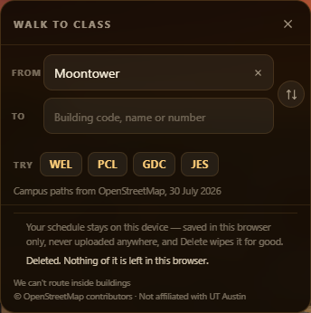
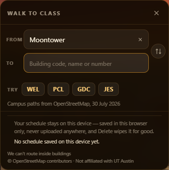

# A class schedule is personal data — the storage lane

`acer/si-privacy`, 2026-08-24. One lane of the schedule-import round. It owns
**storage, deletion and the sentence that tells a student the truth about
both** — `js/wayfind.js` §12 (a new section, nothing existing edited), the
privacy copy in `index.html`, and this file. Four sibling lanes own the three
importers and the import bar; nothing here needs them to exist, and everything
here has a seam for them (§6).

`WAYFIND.on` is untouched. The whole section is inside the `if (!ENABLED)
return` at `js/wayfind.js:1320`, so with the feature off it adds no element, no
listener, no wrapper and no storage — §5.G proves that by loading the page
without `?walk=1` and looking.

**What changed in round 4**, since this file has been through four:

- **§7 retracts a claim this doc made up.** A reviewer found the central factual
  statement about SSW sourced to a file that has never existed. It is retracted,
  the correct measurement is in its place, and §5.0 is a **gate that fails the
  audit if any path this doc cites does not resolve** — it caught the phantom on
  its first run.
- **§5.D grew from one channel to nine.** §6 advertises seven doors; rounds 1–3
  proved one. Every channel is now fired disarmed and then armed, and the test
  is that the two outcomes differ. Building that found a real blind spot in the
  instrument itself, written up where it happened.
- **§9 is new: the branch merged with three sibling lanes and everything re-run
  there**, because a lane's own pass has already been wrong about this once in
  this project.

---

## 1. The promise, and the one sentence that makes it

> **Your schedule stays on this device — saved in this browser only, never
> uploaded anywhere, and Delete wipes it for good.**

Three clauses because there are exactly three things a student would want to
know, and each one is a claim this round can actually back:

| clause | what backs it |
|---|---|
| *saved in this browser only* | one `localStorage` key, `austin3d.schedule.v1` |
| *never uploaded anywhere* | §5.C — every request during a real import, scanned. Zero. |
| *Delete wipes it for good* | §5.E and §5.F — the real button, then a reload |

No "we may share with our partners", no "we take your privacy seriously", no
link to a policy. It says what happens, in the voice the rest of this feature
already uses (`We can't route inside buildings`, `Nobody was asked about
lighting along this route`). It is one sentence because a student reads one
sentence.

**Where to change the wording:** `index.html`, the `<template
id="wf-privacy-copy">` block above the `js/wayfind.js` script tag. It is a
one-line HTML edit (CLAUDE.md rule 11). `js/wayfind.js` carries the identical
strings as `SCHEDULE_PRIVACY_COPY`, because `_harness.html` has no template and
must say the same thing; §5.A asserts the two have not drifted apart, so
changing one and not the other turns the gate red on purpose rather than
quietly shipping two different promises.

The template is not a `<script src>`, so `harness-drift.mjs` is unaffected —
verified, it passes: `index.html: 31 scripts / _harness.html: 31 scripts`.


---

## 2. What a student sees

Three states, in the footer of the walk sheet — the place this feature already
puts the things it has to say about itself.

| nothing stored | a schedule stored | just deleted | after a reload |
|---|---|---|---|
|  |  |  |  |

- The sentence is there **before** anything is imported, not after. A student
  should know where their schedule is going before they paste it in.
- The Delete button only exists when there is something to delete.
- **One tap, no "are you sure".** The brief asked for one tap, and an undo
  would mean keeping the data around after telling someone it was gone. If that
  ever reads as too sharp, `SCHEDULE_STORE.deleteNeedsConfirm = true` is the
  one-line change.
- The state line says **counts and a source**, never a class name — the sheet
  can be open on a phone somebody else is looking at.

---

## 3. What gets stored, and the three things reserved for imports that do not exist yet

One key, `austin3d.schedule.v1`, holding one JSON envelope. A four-class
schedule is 1,397 bytes.

```
{ v, savedAt, term, tz,
  sources: [ { id, kind, label, importedAt } ],
  classes: [ { id, code, room, title, instructor, days[], startMin, endMin,
               unroutableWhy, confidence, src, provenance } ] }
```

Simeon asked for Google Calendar, Apple Calendar and UT's registration export
now, and for a photo of a schedule or a Registration-Plus API to be addable
later **without a rewrite**. Three reservations buy that, and each one is
something that would otherwise force every stored schedule to be migrated:

1. **`sources` is a LIST, and each class points at one.** A photo imported on
   top of an existing `.ics` has to *add* to a schedule, not replace it. A
   single `source` string on the envelope cannot express that, and discovering
   it later means a schema change.
2. **`confidence` and `provenance` on every class.** An `.ics` is exact — 1.0,
   and the `VEVENT` UID. OCR is not, and needs somewhere to record which box on
   the image it read a room number out of, so the student can be shown what to
   check. Bolting that on later rewrites the format.
3. **`v` plus a `SCHEDULE_MIGRATIONS` chain.** A v2 reader opens a v1 blob; a
   v1 reader hands back `{tooNew:true}` and leaves the data alone rather than
   deleting a schedule it does not understand.

`SCHEDULE_SOURCES` already names `image-ocr` and `registration-plus` alongside
the three being built. They are listed before they exist on purpose: it is the
forward compatibility, written down, and it means the delete sweep in §4
already covers what they will write.

**`unroutableWhy` is a string, not a boolean**, because eleven codes a real UT
schedule can name cannot be routed to in this build, and they are **two
different problems wearing one label**. "Unknown code, probably a typo", "real
building, 11 km north at Pickle" and "real building on this campus, missing a
row in our register" are three different sentences to a student, and a boolean
can only tell them apart if you never needed to. Re-measured on this branch
today from the repo's own files — see §7, which also corrects what an earlier
round of this doc said about one of the eleven.

---

## 4. Delete means gone

`WAYFIND.store.clear()` does four things, and the second is the one that
matters for a feature that is going to grow:

1. removes `austin3d.schedule.v1`;
2. **sweeps every key under the `austin3d.schedule.` prefix, in `localStorage`
   AND `sessionStorage`** — so a source added next month that writes its own
   key is already covered by a delete written today. `austin3d.gfx.v1`
   (`js/graphics.js`) does not match the prefix and is left alone; §5.E and
   §5.F both print the surviving key list to prove it;
3. deletes the IndexedDB database `austin3d-schedule`, **whether or not
   anything has created it**. A photo will not fit in `localStorage`, so the
   OCR pass will need IDB, and delete has to reach it on the day it starts
   existing. Deleting a database that was never created is a no-op;
4. drops the in-memory copy **and the egress guard's watchlist** — the guard
   must not end up holding the last copy of the thing it was guarding.

A `storage` event listener makes a delete in one tab a delete in every tab.

---

## 5. The audit — driving the real thing, not reading the code

Method, in full, so it can be re-run:

```
python scripts/serve.py 8915                     # never python -m http.server
node scripts/verify/harness-drift.mjs            # preflight, PASS
node si-privacy-claims.mjs .                     # §5.0, the doc's own citations
VERIFY_URL=http://127.0.0.1:8915 node schedule-privacy.mjs   # the script in §10b
```

playwright-core from `scripts/verify/node_modules`, explicit `executablePath`
`C:/Program Files/Google/Chrome/Application/chrome.exe`, one browser, killed at
the end, port confirmed free after. `?walk=1&drift=0&intro=0`,
`window.cancelGraphicsAutoDetect()` at the top of every page, wait for the veil
to go. **88 assertions in the browser audit plus 3 in the citation gate, all
green, exit 0**, over repeated runs on this commit — and once more on the
merged tree in §9. `harness-drift.mjs` passes before each: `index.html: 31
scripts / _harness.html: 31 scripts`.

### 0. The doc's own citations, before anything is measured

Added in round 4, because the defect a reviewer found in round 3 was not in the
code — it was in this file. Every path `docs/si-privacy.md` cites has to
resolve: here, or in a sibling branch's tree if the doc names the branch, or
declared `(proposed)` if it is a file this lane may not write. And the privacy
sentence quoted in §1 has to be **byte-identical** to the one `index.html`
serves and the one `js/wayfind.js` falls back to, so a doc cannot go on quoting
a promise the app stopped making.

```
  ok   docs/si-gaps.md   (declared on origin/acer/si-gaps, and really there)
  ok   docs/schedule-gaps.md   (named as a phantom the doc is correcting)
  ok   scripts/verify/schedule-privacy.mjs   (declared proposed, not yet written)
PASS  no citation points at a file that does not exist   22 paths checked
PASS  index.html and js/wayfind.js say the same sentence
PASS  the doc quotes that sentence exactly, not a paraphrase of it
```

On its first run it failed, and named `docs/schedule-gaps.md` — which is the
only evidence worth having that a gate works.

### A. The feature is on and the panel is really mounted

Not "the element exists" — a **box on the screen**. The first attempt at this
script asserted `getComputedStyle(el).display !== 'none'`, which reports
`inline-flex` for an element inside a `display:none` ancestor, and it happily
claimed a button was visible that Playwright then could not click. Every
visibility assertion here is `getBoundingClientRect().width > 0 && height > 0
&& offsetParent`.

### B. A real Google Calendar export goes in

The import under test starts from **actual file bytes** — a `.ics` with
Google's own `PRODID`, `TZID` datetimes and `RRULE;BYDAY`, parsed into the
envelope. Four classes: `MAI 220` (CS 314), `WEL 2.122` (CH 301), and
deliberately `SSW 2.112` and `PX3 1.100`, the two shapes of unroutable building
from §7. The parser in the script is a stand-in — the real ones are sibling
lanes' — and it exists so that what gets stored has the shape a parser hands
over rather than being a hand-written object.

Then it does what a student does next: **routes `WEL → MAI`**, which fetches
the 328 KB walk graph. Real traffic inside the import window, which is the
point.

### C. Every request, scanned

Requests are captured two ways, because one of them has a documented blind
spot. `page.on('request')` for the page; and every `Worker` Playwright reports
gets its own `self.fetch`/`XHR` recorder installed by `evaluate`, because
`scripts/verify/README.md` records a page-scoped CDP session under-reporting a
load by 19 MB of MapLibre worker fetches.

```
captured 153 requests total, 13 from the import onward
hosts: {"127.0.0.1:8915": 5, "tiles.openfreemap.org": 8}
PASS  ZERO requests carried schedule content
```

**The app does talk to a third party** — `tiles.openfreemap.org` serves the
basemap, 8 requests in that window. That is worth saying out loud rather than
implying the page is airtight. What the audit establishes is that none of those
8, and none of the 5 local ones, carried a byte of the schedule.

What "schedule content" means here: every string leaf of the stored envelope
four characters or longer, plus the serialised blob, plus the `CODE ROOM`
composites — 26 strings for this schedule. A **bare three-letter building code
is deliberately not on that list**: `?from=WEL&to=MAI` is a documented URL
feature of this app and the codes are its public vocabulary. The scan is run at
both thresholds and reports the difference; on all three runs there was none.

### D. The negative control — nine channels, not one

This is what makes §5.C mean anything, and in round 4 it got nine times bigger
for a reason. §6 advertises that the guard closes seven doors. Rounds 1–3 fired
**one `fetch`** and called the guard proven — six advertised claims with no
evidence behind them, in a section whose whole argument is that a claim about
code is not a measurement. So every channel is now fired **twice**: once with
the guard disarmed, to show the channel really carries and the instrument
really sees it, and once armed, to show the guard is what stopped it. A case
that fails identically in both states proves nothing, so each channel asserts
the two outcomes **differ** and that the armed one is ours.

| channel | disarmed | armed |
|---|---|---|
| `fetch` | sent | `[wayfind] blocked: fetch carried stored schedule content` |
| `XMLHttpRequest` | sent | `[wayfind] blocked: XMLHttpRequest carried…` |
| `navigator.sendBeacon` | returned true | returned **false** |
| `new WebSocket(url)` | opened | `[wayfind] blocked: WebSocket carried…` |
| `WebSocket.send` | `InvalidStateError: Still in CONNECTING state` | `[wayfind] blocked: WebSocket.send carried…` |
| `new EventSource(url)` | opened | `[wayfind] blocked: EventSource carried…` |
| `form.submit()` | submitted | `[wayfind] blocked: form.submit carried…` |
| `form.requestSubmit()` | submitted | **prevented** |
| `Worker.postMessage` | posted | `[wayfind] blocked: Worker.postMessage carried…` |

Three of those deserve a note, because they are the ones where a lazy test
would have passed while proving nothing:

- **`WebSocket.send` throws either way.** The socket never connects, so an
  unguarded `send` throws `InvalidStateError`. The test is that the two errors
  are *different* — the guarded one is our block, thrown before `super.send`
  is reached. Same call, same socket state, different refuser.
- **`form.submit()` and `form.requestSubmit()` are two different doors.**
  `submit()` does not fire a `submit` event, so the prototype wrapper and the
  capture-phase listener are separate pieces of code with separate bugs
  available to them. Only `requestSubmit()` exercises the listener, and its
  refusal is not a throw at all — the event is simply prevented.
- **The form test found a bug in the instrument, not the guard.** The first
  version submitted into `target="_blank"`. The request then belongs to a
  popup, the page-scoped capture never sees it, and the *disarmed* control
  reported zero captured requests — a clean-looking result that meant the
  instrument was blind. It submits into a hidden same-page iframe now, and the
  capture sees it. Worth recording because that is exactly the failure mode
  this whole section exists to rule out, and it appeared in the tool built to
  rule it out.

Of the nine, five make a real network request when disarmed, so the
browser-level capture can independently confirm each leak:

```
PASS  fetch:       DISARMED — the capture actually saw the leak request   1 request(s)
PASS  fetch:       DISARMED — and the scanner flagged it as schedule content
PASS  fetch:       ARMED — no such request reached the wire at all        0 request(s)
   …xhr, sendBeacon, form-submit, form-event, all the same three…
PASS  the guard counted a block for every channel
      {"watched":26,"checked":268,"quietChecked":247,"blocked":9,"inspectFailures":0}
PASS  guard inspected every request without erroring
PASS  the guard's own audit log holds no schedule content
```

That last one is new too: the guard keeps a log of what it blocked, and a log
that quoted the blocked content would be a second copy of the leak sitting in
memory. It stores `20…(24)` — first two characters and a length — and the
assertion scans the whole serialised log against the watchlist to prove it.

### E and F. Delete, then reload

A **real mouse click** on the real `#wf-priv-del`, then `page.goto` a fresh
document:

```
PASS  no schedule key left in local or session storage    ["austin3d.gfx.v1"]
PASS  store.has() false immediately after the tap
PASS  inventory reports zero bytes stored
PASS  the guard dropped its copy of the schedule too
PASS  the panel says it is deleted
PASS  RELOADED: no schedule key in storage                ["austin3d.gfx.v1"]
PASS  RELOADED: the schedule key reads null
PASS  RELOADED: store.load() returns nothing
PASS  RELOADED: reserved IndexedDB database is not there  []
PASS  RELOADED: the panel is back to its empty state
```

The one surviving key is the graphics preference this app already had.

### G. Off is still off

```
PASS  no WAYFIND.store without ?walk=1
PASS  no window.wayfindStore without ?walk=1
PASS  no privacy panel and no injected CSS with the feature off
PASS  fetch, XHR.send, sendBeacon and Worker.postMessage are all still native
      {"fetchNative":true,"xhrNative":true,"beaconNative":true,"workerNative":true}
```

`main` is being screen-recorded. A privacy feature that installs a `fetch`
wrapper on every visitor to a page that does not have the feature turned on
would be a real regression.

The last assertion was weakened in earlier rounds and is fixed here. It used to
test `!/schedWatch|blocked:/.test(String(window.fetch))` — a check that passes
for *any* wrapper that happens not to contain those two words, including one
this lane might add later under a different name. It now asserts each primitive
still stringifies to `[native code]`, which is the browser's own function or
nothing.

### H. And the shipped feature still works

Re-run on this commit. `node scripts/verify/walkmeter.mjs` passes, including its
**live UI gate** — a real mouse click on the "Avoid stairs" checkbox:

```
before              checked=false  "2-4 min walk · 240 m · Stairs: 1 set"
after one click     checked=true   "Under 1 min walk · 46 m · No stairs on this route"
after clicking back checked=false  "2-4 min walk · 240 m · Stairs: 1 set"
same route via the API with avoidStairs:true — 46 m, 0 stair sets
PASS  the checkbox turns the routing on AND back off, and the pill still toggles
PASS  self-check drift 0 over limit, 0 route error(s), UI gate pass
buildings still outside 15 m: none
"avoid stairs" at the door: 9/9 clean
reachable step-free from a hub: 56/56 -> 56/56   stranded before: none  after: none
```

That is the check for the thing this round is not allowed to break: another
lane's stairs-avoidance work, driven through the real interface, not reasoned
about. **It is not, on its own, proof that nothing broke** — a lane's own pass
never is. §9 is the cross-lane part.

---

## 6. The guard, and exactly what it is not

`installEgressGuard()` wraps the ways bytes leave a page and refuses any that
carries a watched string: **`fetch`, `XMLHttpRequest`, `navigator.sendBeacon`,
`WebSocket` (open and send), `EventSource`, `HTMLFormElement.submit` plus a
capture-phase `submit` listener, and `Worker.prototype.postMessage`.**

It is a **seatbelt, not the safety case.** The safety case is that no code here
sends anything. The guard exists so that if a later lane wires an analytics
call into this file, the call fails loudly instead of quietly working.

**`Worker.prototype.postMessage` is the interesting one.** The guard is
main-thread, and MapLibre fetches tiles inside workers where it cannot reach.
Rather than chase the bytes into the worker, it stops schedule bytes from ever
getting in. A worker cannot send what it was never told.

What it does **not** cover, said plainly:

- **`` and plain link navigation.** Those are covered by the
  browser-level capture in §5.C, which sees every request regardless of who
  made it — but not by the runtime guard.
- **A fragment of a field.** Whole field values are the tokens. A leak of
  `"Data"` out of `"Data Structures"` would not match. Whole values are what a
  serialiser emits; word fragments are what tile URLs are full of, and watching
  those would block the map.
- **Inspection failures fail OPEN** — the request proceeds — and are counted.
  Failing closed would let a bug in this file break the city. The audit asserts
  `inspectFailures === 0`, which is the right place to catch it; it has been 0
  on every run.

### The seam for the four sibling lanes

Nothing above needs an import bar. When one exists:

```js
WAYFIND.store.mount(el)            // put the sentence + Delete inside the bar
WAYFIND.store.save(parsedDoc)      // the only writer; normalises + stores
WAYFIND.store.load()               // null, the doc, or {tooNew:true}
WAYFIND.store.has() / .clear() / .clearAsync() / .inventory()
WAYFIND.store.onChange(fn)         // returns an unsubscribe
WAYFIND.store.guard.state() / .log()
```

`save()` runs everything through `normaliseSchedule()`, so a photo and an
`.ics` cannot drift into two shapes. Until a bar exists the panel mounts itself
into `#wf-sheet .wf-foot`.

### Patches this lane could not make (it owns storage functions only)

- **`style.css`** — the panel's rules are injected from JS as `#wf-priv-css`
  because this lane does not own `style.css`. They are one array of strings,
  `SCHEDULE_PRIVACY_CSS`, ready to lift into the stylesheet's `#wf-root` block
  verbatim. Nothing else has to change.
- **`scripts/verify/`** — the two audit scripts belong at
  `scripts/verify/schedule-privacy.mjs` (proposed) and
  `scripts/verify/si-privacy-claims.mjs` (proposed); both are in §10 verbatim.
  Each exits 0/1 on its assertions, so either can go straight into a suite.
- **`scripts/verify/walkmeter.mjs`** — the one-line wording fix at the end of
  §7.
- **The off-map building table.** It belongs to whichever lane owns the import
  module; `docs/si-gaps.md` (on `origin/acer/si-gaps`) has already built it as
  `CAMPUS_EXTRA` + `OFF_MAP` with a `window.wayfindOffMap(code)` seam. `save()`
  stores whatever `unroutableWhy` string it is handed and never invents one, so
  that seam and this one compose without either lane changing.

---

## 7. The eleven unroutable codes — and a correction this doc owes the reader

**Round 3 of this doc got SSW wrong, and got it wrong in the worst available
way: it stated a confident reason and attached a citation to a file that has
never existed.** It said SSW was *"demolished September 2024; the school moved
to Walter Webb Hall"* and sourced that to `docs/schedule-gaps.md` (does not
exist) — not on this branch, not on any other, not at any point in this repo's
history. A reviewer caught it. What follows is the measurement that should have
been there, run on this branch today, and the claim it actually supports.

**The list itself, live.** `walkmeter.mjs` on this branch, port 8915:
`UT buildings this build cannot route to at all (11): BE1 BEG EME FS1 FSL MER
PX3 ROC SSW SV1 TCB`. Eleven, unchanged.

**What each of them actually is.** Three numbers per code, all from this
worktree's own files and none from the walkmeter: straight-line distance from
`MAI`'s surveyed door; distance to the nearest node of `data/walk_graph.json`
(quantised x/y deltas, decoded per its own `_format`); and distance to the
nearest **edge** of any footprint in `data/snapshots/2026-08-24/` — edges, not
centroids, because an L-shaped building's centroid is nowhere near its wall.

| code | km from MAI's door | nearest walk node | nearest drawn footprint |
|---|---|---|---|
| BE1 | 11.84 | 10.63 km | nothing |
| BEG | 11.77 | 10.55 km | nothing |
| EME | 11.59 | 10.38 km | nothing |
| FS1 | 11.25 | 10.01 km | nothing |
| FSL | 11.31 | 10.07 km | nothing |
| MER | 11.11 | 9.89 km | nothing |
| PX3 | 11.32 | 10.09 km | nothing |
| ROC | 11.71 | 10.50 km | nothing |
| SV1 | 10.82 | 9.60 km | nothing |
| TCB | 11.33 | 10.12 km | nothing |
| **SSW** | **0.90** | **37.4 m** | **0.4 m — UT's own door is on the wall** |

Three orders of magnitude apart. **These are two different problems.** Ten are
genuinely off this map and always will be. SSW is a main-campus building whose
UT-surveyed door sits 0.4 m off a footprint this app draws today and 37 m from
mapped pavement. **A demolished building does not have that.** The round-3
narrative was not merely uncited; the geometry contradicts it.

**The register absence is real, and it is our file that is short.** SSW is
genuinely missing from `data/ut_buildings.json` — 198 entries, zero
occurrences, checked in one line. But that file is a **snapshot retrieved
2026-08-05**, not an authority, and `MAI WEL GDC WWH` are all present, which is
the sanity check that the lookup works rather than returning empty for
everything. Absent-from-our-snapshot is not the same claim as does-not-exist,
and round 3 slid from one to the other.

**A sibling lane reached the same numbers first and acted on them.**
`docs/si-gaps.md` (on `origin/acer/si-gaps`) measured SSW's doors at 0.4 m and
2.5 m from the same footprint, found UT filing SSW under its own main-campus
path, and fixed it with one table row — taking the unroutable count from 11 to
10. Its numbers and the ones above were derived independently and agree. This
lane stores whatever `unroutableWhy` string it is handed and does not own that
table, so nothing here changes; what changes is that this doc no longer tells
the next reader something false about SSW.

**Patch this lane cannot make.** `scripts/verify/walkmeter.mjs` prints, under
its own list, `(10 of those are 11 km north at the Pickle campus, off this map;
SSW is not in UT's own register)`. That parenthetical carries the same wrong
implication. This lane does not own `scripts/verify/`; the accurate wording is
*"SSW is on main campus and is missing from our register snapshot"*, and
`si-gaps` removing SSW from the list makes the clause moot anyway.

### Why this section now has a gate in front of it

A fabricated citation is not a typo. It is a claim with no source, presented as
a claim with one, and no amount of care prevents the next one — nothing was
looking. So §5.0 now **reads this file and checks every path it cites**, and
fails if one does not resolve. It found the two that were wrong on the first
run, which is the only evidence worth having that it works.

---

## 8. What the guard costs, and the two measurements that were wrong first

The guard sits on `Worker.prototype.postMessage`, which is MapLibre's per-tile
path. "It's bounded" is a claim about code, so it was measured — and the first
two attempts were both bad instruments, which is worth recording.

**Wrong measurement #1: whole-map load time, with and without a stored
schedule.** After the first rep every tile was in the HTTP cache, so the later
reps did *zero* guard checks and the guarded condition came out **27% faster**.
That is not a result; it is a cache being mistaken for one.

**Wrong measurement #2: absolute microseconds across runs.** The unguarded
baseline for the identical benchmark moved from 7.4 µs to 68 µs depending on
what the other lanes were doing — the machine sat at 82% CPU with 35 Chrome
processes at one point. Only conditions interleaved inside a single run are
comparable.

So: 4,000 MapLibre-shaped `loadTile` messages through a do-nothing worker, the
two conditions interleaved, **minimum of 8 reps**, machine at ~41% at the end.

| | first version | after the fix |
|---|---|---|
| guard cost per main→worker message | **42.6 µs** | **3.8 µs** |
| 1 MB `Float32Array` payload | no measurable cost | no measurable cost (buffers are skipped, not walked) |

Two things were wrong in the first version:

1. **It wrote a log line per message.** A `performance.now()`, an object, and a
   `shift()` off a full ring buffer — per tile. The log exists to audit egress
   to the *network*, where there are tens of requests and every line is worth
   having. Worker messages are now counted (`quietChecked`) and only logged
   when they actually match, which is the only worker message anyone would read.
2. **It concatenated every string in a message into one haystack, then scanned
   it** — and scanned with a compiled alternation regex, which was the second
   mistake dressed as an optimisation. An alternation retries every branch at
   every start position: ~22 branches over a 60-character tile URL is over a
   thousand attempted matches to conclude "no". It now tests each string leaf
   directly with `indexOf` (one vectorised substring search per token, the
   operation V8 has actually optimised), behind two cheap gates: a haystack
   shorter than the shortest token is rejected outright, and the haystack is
   lowercased once per scan instead of once per token. No concatenation, no
   per-message allocation. Testing leaf by leaf finds exactly the same leaks,
   because every watched token is a whole field value and therefore lives
   inside one leaf if it is there at all.

**In real terms:** a cold load of the city with a schedule stored puts 992
messages through the guard; a cold load plus four camera poses across campus
plus a route puts 5,077 through. At 3.8 µs that is **about 19 ms of guard work
across an entire heavy session** — and only when a schedule is stored at all.
With nothing stored the guard is one `if` and returns.

---

## 9. Merged with the other lanes, and re-run there

**A lane's own audit passing is not evidence that the lane did not break
somebody else.** In the previous round of this project one lane's own critic
returned a clean verdict on a commit that had silently broken another lane's
stairs fix. So this round the branch was merged with the siblings that exist
and everything was run again on the merged result, not on this branch alone.

`acer/si-privacy` + `acer/si-gaps` + `acer/si-ui` + `acer/si-parser`:

| | result |
|---|---|
| `js/wayfind.js` vs `si-gaps` | **auto-merged, no conflict** |
| `js/wayfind.js` vs `si-ui`, `si-parser` | conflict at the append point only; both blocks kept whole |
| `node --check js/wayfind.js` | passes |
| `harness-drift.mjs` on the merged tree | PASS, 31 / 31 scripts |
| the whole audit in §5 on the merged tree | **ALL PASS** — 9 channels, delete, reload, off-is-off |
| `walkmeter.mjs` on the merged tree | PASS, stairs UI gate still green, **unroutable 11 → 10** |

That last row is the point of merging: `si-gaps`'s SSW fix lands, the count
drops to ten, and none of it disturbs the storage or the guard.

### And it composes on screen


The sheet on the merged build: `si-ui`'s **Import your class schedule** row,
and directly under it this lane's sentence, state line and Delete button. No
overlap, no duplication, no fighting for the footer — `WAYFIND.store.mount(el)`
was not even needed, the default mount point was already right.

**Two things the integrator should know, neither of which is a defect in any
one lane:**

1. **All four lanes append a new top-level section at the same seam** — just
   above `function boot()` — so an N-way integration hits one conflict at one
   point. The resolution is concatenation, and there is a trap in it: git aligns
   coincidentally identical trailing lines (`return null;`, `}`, `};`) across
   the two unrelated bodies, so a naive "keep both sides" **silently drops a
   function's closing brace** and leaves a file that still reads plausibly. It
   happened here twice. `node --check js/wayfind.js` catches it in a second;
   reading the diff does not. Run it after every hunk.
2. **`acer/si-dayview` collides the same way and was left unresolved here.**
   Its conflict interleaves with this lane's `scanForSchedule` purely by that
   textual coincidence, and picking the right resolution belongs to whoever
   owns the integration, not to this lane guessing. Flagged, not fudged.

### One copy overlap worth a decision (taste — Simeon's call, not this lane's)

In the frame above the promise is made **twice**: `si-ui`'s row says *"Google,
Apple or UT — read on this phone, never uploaded"* and the sentence below says
*"never uploaded anywhere"*. Both are true and neither is wrong, but stacked
they read like a page protesting. The cheap fix is for the import row's
subtitle to drop its privacy clause — *"Google, Apple or UT"* — and let the one
sentence carry the promise once, which is the whole argument of §1. That
subtitle is `si-ui`'s copy, not this lane's, so it is written down here rather
than changed.

---

## 10. The two audit scripts, verbatim

This lane may not write `scripts/verify/`. Both scripts are below in full. Each
exits 0 on pass and 1 on a failed assertion, so either can be dropped straight
into the suite as `scripts/verify/schedule-privacy.mjs` (proposed) and
`scripts/verify/si-privacy-claims.mjs` (proposed). These are the exact files
that produced every number in §5, not paraphrases of them.

### 10a. `si-privacy-claims.mjs` — the gate on this document

Round 4. It reads `docs/si-privacy.md` and fails if a cited path does not
resolve or if the sentence the doc quotes has drifted from the one the app
serves. No browser, no server, runs in well under a second.

```js
/**
 * claims-check.mjs — does docs/si-privacy.md cite anything that does not exist,
 * and does the promise it quotes still match the promise the app makes?
 *
 * WHY THIS EXISTS. Round 3's critic found this doc backing its central factual
 * claim with four citations to `docs/schedule-gaps.md` — a file that has never
 * existed on any branch. Nothing caught it because nothing was looking. A
 * fabricated citation is not a typo; it is a claim with no source presented as
 * a claim with one, and the only durable fix is a gate rather than a promise to
 * be more careful.
 *
 * Two checks, both cheap:
 *   1. EVERY relative path this doc cites resolves — either in this worktree,
 *      or, if the doc marks it `(on BRANCH)`, in that branch's tree. A citation
 *      that names its branch is honest; one that does not and does not exist is
 *      the defect.
 *   2. The privacy sentence the doc QUOTES is byte-identical to the one
 *      index.html serves and the one js/wayfind.js falls back to. A doc that
 *      quotes a promise the app no longer makes is the same defect wearing
 *      different clothes.
 *
 * Usage:  node claims-check.mjs <repo-root>
 * Exit 0 all checks passed, 1 a check failed.
 */
import fs from 'node:fs';
import path from 'node:path';
import { execFileSync } from 'node:child_process';

const ROOT = process.argv[2] || process.cwd();
const DOC = path.join(ROOT, 'docs', 'si-privacy.md');
const text = fs.readFileSync(DOC, 'utf8');

const fails = [];
const ok = (cond, label, extra) => {
  console.log((cond ? '  PASS  ' : '  *FAIL ') + label + (extra ? '   ' + extra : ''));
  if (!cond) fails.push(label);
  return cond;
};

console.log('\n── 1. every path this doc cites resolves ──');

// A CITATION IS PROSE, NOT CODE. Fenced blocks hold the audit scripts verbatim
// and their console output, and both are full of paths that are examples,
// placeholders or runtime strings — not this document citing a source. Strip
// them first, or the gate reports the sample paths in its own listing.
const prose = text.replace(/```[\s\S]*?\n```/g, '');

// Citations look like `docs/foo.md`, ../shots/si/privacy/x.png, js/wayfind.js,
// data/ut_buildings.json. Pull them out of backticks AND out of image links.
const cited = new Set();
for (const m of prose.matchAll(/`([^`\n]+)`/g)) {
  const s = m[1].trim();
  if (/^(docs|js|data|scripts|shots)\/[\w./-]+$/.test(s)) cited.add(s);
}
for (const m of prose.matchAll(/!\[[^\]]*\]\(([^)]+)\)/g)) {
  cited.add(m[1].trim().replace(/^\.\.\//, ''));
}

// A citation may legitimately point at something that is not in THIS tree, but
// the doc has to SAY which, right next to the citation:
//   `docs/x.md` (on origin/acer/y)   — a sibling lane's file, checked in that tree
//   `scripts/verify/x.mjs` (proposed) — a file this lane may not write, not yet real
//   `docs/x.md` (does not exist)      — named because the doc is DISCUSSING a
//                                       phantom citation, not making one
// Anything else that does not resolve is the round-3 defect: a claim wearing a
// citation's clothes. The declaration has to sit next to the FIRST mention, so
// a later bare repeat inside the same discussion is fine but a bare citation
// somewhere else in the file is not.
// The window spans newlines because markdown wraps, and backticks around the
// branch name are optional — a rule nobody can satisfy is a rule that gets
// switched off.
const declOf = (p) => {
  const esc = p.replace(/[.*+?^${}()|[\]\\]/g, '\\$&');
  const near = (tail) => new RegExp('`' + esc + '`[\\s\\S]{0,120}?' + tail);
  const br = text.match(near('\\(on `?(origin/[\\w./-]+)`?\\)'));
  if (br) return { kind: 'branch', branch: br[1] };
  if (near('\\(proposed\\)').test(text)) return { kind: 'proposed' };
  if (near('\\(does not\\s+exist\\)').test(text)) return { kind: 'phantom' };
  return null;
};

const inTree = (branch, p) => {
  try {
    const out = execFileSync('git', ['-C', ROOT, 'ls-tree', '--name-only', branch, p], { encoding: 'utf8' });
    return out.trim().length > 0;
  } catch (e) { return false; }
};

const missing = [];
for (const p of Array.from(cited).sort()) {
  const here = fs.existsSync(path.join(ROOT, p));
  const d = declOf(p);
  if (here) { console.log('    ok   ' + p); continue; }
  if (d && d.kind === 'branch') {
    if (inTree(d.branch, p)) console.log('    ok   ' + p + '   (declared on ' + d.branch + ', and really there)');
    else missing.push(p + '  — declared on ' + d.branch + ' but NOT in that tree');
    continue;
  }
  if (d && d.kind === 'proposed') { console.log('    ok   ' + p + '   (declared proposed, not yet written)'); continue; }
  if (d && d.kind === 'phantom') { console.log('    ok   ' + p + '   (named as a phantom the doc is correcting)'); continue; }
  missing.push(p + '  — does not exist here, and the doc declares no branch and does not call it proposed');
}
ok(missing.length === 0, 'no citation points at a file that does not exist',
  missing.length ? '\n         ' + missing.join('\n         ') : cited.size + ' paths checked');

console.log('\n── 2. the sentence the doc quotes is the sentence the app makes ──');

const html = fs.readFileSync(path.join(ROOT, 'index.html'), 'utf8');
const js = fs.readFileSync(path.join(ROOT, 'js', 'wayfind.js'), 'utf8');

const htmlLine = (html.match(/<span data-k="line">([^<]+)<\/span>/) || [])[1];
// SCHEDULE_PRIVACY_COPY.line is written as two concatenated string literals, so
// take everything between `line:` and the next key and glue the literals back.
const jsLine = (() => {
  const at = js.indexOf('const SCHEDULE_PRIVACY_COPY');
  if (at < 0) return null;
  const m = js.slice(at).match(/line:\s*([\s\S]*?),\s*\n\s*deleteBtn:/);
  if (!m) return null;
  return (m[1].match(/'([^']*)'/g) || []).map(s => s.slice(1, -1)).join('');
})();
// The doc quotes it as a blockquote in §1, wrapped across lines.
const quoted = (() => {
  const m = text.match(/>\s\*\*(Your schedule stays[\s\S]*?)\*\*/);
  return m ? m[1].replace(/\n>\s*/g, ' ').replace(/\s+/g, ' ').trim() : null;
})();

console.log('    index.html   : ' + JSON.stringify(htmlLine));
console.log('    wayfind.js   : ' + JSON.stringify(jsLine));
console.log('    si-privacy.md: ' + JSON.stringify(quoted));
ok(!!htmlLine && !!jsLine && htmlLine === jsLine, 'index.html and js/wayfind.js say the same sentence');
ok(!!quoted && quoted === htmlLine, 'the doc quotes that sentence exactly, not a paraphrase of it');

console.log('\n' + (fails.length === 0 ? '  ALL PASS' : '  ' + fails.length + ' FAILED:\n   - ' + fails.join('\n   - ')) + '\n');
process.exit(fails.length === 0 ? 0 : 1);
```

### 10b. `schedule-privacy.mjs` — the browser audit

The one that answers both halves of the bar. Needs `VERIFY_URL` and nothing
else; `--shots DIR` writes its frames wherever you point it (the scratchpad,
not `shots/` — CLAUDE.md rule 12).

```js
/**
 * schedule-privacy.mjs — does a student's class schedule actually stay on the
 * device, and does Delete actually delete it?
 *
 * Two questions, and neither is answerable by reading js/wayfind.js:
 *
 *   1. During a real import, does ANY request leave this page carrying
 *      schedule content? Answered by recording every request the page and its
 *      workers make across the import window and scanning each one's URL and
 *      body for the schedule's own strings.
 *   2. Does the Delete control empty storage? Answered by clicking the real
 *      button with a real mouse, reloading the page, and reading storage from
 *      the fresh document.
 *
 * THE PART THAT MAKES ANSWER 1 MEAN ANYTHING. "Zero requests carried the
 * schedule" is what a blind instrument says too. So the run includes a
 * NEGATIVE CONTROL — and since round 4, one for EVERY channel the guard
 * claims, not just `fetch`. A guard that advertises seven doors and has only
 * ever been shown closing one has six untested claims in it. Each channel is
 * fired twice: once with the guard disarmed, to prove the channel really works
 * and the instrument really sees it, and once armed, to prove the guard is the
 * thing that stopped it.
 *
 * Usage (repo root, own port, own browser):
 *   python scripts/serve.py 8915
 *   VERIFY_URL=http://127.0.0.1:8915 node schedule-privacy.mjs [--shots DIR]
 *
 * Exit 0 all assertions passed, 1 an assertion failed, 2 could not run.
 */
import fs from 'node:fs';
import path from 'node:path';
import { chromium } from 'playwright-core';

const BASE = process.env.VERIFY_URL || 'http://127.0.0.1:8915';
const CHROME = process.env.CHROME_PATH || 'C:/Program Files/Google/Chrome/Application/chrome.exe';
const SHOTS = (() => {
  const i = process.argv.indexOf('--shots');
  return i > 0 ? process.argv[i + 1] : path.join(process.cwd(), 'shots-out');
})();
fs.mkdirSync(SHOTS, { recursive: true });

const fails = [];
const notes = [];
const ok = (cond, label, extra) => {
  console.log((cond ? '  PASS  ' : '  *FAIL ') + label + (extra ? '   ' + extra : ''));
  if (!cond) fails.push(label);
  return cond;
};

// ── the schedule, as a real Google Calendar export ────────────────────────────
// Real shape (Google's own PRODID, TZID form, RRULE BYDAY, LOCATION as a free
// string with no structured building field — docs/import-bar-apple.md). Two of
// the classes are deliberately in buildings this build cannot route to, and
// they are the TWO DIFFERENT KINDS of unroutable that docs/si-gaps.md measured:
// PX3 (Pickle campus, ~11 km north, genuinely off this map) and SSW (a real
// main-campus building our 198-code register snapshot is simply missing).
const ICS = [
  'BEGIN:VCALENDAR',
  'PRODID:-//Google Inc//Google Calendar 70.9054//EN',
  'VERSION:2.0',
  'BEGIN:VEVENT',
  'DTSTART;TZID=America/Chicago:20260826T140000',
  'DTEND;TZID=America/Chicago:20260826T153000',
  'RRULE:FREQ=WEEKLY;BYDAY=TU,TH',
  'SUMMARY:CS 314 Data Structures',
  'LOCATION:MAI 220',
  'UID:4b1f9c0a-utexas-cs314@google.com',
  'END:VEVENT',
  'BEGIN:VEVENT',
  'DTSTART;TZID=America/Chicago:20260824T100000',
  'DTEND;TZID=America/Chicago:20260824T110000',
  'RRULE:FREQ=WEEKLY;BYDAY=MO,WE,FR',
  'SUMMARY:CH 301 Principles of Chemistry',
  'LOCATION:WEL 2.122',
  'UID:9d33ae71-utexas-ch301@google.com',
  'END:VEVENT',
  'BEGIN:VEVENT',
  'DTSTART;TZID=America/Chicago:20260825T163000',
  'DTEND;TZID=America/Chicago:20260825T180000',
  'RRULE:FREQ=WEEKLY;BYDAY=TU,TH',
  'SUMMARY:SW 310 Introduction to Social Work',
  'LOCATION:SSW 2.112',
  'UID:1a7c55be-utexas-sw310@google.com',
  'END:VEVENT',
  'BEGIN:VEVENT',
  'DTSTART;TZID=America/Chicago:20260828T090000',
  'DTEND;TZID=America/Chicago:20260828T120000',
  'RRULE:FREQ=WEEKLY;BYDAY=FR',
  'SUMMARY:ASE 379 Rocket Propulsion Lab',
  'LOCATION:PX3 1.100',
  'UID:c0e2d418-utexas-ase379@google.com',
  'END:VEVENT',
  'END:VCALENDAR',
].join('\r\n');

/**
 * A DELIBERATELY MINIMAL ICS -> schedule mapping. The real parser is a sibling
 * lane's; this exists so the import under test starts from actual file bytes
 * rather than from a hand-written object, and so the thing being stored has
 * the shape a parser will hand over.
 */
function parseIcs(text) {
  const classes = [];
  const days = { MO: 'Mo', TU: 'Tu', WE: 'We', TH: 'Th', FR: 'Fr', SA: 'Sa', SU: 'Su' };
  for (const block of text.split('BEGIN:VEVENT').slice(1)) {
    const g = (re) => { const m = block.match(re); return m ? m[1].trim() : null; };
    const loc = g(/^LOCATION:(.*)$/m) || '';
    const bits = loc.split(/\s+/);
    const start = block.match(/^DTSTART[^:]*:\d{8}T(\d{2})(\d{2})/m);
    const end = block.match(/^DTEND[^:]*:\d{8}T(\d{2})(\d{2})/m);
    const by = g(/BYDAY=([A-Z,]+)/);
    classes.push({
      id: g(/^UID:(.*)$/m),
      code: bits[0] || null,
      room: bits.slice(1).join(' ') || null,
      title: g(/^SUMMARY:(.*)$/m),
      days: by ? by.split(',').map(d => days[d] || d) : [],
      startMin: start ? Number(start[1]) * 60 + Number(start[2]) : null,
      endMin: end ? Number(end[1]) * 60 + Number(end[2]) : null,
      confidence: 1,
      provenance: { kind: 'ics-uid', ref: g(/^UID:(.*)$/m) },
    });
  }
  return {
    term: 'Fall 2026', tz: 'America/Chicago',
    sources: [{ id: 'g1', kind: 'google-ics', label: 'a Google Calendar export' }],
    classes: classes.map(c => Object.assign(c, { src: 'g1' })),
  };
}

const DOC = parseIcs(ICS);

/** The guard's own rule: whole string leaves of 4+ chars, plus the blob. */
function tokensOf(doc, minLen) {
  const out = new Set();
  const add = (s) => {
    if (typeof s !== 'string') return;
    const t = s.trim().toLowerCase();
    if (t.length >= minLen) out.add(t);
  };
  const walk = (v) => {
    if (v == null) return;
    if (typeof v === 'string') return add(v);
    if (Array.isArray(v)) return v.forEach(walk);
    if (typeof v === 'object') return Object.keys(v).forEach(k => walk(v[k]));
  };
  walk(doc);
  for (const c of doc.classes) if (c.code && c.room) { add(c.code + ' ' + c.room); add(c.code + '-' + c.room); }
  add(JSON.stringify(doc));
  return Array.from(out);
}
const PRIVATE = tokensOf(DOC, 4);            // the guard's watchlist rule
const STRICT = tokensOf(DOC, 3);             // adds the bare building CODEs

// ── the browser ──────────────────────────────────────────────────────────────
const browser = await chromium.launch({
  executablePath: CHROME,
  headless: true,
  args: ['--no-sandbox', '--disable-dev-shm-usage', '--ignore-gpu-blocklist',
    '--enable-gpu-rasterization', '--force_high_performance_gpu',
    '--enable-unsafe-swiftshader'],
});
let killed = false;
const reap = (code) => {
  if (killed) return; killed = true;
  try { browser.process()?.kill('SIGKILL'); } catch (e) {}
  try { browser.close(); } catch (e) {}
  if (code != null) process.exit(code);
};
const watchdog = setTimeout(() => { console.error('watchdog'); reap(124); }, 600000);
process.once('SIGINT', () => reap(130));
process.once('uncaughtException', e => { console.error(e); reap(1); });
process.once('unhandledRejection', e => { console.error(e); reap(1); });

const page = await browser.newPage({ viewport: { width: 1180, height: 800 } });
const pageErrors = [];
page.on('pageerror', e => pageErrors.push(e.message));

// EVERY request the page makes, tagged with the phase it happened in.
let phase = 'boot';
const wire = [];
page.on('request', r => {
  let body = null;
  try { body = r.postData(); } catch (e) { body = '[unreadable]'; }
  wire.push({ phase, where: 'page', method: r.method(), url: r.url(), body });
});
// AND the workers. A page-scoped listener cannot see a MapLibre worker's own
// fetches (scripts/verify/README, the 19 MB under-report), so each worker gets
// its own recorder installed the moment Playwright reports it.
const workerFetches = [];
page.on('worker', async (w) => {
  try {
    await w.evaluate(() => {
      if (self.__wfRec) return;
      self.__wfRec = [];
      const orig = self.fetch;
      self.fetch = function (i, init) {
        try {
          self.__wfRec.push({
            url: (i && i.url) || String(i),
            method: (init && init.method) || 'GET',
            body: init && typeof init.body === 'string' ? init.body : null,
          });
        } catch (e) {}
        return orig.apply(this, arguments);
      };
      const op = self.XMLHttpRequest && self.XMLHttpRequest.prototype.open;
      if (op) {
        self.XMLHttpRequest.prototype.open = function (m, u) {
          try { self.__wfRec.push({ url: String(u), method: String(m), body: null }); } catch (e) {}
          return op.apply(this, arguments);
        };
      }
    });
    workerFetches.push({ url: w.url(), worker: w });
  } catch (e) { /* worker died before we attached */ }
});

console.log('\n════════════════════════════════════════════════════════════════');
console.log('  schedule-privacy — ' + BASE);
console.log('  ' + DOC.classes.length + ' classes, ' + PRIVATE.length + ' watched strings');
console.log('════════════════════════════════════════════════════════════════\n');

const URL_WALK = `${BASE}/index.html?walk=1&drift=0&intro=0`;

async function settle() {
  await page.waitForFunction(() => window.__map && window.__map.isStyleLoaded(), null, { timeout: 150000 });
  await page.evaluate(() => { try { window.cancelGraphicsAutoDetect(); } catch (e) {} });
  // The veil: app.js REMOVES it after its transition, so "gone" is the state.
  await page.waitForFunction(() => {
    const v = document.getElementById('veil');
    return !v || getComputedStyle(v).opacity === '0' || v.classList.contains('lift');
  }, null, { timeout: 150000 }).catch(() => notes.push('veil never reported lifted'));
  await page.waitForTimeout(2500);
}

await page.goto(URL_WALK, { waitUntil: 'domcontentloaded', timeout: 150000 });
await settle();

console.log('── A. the feature is really on, and the panel is really mounted ──');
const boot = await page.evaluate(() => ({
  hasStore: !!(window.WAYFIND && window.WAYFIND.store),
  guard: window.WAYFIND && window.WAYFIND.store && window.WAYFIND.store.guard.state(),
  key: window.WAYFIND && window.WAYFIND.store && window.WAYFIND.store.KEY,
  panel: !!document.getElementById('wf-priv'),
}));
ok(boot.hasStore, 'WAYFIND.store exists under ?walk=1');
ok(boot.guard && boot.guard.installed, 'egress guard installed at boot');
ok(boot.panel, 'privacy panel mounted into the walk sheet');
console.log('    key=' + boot.key + '  guard=' + JSON.stringify(boot.guard));

// The copy in index.html and the defaults in js/wayfind.js must not fork.
const copyCheck = await page.evaluate(() => {
  const s = window.WAYFIND.store;
  const live = s.copy(), def = s.defaultCopy;
  const diff = Object.keys(def).filter(k => live[k] !== def[k]);
  return { live, diff };
});
ok(copyCheck.diff.length === 0, 'index.html copy == js/wayfind.js defaults (no drift)',
  copyCheck.diff.length ? 'differs: ' + copyCheck.diff.join(',') : '');
console.log('    line: ' + JSON.stringify(copyCheck.live.line));

// And the sentence docs/si-privacy.md QUOTES is the sentence the app serves. A
// doc that quotes a promise the app stopped making is the same class of defect
// as a citation to a file that does not exist.
const DOC_QUOTE = process.env.DOC_QUOTE || '';
if (DOC_QUOTE) {
  ok(copyCheck.live.line === DOC_QUOTE, 'the live sentence is byte-identical to the one docs/si-privacy.md quotes');
} else notes.push('DOC_QUOTE not set — doc-quote assertion skipped');

// Open the sheet with a real click so the panel is where a student sees it.
await page.click('#wf-button');
await page.waitForTimeout(1800);
// REALLY visible: a box on the screen, not merely a computed display. An
// element inside a `display:none` ancestor still reports its own display, and
// that is exactly the check that let the first run of this script claim a
// button was there while Playwright could not click it.
const VIS = `(id) => { const e = document.getElementById(id); if (!e) return false;
  const r = e.getBoundingClientRect(); return r.width > 0 && r.height > 0 && !!e.offsetParent; }`;
const emptyText = await page.evaluate((vis) => {
  const p = document.getElementById('wf-priv');
  // eslint-disable-next-line no-eval
  const visible = eval(vis);
  return p ? { text: p.innerText.replace(/\s+/g, ' ').trim(), delVisible: visible('wf-priv-del'), panelVisible: visible('wf-priv') } : null;
}, VIS);
ok(!!emptyText && emptyText.panelVisible, 'the privacy sentence is really on screen (a box, not a computed style)');
ok(!!emptyText && /No schedule saved/i.test(emptyText.text), 'empty state says nothing is stored');
ok(emptyText && emptyText.delVisible === false, 'no Delete button when there is nothing to delete');
await page.screenshot({ path: path.join(SHOTS, '1-empty-full.png') });
await page.locator('#wf-sheet').screenshot({ path: path.join(SHOTS, '1-empty.png') }).catch(() => {});

// ── B. the import ────────────────────────────────────────────────────────────
console.log('\n── B. import a real Google Calendar export, watch the wire ──');
phase = 'import';
const saved = await page.evaluate((doc) => window.WAYFIND.store.save(doc), DOC);
ok(saved && saved.ok, 'save() accepted the parsed schedule', JSON.stringify(saved));
await page.waitForTimeout(600);

const savedState = await page.evaluate((vis) => {
  const p = document.getElementById('wf-priv');
  // eslint-disable-next-line no-eval
  const visible = eval(vis);
  return {
    text: p ? p.innerText.replace(/\s+/g, ' ').trim() : null,
    delVisible: visible('wf-priv-del'),
    stored: (localStorage.getItem(window.WAYFIND.store.KEY) || '').length,
    has: window.WAYFIND.store.has(),
    guard: window.WAYFIND.store.guard.state(),
  };
}, VIS);
ok(savedState.stored > 0, 'schedule is in localStorage', savedState.stored + ' bytes');
ok(savedState.has === true, 'store.has() true after import');
ok(savedState.delVisible, 'Delete button is visible once there is something to delete');
ok(/on this device only/i.test(savedState.text || ''), 'panel says it is on this device only');
// The state line must not name a class. The sheet can be open on a phone that
// somebody else is looking at.
const namesAClass = DOC.classes.some(c => (savedState.text || '').indexOf(c.title) !== -1);
ok(!namesAClass, 'the state line names no class — counts and a source only');
console.log('    panel: ' + savedState.text);
console.log('    guard: ' + JSON.stringify(savedState.guard));
await page.screenshot({ path: path.join(SHOTS, '2-saved-full.png') });
await page.locator('#wf-sheet').screenshot({ path: path.join(SHOTS, '2-saved.png') }).catch(e => notes.push('2-saved crop: ' + e.message));

// Now do what a student does next: route between two of the classes. Routing
// FETCHES the walk graph — real traffic inside the import window, exactly what
// should be captured and exactly what must not carry the schedule. It also
// CLOSES the sheet, which is why the panel shot is taken above and not here.
const routed = await page.evaluate(async () => {
  const r = await window.wayfindRoute('WEL', 'MAI');
  return { ok: !!(r && r.ok), why: r && r.why };
});
console.log('    routed WEL->MAI during the import window: ' + JSON.stringify(routed));
await page.waitForTimeout(4000);
phase = 'post-import';

// Pull the workers' own logs.
for (const w of workerFetches) {
  try {
    const rec = await w.worker.evaluate(() => self.__wfRec || []);
    for (const r of rec) wire.push({ phase: 'worker', where: 'worker:' + w.url.split('/').pop(), method: r.method, url: r.url, body: r.body });
  } catch (e) { notes.push('worker log unreadable: ' + w.url); }
}

// ── C. the scan ──────────────────────────────────────────────────────────────
console.log('\n── C. every request captured, scanned for schedule content ──');
function scan(list, toks) {
  const hits = [];
  for (const r of list) {
    const hay = ((r.url || '') + ' ' + (r.body || '')).toLowerCase();
    for (const t of toks) if (hay.indexOf(t) !== -1) { hits.push({ r, t }); break; }
  }
  return hits;
}
const importWindow = wire.filter(r => r.phase !== 'boot');
console.log('    captured ' + wire.length + ' requests total, ' + importWindow.length + ' from the import onward');
const byHost = {};
for (const r of importWindow) { const h = (() => { try { return new URL(r.url).host; } catch (e) { return r.url.slice(0, 24); } })(); byHost[h] = (byHost[h] || 0) + 1; }
console.log('    hosts: ' + JSON.stringify(byHost));
const privHits = scan(importWindow, PRIVATE);
const strictHits = scan(importWindow, STRICT);
ok(privHits.length === 0, 'ZERO requests carried schedule content',
  privHits.length ? privHits.slice(0, 3).map(h => h.r.method + ' ' + h.r.url.slice(0, 80)).join(' | ') : '');
if (strictHits.length !== privHits.length) {
  console.log('    note: ' + (strictHits.length - privHits.length) + ' request(s) matched only a bare 3-letter');
  console.log('    building code, which is this app\'s public vocabulary (?from=WEL&to=MAI):');
  for (const h of strictHits.slice(0, 4)) console.log('      ' + h.t + '  <-  ' + h.r.url.slice(0, 100));
}

// ── D. the negative control, on EVERY channel the guard claims ───────────────
// ROUND 4. The previous rounds fired one `fetch` and called the guard proven.
// The guard advertises seven doors; six of them had never been shown closing.
// Each is now fired twice — disarmed, to prove the channel really carries and
// the instrument really sees it, then armed, to prove the guard is what stopped
// it. A channel that "fails" identically in both states proves nothing, so each
// case asserts the two outcomes are DIFFERENT and that the armed one is ours.
console.log('\n── D. negative control — seven channels, fired disarmed then armed ──');

const CHANNELS = `(async (name, blob) => {
  const R = (v) => ({ v });
  const url = '/__leak_probe_' + name;
  // One hidden same-page iframe both form channels submit into.
  self.__leakForm = self.__leakForm || function (action, value) {
    let fr = document.getElementById('__leak_frame');
    if (!fr) {
      fr = document.createElement('iframe');
      fr.id = '__leak_frame'; fr.name = '__leak_frame';
      fr.style.cssText = 'position:absolute;left:-9999px;top:-9999px;width:1px;height:1px;border:0';
      document.body.appendChild(fr);
    }
    const f = document.createElement('form');
    f.method = 'POST'; f.action = action; f.target = '__leak_frame';
    const i = document.createElement('input');
    i.name = 'sched'; i.value = value; f.appendChild(i);
    document.body.appendChild(f);
    return f;
  };
  switch (name) {
    case 'fetch':
      try { await fetch(url, { method: 'POST', body: blob }); return R('sent'); }
      catch (e) { return R('threw: ' + String(e.message || e)); }
    case 'xhr':
      try {
        const x = new XMLHttpRequest();
        x.open('POST', url, true);
        x.send(blob);
        return R('sent');
      } catch (e) { return R('threw: ' + String(e.message || e)); }
    case 'sendBeacon':
      try { return R('returned ' + navigator.sendBeacon(url, blob)); }
      catch (e) { return R('threw: ' + String(e.message || e)); }
    case 'websocket-url':
      try { const w = new WebSocket('ws://127.0.0.1:1/' + encodeURIComponent(blob.slice(0, 400))); try { w.close(); } catch (e2) {} return R('opened'); }
      catch (e) { return R('threw: ' + String(e.message || e)); }
    case 'websocket-send':
      // The socket never connects, so an UNGUARDED send throws InvalidStateError
      // and a GUARDED one throws our block first. Two different errors is the
      // whole test: it shows the guard, not the socket state, did the refusing.
      try {
        const w = new WebSocket('ws://127.0.0.1:1/x');
        try { w.send(blob); } finally { try { w.close(); } catch (e2) {} }
        return R('sent');
      } catch (e) { return R('threw: ' + String(e.message || e)); }
    case 'eventsource':
      try { const s = new EventSource(url + '?d=' + encodeURIComponent(blob.slice(0, 400))); try { s.close(); } catch (e2) {} return R('opened'); }
      catch (e) { return R('threw: ' + String(e.message || e)); }
    // A form has to submit SOMEWHERE. target=_blank was the first attempt and
    // it is a bad instrument: the request belongs to a popup, so the
    // page-scoped capture never sees it and the disarmed control silently
    // reports zero — a false clean. It goes into a hidden same-page iframe
    // instead, which is a real network request this page's capture does see.
    case 'form-submit': {
      const f = self.__leakForm(url, blob);
      try { f.submit(); return R('submitted'); }
      catch (e) { return R('threw: ' + String(e.message || e)); }
      finally { setTimeout(() => f.remove(), 3000); }
    }
    // A SECOND, GENUINELY DIFFERENT DOOR. form.submit() does not fire a
    // submit event, so the guard's capture-phase listener and its
    // HTMLFormElement.submit wrapper are two separate pieces of code. This is
    // the one a student pressing Enter would actually take.
    case 'form-event': {
      const f = self.__leakForm(url, blob);
      let prevented = null;
      f.addEventListener('submit', (ev) => { prevented = ev.defaultPrevented; });
      try { f.requestSubmit(); }
      catch (e) { return R('threw: ' + String(e.message || e)); }
      finally { setTimeout(() => f.remove(), 3000); }
      return R(prevented === true ? 'prevented' : prevented === false ? 'submitted' : 'no submit event');
    }
    case 'worker-postmessage':
      try {
        if (!self.__leakWorker) {
          const src = 'self.onmessage=function(){};';
          self.__leakWorker = new Worker(URL.createObjectURL(new Blob([src], { type: 'text/javascript' })));
        }
        self.__leakWorker.postMessage({ tile: 'x', payload: blob });
        return R('posted');
      } catch (e) { return R('threw: ' + String(e.message || e)); }
  }
  return R('unknown channel');
})`;

const NAMES = ['fetch', 'xhr', 'sendBeacon', 'websocket-url', 'websocket-send',
  'eventsource', 'form-submit', 'form-event', 'worker-postmessage'];
const isOurBlock = (s) => /\[wayfind\] blocked:/.test(String(s));
// Three shapes of refusal, because three of these channels cannot throw: a
// beacon returns false, and a prevented submit event just does not navigate.
const isRefusal = (v) => isOurBlock(v) || v === 'returned false' || v === 'prevented';

const channelRows = [];
for (const name of NAMES) {
  phase = 'leak-' + name;
  const before = wire.length;
  const disarmed = await page.evaluate(async ([fn, n]) => {
    window.WAYFIND.store.guard.__disarmForAudit();
    // eslint-disable-next-line no-eval
    return await eval(fn)(n, JSON.stringify(window.WAYFIND.store.load()));
  }, [CHANNELS, name]);
  await page.waitForTimeout(700);
  const sawDisarmed = wire.length - before;
  const flagged = scan(wire.slice(before), PRIVATE).length;

  const before2 = wire.length;
  const armed = await page.evaluate(async ([fn, n]) => {
    window.WAYFIND.store.guard.arm();
    // eslint-disable-next-line no-eval
    return await eval(fn)(n, JSON.stringify(window.WAYFIND.store.load()));
  }, [CHANNELS, name]);
  await page.waitForTimeout(700);
  const sawArmed = wire.length - before2;
  const leakedArmed = scan(wire.slice(before2), PRIVATE).length;

  channelRows.push({ name, disarmed: disarmed.v, armed: armed.v, sawDisarmed, flagged, sawArmed, leakedArmed });
  console.log('    ' + name.padEnd(19) + ' disarmed=' + JSON.stringify(disarmed.v).slice(0, 62));
  console.log('    ' + ''.padEnd(19) + '   armed=' + JSON.stringify(armed.v).slice(0, 62));

  // The armed outcome must be OUR refusal, and must differ from the disarmed one.
  ok(isRefusal(armed.v), name + ': armed, the guard refuses it', String(armed.v).slice(0, 70));
  ok(disarmed.v !== armed.v, name + ': disarmed and armed really behave differently',
    JSON.stringify(disarmed.v).slice(0, 40) + '  vs  ' + JSON.stringify(armed.v).slice(0, 40));
  ok(!isRefusal(disarmed.v), name + ': disarmed, the guard is genuinely out of the way');
  ok(leakedArmed === 0, name + ': armed, nothing carrying the schedule reached the wire');
}

// Of the eight cases, four make a REAL network request when disarmed. Those are
// the ones where the browser-level capture can independently confirm the leak,
// and that confirmation is what makes §C's zero worth reading.
const NETWORKY = ['fetch', 'xhr', 'sendBeacon', 'form-submit', 'form-event'];
for (const name of NETWORKY) {
  const r = channelRows.find(x => x.name === name);
  ok(r.sawDisarmed >= 1, name + ': DISARMED — the capture actually saw the leak request', r.sawDisarmed + ' request(s)');
  ok(r.flagged >= 1, name + ': DISARMED — and the scanner flagged it as schedule content',
    r.flagged ? '' : 'MISSED IT — §C\'s zero would be worthless');
  ok(r.sawArmed === 0, name + ': ARMED — no such request reached the wire at all', r.sawArmed + ' request(s)');
}
const gs = await page.evaluate(() => window.WAYFIND.store.guard.state());
ok(gs.blocked >= NAMES.length, 'the guard counted a block for every channel', JSON.stringify(gs));
ok(gs.inspectFailures === 0, 'guard inspected every request without erroring');
// The guard's own log must not become a second copy of the leak.
const logLeak = await page.evaluate((toks) => {
  const t = JSON.stringify(window.WAYFIND.store.guard.log()).toLowerCase();
  return toks.filter(x => t.indexOf(x) !== -1);
}, PRIVATE);
ok(logLeak.length === 0, 'the guard\'s own audit log holds no schedule content', logLeak.slice(0, 2).join(','));

// ── E. delete, for real, with a real click ──────────────────────────────────
console.log('\n── E. one tap on the real Delete button ──');
phase = 'delete';
// Routing closed the sheet, so open it the way a student would before the tap.
const sheetShut = await page.evaluate(() => {
  const s = document.getElementById('wf-sheet');
  return !!(s && s.classList.contains('hidden'));
});
if (sheetShut) { await page.click('#wf-button'); await page.waitForTimeout(1200); }
ok(await page.evaluate((vis) => eval(vis)('wf-priv-del'), VIS),
  'the Delete button has a real box on screen before the click');
await page.click('#wf-priv-del');
await page.waitForTimeout(1500);
const afterDel = await page.evaluate(() => {
  const keys = [];
  for (let i = 0; i < localStorage.length; i++) keys.push(localStorage.key(i));
  for (let i = 0; i < sessionStorage.length; i++) keys.push('session:' + sessionStorage.key(i));
  return {
    text: (document.getElementById('wf-priv') || {}).innerText,
    keys,
    scheduleKeys: keys.filter(k => k && k.indexOf('austin3d.schedule.') !== -1),
    has: window.WAYFIND.store.has(),
    inv: window.WAYFIND.store.inventory(),
    guardWatch: window.WAYFIND.store.guard.state().watched,
  };
});
ok(afterDel.scheduleKeys.length === 0, 'no schedule key left in local or session storage',
  JSON.stringify(afterDel.keys));
ok(afterDel.has === false, 'store.has() false immediately after the tap');
ok(afterDel.inv.bytes === 0, 'inventory reports zero bytes stored');
ok(afterDel.guardWatch === 0, 'the guard dropped its copy of the schedule too');
ok(/Deleted/i.test(String(afterDel.text || '')), 'the panel says it is deleted');
console.log('    remaining localStorage keys: ' + JSON.stringify(afterDel.keys));
await page.screenshot({ path: path.join(SHOTS, '3-deleted-full.png') });
await page.locator('#wf-sheet').screenshot({ path: path.join(SHOTS, '3-deleted.png') }).catch(() => {});

// ── F. and it is still gone after a reload ──────────────────────────────────
console.log('\n── F. reload, and look again from a fresh document ──');
phase = 'reload';
await page.goto(URL_WALK, { waitUntil: 'domcontentloaded', timeout: 150000 });
await settle();
await page.click('#wf-button');
await page.waitForTimeout(1800);
const afterReload = await page.evaluate(async () => {
  const keys = [];
  for (let i = 0; i < localStorage.length; i++) keys.push(localStorage.key(i));
  let dbs = [];
  try { dbs = (await indexedDB.databases()).map(d => d.name); } catch (e) { dbs = ['<unlistable>']; }
  return {
    keys,
    scheduleKeys: keys.filter(k => k && k.indexOf('austin3d.schedule.') !== -1),
    raw: localStorage.getItem('austin3d.schedule.v1'),
    has: window.WAYFIND.store.has(),
    load: window.WAYFIND.store.load(),
    watched: window.WAYFIND.store.guard.state().watched,
    dbs,
    text: (document.getElementById('wf-priv') || {}).innerText,
  };
});
ok(afterReload.scheduleKeys.length === 0, 'RELOADED: no schedule key in storage', JSON.stringify(afterReload.keys));
ok(afterReload.raw === null, 'RELOADED: the schedule key reads null');
ok(afterReload.has === false, 'RELOADED: store.has() false');
ok(afterReload.load === null, 'RELOADED: store.load() returns nothing');
ok(afterReload.watched === 0, 'RELOADED: guard watchlist empty');
ok(!afterReload.dbs.includes('austin3d-schedule'), 'RELOADED: reserved IndexedDB database is not there',
  JSON.stringify(afterReload.dbs));
ok(/No schedule saved/i.test(String(afterReload.text || '')), 'RELOADED: the panel is back to its empty state');
await page.screenshot({ path: path.join(SHOTS, '4-reload-full.png') });
await page.locator('#wf-sheet').screenshot({ path: path.join(SHOTS, '4-reload.png') }).catch(() => {});

// ── G. OFF still means off ──────────────────────────────────────────────────
// The whole module returns on line one without ?walk=1, and this section is
// inside that return. `main` is being screen-recorded; a privacy feature that
// installs a fetch wrapper on every visitor of a page that does not have the
// feature turned on would be a real regression, not a small one.
console.log('\n── G. with the feature off, none of this exists ──');
phase = 'off';
const offPage = await browser.newPage({ viewport: { width: 900, height: 600 } });
await offPage.goto(`${BASE}/index.html?drift=0&intro=0`, { waitUntil: 'domcontentloaded', timeout: 150000 });
await offPage.waitForFunction(() => window.__map && window.__map.isStyleLoaded(), null, { timeout: 150000 });
await offPage.evaluate(() => { try { window.cancelGraphicsAutoDetect(); } catch (e) {} });
await offPage.waitForTimeout(2500);
const off = await offPage.evaluate(() => ({
  store: !!(window.WAYFIND && window.WAYFIND.store),
  globalStore: typeof window.wayfindStore,
  panel: !!document.getElementById('wf-priv'),
  css: !!document.getElementById('wf-priv-css'),
  fetchNative: /\[native code\]/.test(String(window.fetch)),
  xhrNative: /\[native code\]/.test(String(XMLHttpRequest.prototype.send)),
  beaconNative: /\[native code\]/.test(String(navigator.sendBeacon)),
  workerNative: /\[native code\]/.test(String(Worker.prototype.postMessage)),
}));
ok(off.store === false, 'no WAYFIND.store without ?walk=1');
ok(off.globalStore === 'undefined', 'no window.wayfindStore without ?walk=1');
ok(off.panel === false && off.css === false, 'no privacy panel and no injected CSS with the feature off');
// Stronger than "not obviously ours": every wrapped primitive is still the
// browser's own native function.
ok(off.fetchNative && off.xhrNative && off.beaconNative && off.workerNative,
  'fetch, XHR.send, sendBeacon and Worker.postMessage are all still native',
  JSON.stringify(off));
await offPage.close();

// ── H. nothing broke ────────────────────────────────────────────────────────
console.log('\n── H. the app itself ──');
const mapOk = await page.evaluate(() => !!(window.__map && window.__map.isStyleLoaded() && window.__map.getLayer('buildings-3d')));
ok(mapOk, 'the city still loads and buildings-3d is still there');
const realErrors = pageErrors.filter(e => !/__leak_probe|blocked: |InvalidStateError|Failed to construct/i.test(e));
ok(realErrors.length === 0, 'no page errors', realErrors.slice(0, 2).join(' | '));

console.log('\n════════════════════════════════════════════════════════════════');
for (const n of notes) console.log('  note: ' + n);
console.log(fails.length === 0 ? '  ALL PASS (' + SHOTS + ')' : '  ' + fails.length + ' FAILED:\n   - ' + fails.join('\n   - '));
console.log('════════════════════════════════════════════════════════════════\n');

fs.writeFileSync(path.join(SHOTS, 'wire.json'), JSON.stringify({
  totals: { captured: wire.length, importWindow: importWindow.length, hosts: byHost },
  privateTokens: PRIVATE.length,
  channels: channelRows,
  importWindowRequests: importWindow.map(r => ({ phase: r.phase, where: r.where, method: r.method, url: r.url, bodyBytes: r.body ? r.body.length : 0 })),
}, null, 1));

clearTimeout(watchdog);
reap(fails.length === 0 ? 0 : 1);
```

`WAYFIND.store.guard.__disarmForAudit()` exists **only** for that control.
Nothing in the app calls it. A "zero requests carried the schedule" result
means nothing unless the instrument is shown catching one, and the honest way
to show that is to fire a real leak and watch it get caught.

---

*Server on 8915 served and freed within this session; one browser, killed at
the end, port re-confirmed free. Every scratch frame went to the scratchpad;
the six in `shots/si/privacy/` are 235 KB total and every one is cited by this
file, which §5.0 now checks rather than asserts (CLAUDE.md rule 12).
`WAYFIND.on` untouched. Nothing outside `js/wayfind.js` §12, the `index.html`
template, `docs/si-privacy.md`, `docs/walk-progress.md` and
`shots/si/privacy/` was written; the cross-lane merge in §9 was made on a
throwaway branch and is not part of what this branch pushes.*
