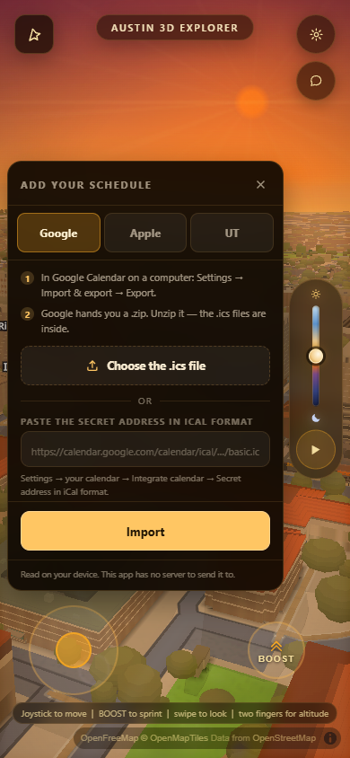
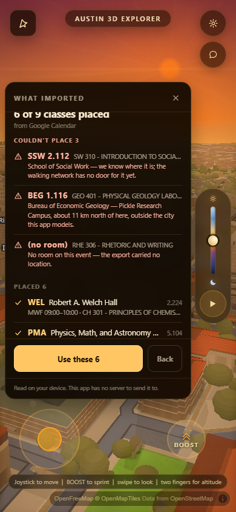
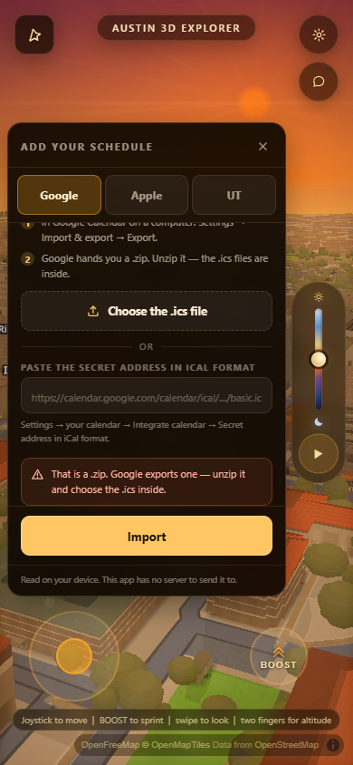
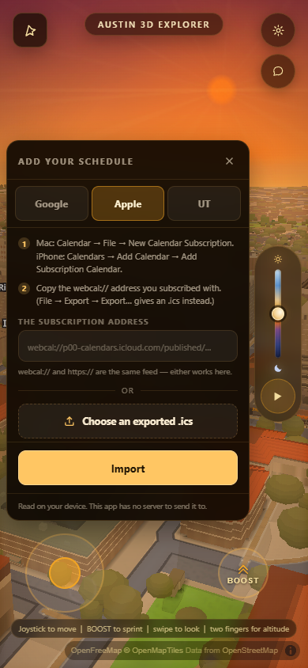
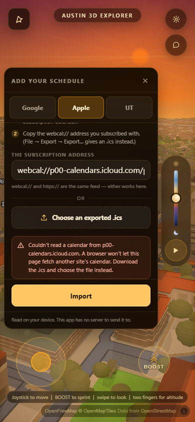
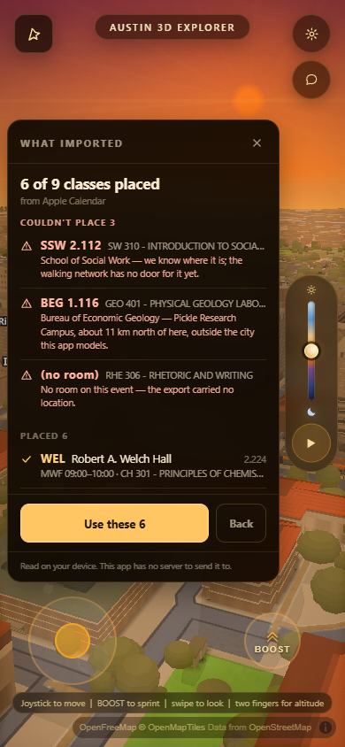
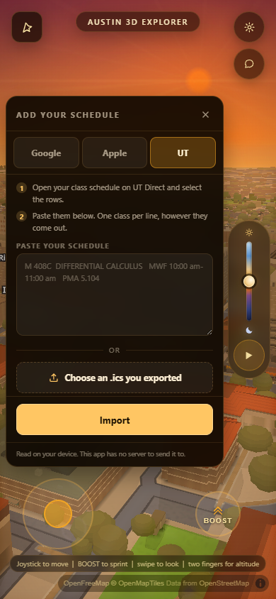
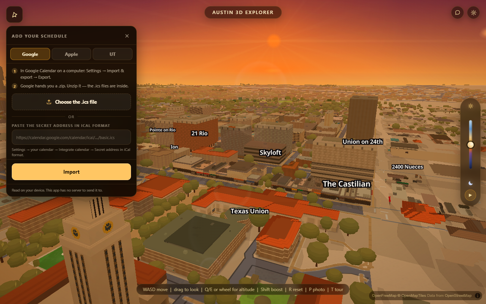
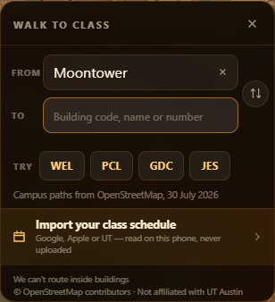
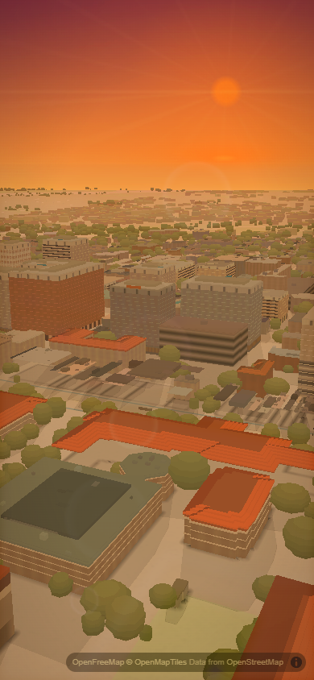

# The schedule-import screen — `acer/si-ui`

The screen a student adds their class schedule on. Three ways in — a file, an
address, or a block of pasted rows — one screen that says what landed, and a
second half of that screen that says what did **not** land and why. Behind
`?walk=1`, like everything else in this feature; `WAYFIND.on` is still `false`,
so a stranger loading `main` gets a byte-identical app.

Code: `js/wayfind.js` §9 (one appended block, nothing above it edited),
`style.css` (`#wf-imp` and its children). No new `<script>` tag, so
`index.html` and `_harness.html` did not have to move — `harness-drift.mjs`
reads 31 scripts on both, as it did before.

---

## What it looks like

**Google Calendar — the add screen and what happened**




**Google's own export is a `.zip`, and that is a real failure with a real
sentence** — every guide to exporting a Google calendar forgets it, so the
screen does not.



**Apple Calendar — a subscription address, and a subscription that cannot be
read.** Apple's flow is `webcal://`, an OS-registered URI scheme, so the
address is the thing a student already has in their hand — the address field is
first on this tab and the file picker second, which is the reverse of Google's
tab. That ordering is `IMP_SOURCES[].accepts`, one array per source, and it is
the whole layout rule.





The two result screens read the same because they **are** the same: Google's
export, Apple's export and Apple's live `webcal://` feed are all one ICS
payload, so there is one decoder behind all three and the tabs differ only in
what they tell you to go and fetch.

Panel-only crops of the two result screens, for reading the type:
[Google](../shots/import/bar-google/si-google-result-panel.png) ·
[Apple](../shots/import/bar-apple/si-apple-result-panel.png).

**UT registration — paste the rows**, because there is no first-party UT
`.ics`. See "what the research changed", below.




The pasted block is where all four failure reasons show up at once: a Pickle
lab, a code nobody recognises (`CAB 4.328`, a plausible mistyping of McCombs's
`CBA`), and a line with no room in it at all.

And the same screen at desktop width, because a panel that only works at one
size is a panel with a bug in it:



**The door in**, in the search panel that already exists:



**The payoff.** `Use these N` publishes the schedule on
`window.wayfindSchedule` and drops the first two consecutive classes into the
two ends of the router this app already has. That is the answer to "why import
a timetable into a *map*".


**And it does not exist on a recording surface.** This frame is
`?walk=1&clip=1` with `wayfindImportOpen()` called on purpose immediately
before the shutter — "hidden because nobody opened it" is not the claim.



---

## The shape, and why OCR and Registration Plus are a row each

Simeon asked for all three now and for image-OCR and a Registration-Plus API to
be addable later *without a rewrite*. The joint that buys that is here:

```
bytes ──[ decoder ]──> RAW ROWS ──[ impPlace ]──> classes + rejects ──> the screen
```

* A **decoder** is per-format and knows nothing about UT.
  `impDecodeICS` covers Google's export, Apple's export and any `webcal://`
  feed, because all three are the same VEVENT payload.
  `impDecodeUTText` covers a block of rows off UT Direct.
* A **RAW ROW** is `{ title, location, days, start, end, raw }` and nothing
  else. It is the only thing the two halves agree on.
* **`impPlace`** is per-campus and knows nothing about calendars: split the
  location on its first space, uppercase the head, ask the router.

So adding OCR later is `impDecodeImage(pixels) -> RAW ROWS` plus one row in
`IMP_SOURCES`; adding Registration Plus is `impDecodeRegPlus(json) -> RAW ROWS`
plus one row. Neither touches placement, the failure taxonomy, or a line of the
screen. **Neither is built now** — Simeon said "not in this pass" and the
comment in the source says so too, so nobody mistakes the empty seat for a
promise.

**The parser lane is a seam, not a dependency.** If a sibling lane publishes
`window.wayfindParseSchedule(text, { source }) -> RAW ROWS`, `impRawRows` uses
it and falls back to the reference decoders otherwise. That is why this screen
is photographable today instead of being a mockup waiting on someone else, and
why the swap costs neither side an edit.

The result object, versioned because a saved schedule outlives the tab:

```js
{ v: 1, source: 'gcal'|'apple'|'ut', via: 'file'|'url'|'text', at: <ms>,
  classes: [ { code, room, name, title, days:['TU','TH'], start:'14:00', end:'15:30',
               raw, status:'ok' } ],
  rejects: [ { …the same fields…, status:'offmap'|'nodoor'|'unknown'|'nolocation',
               place } ] }
```

---

## What the research changed, and what re-verifying it changed again

The three recon docs (`docs/import-bar-google.md` was never written;
`docs/import-bar-apple.md` and `docs/import-bar-ut.md` were) settled two things
that this screen is built on and would have been guessed wrong otherwise:

1. **Apple's `webcal://` and `https://` are the same feed and both ends accept
   the swap.** So the address field takes either and swaps the scheme itself —
   a student pasting a subscription address does not have to know that.
2. **There is no confirmed first-party UT `.ics` or webcal feed for a personal
   class schedule.** So the UT tab's primary control is a paste box, not a URL
   field. Building a "UT feed URL" control would have been a control that
   cannot work.

### The forcing function, re-verified rather than believed

The brief said 11 UT buildings cannot be routed to, and named them. I did not
take that. Every code in this app's own `UT_CELEBRATED` and `UT_ENTRANCES`
tables (67 of them) was put to the **live page's** `wayfindSearch` after the
graph had loaded. Three findings:

* **It is 12, not 11.** `HLB` — Dell Med's Health Learning Building — resolves
  by name in the register and has **zero walkable doors**. It is not in the
  brief's list, and it is not off-map: latitude 30.2756, which is main campus's
  own band, not Pickle's.
* **The Pickle claim is true.** All ten of `BE1 BEG EME FS1 FSL MER PX3 ROC SV1
  TCB` sit at latitude 30.382–30.392 against main campus's 30.28–30.29 — about
  11–12 km. Independently matched to UT Direct's own PRC building index in
  `docs/import-bar-ut.md`.
* **The SSW claim is false.** SSW is in UT's own register as a *main-campus*
  building (`maps.utexas.edu/buildings/utm/ssw`), and this codebase already
  carries two door rows and coordinates for it. Its unroutability is a gap in
  **this app's** walking graph, not a missing UT record.

That is why the screen has three different sentences and not one "couldn't
import". A class 400 m away and a class 11 km away are not the same news, and
telling a student their real building does not exist is the "wrong building,
beautifully drawn" failure with the lights off.

The failure taxonomy, one sentence each:

| status | when | what the row says |
|---|---|---|
| `offmap` | one of the ten PRC codes | *Bureau of Economic Geology — Pickle Research Campus, about 11 km north of here, outside the city this app models.* |
| `nodoor` | SSW, HLB, or any code the register knows with no walkable door | *School of Social Work — we know where it is; the walking network has no door for it yet.* |
| `unknown` | the head token is not a code this app knows | *CAB isn't a UT building code this app knows.* |
| `nolocation` | the event or line carried no room | *No room on this event — the export carried no location.* (ICS) / *No room on this line — nothing in it named a building.* (paste) |

---

## Defects this pass found by looking at the frame, not by reasoning

Every one of these was live in a working build and was caught by taking the
picture at 390 × 844 and reading it. None would have been caught by the code.

1. **The failures were below the fold.** The first cut listed the six that
   worked and then the three that did not — so the phone showed four ticks and
   nothing else. A student imports nine classes, sees ticks, believes they are
   done, and finds out on the second Tuesday of term. The failures come first
   now; the count line above them already delivers the good news in five words.
   Asserted: all 3 of 3 failure rows are above the fold on the result screen.
2. **The error message was invisible and it took the address with it.** The
   error was the last child of the scrolling body, so pressing Import on a
   `webcal://` address that cannot be fetched appeared to do nothing at all —
   and the re-render wiped the field, so the address was gone too. This is
   exactly the lesson `#wf-more` in the search sheet had already learned and
   written down. The error now has its own non-scrolling row directly above the
   action, and `url` / `text` live in state, not in the DOM. Asserted: the
   message is on screen, and the typed address survives.
3. **The panel was too short.** At `74vh` the Google hint line and Apple's
   second control were both below a fold with no scroll affordance. Raised to
   `84vh`, which puts the top edge at y135 — measured against the two stacked
   top-right buttons, which end at y112. Asserted: the panel does not overlap
   `#wf-button`, `#gfx-button` or `#fb-button`, and every control the source
   promises is reachable without a scroll.
4. **A course number was being read as a room.**
   `RHE 306  RHETORIC AND WRITING  42655  MW 3:00 pm-4:00 pm` has no room in
   it, and the parser reported it as a class in a building called `RHE`.
   Separately, `MW 3:00 pm` matched the room pattern — two capitals, a space, a
   digit — so a *day abbreviation* was very nearly a building. `import-bar-ut.md`
   flagged this trap ("the field of study and the building can look identical
   in shape") before a line was written. Fixed structurally: a line is read by
   subtraction — the time is found and blanked, the days are found and blanked,
   and the room is only looked for **after** where they were, because UT's own
   column order is course · title · unique · days · hour · room. A reflowed
   paste that puts the room first now says "no room", which the student sees and
   can fix; that is a much better mistake than a confident route to a building
   nobody has a class in.
5. **The second line truncated the wrong half.** It read
   `C S 429 - COMPUTER ORGANIZATION AND… ` with the days and time cut off. Days
   and time lead now, the course title trails, so the ellipsis eats the thing
   the student can already recite.
6. **The error named a control the same frame was hiding.** With defect 2
   fixed, the Apple tab's message read *"…download the .ics and choose the file
   instead"* — and the file button it means was scrolled off the bottom of the
   body, because the message itself costs the body about 86 px. An instruction
   pointing at something you cannot see is worse than no instruction. The body
   now scrolls to its end whenever an error appears, which is not an arbitrary
   place: every source puts its numbered steps first and its **controls** last,
   so the bottom of that scroller is always the doing half. Asserted: with the
   error on screen, `.wf-imp-file-btn` is inside the body's visible rect.

---

## How it was verified

One browser, one page, `?walk=1&drift=0&intro=0`,
`window.cancelGraphicsAutoDetect()` at the top, viewport 390 × 844, every frame
taken twice with the second kept. Server: `python scripts/serve.py 8913`.
Fixtures live beside the frames: [`fixture-google-export.ics`](../shots/si/ui/fixture-google-export.ics)
(nine VEVENTs — a real-shaped Fall 2026 schedule with one PRC lab, one SSW
class and one event with no `LOCATION`) and
[`fixture-apple-webcal.ics`](../shots/si/ui/fixture-apple-webcal.ics) (the same
term, published the way Apple publishes one, served over HTTP so the
subscription path runs end to end rather than being mocked).

Asserted, not eyeballed:

* the panel is on screen and inside the viewport on every one of the six
  screens photographed;
* it does not overlap the three top buttons;
* every control a source promises is reachable without scrolling;
* all failure rows are above the fold;
* the error message is on screen, the typed address survives it, and the
  control the message points at is visible under it;
* the panel is inside the viewport and does not need to scroll at 1280 × 800;
* `Use these N` fills **both** ends of the router and publishes
  `window.wayfindSchedule`;
* and, on `?clip=1`, `?autopilot=1` and `?sliderdemo=1`, with the import screen
  **opened on purpose first**, `#wf-imp`, `#wf-imp-entry`, `#wf-button`,
  `#wf-sheet` and `#wf-pill` all measure zero or compute `display:none`.

### And it did not break what it was appended to

Own-lane passing is not proof a sibling's work survived, so the two claims the
existing feature makes were re-run against this branch rather than assumed:

* **The shipped single-leg router still routes.** `wayfindRoute('JES','WEL')`
  returns `450 m`, `5–7 min`, `JES → WEL`, headline
  *"5-7 min walk · 450 m · No stairs on this route"*, and the answer bar draws
  at 366 × 156 with *"Robert A. Welch Hall · Entrances are on this side"* under
  it. No page error on either load.
* **Off is still off.** `?walk=0&from=JES&to=WEL` — the explicit veto that
  beats every other switch — leaves **zero** of `wf-root wf-button wf-sheet
  wf-pill wf-imp wf-imp-entry wf-imp-file` in the document, **zero**
  `input[type=file]` anywhere on the page, no `wayfindRoute` or
  `wayfindImportOpen` on `window`, and no `wayfind*` map source, measured six
  seconds after the map exists — long enough for §9's install poll to have
  fired seventy-odd times if it were going to fire at all. That check exists
  because a self-booting poll is exactly the shape of thing that quietly breaks
  a byte-identical-`main` promise, and this feature makes one.

`harness-drift.mjs`: 31 scripts in `index.html`, 31 in `_harness.html` — no new
`<script>` tag was needed, because §9 lives in a file both already load.

The capture-mode rule needed one edit to `style.css`, and it is worth naming:
the existing `.clip` rule hid `#wf-button, #wf-sheet, #wf-pill` and carried a
comment saying every element this feature adds is a child of one of those three
— "which is why the rule has not had to grow". `#wf-imp` is a fourth child of
`#wf-root`, because a panel that covers the sheet cannot live inside it. It is
listed in the rule now, and the comment says so, because that sentence is what
would have let this ship visible in a recording.

---

## Requests to other lanes — things I did not do because they are not mine

1. **The parser lane**: publish
   `window.wayfindParseSchedule(text, { source }) -> RAW ROWS` with the field
   names above. `impRawRows` already prefers it and falls back silently, so
   landing it needs no edit here.
2. **Whoever owns the walking graph**: `SSW` and `HLB` are registered
   main-campus buildings with coordinates in this codebase and no walkable
   door. That is a graph gap, not an import one, and it is a *smaller* fix than
   the brief's "SSW isn't in UT's register" framing implied. Until it lands the
   import screen names them honestly.
3. **Nothing in the shared `WAYFIND` taste block was touched**, and no existing
   function in `js/wayfind.js` was edited — §9 is appended whole and the entry
   row is a DOM append onto `#wf-sheet`, so four concurrent lanes in this file
   have nothing to conflict with.

## Not built, on purpose

Image-OCR and a Registration-Plus API integration. Both have a named seat in
`IMP_SOURCES` and a one-function contract; neither has code, because Simeon
said "not in this pass". Persisting the imported schedule across reloads is
also not built — nothing here writes storage, which is what makes the "read on
your device, this app has no server to send it to" line on the screen true.
