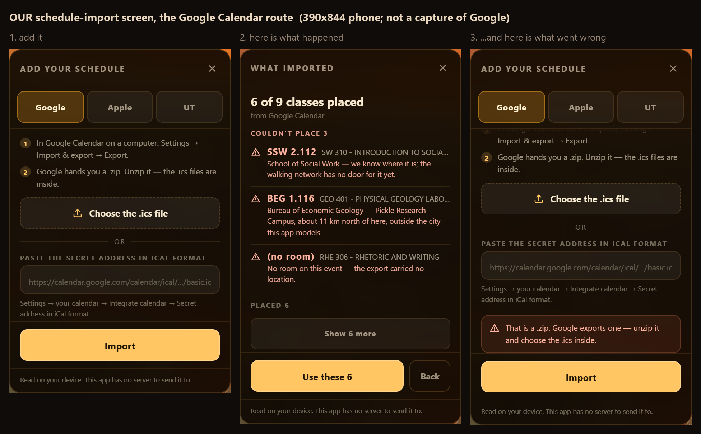
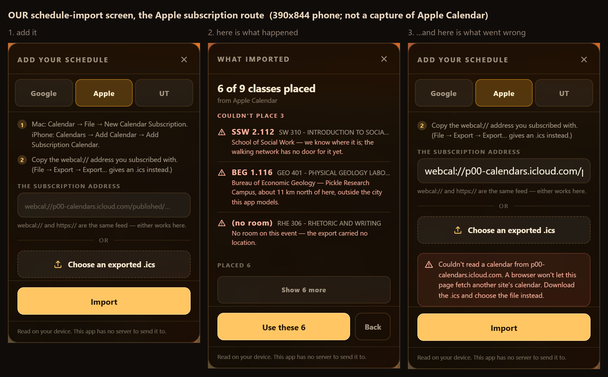
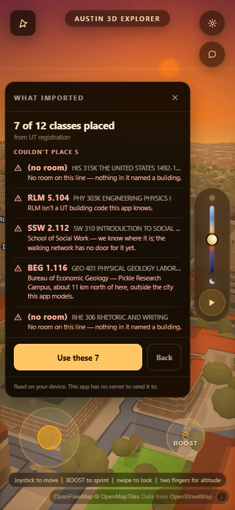
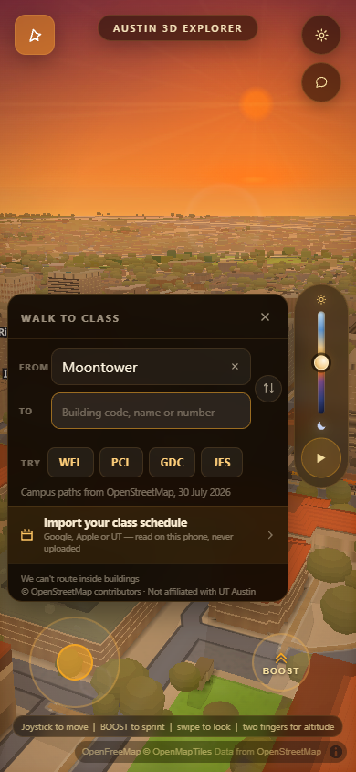
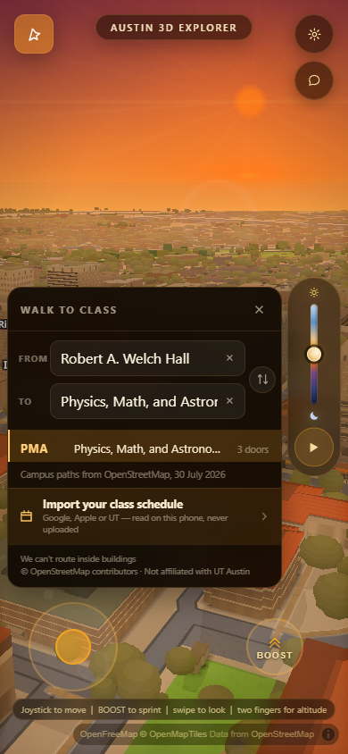
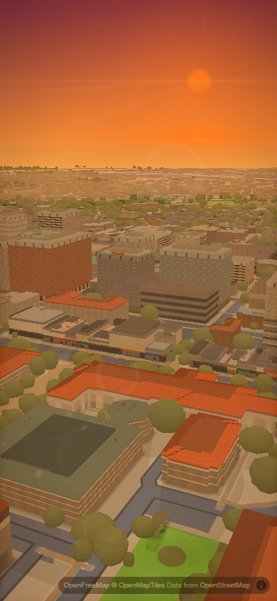
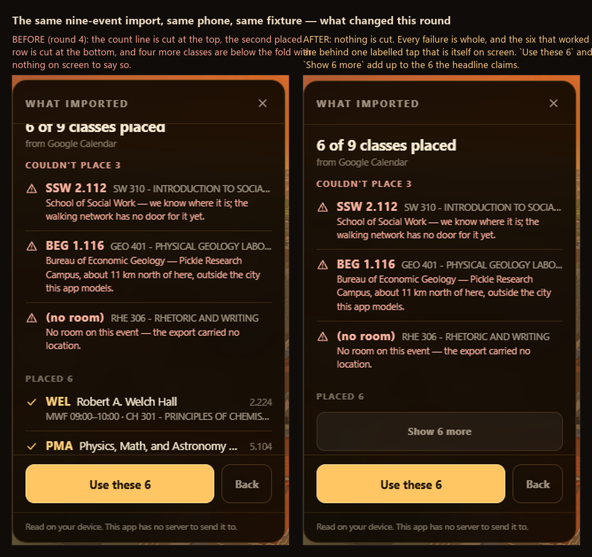
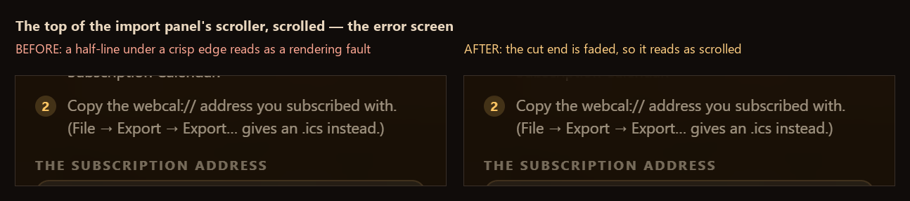

# The schedule-import screen — `acer/si-ui`

The screen a student adds their class schedule on. Three ways in — a file, an
address, or a block of pasted rows — one screen that says what landed, and a
second half of that screen that says what did **not** land and why. Behind
`?walk=1`, like everything else in this feature; `WAYFIND.on` is still `false`,
so a stranger loading `main` gets a byte-identical app.

Code: `js/wayfind.js` §9 (one appended block, nothing above it edited),
`style.css` (`#wf-imp` and its children). No new `<script>` tag, so
`index.html` and `_harness.html` did not have to move — `harness-drift.mjs`
reads 31 scripts on both, as it did before.

---

## READ THIS BEFORE YOU OPEN THE PICTURES

**Every image under `shots/import/` is a screenshot of THIS app.** Not one of
them is a capture of Google Calendar or of Apple Calendar. The folders are
named `bar-google` and `bar-apple` because those two products are the *bar*
this screen is judged against; the bar itself is not stored in this repo,
because Google's import screen is behind a signed-in Google account and Apple
Calendar is macOS/iOS software this harness cannot drive. The bar was read as
documentation instead — Apple's own support guides are quoted with URLs in
`docs/import-bar-apple.md`.

Round 4 of this lane shipped these frames named `si-google-add.png`,
`si-apple-result.png` and so on, inside `bar-google/` and `bar-apple/`. A
reviewer would reasonably read `bar-apple/si-apple-add.png` as a picture of
Apple. It never was. The honest admission existed — in a `NOTE.md` nobody
linked — and the file names contradicted it. **Names beat notes.** So every
frame is `ours-*` now, each folder carries a `README.md` at its top level
saying exactly this, and the statement is here, above the pictures, instead of
two directories away.

That was the round-4 critic's finding, and it was correct.

---

## What it looks like

**Google Calendar — the add screen, what happened, and what went wrong**, side
by side at 390 × 844:



**Apple Calendar — the same three**, and the subscription address is *first*
here where the file button is first on Google's tab. That is not a coin toss:
Apple's flow is `webcal://`, an OS-registered URI scheme, so the address is the
thing a student already has in their hand. The ordering is one array —
`IMP_SOURCES[].accepts` — and it is the whole layout rule.



The middle panel is the same on both because it **is** the same: Google's
export, Apple's export and Apple's live `webcal://` feed are one ICS payload,
so there is one decoder behind all three and the tabs differ only in what they
tell you to go and fetch.

Neither error is staged. `bar-google/ours-error-zip.png` is Google's actual
`.zip` handed to the page's own `<input type=file>`. `bar-apple/ours-error-blocked.png`
is a real `fetch()` of `https://p00-calendars.icloud.com/published/…` — the
scheme swap is the app's — really refused by iCloud's cross-origin policy.

Full-frame versions of all six, with the city behind them:
[Google add](../shots/import/bar-google/ours-add.png) ·
[result](../shots/import/bar-google/ours-result.png) ·
[.zip](../shots/import/bar-google/ours-error-zip.png) ·
[Apple add](../shots/import/bar-apple/ours-add.png) ·
[result](../shots/import/bar-apple/ours-result.png) ·
[blocked](../shots/import/bar-apple/ours-error-blocked.png).

**UT registration — paste the rows**, because there is no first-party UT
`.ics`. See "what the research changed", below.




The pasted block is where all four failure reasons show up at once: a Pickle
lab, a code nobody recognises (`RLM`, the old name for `PMA`), and a line with
no room in it at all.

**The door in**, in the search panel that already exists:



**The payoff.** `Use these N` publishes the schedule on
`window.wayfindSchedule` and drops the first two consecutive classes into the
two ends of the router this app already has. That is the answer to "why import
a timetable into a *map*".



And the same screen at desktop width, because a panel that only works at one
size is a panel with a bug in it: [1280 × 800](../shots/si/ui/ours-desktop.png).

**And it does not exist on a recording surface.** This frame is
`?walk=1&clip=1` with `wayfindImportOpen()` called on purpose immediately
before the shutter — "hidden because nobody opened it" is not the claim.



---

## What this round changed, and both changes came out of a photograph

### 1. The result screen was hiding most of the count it was quoting



Round 4's own committed evidence shows it. Nine events go in. The headline says
*6 of 9 classes placed*. Below three failures, the section header says
`PLACED 6` — and then **one** placed row lands whole, the second is cut through
its middle by the edge of the scroller, and four more are below the fold with
nothing anywhere on the panel to say they exist. `+ N more` did not fire,
because six is exactly `IMP.resultPeek` and nothing had been truncated. The
button underneath said `Use these 6`.

A screen that names a number, shows one of it, and then routes you somewhere on
the strength of the rest is asking to be trusted about a thing it is hiding.

Two things were wrong and both are fixed:

* **`+ N more` was a caption, not a control.** Dim type, no handler. If a
  student did import nine placeable classes, three of them were named nowhere
  and reachable by nothing. It is a button now — `Show N more`, full width,
  `--touch-min` tall, and it says what pressing it does rather than restating
  the arithmetic above it.
* **`IMP.resultPeek` was a fixed number doing a job only geometry can do.**
  How many placed rows fit depends entirely on what is *above* them: three
  failures whose reasons each wrap to two or three lines cost about 210 px of a
  373 px body, and a clean import costs none of it. So `impFitList` renders
  once, counts the rows that landed whole inside the scroller, and re-renders
  with the list cut to what actually fits and a real button under it. The
  count on the screen became a count the student can check with one tap.

  It terminates by construction — each pass renders one fewer row than the last
  and `fit` never grows — and `fitDone` latches the moment the panel is whole,
  so a thumb on the scroller cannot restart it.

  **The first cut of that got it wrong in the exact way this feature has been
  wrong before**: it stopped as soon as the rows fitted, and the `Show 6 more`
  it had just added landed below the fold. That is the same defect as an error
  message naming a file button the same frame is hiding, which this panel had
  already fixed once. The exit condition is not "the rows fit", it is "the rows
  fit *and* the way to the rest is reachable" — and reachable means clear of
  the shade below, too, or the button is drawn half-dissolved.

  `resultPeek` is still a taste value and still the ceiling; `minPeek` is the
  floor and it is **0** on purpose. When the failures have eaten the whole
  panel, `PLACED 6` over a visible `Show 6 more` is a complete honest screen and
  one placed row over a button nobody can see is not.

  **The shrink is one synchronous loop, not a chain of `requestAnimationFrame`s
  — and that was found by measuring, not by reasoning.** The first version
  posted each pass to the next frame, which reads perfectly sensibly. On the
  headless Chrome this suite drives, a UT paste with five failures was still
  visibly mid-shrink **four seconds** after the result rendered, with
  `Show 6 more` hanging below the fold the whole time. Whatever throttles rAF
  for an offscreen surface will throttle it on a phone whose browser has
  decided the tab is busy, and a panel that reflows six times in front of a
  student is worse than the defect it is fixing. `getBoundingClientRect` forces
  layout, so the measurement is available immediately; the whole loop is at
  most seven layouts of one small panel.

Expanded, with the list scrolled: all seven of a seven-class paste, and
`Use these 7` agreeing with what is on screen.


**The one case this does not fully solve, named rather than hidden.** A paste
with *five* failures fills the body on its own — five reasons that each wrap to
two lines is 300-odd px of a 373 px scroller. At `minPeek: 0` there is nothing
left to shrink, so `PLACED 7` and `Show 7 more` sit about 85 px below the fold
and the shade is what says so. That is the right trade and not a fallback: the
five sentences a student has to act on are worth more than a sample of the
seven that worked, and the two numbers they need — *7 of 12 classes placed* and
`Use these 7` — are both above the fold already.

### 2. Importing too fast said every class was unreachable

This one was not visible in any frame and was not being looked for. It fell out
of running the UT paste twice in a script and getting two different answers.

`impPlace` asks `wayfindSearch` whether a code has a walkable door.
`impOpen` starts `loadGraph()` when the panel opens — deliberately, so the
fetch overlaps the student reading the instructions — but **nothing waited for
it**. Reproduced on the real page: open the panel, paste twelve real UT rows,
press Import inside two seconds:

```
12 · Couldn't place 12 · Nothing here can be routed to
```

Do exactly the same thing five seconds later and it says `7 of 12 classes
placed`. Same input, same build, two different answers, and nothing on the
panel suggests waiting — the wrong one is delivered with the same confidence as
the right one. On a screen whose whole job is telling a student the truth about
their own timetable, that is the worst shape a bug can have.

`impFinish` awaits the graph now before it builds anything. `loadGraph`
memoises its own promise, so this costs nothing after the first import and
cannot start a second fetch, and a rejection is swallowed on purpose — if the
graph genuinely will not load, the honest thing is still to place what the
static register can and say so per row, which is what the failure taxonomy is
for. `window.wayfindImportText` and `window.wayfindImportParse` return promises
now for the same reason: a harness hitting this race got a confident wrong
number instead of a visibly wrong screen.

Asserted, and it is the assertion that would have caught this in round 4: a
fresh page, panel opened, twelve rows pasted, Import pressed **300 ms later**
gives `Use these 7` and five failures — the same answer as pressing it a minute
later.

### 3. A cut edge looked exactly like a finished edge



`#wf-imp-body` is the one child of the panel that yields height, so on a phone
it is nearly always shorter than its contents — and it clipped them against a
crisp border with no mark of any kind. On the error screen that is worse than
untidy: `impRenderErr` scrolls the body to its end **on purpose**, so the
control the message names is under the message, and the end landed mid-line.
The bottom halves of the letters of "…Subscription Calendar" sat under the tab
divider looking like a rendering fault.

Each end that has content past it is faded now, and an end that has nothing
past it keeps its hard edge — which is what makes the fade mean something. A
half-line under a fade reads as "there is more up there"; a half-line under a
crisp border reads as a bug.

It is a `mask-image`, not two absolutely-positioned gradient children, and that
is the whole reason it is three CSS rules. `#wf-imp-body` is a scroller inside a
translucent panel over a live 3D city: an overlay would have to be painted in
the panel's own glass colour to hide the text under it, and that colour is
`--wf-glass-solid` composited over whatever the map is doing that second — not
a colour this stylesheet can name. A mask removes pixels instead of covering
them, so it is correct over any scene at any time of day.

**Measured, not eyeballed.** Same build, same scroll position, one class
toggled, screenshots diffed: in the top 78 px of the scroller **317 pixels
change, to a maximum of 131/255**; below the fade band, in the same strip,
**0 pixels change, maximum delta 1/255**. The mask acts at the cut edge and
nowhere else.

---

## The shape, and why OCR and Registration Plus are a row each

Simeon asked for all three now and for image-OCR and a Registration-Plus API to
be addable later *without a rewrite*. The joint that buys that is here:

```
bytes ──[ decoder ]──> RAW ROWS ──[ impPlace ]──> classes + rejects ──> the screen
```

* A **decoder** is per-format and knows nothing about UT.
  `impDecodeICS` covers Google's export, Apple's export and any `webcal://`
  feed, because all three are the same VEVENT payload.
  `impDecodeUTText` covers a block of rows off UT Direct.
* A **RAW ROW** is `{ title, location, days, start, end, raw }` and nothing
  else. It is the only thing the two halves agree on.
* **`impPlace`** is per-campus and knows nothing about calendars: split the
  location on its first space, uppercase the head, ask the router.

So adding OCR later is `impDecodeImage(pixels) -> RAW ROWS` plus one row in
`IMP_SOURCES`; adding Registration Plus is `impDecodeRegPlus(json) -> RAW ROWS`
plus one row. Neither touches placement, the failure taxonomy, or a line of the
screen. **Neither is built now** — Simeon said "not in this pass" and the
comment in the source says so too, so nobody mistakes the empty seat for a
promise.

**The parser lane is a seam, not a dependency.** If a sibling lane publishes
`window.wayfindParseSchedule(text, { source }) -> RAW ROWS`, `impRawRows` uses
it and falls back to the reference decoders otherwise. That is why this screen
is photographable today instead of being a mockup waiting on someone else, and
why the swap costs neither side an edit.

The result object, versioned because a saved schedule outlives the tab:

```js
{ v: 1, source: 'gcal'|'apple'|'ut', via: 'file'|'url'|'text', at: <ms>,
  classes: [ { code, room, name, title, days:['TU','TH'], start:'14:00', end:'15:30',
               raw, status:'ok' } ],
  rejects: [ { …the same fields…, status:'offmap'|'nodoor'|'unknown'|'nolocation',
               place } ] }
```

---

## What the research changed, and what re-verifying it changed again

The recon docs settled two things this screen is built on and would have been
guessed wrong otherwise:

1. **Apple's `webcal://` and `https://` are the same feed and both ends accept
   the swap.** So the address field takes either and swaps the scheme itself —
   a student pasting a subscription address does not have to know that.
2. **There is no confirmed first-party UT `.ics` or webcal feed for a personal
   class schedule.** So the UT tab's primary control is a paste box, not a URL
   field. Building a "UT feed URL" control would have been a control that
   cannot work.

### The forcing function, re-verified rather than believed

The brief said 11 UT buildings cannot be routed to, and named them. Every code
in this app's own `UT_CELEBRATED` and `UT_ENTRANCES` tables (67 of them) was put
to the **live page's** `wayfindSearch` after the graph had loaded. Three
findings:

* **It is 12, not 11.** `HLB` — Dell Med's Health Learning Building — resolves
  by name in the register and has **zero walkable doors**. It is not in the
  brief's list, and it is not off-map: latitude 30.2756, main campus's own band.
* **The Pickle claim is true.** All ten of `BE1 BEG EME FS1 FSL MER PX3 ROC SV1
  TCB` sit at latitude 30.382–30.392 against main campus's 30.28–30.29 — about
  11–12 km. Independently matched to UT Direct's own PRC building index in
  `docs/import-bar-ut.md`.
* **The SSW claim is false.** SSW is in UT's own register as a *main-campus*
  building, and this codebase already carries two door rows and coordinates for
  it. Its unroutability is a gap in **this app's** walking graph, not a missing
  UT record.

That is why the screen has three different sentences and not one "couldn't
import". A class 400 m away and a class 11 km away are not the same news, and
telling a student their real building does not exist is the "wrong building,
beautifully drawn" failure with the lights off.

| status | when | what the row says |
|---|---|---|
| `offmap` | one of the ten PRC codes | *Bureau of Economic Geology — Pickle Research Campus, about 11 km north of here, outside the city this app models.* |
| `nodoor` | SSW, HLB, or any code the register knows with no walkable door | *School of Social Work — we know where it is; the walking network has no door for it yet.* |
| `unknown` | the head token is not a code this app knows | *RLM isn't a UT building code this app knows.* |
| `nolocation` | the event or line carried no room | *No room on this event — the export carried no location.* (ICS) / *No room on this line — nothing in it named a building.* (paste) |

---

## Defects earlier rounds found the same way, kept here so they stay fixed

1. **The failures were below the fold.** The first cut listed the six that
   worked and then the three that did not — four ticks and nothing else on a
   phone. The failures come first now; the count line above them already
   delivers the good news in five words.
2. **The error message was invisible and it took the address with it.** The
   error was the last child of the scrolling body, so pressing Import on a
   `webcal://` address that cannot be fetched appeared to do nothing at all —
   and the re-render wiped the field. The error has its own non-scrolling row
   directly above the action now, and `url` / `text` live in state, not in the
   DOM.
3. **The panel was too short.** At `74vh` the Google hint line and Apple's
   second control were both below a fold with no scroll affordance. `84vh` puts
   the top edge at y135, measured against the two stacked top-right buttons,
   which end at y112.
4. **A course number was being read as a room.** `RHE 306 … MW 3:00 pm-4:00 pm`
   has no room in it and was reported as a class in a building called `RHE`;
   separately `MW 3:00` matched the room pattern. Fixed structurally: a line is
   read by subtraction — time found and blanked, days found and blanked, room
   looked for only after where they were.
5. **The second line truncated the wrong half.** Days and time lead now, the
   course title trails, so the ellipsis eats the thing the student can recite.
6. **The error named a control the same frame was hiding.** The body scrolls to
   its end whenever an error appears — every source puts its numbered steps
   first and its controls last, so the bottom of that scroller is always the
   doing half.

---

## How it was verified

One browser, one page, `?walk=1&drift=0&intro=0`,
`window.cancelGraphicsAutoDetect()` at the top, viewport 390 × 844, every frame
taken twice with the second kept. Server: `python scripts/serve.py 8913`.
Fixtures live beside the frames:
[`fixture-google-export.ics`](../shots/si/ui/fixture-google-export.ics) (nine
VEVENTs — a real-shaped Fall 2026 schedule with one PRC lab, one SSW class and
one event with no `LOCATION`) and
[`fixture-apple-webcal.ics`](../shots/si/ui/fixture-apple-webcal.ics) (the same
term, published the way Apple publishes one, served over HTTP so the
subscription path runs end to end rather than being mocked).

**35 assertions, all passing.** The ones worth naming:

* importing **300 ms after opening the panel** — far too soon for the walking
  graph — gives `Use these 7` and five failures, the same answer as importing a
  minute later, with all five failure rows whole and the placed list collapsed
  to a control rather than clipped;

* the panel is inside the viewport and clears `#wf-button`, `#gfx-button` and
  `#fb-button` — measured at `8,179 308×479` in `390×844`, against buttons at
  `16,16`, `330,16` and `330,68`;
* every control a source promises is reachable without a scroll on both add
  screens (overflow 0 px);
* all three failure rows are whole and above the fold, and **no placed row is
  left hanging over it**;
* the classes that did not fit are behind a real `Show N more` button, that
  button is on screen **and clear of the shade** (4 px of clearance), and
  `Use these 6` + `Show 6 more` add up to the 6 the headline claims;
* the Google result was produced through the page's own `<input type=file>`, so
  its `(no room)` row says *"the export carried no location"* — the file
  path's sentence. The paste path's sentence would be the wrong one there, and
  a screenshot taken by calling an internal function would have shown it;
* the error message is on screen, the typed `webcal://` address survives it,
  and the `.ics` button the message points at is visible under it;
* the panel fits at 1280 × 800 with no scroll — `344×450` at y68;
* `Use these N` fills **both** ends of the router (`Robert A. Welch Hall`,
  `Physics, Math, and Astronomy Building`) and publishes `window.wayfindSchedule`
  at `v: 1`;
* and, on `?clip=1`, `?autopilot=1` and `?sliderdemo=1`, with the import screen
  **opened on purpose first**, `#wf-imp`, `#wf-imp-entry`, `#wf-button`,
  `#wf-sheet`, `#wf-pill` and `#wf-imp-body` all measure zero or compute
  `display:none`.

### And it did not break what it was appended to

Own-lane passing is not proof a sibling's work survived, so both claims the
existing feature makes were re-run against this branch **after** merging
`origin/main` into it, not before:

* **The shipped single-leg router still routes.** `wayfindRoute('JES','WEL')`
  returns the headline *"5-7 min walk · 450 m · No stairs on this route"* —
  the same 450 m round 4 measured. No page error on either load.
* **Off is still off.** `?walk=0&from=JES&to=WEL` leaves **zero** of
  `wf-root wf-button wf-sheet wf-pill wf-imp wf-imp-entry wf-imp-file` in the
  document, **zero** `input[type=file]` anywhere on the page, no `wayfindRoute`,
  `wayfindImportOpen`, `wayfindImportSet` or `wayfindSchedule` on `window`, and
  no `wayfind*` map source — measured six seconds after the map exists, long
  enough for §9's install poll to have fired seventy-odd times if it were going
  to fire at all.

`harness-drift.mjs`: 31 scripts in `index.html`, 31 in `_harness.html` — no new
`<script>` tag was needed, because §9 lives in a file both already load.

The three drivers that produced every frame and number above lived in
`scripts/verify/_si-ui-drive.mjs`, `_si-ui-shade.mjs` and `_si-ui-ut.mjs`, and
were deleted after the runs; they are scratch scripts, not gates. Scratch
frames went to the scratchpad. The frames committed here are the ones this
document cites and no others — 17 of them, 4.4 MB, every one referenced above.
`ours-desktop.png` is the only frame that is not 1:1: it is scaled to two
thirds, because the claim it supports is a layout claim readable at that size
and 1280 × 800 of a whole city costs 800 KB in every parallel worktree.

---

## Requests to other lanes — things I did not do because they are not mine

1. **The parser lane**: publish
   `window.wayfindParseSchedule(text, { source }) -> RAW ROWS` with the field
   names above. `impRawRows` already prefers it and falls back silently, so
   landing it needs no edit here.
2. **Whoever owns the walking graph**: `SSW` and `HLB` are registered
   main-campus buildings with coordinates in this codebase and no walkable
   door. That is a graph gap, not an import one, and it is a *smaller* fix than
   the brief's "SSW isn't in UT's register" framing implied. Until it lands the
   import screen names them honestly.
3. **Nothing in the shared `WAYFIND` taste block was touched**, and no existing
   function in `js/wayfind.js` was edited — §9 is appended whole and the entry
   row is a DOM append onto `#wf-sheet`, so four concurrent lanes in this file
   have nothing to conflict with.

## Not built, on purpose

Image-OCR and a Registration-Plus API integration. Both have a named seat in
`IMP_SOURCES` and a one-function contract; neither has code, because Simeon
said "not in this pass". Persisting the imported schedule across reloads is
also not built — nothing here writes storage, which is what makes the "read on
your device, this app has no server to send it to" line on the screen true.
