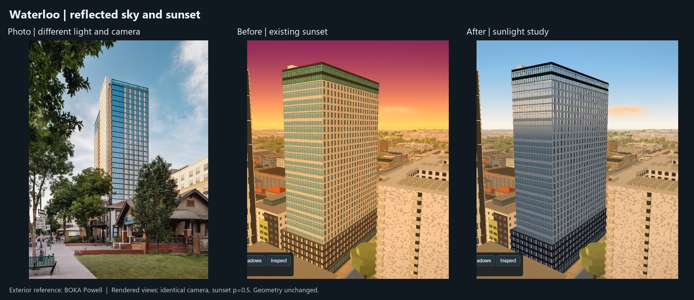
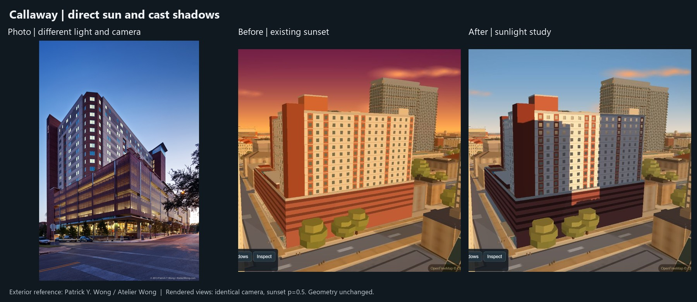

# Sunlit materials study

Branch: `codex/sunlit-materials`. This is an opt-in lighting study on **Yugo
Austin Waterloo** and **The Callaway House Austin**. Building shapes and authored
colours are unchanged. The natural lighting direction was accepted on 2026-09-19.
This remains a two-building technical preview before a wider lighting rollout,
not a completed building-matching round.

This document also records the continuation handoff. `HANDOFF.md` overlaps the
two existing open decision PRs (#164 and #189), so this pass leaves that shared
file untouched under the file-ownership rule. No code files overlap those PRs.

## Look at it

Run `python scripts/serve.py 8458` from this checkout, then open
`http://127.0.0.1:8458/scripts/verify/sunlight.html`. The page embeds the real
`index.html`. It waits for the apartment meshes, cancels graphics auto-detect,
and supplies the same camera for Before and After. Use the building selector,
Day / Sunset / Night, and Other angle. `?sunlight=1` enables the study in the
ordinary app; the default remains off.

The photograph panels are material/architecture references, taken from different
cameras and in different light. Only the two rendered panels are matched-camera
comparisons. Local reference filenames:

- `yugo-waterloo/yugo-waterloo__west-south-corner__04.jpg`, BOKA Powell exterior
  photograph (source attribution recorded in the reference folder's `notes.md`).
- `callaway-house/callaway-house__north-west-corner-blue-hour__01.jpg`, exterior
  photograph by Patrick Y. Wong / Atelier Wong, from the Callaway reference folder.

## What changes

- Painted walls receive directional warm sunlight and cooler skylight in shade.
  Existing authored daytime colours provide the material colour.
- Explicit glass materials reflect a directional sky model. Reflection colour
  and the sun highlight move with the camera, using the same sun direction as
  the visible sky. The old fixed golden colour ramp no longer supplies the
  glass's reflected light.
- Two cached sun depth maps allow the existing custom building geometry to cast
  shadows onto the study buildings. The shared MapLibre viewport and scissor
  state are restored after the offscreen pass.
- The opt-in visible sky is less saturated at golden hour and shares its palette
  with the reflected sky. Twilight smoothly returns to the existing night look.

All tuning is in `SLOPES.sunlight` near the top of `js/slopes.js`: colours,
ambient/direct balance, glass reflectance, highlight width/strength, sky blend,
shadow resolution/radius/bias and target locations. The two apartment JSON files
declare which existing colour keys are brick and glass; unclassified surfaces
use the matte study material. Study membership is assigned when geometry builds.
Other tuning and the enable switch are read live.

## Limits

This is an analytic sky reflection, not a captured reflection of the surrounding
city. There is no reflected neighbour detail, indirect light bounce, bloom pass
or ray tracing. MapLibre fill-extrusion buildings do not enter the custom shadow
maps. Shadow coverage is local to the two study buildings; this implementation
must not simply be enabled citywide. The two 1536-square RGBA/depth targets also
add GPU memory once enabled and remain cached until the layer is removed.
Mobile cost has not been verified.

The wider building-matching queue and `acer/match-dobie` remain separate work.
Do not merge that branch based on this study's checks.

## Verification

`Run checks` tests the nighttime shader toggle with an adjacent unchanged control,
geometry identity, shared sun direction, live/cached shadow maps, WebGL errors and
shader diagnostics. Night capture runs after settling and reads pixels inside a
map render event; a non-black check prevents an empty framebuffer from passing.
Full time-of-day transitions and the before/after palette are inspected visually.

`Benchmark A/B` alternates six runs (three each), waits 4.2 seconds after each
switch, and forces 91 actual map renders per run. It reports the 90 frame
intervals and the custom-layer render count. Use the minimum of the three run
means per mode. This is unthrottled browser frame pacing, not isolated GPU time
or a load-time benchmark. A stationary requestAnimationFrame-only measurement
was rejected because it could measure an idle map.

Static checks: JavaScript syntax, `harness-drift.mjs`,
`apartment-window-rule.mjs`, and `git diff --check`.

Waterloo's controlled nighttime toggle changed **0 / 1,917,867 pixels**, as did
the adjacent unchanged control. The original full time-of-day retint comparison
was rejected: it changed 13,097 pixels on a first run, then 1,032 warmed. Forcing
an atlas/tiling update is a confound when testing an otherwise identical shader.
The corrected check isolates the shader switch after the night transition.

Waterloo sunset, balanced preset, unthrottled desktop: minima of three
interleaved run means were **24.85 ms before / 27.38 ms after**. Every run counted
91 custom-layer renders. This measured a roughly 2.53 ms increase in this view,
not a promise for other devices or a GPU-only cost.
The browser reports ANGLE / AMD Radeon Graphics (0x1638), Direct3D11. The custom
apartment scene contains 2,593,067 triangles in this preset. Measurements and
check outputs are recorded in [the evidence file](sunlit-materials-evidence.json).

Callaway passed the same checks, also with zero changed night pixels. Deliberately
disabling shadows made the check fail (`shadowActive: false`, zero shadow maps),
then restoring them made it pass. Callaway sunset frame minima were **26.67 ms
before / 27.16 ms after**; the runs have substantial scheduling variance, so do
not extrapolate these small differences to other hardware.

The secondary views are Waterloo at azimuth 135 degrees / distance 110 m and
Callaway at 295 degrees / 100 m. Both were inspected with the actual city loaded;
the original generic 30-degree orbit was rejected because it entered neighbours.
Callaway was also inspected at day and night. The existing dark night appearance
is preserved; improving that appearance is outside this study.

## Next work

Keep the accepted natural colour/glare direction. Measure shadow
allocation/update spikes and mobile limits before selecting a wider strategy.
Neighbour reflections need their own costed implementation. Continue geometry
matching from verified local exterior photos; do not spend a research pass on
interiors or unrelated social-media images. Image collection is useful as a
separate bounded task: exact building, exterior view, source, date if known,
photo versus rendering, and a contact sheet. Renderer changes and final visual
acceptance should stay with the implementation task.
