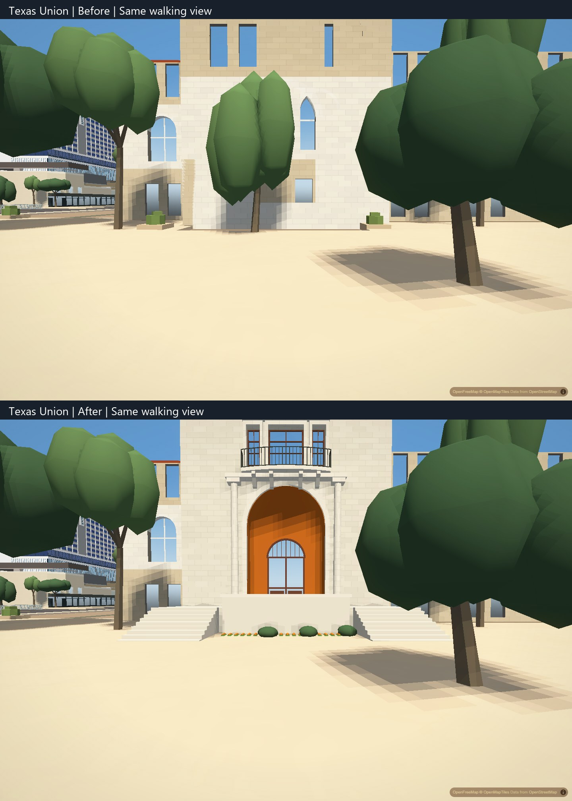
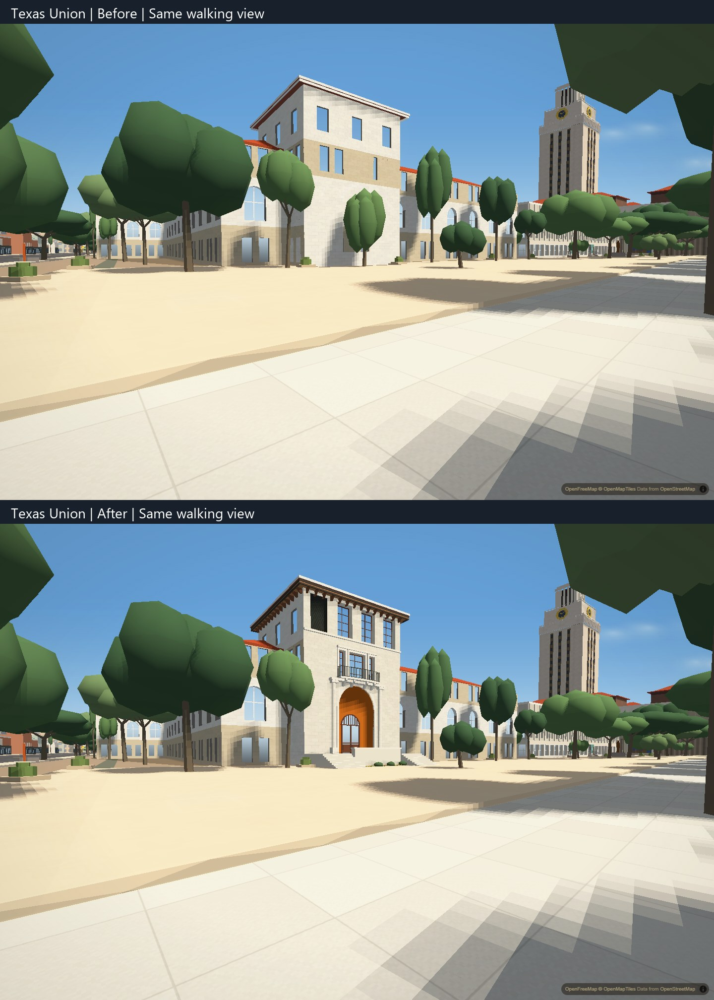
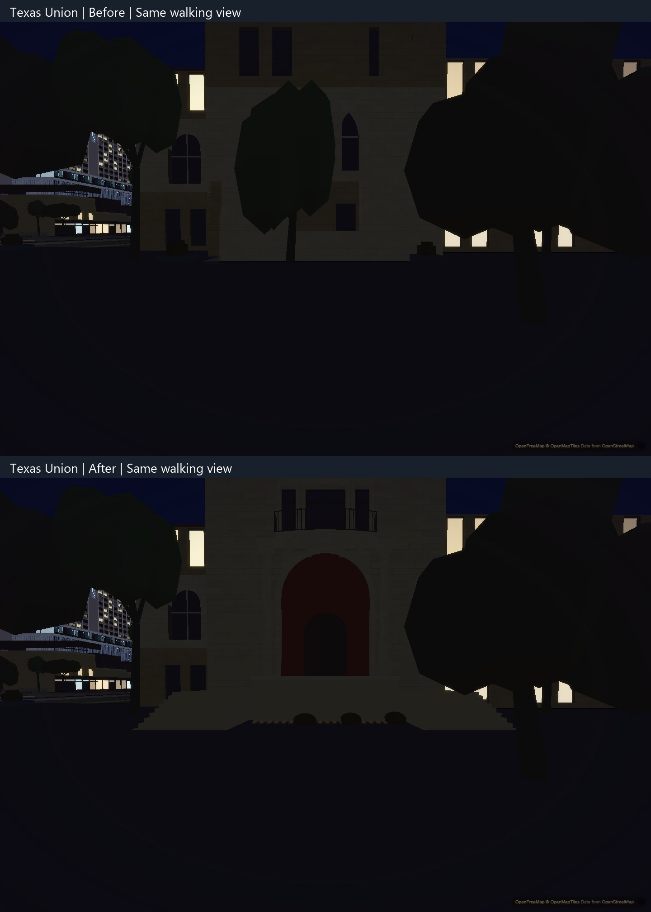

# Texas Union south entrance

The entrance tower now has a deep round-arched vault and smaller wood-and-glass door, three balcony-level openings with a bowed iron guard, four tall upper bays, and a bracketed timber eave. Two stair flights reach a shared landing around a low central wall and planting, connecting the raised doorway to the plaza.

The comparisons use second application captures at the same ordinary 1.8 m walking elevation, 1440 by 960, DPR 1, hardware Chromium, balanced preset, 74-degree field of view and no CPU throttling. Camera and time of day match within each pair; automatic graphics detection and exposure are disabled. Photographs and source-camera details stay local. Night views check the application's appearance; they are not matched to a night reference.

## Scope and tuning

`scripts/bake_union.py` is the sole writer of `data/apartments/texas-union.json`. The older all-building author entry point calls it rather than duplicating the Union recipe. Its original base reproduces the prior baked model exactly. `scripts/campus_union.py` parameterizes the south face, door, arch, balcony, glazing, louver, stone and timber. Only the tower face and wing fragments enclosed by the tower are replaced; footprint, levels, roof geometry and the other wings remain.

The landscape bake calls `scripts/campus_union_ground.py` for the approach. Its grade is an inferred 1.5 m above the current flat plaza datum, matching the modeled doorway threshold. Both flights have ten 0.15 m risers. These are exterior-view estimates, not a survey, accessible-route certification or an interior traversal claim. The 22 ground surfaces match the visible landing, treads and wall coping. Existing gardens and walking surfaces remain unchanged.

One imagery-detected tree occupied the clear vestibule approach. A narrow bake-side exclusion disables that row through the existing density filter while preserving its array slot and old-tree retirement keys. Array positions seed tree shapes, so deleting the row would change surrounding trees. Every retained tree record and seed is unchanged; ordinary nearby trees still obscure parts of the view.

## Verification

`python scripts/verify/union-entrance-data.py d2ab385` checks the original model, deterministic output, unchanged shell and roofs, eight nonintersecting recessed openings, 390 closed outward architecture solids and 106 approach solids. Missing-face and reversed-winding controls fail as intended. The architecture details contain 5,128 triangles and the approach 952; these counts do not establish a performance improvement. It also checks both ten-tread flights, the shared landing, obstacle height, exact retained trees and unchanged prior gardens and floors. `node scripts/verify/campus-court-detail.mjs` checks the renderer's atomic handling of valid and malformed landscape detail meshes; the 48-script harness matches the application.

Six matched day/night second captures load all 196 authored buildings with exact tested Union and landscape assets, finite geometry and no page or console errors. Actual keyboard walking starts on the plaza, stops/restarts, climbs the left flight, crosses the outdoor landing, contacts the central wall, restarts toward the right flight and descends to the plaza without resetting the camera. All ten heights are observed on each flight. The final 2,945-frame route stays outside the building footprint; seven settled stops have zero drift and approximately 1.8 m eye clearance. Descent smoothing briefly raises clearance to 2.293 m before it settles back to walking height. The central coping blocks movement as expected.

The peak clearance occurs over the lowest 0.15 m tread during active descent. Samples above 2 m span 1.126 simulation seconds; clearance returns to 1.800 m on the plaza 0.342 simulation seconds after the peak, while still moving. The trace therefore records a temporary interpolation lag, not a persistent elevated stop.

The Gearing floor regression also passes. Its old height-only selection accidentally counted the new Union treads; the test now selects Gearing's stair footprint before applying the same floor-count, height and extent assertions. No controls or renderer change was needed. The original failed check and initial camera/framing attempts remain in local verification evidence.

## Remaining limits

The main roof, adjacent wings and their proportions remain the existing approximation. Fine stone carving, inscriptions and insignia, weathering, detailed hardware, roof texture and unseen elevations remain unfinished. The doorway has no walkable interior. The approach is based on the application's flat ground; future terrain must reconcile its datum. This is a bounded entrance correction, not full photographic acceptance or physical-phone performance evidence. Shared renderer, shadow, compiled streaming and recovery work remain separate.
