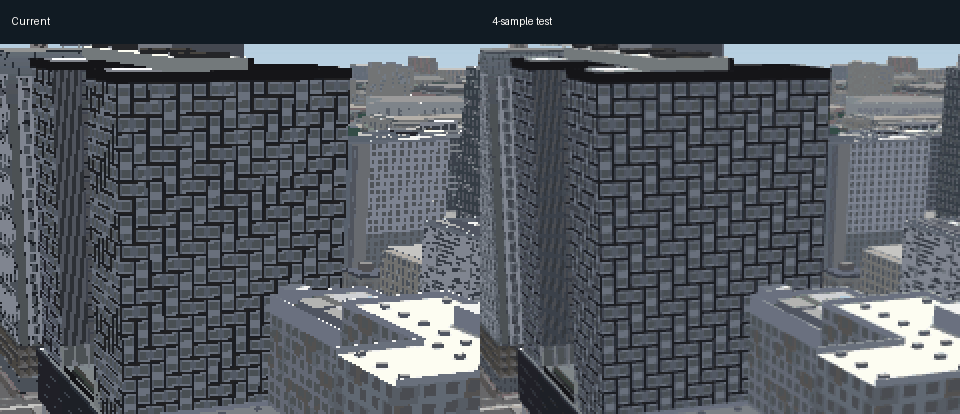

# Union facade motion

September 21, 2026. Branch `codex/window-renderer-attribution`, PR #280.

The reported daytime curves and lines are moving sampling patterns on thin
facade details. They persist when legacy MapLibre extrusions are hidden and
only the authored buildings remain. The narrow face occupies about 14 rendered
pixels in the matched view. Keep the building design; improve edge coverage.

This is a 2x enlarged native-framebuffer crop, 17 matched poses played forward
and backward. The animation is a visual aid, not the source of measurements.
All 196 authored buildings loaded through the normal application and tile path.

## Result and scope

Four-sample MSAA reduces registered temporal variation about 68% on the wide
wall and 62% on the narrow wall. Average brightness stays nearly unchanged.
The narrow-wall pattern is reduced, not eliminated. This does not establish
that all middle-distance flicker or periodic idle pauses are solved.

Enable the default only for desktop framebuffers up to 600,000 estimated pixels
(`EDGE_SMOOTHING.maxDefaultPixels` in graphics.js). The tested framebuffer was
732x672, from a 651x598 CSS viewport, DPR 1.5 and performance scale 0.75.
Larger framebuffers and phone profiles retain their previous defaults; explicit
Ultra remains enabled as before. Actual sample count is browser/device dependent.

Existing noncustom presets inherit the new budget on reload. Custom preferences
are preserved, including deliberate Smooth edges overrides. A custom user can
enable Graphics > Smooth edges and reload. The budget is evaluated at boot;
resizing cannot recreate the current WebGL context automatically.

## Verification

[Recorded results](verification/union-window-motion.json) include registered
motion, all four interleaved timing runs and the integrated saved-settings check.
Hardware GL, no CPU throttling, one test browser at a time. Auto-detection was
cancelled, time and camera fixed, tiles settled, and second day/night screenshots
inspected. No page errors or lighting failures; all 196 authored buildings loaded.

For motion, bearings 115 through 115.96 advance by 0.06 degrees, zoom 16.8,
pitch 70, day phase 0.25. Project the Union west and north wall planes each frame,
warp each to 200x200 using bicubic sampling, blur 1.5 pixels, then measure temporal
standard deviation and second difference. Plane registration avoids treating
ordinary camera displacement as flicker. Long-wall bounds: u=78.55, v=1.7..53.3,
z=48..90; short-wall bounds: v=1.5, u=55.95..78.33, z=48..90 in the building frame.
This is a local test of these walls, not a citywide quality score.

Four interleaved full loads (off/on/off/on) each tested 12-second day and night
rotations. Median frame time stayed 18 ms in every arm. There was no consistent
increase in stalls; do not infer an FPS improvement or extrapolate cost to large
screens or phones. Earlier night whole-frame metrics were inconclusive; this
registered daylight test addresses the user's clearer reproduction.

The final unmodified application loaded complete revision-2 saved performance
settings without a URL preset override. It migrated to revision 3, requested and
received four samples, and preserved every other saved preference. Its registered
scores reproduce the experiment within 0.000001. Full frames have tiny unrelated
variation (maximum mean absolute channel difference below 0.008 on a 0..255 scale).
`edge-defaults.mjs` verifies migration, custom overrides, viewport budget, phone,
Ultra and nonpersistent capture overrides. Harness drift and syntax checks pass.

Next: address residual grazing-angle shimmer and remaining idle stalls before
the queued downtown reference/geometry pass. Do not flatten architectural variety.
