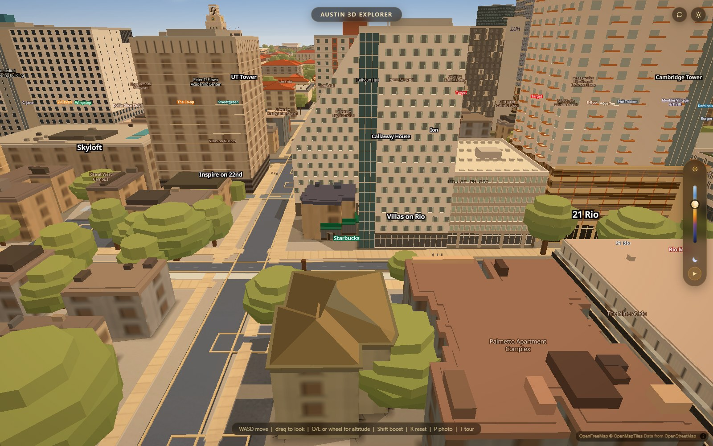
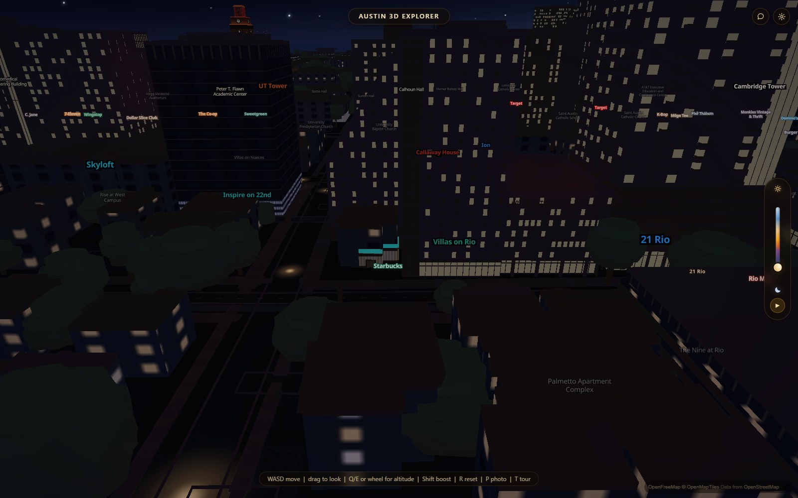
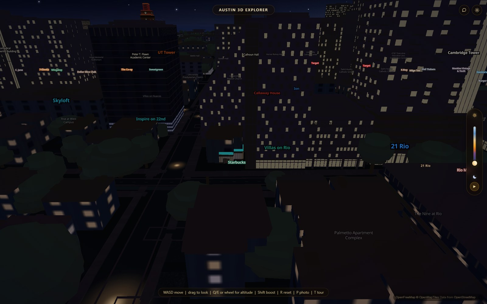

# Villas on Rio: the missing stagger

The white tower now shifts its window openings half a bay on alternate floors.
Main had already repaired the inconsistent window sizes; the remaining item in
this building's own todo was the measured stagger. This pass implements that
item using the existing source measurements, without a new photographic survey.

Before:

After:

The generator's optional `windowRule: "checker"` selects alternate candidate
bays. Villas uses 1.575 m candidates for a nominal 3.15 m window pitch, fitted to
each face. The existing 1.00 m dark opening, two 0.35 m pale side bars, 1.65 m
height and 0.70 m sill remain. Parity follows the building's floor list across
material bands, recessed walls and raked faces. Removing the rule and restoring
`bay: 3.15` restores the former vertical grid.

Night before and after:

Verified on current main d12aca7 plus this change, one hardware WebGL browser,
1600 x 1000, identical camera, times 0.3 and 1.0, graphics auto-detect cancelled.
Each frame was captured twice and the second kept. All 28 buildings remained;
window count across the scene was 32,685 before and 32,691 after (face-edge fitting
changes the count slightly). No page errors or generator warnings. The pattern
reads as staggered, equally sized rows; the lit openings remain visible at night.

`apartment-window-rule.mjs` passes pitch, row offset, material-band continuity,
retained floor-below, frames, night flags, opt-out and blank-wall cases.
An independent comparison of the old and new production window functions over
888 existing skin/face combinations produced identical output for every skin
without the new rule. Syntax, harness drift and whitespace checks pass.
`apartment-window-scene.mjs` reproduces the four views with VERIFY_OUT set to a
scratch directory. The full slopes/performance suites were not run; no frame-rate
claim is made. The pane's physical angular shape and asymmetric pale side remain
approximations already described in the building JSON.

Branch: `codex/villas-floor-grid`.
