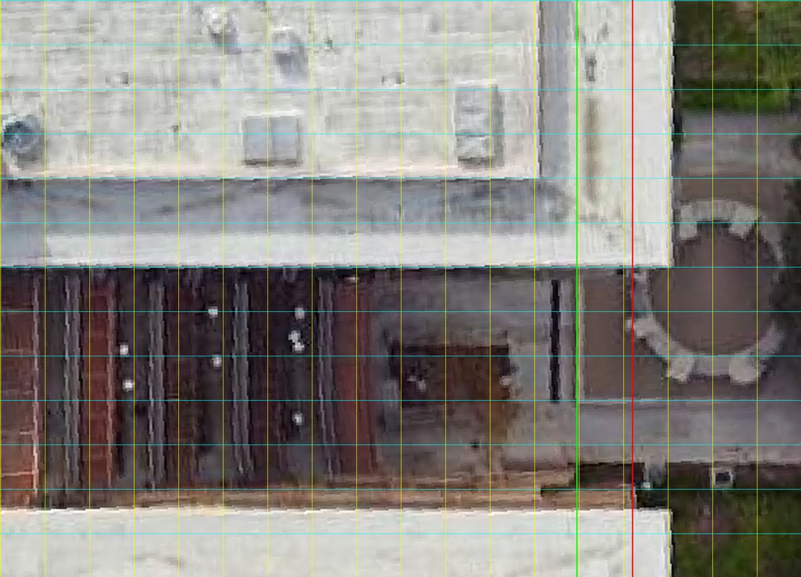
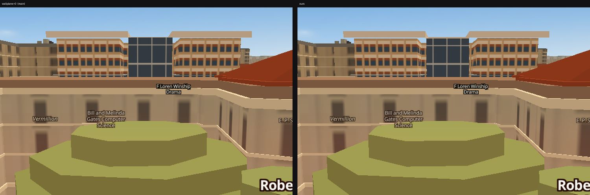
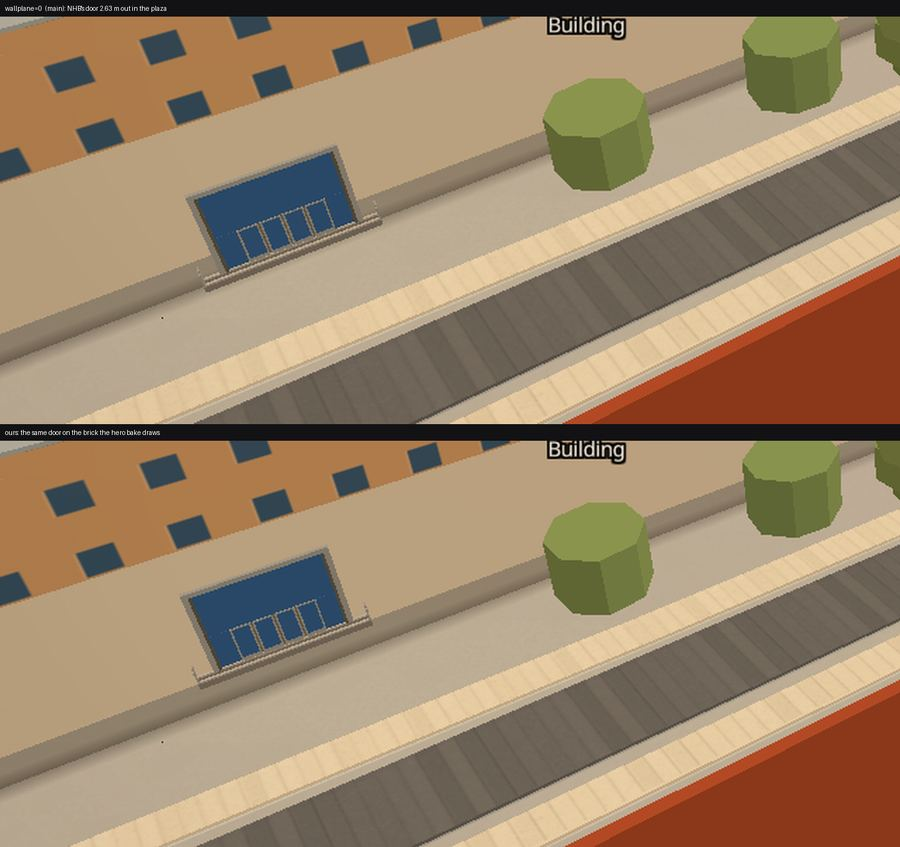

# A wall is where the renderer draws it

**2026-09-05.** Two defects with one cause. Six passes in this repo re-draw whole
buildings from authored geometry, and where that geometry is INSET from the
footprint ring, everything placed against the ring ends up floating in front of
the building. GDC's glass atrium was 2.5 m in front of its own brick, and twelve
doors on GDC and NHB were 2.63 m out in the plaza.

Both are behind one switch: **`?wallplane=0`**, or `window.WALLPLANE.on = false`.
With it off, the picture is what `main` draws.

---

## 1. The atrium

`scripts/bake_heroes.py` insets every GDC band by `GDC_OVERSAIL = 2.5 m`, because
the Overture ring traces the ROOF CANOPY and not the wall — Pelli's roof plane
hangs past the wall on every side. The glass atrium in the notch between the two
bars was emitted at inset **0**, and the comment on that line called it
deliberate:

> *"The atrium at inset 0: it stands GDC_OVERSAIL proud of the brick, which is
> what a glass link between two brick bars looks like."*

It is not what it does. Three references say so.

**The Esri z20 nadir, resampled into GDC's own frame at 0.06 m/px, cannot answer
this** — and finding that out was worth the trip. The notch mouth is in the south
bar's shadow, and the only edge it offers slopes **0.35 m of u per metre of v**.
An object edge perpendicular to the notch does not slope. It is the shadow. The
first number read off it — a 3.4 m recess — was that shadow measured three times
in three bands, which is exactly the failure mode `CLAUDE.md`'s reference method
warns about: *a wrong cell means a wrong rule.*

**Google's z20, same frame, a different overpass, no shadow in the notch, does**:

Grid every 2 m in GDC's own frame; the **green** line is the brick end wall this
bake draws (u 30.00) and the **red** line is the footprint ring (u 32.40). The
atrium's roof runs out from the link to u 26.9, a lighter strip follows, and a
hard dark line stands at **u 29.00** across the full width of the notch. Both
providers put the bars' roof-canopy end at u 34.0 ± 0.1, so the two frames agree
in u to a tenth of a metre even though they disagree by 3 m in v.

**Google Earth's 3D mesh from the west** (30.28629, −97.73657, 190 m, heading 90,
tilt 72 — the Speedway side, which is +u in this frame) shows the two brick ends
standing FORWARD of a receding slot. Nothing stands proud.

So `GDC_ATRIUM_RECESS = 0.90 m` behind the brick: 29.00 measured against 30.00
drawn.

**In v the atrium keeps the ring's own notch, and that is a decision, not an
omission.** The oversail moves each bar's notch-facing brick 2.5 m further apart,
so glass left at the ring's notch width sits 2.5 m *inside* the brick on both
flanks — a deep reveal, which is what the Earth mesh shows. Growing it to meet
those flanks was tried and rejected on two counts: the shadow-free frame reads
the atrium's roof NARROWER than the ring notch, not wider, so the growth has no
measurement behind it; and a 17.7 m glass slab swallows the door on the south
flank, which is GDC's Speedway entrance — it came out of the bake 29 m away on
the courtyard wall.

Left is `?wallplane=0` — what main draws: the glass is a prism in front of the
brick and the bars' end faces are hidden behind it. Right is this branch: the
glass is set back between two visible brick returns.

---

## 2. The doors, as a rule

The hypothesis was that `bake_entrances.py` places doors against the raw
footprint ring while the hero bake draws the brick 2.5 m inward. Measured against
the shipped files, before anything changed:

| | distance from the wall the bake actually draws |
|---|---|
| GDC eids 166–171 | **2.63 m** |
| NHB eids 581–586 | **2.63 m** |
| EER eids 333–337 | 0.13–0.17 m |

2.63 = the 2.50 m oversail plus the 0.13 m the door bank already stands proud of
its own wall reference (`PROUD_DOOR`). EER's bands are at inset 0 and its doors
measure the standoff alone — correct, and the regression control for everything
below.

**The rule, not twelve numbers.** `seat_on_drawn_wall()` marches each candidate
inward along its own wall normal and seats it on the first surface THIS HOST
draws. It is a no-op wherever the footprint IS the wall — every ordinary building
has no authored mass at all — it is exactly `_OVERSAIL` wherever a pass insets
its walls, and the day somebody adds a seventh inset building it is already
right. GDC and NHB come out at exactly **2.50 m**, which is the rule reproducing
a constant it never reads.

Three things the rule learned by being run:

1. **Order: after `clear_buried()`, not before.** Seating first moves the burial
   test's input, and three GDC doors and one at DKR came out of the relocation
   march on completely different walls — 15 to 57 m away. Seating last leaves
   every other stage byte-for-byte what main bakes.
2. **The floor is 0.80 m, not 0.15 m.** A sub-metre gap between the ring and an
   authored re-draw is that re-draw's own modelling slack — a balcony return, a
   podium edge — not an oversail. At 0.15 m the rule seated 29 doors and buried
   one: Block on 25th East's leaf ended 0.64 m INSIDE a neighbouring West Campus
   mass, because `assemble()` slides an opening along its run AFTER the seat, so
   the leaf does not end up where the candidate was tested.
3. **A seat that would bury the leaf is refused outright**, tested against every
   drawn mass and not only the host's, because the mass that buries a seated door
   is not always the host's. Four refused. A half-seated door is a door on no
   plane at all.

**22 seated, 4 refused, 561 of 591 entrances byte-identical to main.**

---

## 3. The switch, and how exact it is

`?wallplane=0` / `window.WALLPLANE.on = false`, declared by whichever of
`js/heroes.js` and `js/entrances.js` loads first and read by both.

* Every entrance piece the bake moved carries **`wp`** — the vector back to the
  footprint ring, in degrees. `js/entrances.js` adds it back before the source is
  published, so waiters (`js/slopes-arches.js`, wayfind) see the same
  coordinates the layer does.
* The atrium carries **`wp0`** — its whole pre-fix ring, because its shape
  changed as well as its position, so a translation could not restore it.
* A door that `clear_buried()` relocated onto a wall that MOVED this round adopts
  that wall's own **`wpd`** vector. That is GDC's Speedway entrance: it is buried
  inside the atrium at every plane the atrium has ever had, so the march puts it
  on the atrium's outer face, and that face travelled 3.40 m.

**How exact.** With the switch off, the worst vertex sits **1.47 cm** from
where main puts it, measured vertex-to-nearest-vertex over every seated
entrance. That is not tolerance, it is arithmetic: `entrances.geojson` rounds
every vertex to 7 decimal places — 0.96 cm of longitude and 1.11 cm of latitude
here — and sqrt(0.96² + 1.11²) = 1.47. A piece translated 2.50 m out and 2.50 m
back lands on the far side of that grid. (An earlier pass of this measurement
reported 8.9 cm on an NHB handrail; it was comparing two feature lists in file
order, and the seat reverses the order of a door's two handrails.)

And the picture, not just the coordinates — `node scripts/verify/wallplane-off.mjs`
loads the page once with `?wallplane=0`, hands `austin-entrances` and
`austin-heroes` main's own two files through `setData()`, and diffs the two
frames inside the page:

| pose | own floor | off vs main | box |
|---|---|---|---|
| gdc-plaza (z 18.9) | 8314 px | **0** | — |
| gdc-notch (z 18.4) | 0 px | **0** | — |
| nhb-door (z 19.2) | 7 px | 104 px | 193,563 → 329,659 |

The 104 is the 1.47 cm, on a 7 m door bank filling a third of a zoom-19.2 frame.
Both GDC poses are zero.

---

## 4. What it scores

`node scripts/verify/wallplane.mjs` — no browser, because a screenshot can only
tell you a door looks attached from the one bearing you shot it from. Over the
120 entrances on the 68 buildings whose walls are authored geometry:

| population | main | now |
|---|---|---|
| float band — 0.60–6.00 m off the drawn wall | 34 | **12** |
| orphans — over 6.00 m, on a face nothing draws | 7 | 7 |
| buried — a leaf over 0.25 m inside a mass | 2 | 2, none seated |

Plus two zeros this change owns: EER seats nothing, and all 23 entrances carrying
`wp` float again when it is added back.

The **orphans are not this rule's to fix and the gate says so** rather than
hiding them: EER's footprint covers a paved courtyard the hero bake deliberately
refuses to build, so two of its doors stand on a wall that exists at no distance
at all. They are held at their number so they cannot grow in silence.

Other gates, run on this branch's served app:

* `walkmeter.mjs` — **PASS**. 20 pairs routed, 0 errors, self-check drift 0,
  route-length extra 2.03 m over the list, door-offset extra 109.5 m, 38 ends at
  the door, and the live-mouse "Avoid stairs" gate passes both ways.
* `doorstack.mjs` on HRC 186/187 — the tightest pair the seat created (5.75 m →
  3.58 m apart): `only186` 20,210 px, `only187` 12,833 px, and the two arms
  disagree over 28,221 of the 33,043 they draw, with bounding boxes overlapping
  in 15 px of 128. Two doorways side by side, not one doorway drawn twice.
* `campusmeter.mjs` entrances A: 74/181 within 10 m of UT's own surveyed door.
* `wallplane-off.mjs` — **green**: with the switch off the frame is main's, at
  every pose, to within the coordinate grid (table above).

---

## 5. The cost, stated

**A seated door is up to 2.5 m FURTHER from UT's published coordinate**, because
UT's survey point sits on the footprint ring — which on these buildings is the
roof canopy — and the wall is 2.5 m behind it. NHB eid 581 goes 0.73 m → 3.23 m.
The count of doors within 10 m of a UT surveyed door is unchanged at **77 of
591**, so nothing crosses the threshold either meter uses, but the trade is real
and it is the right way round: the door is on the building.

**`data/walk_graph.json` still carries the pre-seat door anchors** for the 23
entrances that moved. That file belongs to the walk lane's bake
(`scripts/bake_walk.py`), not to this one, and `walkmeter.mjs` passes as it
stands — but a re-bake there will pick the moved doors up and should be run
before anyone quotes route lengths to the centimetre.
