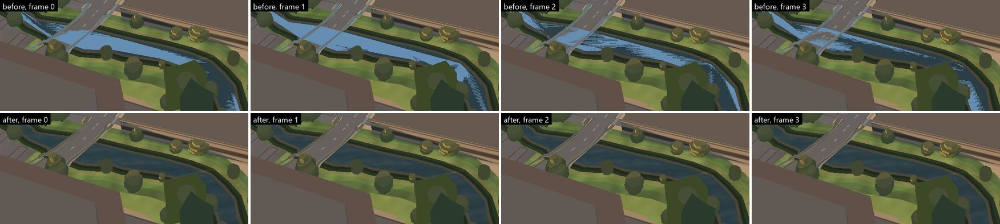
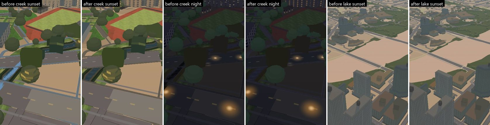
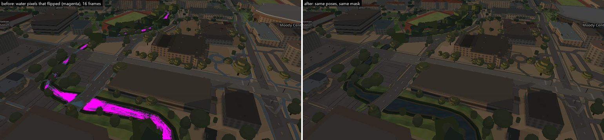
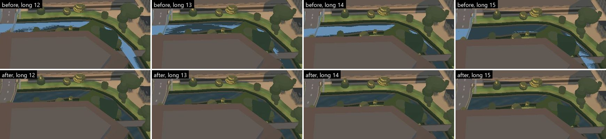
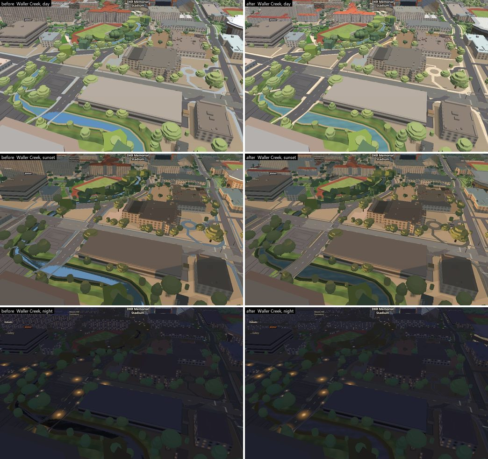
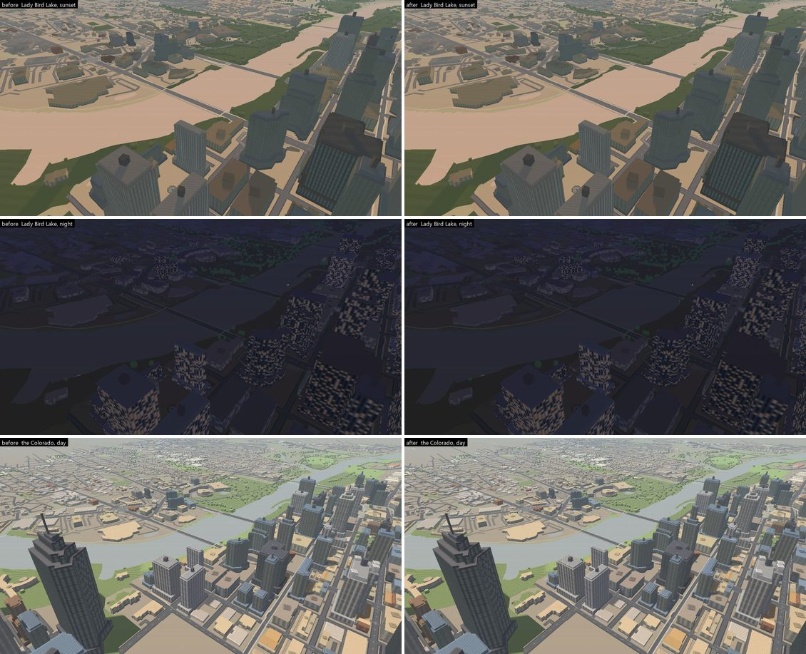
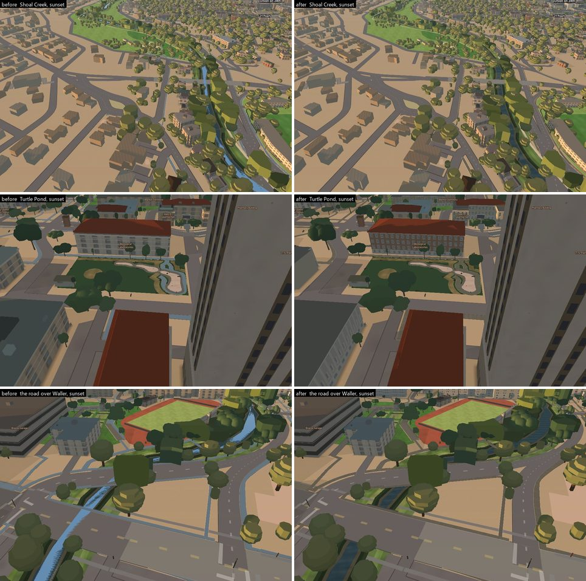
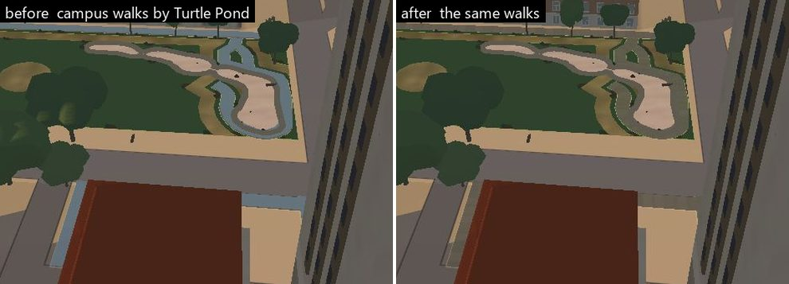

# Water flickers during movement — reproduced, named, fixed

Branch `acer/water-flicker`, 2026-09-19, based on `main` @ c656249 (PR #267
merged). Port 8621, `_harness.html?intro=0&drift=0`,
`cancelGraphicsAutoDetect()` on every load, `harness-drift.mjs` green (45/45)
before any pixel work. Hardware GL throughout (`VERIFY_GL=hardware`, ANGLE /
D3D11 on the RTX 3050 Ti Laptop GPU, 24-bit depth + 8-bit stencil, no MSAA,
balanced preset, render scale 1), one browser at a time through the machine's
GPU slot runner.



Top row: Waller Creek on campus (−97.734, 30.280), as shipped on c656249, four consecutive frames of a camera sliding north 0.5 m per frame.
The light blue is the ripple slab drawn as an opaque sky mirror, the dark is
the water under it; the boundary between them re-tiles every frame in
triangle-shaped patches (the signature of a depth tie between two different
triangulations), and at the road bridge the water paints over the deck. Bottom
row: the same four poses on this branch.

## The answer

| | |
|---|---|
| **Which water** | **Waller Creek and Shoal Creek** — the creek channel's water (same layers in both). Not Lady Bird Lake, not the ponds: both measure zero before and after. |
| **Which layer** | `ground-creek-sheen` (the ripple slab) against `ground-channel`'s water prism under it; and `ground-deck` (the culvert and bridge decks) against the same water prism. |
| **Mechanism** | Coplanar surfaces. MapLibre 5.24 **clamps every fill-extrusion base and height at zero** in its vertex shader. The bake cuts the channel 1.4–3.1 m *below* zero, so the water prism's top, the sheen's top (meant to be 0.10 m above it) and every deck's top are all drawn at exactly z = 0 and tie in the depth test. Which one wins a pixel is rounding in two different triangulations, and it changes with every camera step. |
| **Why it got loud now** | Since PR #267 the sheen is not an 11 % tint any more: the pattern path in `js/city-lighting.js` shades every texel with alpha < 1 as *glass* and writes it out at the layer's opacity, i.e. opaque. The ripple slab became a full-strength sky mirror by day and a near-black lid at night, so the tie became a flicker between two very different colours. |
| **Why it is intermittent** | It depends on the time of day. At noon (p 0.25) the mirror and the water happen to land within a few luma of each other and the metric reads 0.30 % flip; at sunset and at night they are far apart and it reads 17–21 %. Note which one the app opens on: `TOD_DEFAULT_P = 0.50` in `js/app.js` is sunset, so the default view is the loud one — this was not an edge case anybody had to go looking for. |
| **Not the cause** | The two camera-following shadow maps (shadows off: no change), the city-wide ground grain (`ground-base-texture` off: no change), anything cached against camera travel (stop-and-go difference **0.000 %** at every pose, every run), Lady Bird Lake and the ponds (zero). |
| **Why the earlier fix did not hold** | The sheen was always meant to stand `CHANNEL.sheen_m` = 0.10 m on the water "so the depth order is defined rather than undefined" (HANDOFF, the Waller Creek water pass, ee0c229). That 0.10 m only ever existed in `data/ground.geojson`: both numbers are below zero and both clamp to the same z = 0 on the GPU. `scripts/verify/coplanar.mjs` compares the baked numbers, so it could not see it either. |

## How it was measured — `scripts/verify/water-flicker.mjs`

A still cannot show a flicker, and a whole-frame difference cannot either —
a moving camera changes most of the frame every step. So the instrument only
looks at water pixels:

* **Mask pass.** The exact same poses are replayed with every water surface
  keyed magenta (the basemap `water` fill, `ground-areas` classed water/pond,
  `ground-channel`'s water prisms; the translucent overlays that sit on water
  hidden) and the mask is eroded 2 px, so a shoreline creeping a pixel is not
  scored. The mask is our own layers, read per frame — never a colour guess
  (the lake is tan at sunset and near black at night).
* **FLIP** — over three consecutive frames of a small, monotonic camera step,
  a water pixel's luma goes up then down (or down then up) by ≥ 6 both times.
  Real geometry under a small monotonic step changes monotonically; a depth
  tie does not.
* **JUMP** — |Δluma| ≥ 12 on a water pixel between consecutive frames.
* **STOP-GO** — every pose is rendered twice, once *in flight* (one `jumpTo`
  and one rendered frame per pose, no waiting — how `js/controls.js` drives
  the camera) and once *stopped* (idle + settle, screenshot twice). A water
  pixel with |moving − stopped| ≥ 12 means the picture depends on whether the
  camera is moving at all: the fingerprint of shadow maps, proxies, LOD.
* Every metric is computed on the moving sequence AND on the stopped
  sequence at the same poses; the stopped sequence is the control.
* Hypotheses are **arms** in the same browser session — one in-page toggle
  each, interleaved.
* The ENV line reads the cause back off the GPU every run
  (`extrusionClampsAtZero`), so if MapLibre ever drops the clamp the doc and
  the lift go stale loudly, not silently.

Trajectories (1280×800; phone profile at 430×932 with `?lite=1`):

| name | what moves | step |
|---|---|---|
| `waller-translate` | north along the creek, z 17.3, pitch 60 | 0.53 m/frame, 16 frames |
| `waller-rotate` | bearing 0 → 3° about the same centre | 0.2°/frame |
| `waller-altitude` | zoom 17.2 → 17.35 | ~1 %/frame |
| `waller-long` | 60 m forward at z 17.0, crossing tile edges and the 20 m shadow-snap grid | 2 m/frame, 30 frames |
| `crossing-box` | the road bridge over the creek at z 18.3; every pixel of a 400×300 box, not just water | 0.27 m/frame |
| `shoal-translate` | Shoal Creek, z 17.0 | 0.53 m/frame |
| `lake-*` | Lady Bird Lake at the Congress Avenue bridge: translate, rotate, altitude, a 126 m day run | as above; 4.3 m/frame for the long run |
| `pond-translate` | Turtle Pond, z 18.6 | 0.2 m/frame |

Sunset is p 0.50 (the app's default), day 0.25, night 0.92.

Limits, stated: tiles were warm (the mask pass visits every pose first), so a
first-ever flight over the creek is not what was scored; and the phone profile
is `?lite=1` in desktop Chrome at a 430×932 viewport on the same GPU, not a
phone.

## Hypotheses, one at a time (on c656249, Waller Creek, sunset)

In-page toggles, same session, same poses (16–20 frames). These numbers come
from the hypothesis session and its own step length, so the "as shipped" row
here (24.09 %) is not the same measurement as the 17.305 % in the before/after
table further down — that one is the 16-frame, 0.53 m/frame plan. Compare rows
*within* a table, never across:

| arm (one change) | translate flip / jump | rotate flip / jump | stop-go |
|---|---|---|---|
| none (as shipped) | **24.09 % / 42.89 %** | **20.83 % / 38.52 %** | 0.000 % |
| `ground-base-texture` hidden | 24.09 % / 42.89 % | 20.83 % / 38.52 % | 0.000 % |
| sun shadows off (`SLOPES.sunlight.shadows=false`) | 19.23 % / 41.28 %¹ | — | 0.000 % |
| sunlight off (`SLOPES.sunlight.on=false`) | 19.20 % / 41.23 %¹ ² | — | 0.000 % |
| `ground-creek-sheen` hidden | **0.003 % / 0.091 %** | **0.000 % / 0.000 %** | 0.000 % |
| sheen lifted to 0 → 0.10 m (no other change) | **0.013 % / 4.34 %** | **0.000 % / 1.12 %** | 0.000 % |

¹ first run, 20 frames over 10 m, base 19.28 % / 41.14 % in the same session.
² Not evidence that the #267 shader is irrelevant: with the switch off,
`cityShade` returns the unlit colour but the patched pattern path still writes
alpha = layer opacity, so the sheen is still an opaque (dark) lid tying with
the water.

Hiding the sheen removes it; lifting the sheen by 0.10 m **above the drawn
water top** removes it; the shadow maps and the ground grain do nothing.
Stop-go is exactly zero everywhere: the picture at a pose is the same moving
or stopped, so this is a pose-dependent depth tie, not a stale cache.

**The clamp, read back** off the compiled `fillExtrusion` and
`fillExtrusionPattern` vertex programs in the running app:

```
base=max(0.0,base)+base_terrain3d_offset;height=max(0.0,height)+height_terrain3d_offset;
```

`data/ground.geojson` gives the water prisms `b` −3.7…−2.0, `h` −3.1…−1.4 and
the sheens `h = water top + 0.10` (−3.0…−1.3): every one of them clamps to 0.
So does every bank course and every culvert deck (`h` −0.04). The "0.10 m
proud" in `scripts/bake_ground.py` (`CHANNEL.sheen_m`) never reaches the GPU.

### Which of the two ingredients does what — the 2×2

The tie is the defect; PR #267's opaque shading is what made it a *flicker you
can see*. Measured as all four corners, `waller-translate`, 16 frames, same
poses (the two "tied" rows put the original paint expressions back in-page, so
only the geometry differs from the row above them):

| geometry | pattern shading | sunset flip / jump | night flip / jump |
|---|---|---|---|
| tied at z = 0 (as shipped) | opaque glass (#267) | **17.305 % / 36.994 %** | **17.217 % / 37.264 %** |
| tied at z = 0 | translucent (fix 2) | 1.005 % / 0.069 % | 0.141 % / 0.333 % |
| lifted 0.10 m (fix 1) | opaque glass | 0.013 % / 4.34 % | — |
| lifted 0.10 m | translucent | **0.002 % / 0.069 %** | **0.000 % / 0.000 %** |

Read down the first column: the tie is always there, but while the two tying
surfaces are a ripple *tint* and the water it tints, swapping which one wins a
pixel costs about one luma step (1.0 % / 0.14 %). Once #267 wrote the ripple
out opaque, the same swap was between a sky mirror and dark water and the
flicker went to 17 %. Fix (2) alone would take the visible flicker away and
leave the tie; fix (1) alone removes the tie but leaves an opaque mirror
sliding over the creek (jump 4.34 %). Both, and it is zero.

Stop-go was **0.000 % in every cell** of that table.


## The fix

1. **`js/ground.js` — lift relative to what is drawn, not to the bake's
   number.** `ground-creek-sheen` now spans `max(b, 0)` → `max(b, 0) +
   GROUND.creekSheenLift` (0.10 m), and `ground-deck` tops out at `max(h, 0) +
   GROUND.creekDeckLift` (0.16 m). The order at a crossing is now defined:
   water 0 < ripple 0.10 < deck 0.16 < walk deck 0.22 (`pathRaise`). Both are
   correctness constants, but they live in `GROUND` with the reasoning, so
   either is a one-line edit.
2. **`js/city-lighting.js` — translucent overlays are not glass.** The glass
   code is a facade-atlas convention (opaque texels, alpha 191 reserved for
   glass). Pattern texels with alpha < 0.70 now keep MapLibre's own
   premultiplied output (`mixedColor * v_lighting`) instead of being shaded as
   glass and written opaque.

   The threshold is safe because the two populations do not overlap. Measured
   in the running app over the 22 `fill-extrusion-pattern` layers and the
   images each one resolves:

   | | layers | alpha range |
   |---|---|---|
   | facade atlases | `outer-tower`, `outer-midrise`, `buildings-3d`, `heroes-*`, `moody-wall`, `arts-*`, `wc-wall`, `stadium-wall`, `parts-3d`, `places-glass` | **min 191**, max 255 (`places-glass` 204–229, `moody` 224–255) |
   | ground overlays | `ground-paths-texture`, `ground-speedway-brick`, `ground-close-path-grain`, `ground-creek-sheen`, `capitol-ground-texture` | min 0, **max 121** (canopy 121, Speedway brick 86, walk grain 44–62, creek ripple 29, close grain 16) |

   0.70 × 255 = 178.5 sits in the empty band between 121 and 191, so no image
   is split by it and windows, glare and the sunlight on every opaque surface
   go down exactly the path they did before.

   That was then checked against the **whole style** rather than a
   hand-listed set, by walking every loaded image and every
   `fill-extrusion-pattern` expression in the running app after a 13-pose
   tour (so the atlases had all loaded):

   * **708** images loaded, **24** `fill-extrusion-pattern` layers, **52**
     images reachable from those layers' expressions.
   * Of those 52: 23 on the overlay side with **max alpha 121**, 28 on the
     facade side with **min alpha 191**, and **exactly one** image whose
     alpha crosses the threshold — `water`.
   * `water` is not a pattern that gets drawn. It is the *input* side of a
     `match` on the ground class:
     `["match", ["get","s"], … "water", "gnd-tex-water", "creek",
     "gnd-tex-water", "pond", "gnd-tex-water", …]`. It only appeared in the
     first sweep because the basemap sprite happens to contain an icon of the
     same name. The image actually drawn for that class is `gnd-tex-water`,
     at alpha 2–29.
   * 233 of the 708 images in the style do straddle the line, but 232 of them
     are basemap sprite icons (`bank`, `bakery`, `airport_11`, …) that no
     fill-extrusion can reach. They are drawn by symbol layers, which this
     shader patch never touches.

   So no image any fill-extrusion can draw is split by the threshold.

(1) alone removes the flicker (the "sheen lifted" arm above). (2) is what
keeps the water looking like water: without it the lifted sheen is a
permanent opaque mirror by day and a near-black lid at night and in the phone
profile, hiding the water's time-of-day colour that the creek pass was built
around.

## Before / after — the metric

Same plan, same poses, same session settings; c656249 vs this branch. Moving
sequence shown; the stopped sequence gave identical numbers in every row
(stop-go 0.000 %).

The `water px/frame` column is the **after** run's mask. The before run's
mask agreed with it to under 1 % on every row except `shoal-translate`,
where it was 4,855 px against 6,324 — the two sessions had streamed
different amounts of that narrow creek. Both columns are rates over their
own denominator, so the comparison holds, but the Shoal row is the one to
read as "15 % became 0.6 %" rather than as two counts.

| trajectory | before flip / jump | after flip / jump | water px/frame |
|---|---|---|---|
| `waller-translate-sunset` | **17.305 % / 36.994 %** | 0.002 % / 0.069 % | 16,364 |
| `waller-rotate-sunset` | **20.769 % / 38.793 %** | 0.000 % / 0.000 % | 15,876 |
| `waller-altitude-sunset` | **19.136 % / 37.578 %** | 0.019 % / 0.022 % | 15,020 |
| `waller-long-sunset` | **16.210 % / 33.700 %** | 1.678 % / 0.436 % | 11,046 |
| `waller-translate-day` | 0.300 % / 0.133 % | 0.007 % / 0.043 % | 16,277 |
| `waller-translate-night` | **17.217 % / 37.264 %** | 0.000 % / 0.000 % | 16,292 |
| `shoal-translate-sunset` | **15.175 % / 31.996 %** | 0.624 % / 3.326 % | 6,324 |
| `crossing-box-sunset` | **1.490 % / 5.204 %** | 0.549 % / 3.317 % | 120,701 |
| `lake-translate-sunset` | 0.000 % / 0.014 % | 0.006 % / 0.019 % | 122,372 |
| `lake-rotate-sunset` | 0.000 % / 0.000 % | 0.000 % / 0.000 % | 128,018 |
| `lake-altitude-sunset` | 0.000 % / 0.001 % | 0.000 % / 0.001 % | 102,090 |
| `lake-long-day` | 0.000 % / 0.110 % | 0.070 % / 0.365 % | 65,108 |
| `lake-translate-night` | 0.000 % / 0.000 % | 0.000 % / 0.000 % | 131,638 |
| `pond-translate-sunset` | 0.000 % / 0.000 % | 0.000 % / 0.000 % | 2,751 |

Repeats, stated honestly: two earlier "after" runs in separate browser
sessions agree with this table to within **0.11 % flip** on every creek row
and within 0.04 % flip / 0.14 % jump on every lake and pond row. **Jump is
the less stable half of the instrument on one row**: `waller-long` read
0.436 % jump in the run tabled above and 3.327 % in an earlier session, with
flip 1.678 % vs 1.787 % — the same flip, an eightfold different jump. Jump
counts any |Δluma| ≥ 12 between consecutive frames, so on the 2 m/frame run
it is dominated by how much of the ripple texture had streamed in that
session, which is exactly the quantity that varies between sessions. Flip
(the up-then-down test) is the discriminating metric here and it repeats;
treat a single jump number on a fast trajectory as indicative, not as a
measurement. Every other row agrees on both.

The metric is deterministic *within* a session (moving = stopped to
0.000 % everywhere), so the spread is session-to-session tile and streaming
state, not the camera.

Phone profile — the full query, because the flags are part of the answer:
`?intro=0&drift=0&lite=1&campuslandscape=0&preset=performance`, 430×932
viewport, performance preset, render scale 0.75, so the drawing buffer is
322×699 and the water mask is 5.7 k px per frame instead of 16.4 k:

| trajectory | before flip / jump | after flip / jump |
|---|---|---|
| `waller-translate-sunset` | **23.568 % / 41.407 %** | 0.004 % / 0.337 % (repeat: 0.000 % / 0.169 %) |
| `waller-translate-night` | **23.363 % / 41.581 %** | 0.000 % / 0.000 % (repeat: 0.000 % / 0.000 %) |
| `lake-translate-sunset` | 0.000 % / 0.010 % | 0.032 % / 0.037 % (repeat: 0.000 % / 0.009 %) |

And what that profile looks like — same session on each side, so the scenes
are comparable (same buildings, same labels, same trees; only the shading
differs):



The creek goes from a pale blue ribbon to water on the phone profile too, and
the lake pair is indistinguishable, which is what the 0.000 % rows say in
pictures.



**What is left, and why it is not flicker:**

* `waller-long` 1.68 % flip: the camera moves 2 m per frame there, so the
  ripple texture itself slides several pixels between frames and a pixel's
  luma legitimately goes up and down. **Measured, not assumed:** hiding the
  ripple on that trajectory takes it from 1.787 % to 0.887 % flip in the same
  session, so about half of what is left is the ripple's own texture sliding
  and the other half is the rest of the scene doing the same. The identical
  creek at 0.5 m/frame reads 0.002 %. By eye the 30-frame sequence is stable
  (strip below).
* `shoal-translate` 0.62 % / 3.3 %: **not the water and not this fix.** Four
  arms at that trajectory, all after the fix, all in one session:

  | arm | flip / jump |
  |---|---|
  | base | 0.666 % / 3.933 % |
  | `nosheen` (ripple hidden) | 0.665 % / 3.957 % |
  | `nocanopy` (creek canopy hidden) | 0.645 % / 3.859 % |
  | sun shadows off | 0.532 % / 3.522 % |

  Hiding the ripple changes the number in the fourth decimal, so whatever is
  left is not the surface this fix touched. The flip heat map says where it
  is instead: every surviving speck sits on the **edge of a tree crown that
  overhangs the channel**, not on open water. Shoal is a narrow, heavily
  overhung creek — 6.3 k water pixels per frame against Waller's 16.4 k — so
  a large share of its water mask is within a pixel or two of an occluder
  edge that sweeps as the camera translates, and the 2 px erosion cannot
  remove an occluder that is in *front* of the water rather than at its
  boundary. Before the fix the whole channel was magenta; now it is a dozen
  specks on leaf edges.

  *Not proved:* the direct `trees-canopy`/`trees-trunk` arm that would settle
  this by removing the occluders never got a GPU slot before the round ended
  (three lanes were sharing three slots). The heat map is a look, not a
  toggle. See "Not done".
* `crossing-box` 0.55 % / 3.3 %: this box scores **every pixel**, not just
  water — road, deck, lane dashes, bank, tree crowns, the buildings behind.
  It was 1.49 % / 5.20 % before the fix, so the fix removed the water's share
  of it; what is left is not water. Four arms at that box, same session,
  all after the fix:

  | arm | flip / jump |
  |---|---|
  | base | 0.549 % / 3.317 % |
  | `nosheen` | 0.549 % / 3.339 % |
  | sun shadows off | 0.649 % / 3.899 % |
  | `nocanopy` | 0.695 % / 4.014 % |

  Hiding the ripple changes nothing (0.549 either way), and the two arms that
  remove scene elements make the number go slightly *up*, which is the spread
  of the measurement rather than a signal. Nothing water-related is left in
  that box.
* `lake-long-day` 0.07 %: the flagged pixels are on the crown of the tower in
  the foreground, not on the lake — the mask pass (run first) and the scored
  passes disagreed about that tower's silhouette while it swept 20 px per
  frame across the frame. The lake surface itself reads zero, before and
  after.



## Lady Bird Lake and the ponds

Measured, because the report said "water" and the lake is the biggest water in
the app: translation, rotation, altitude and a 126 m day run over the Colorado
at the Congress Avenue bridge, sunset, day and night, desktop and phone
profile, and Turtle Pond. **Zero flicker before and after** (every row under
0.02 % flip except the tower-crown mask artefact above). The lake is the
basemap's flat `water` fill: a 2D layer drawn once, with nothing coplanar on
it, so it has nothing to tie with. Nothing in this branch touches it and the
stills above show it unchanged.

One caveat so the stills are not over-read: the *water* at Turtle Pond is
unchanged, but the **walks around it are not** — they are `ground-paths-texture`
and they go from sky-blue to stone with every other overlay. That is the
declared side effect below, not something that happened to the pond.

## What it looks like

Stills at the same poses, before (c656249) and after (this branch). These are
frame 0 of the measured trajectories themselves rather than a separate shoot,
which is the honest way to pair them: stop-go measured 0.000 % at every pose,
so the picture with the camera moving is the same picture as the settled one,
and the stills are therefore literally the frames the table above scored.

**A pair of stills from two different browser sessions was thrown away to get
here.** The first attempt shot the "after" side in one session and the
"before" side in another, and the result was worthless in a way that looked
convincing: at the Speedway pose a whole authored building was present on one
side and missing on the other, and at the Capitol the entire surrounding city
and every label were absent from one side. Neither has anything to do with
shading — the two sessions had simply streamed different amounts. A settle of
`once('idle')` plus a few seconds is not enough after a jump to a new part of
the map; `areTilesLoaded()` is the thing to wait on. Pairs in this doc are
either from the same session or from the metric harness, which does a full
mask pass over every pose before it scores anything.



The creek stops being a pale sky mirror and goes back to being water with a
visible channel: banks read as banks, the ripple is a tint on the water
instead of a lid over it, and at sunset the road bridge is a road again
instead of something the creek paints across. The shoreline is in the same
place in both columns — the fix moves surfaces in z, never in plan.



Lady Bird Lake and the Colorado are **unchanged**, which is the point: they
are the basemap's flat `water` fill with nothing coplanar on them, they
measured zero flicker before and after, and nothing in this branch touches
them. Put the two columns side by side and there is nothing to find.



Shoal Creek gets the same correction as Waller. At the road crossing the
before column shows the defect that is easiest to name without a metric: the
creek is drawn **over the carriageway**, because the deck and the water tie at
z = 0 and the water wins some of the pixels. After, the road crosses the creek.

## Side effect, declared

The overlay rule in fix (2) is not creek-specific, by design: it is the
facade-atlas convention being applied only to facade atlases. Every walk
(`ground-paths-texture`), the Speedway brick, the close-range walk grain and
the Capitol ground texture were ALSO being drawn as opaque sky mirrors since
PR #267 and go back to being a tint on the deck under them.



**This is the one thing in this branch that is a taste call, so it is flagged
rather than buried.** On `main` today every campus walk is drawn as a pale
sky-blue ribbon — that is the same opaque-glass shading that made the creek
flicker, applied to the walk grain, and it is why the paths by Turtle Pond
read as water in the left panel. After, they are stone. The same goes for the
Speedway brick, the close-range walk grain and the Capitol ground texture.

Three things worth being explicit about:

* This **restores** the pre-#267 appearance; it is not a new look. The glass
  path is a facade convention that #267 began applying to ground overlays too.
* It is **not** the sunlight or the window glare. Those come from the solid
  and the facade-atlas paths, which this change does not touch — every texel
  at alpha ≥ 0.70 goes down exactly the same code as before.
* It is **separable from the flicker fix.** Fix (1), the lift, removes the
  z-fight on its own (0.013 % flip). If the blue walks turn out to be wanted,
  fix (2) can go without losing the flicker fix — the cost is that the creek
  goes back to being an opaque mirror lying on the water, which is the
  appearance the creek pass was written to avoid.

The call on whether the walks should be stone or sky belongs to whoever owns
the look, not to this lane; the measurement only says they are the same
mechanism.

## Not done, and why

* **The creek is still flat.** HANDOFF ("Waller Creek is a cut channel now")
  believed `fill-extrusion-base` could go negative once the lawn was removed
  from the trench. It cannot: MapLibre clamps it, so the whole cut — bed,
  water, bank courses, decks — has always rendered as flat coloured bands at
  z = 0. Actually sinking it means patching MapLibre's clamp for every
  extrusion (a global renderer change) and changes how the creek looks; that
  is a taste call and a renderer-owner call, not a flicker fix.
* **Why neither existing detector caught it.**
  `scripts/verify/coplanar.mjs` checks the baked `b`/`h` values, so it cannot
  see this class at all: the sheen and the water are 0.10 m apart in the data
  and 0 m apart on the GPU. It should apply `max(0, ·)` to both ends before it
  compares tops. `scripts/verify/zfight.mjs` *is* renderer-based and would
  have seen it — but its eight poses (`shots-places.json`:
  `fly-drag-*`, `fly-wide-day`, `street-drag-*`, `street-coop-day`,
  `westcampus-day`) are all Drag / West Campus / downtown. **Not one of them
  looks at a creek**, so the loudest flicker in the app sat outside the
  detector's field of view. Neither file is edited here (not this lane's).
* The bake (`scripts/bake_ground.py`) still emits the negative numbers. They
  are harmless now (the renderer lifts from the drawn top), and changing them
  is the bake owner's call.
* **The Shoal residual is located but not toggled.** The heat map puts every
  surviving speck on a tree-crown edge over the channel, and four arms rule
  out the ripple, the creek canopy and the shadows — but the one arm that
  would prove it, hiding `trees-canopy`/`trees-trunk`, never got a GPU slot
  (three lanes, three slots, and this lane gave its place to the stills).
  The plan is written and ready at `plan-tie3.json` in the lane scratch;
  it is one run. 0.6 % flip on 6.3 k pixels is not a visible defect either
  way, which is why it lost the slot.
* No real phone was used. The phone profile is `?lite=1` in desktop Chrome at
  a 430×932 viewport on the same GPU.

## Reproduce

```
python scripts/serve.py 8621            # from the repo root
cd scripts/verify
VERIFY_URL=http://127.0.0.1:8621 VERIFY_GL=hardware \
  node water-flicker.mjs plan.json out/ [--q=lite=1] [--save]
```

`water-flicker.mjs`'s header documents the plan format (poses, arms,
box masks). `water-look.mjs` takes the stills; `water-probe.mjs` runs one
page snippet at one pose (it is how the clamp was read off the compiled
programs).
