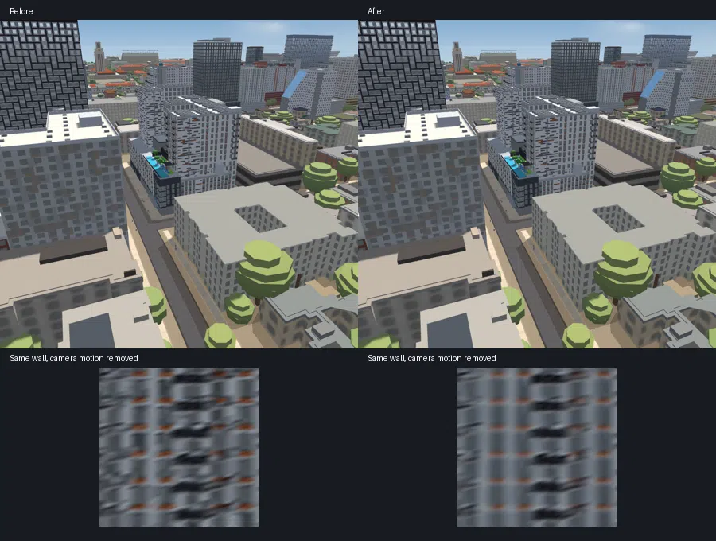

# Wider apartment window filtering

The desktop daytime filter now also covers The Standard, Villas on Rio and
Yugo Austin Waterloo, using their authored window layouts. Union on 24th and
21 Rio remain included. This is five-building coverage, not citywide acceptance.
Resolved close-view details, night windows, deep/arched openings and shadows
keep their original geometry. Phone defaults remain off pending physical-device
acceptance.

## Memory and lifecycle

The selected facades are collected before texture allocation. A shared resolution
level is chosen so the entire eligible set fits the existing 16 MiB GPU texture
budget, including mipmaps. Each level halves both texture dimensions; exact area
integration preserves average authored colours and glass coverage. Ordering the
buildings differently cannot give earlier buildings more of the budget.

The budget counts GPU texture storage, not total application memory. Authored-cell
staging, retained packed CPU arrays and transient raster/packing allocations are
additional. Staging is released as faces are rasterized. Obsolete per-face CPU
image buffers are cleared after successful texture-array transfer. Texture layers
are still batched by size, and failed allocations retain the authored mesh.

Turning apartments off and back on while loading retains the current build until
it finishes; a second build cannot consume the first build's planned allowance.
Completion applies the latest on/off intent.

The complete city allocates all 178 eligible facade sections in 24 texture-array
batches at resolution level 1, using 8,154,336 GPU texture bytes (about 7.8 MiB).
The earlier two-building configuration used 14,705,940 bytes in 12 batches.
Lower texture use is not a claim of lower total application memory or faster frames.

## Verification

Matched 17-frame sequences show less narrow-wall temporal second difference:
about 66% at The Standard, 60% at Villas on Rio and 67% at Waterloo. The wider
faces remain effectively unchanged. These scores describe the captured walls
and camera motions, not the entire city.

Every accepted capture uses all 196 authored buildings, a ready city, normal
tiles, indexed geometry and no loading veil. Lighting and exposure are fixed;
graphics auto-detection and idle drift are cancelled. Second screenshots are
registered to 200x200 wall images and blurred with Gaussian radius 1.5 before
temporal measurement. This compares the same walls along the same camera path.

The existing Union and Rio narrow-wall results remain within 0.3% of the earlier
filtered version; the largest pilot wide-wall change is 1.1%. Standard close-view
broad-wall pixels match exactly. Its grazing wall still filters subpixel detail
(mean absolute change 0.91/255); close distance alone does not disable filtering.
All 7,242 tested Standard night facade pixels match exactly.

Narrow-wall mean RGB changes by +2.28/255 at Standard, -2.78/255 at Villas and
+6.69/255 at Waterloo. Waterloo becomes visibly lighter on its narrow side as
subpixel details are averaged. Authored arrangement and silhouette are retained.

Four interleaved ten-second runs compare the shipped two-building configuration
with five buildings, using native CPU speed, hardware GL, DPR 1.5 and render
scale 0.75. At 651x598 CSS pixels with actual 4x MSAA, minimum mean frame time
is 17.985 versus 17.933 ms; p95 is 18.1 ms for both. At 1536x864 with the fresh
default MSAA-off context, minimum means are 18.433 versus 18.725 ms (+1.6%);
minimum p95 is 18.1 versus 18.2 ms. No run has a frame over 100 ms. The small
large-screen difference is accepted for the added coverage; this is not a
speedup claim. Both configurations pass full-city readiness in every arm.

The [sanitized report](verification/window-coverage-summary.json) records source
hashes, allocation, appearance and timing checks. Private poses remain local.
Physical-phone performance and memory, citywide/nighttime shimmer, production
recovery-event delay and explicit Play/Stop responsiveness remain open.

Area coverage, budget fairness, input-order independence, actual deferred tiling,
array batching, impossible budgets, allocation cleanup and desktop/phone switches
are exercised by `scripts/verify/facade-filter.mjs`. Its intentional point-sampling
failure remains detectable. Map lifecycle, material overrides and harness parity
are checked separately.
